# Playwright End-to-End Testing

<cite>
**Referenced Files in This Document**
- [playwright.config.js](file://frontend/playwright.config.js)
- [package.json](file://frontend/package.json)
- [phase4-flows.spec.js](file://frontend/e2e/phase4-flows.spec.js)
- [upload-journey.spec.js](file://frontend/e2e/upload-journey.spec.js)
- [auth-flow.spec.js](file://frontend/e2e/auth-flow.spec.js)
- [formatter-upload.spec.js](file://frontend/e2e/formatter-upload.spec.js)
- [generator-streaming.spec.js](file://frontend/e2e/generator-streaming.spec.js)
- [responsive-mobile.spec.js](file://frontend/e2e/responsive-mobile.spec.js)
- [formatter-live-preview.spec.js](file://frontend/e2e/formatter-live-preview.spec.js)
- [generator-history.spec.js](file://frontend/e2e/generator-history.spec.js)
- [smoke.spec.js](file://frontend/e2e/smoke.spec.js)
- [template-list.spec.js](file://frontend/e2e/template-list.spec.js)
- [e2e-production.yml](file://.github/workflows/e2e-production.yml)
- [AuthContext.jsx](file://frontend/src/context/AuthContext.jsx)
- [api.auth.js](file://frontend/src/services/api.auth.js)
- [api.documents.js](file://frontend/src/services/api.documents.js)
- [useUpload.js](file://frontend/src/hooks/useUpload.js)
- [api.generator.v1.js](file://frontend/src/services/api.generator.v1.js)
- [useGeneratorSessionStream.js](file://frontend/src/hooks/useGeneratorSessionStream.js)
</cite>

## Update Summary
**Changes Made**
- Added comprehensive documentation for expanded E2E testing infrastructure with new upload-journey.spec.js (46 lines) providing robust end-to-end upload processing workflow
- Documented enhanced phase4-flows.spec.js (300 lines) with comprehensive formatter and agent workflow testing
- Updated test suite coverage to include 45 test files with expanded Phase 4 flows testing
- Enhanced documentation for robust authentication handling, state monitoring, and CI/CD environment variable configuration
- Added detailed coverage of new upload journey testing patterns and comprehensive workflow validation

## Table of Contents
1. [Introduction](#introduction)
2. [Project Structure](#project-structure)
3. [Core Components](#core-components)
4. [Architecture Overview](#architecture-overview)
5. [Detailed Component Analysis](#detailed-component-analysis)
6. [Enhanced Phase 4 Flows Testing](#enhanced-phase-4-flows-testing)
7. [Upload Journey Testing](#upload-journey-testing)
8. [Authentication and State Management](#authentication-and-state-management)
9. [Dependency Analysis](#dependency-analysis)
10. [Performance Considerations](#performance-considerations)
11. [Troubleshooting Guide](#troubleshooting-guide)
12. [Conclusion](#conclusion)
13. [Appendices](#appendices)

## Introduction
This document provides comprehensive Playwright End-to-End (E2E) testing documentation for the Next.js frontend application. It covers configuration, setup, test categories, and testing patterns for critical user workflows such as authentication, document formatting, generator functionality, and template management. The documentation now includes expanded E2E testing infrastructure with comprehensive Phase 4 flows testing, enhanced authentication handling, robust upload journey testing, and improved state monitoring using Promise.any(). The test suite has grown to 45 test files covering authentication flows, dashboard interactions, formatter workflows, generator features, and responsive design testing. It includes guidance for writing robust E2E tests, handling asynchronous operations, managing test data, debugging failures, browser compatibility, responsive design validation, and performance testing scenarios.

## Project Structure
The E2E tests reside under the frontend directory in the e2e folder. The Playwright configuration defines test execution behavior, browser targets, and local development server integration. The GitHub Actions workflow executes E2E tests against a production-like frontend URL with proper environment variable configuration for agent authentication. The expanded test infrastructure now includes comprehensive upload journey testing and enhanced Phase 4 flows validation.

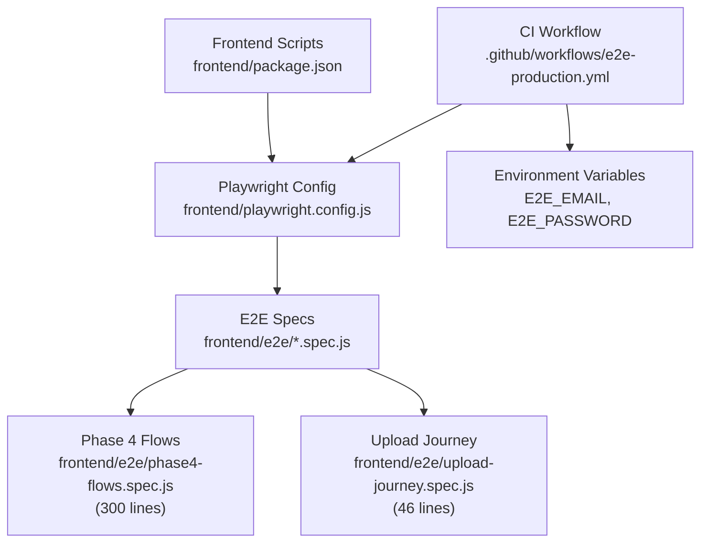

**Diagram sources**
- [playwright.config.js:1-50](file://frontend/playwright.config.js#L1-L50)
- [package.json:1-69](file://frontend/package.json#L1-L69)
- [e2e-production.yml:1-60](file://.github/workflows/e2e-production.yml#L1-L60)
- [phase4-flows.spec.js:1-300](file://frontend/e2e/phase4-flows.spec.js#L1-L300)
- [upload-journey.spec.js:1-48](file://frontend/e2e/upload-journey.spec.js#L1-L48)

**Section sources**
- [playwright.config.js:1-50](file://frontend/playwright.config.js#L1-L50)
- [package.json:1-69](file://frontend/package.json#L1-L69)
- [.github/workflows/e2e-production.yml:1-60](file://.github/workflows/e2e-production.yml#L1-L60)

## Core Components
- Playwright configuration controls test execution, browser selection, tracing, and local dev server lifecycle.
- Test suites cover authentication flows, dashboard interactions, formatter workflows, generator features, responsive design, and enhanced Phase 4 flows with comprehensive upload journey testing.
- Services and hooks encapsulate API interactions and real-time features used by the tested pages.
- Environment variable configuration enables secure agent authentication in CI/CD pipelines.
- Comprehensive test harness installation provides realistic testing environments for both formatter and agent workflows.

Key configuration highlights:
- Test directory: frontend/e2e
- Projects: Chromium only by default
- Workers: 4 locally, 1 in CI
- Retries: 2 on CI
- Trace: collected on first retry
- Web server: starts Next.js dev server automatically when no external base URL is provided
- Environment variables: E2E_EMAIL, E2E_PASSWORD for agent authentication
- Test timeout: 240 seconds for Phase 4 flows to accommodate production processing delays

**Section sources**
- [playwright.config.js:9-49](file://frontend/playwright.config.js#L9-L49)
- [package.json:6-16](file://frontend/package.json#L6-L16)
- [e2e-production.yml:50-55](file://.github/workflows/e2e-production.yml#L50-L55)
- [phase4-flows.spec.js:237-239](file://frontend/e2e/phase4-flows.spec.js#L237-L239)

## Architecture Overview
The E2E architecture integrates Playwright with the Next.js frontend and backend APIs. Tests navigate to routes, interact with UI components, and assert expected outcomes. Enhanced authentication relies on Supabase with improved state monitoring, while document and generator features leverage dedicated services and hooks with better selector strategies. The expanded infrastructure now includes comprehensive upload journey testing with realistic API mocking and state management.

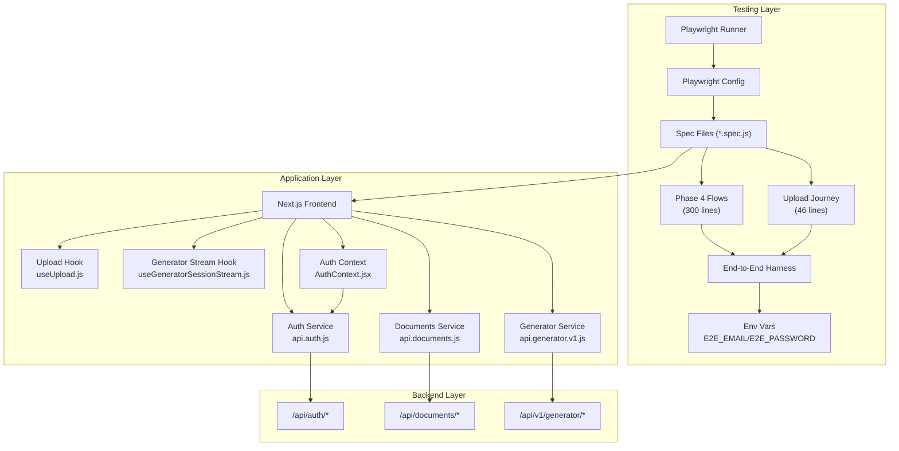

**Diagram sources**
- [playwright.config.js:1-50](file://frontend/playwright.config.js#L1-L50)
- [phase4-flows.spec.js:105-235](file://frontend/e2e/phase4-flows.spec.js#L105-L235)
- [upload-journey.spec.js:4-46](file://frontend/e2e/upload-journey.spec.js#L4-L46)
- [AuthContext.jsx:65-172](file://frontend/src/context/AuthContext.jsx#L65-L172)
- [api.auth.js:1-39](file://frontend/src/services/api.auth.js#L1-L39)
- [api.documents.js:1-412](file://frontend/src/services/api.documents.js#L1-L412)
- [api.generator.v1.js:1-80](file://frontend/src/services/api.generator.v1.js#L1-L80)
- [useUpload.js:1-361](file://frontend/src/hooks/useUpload.js#L1-L361)
- [useGeneratorSessionStream.js:1-12](file://frontend/src/hooks/useGeneratorSessionStream.js#L1-L12)

## Detailed Component Analysis

### Authentication Flow Testing
Tests verify the authentication root check and basic login behavior with enhanced environment variable handling. The auth service integrates with Supabase for OAuth and OTP-based flows, now supporting production-grade authentication in CI/CD environments.

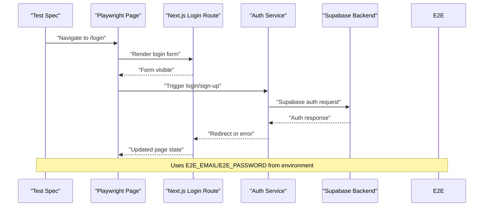

**Diagram sources**
- [auth-flow.spec.js:1-7](file://frontend/e2e/auth-flow.spec.js#L1-L7)
- [api.auth.js:18-38](file://frontend/src/services/api.auth.js#L18-L38)

**Section sources**
- [auth-flow.spec.js:1-7](file://frontend/e2e/auth-flow.spec.js#L1-L7)
- [api.auth.js:1-39](file://frontend/src/services/api.auth.js#L1-L39)

### Document Upload and Formatting Workflows
Tests cover upload routes and formatter pages with improved selector strategies. The upload hook manages progress, chunked uploads, and status polling. The documents service handles file uploads, previews, comparisons, exports, and deletions.

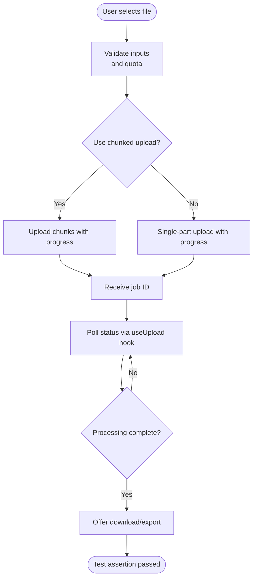

**Diagram sources**
- [useUpload.js:224-342](file://frontend/src/hooks/useUpload.js#L224-L342)
- [api.documents.js:128-300](file://frontend/src/services/api.documents.js#L128-L300)

**Section sources**
- [formatter-upload.spec.js:1-11](file://frontend/e2e/formatter-upload.spec.js#L1-L11)
- [useUpload.js:1-361](file://frontend/src/hooks/useUpload.js#L1-L361)
- [api.documents.js:1-412](file://frontend/src/services/api.documents.js#L1-L412)

### Generator Streaming and Session Management
Generator tests validate real-time token streaming and session interactions. The generator service supports sessions, messages, outlines, and stopping sessions. The generator stream hook connects to event streams.

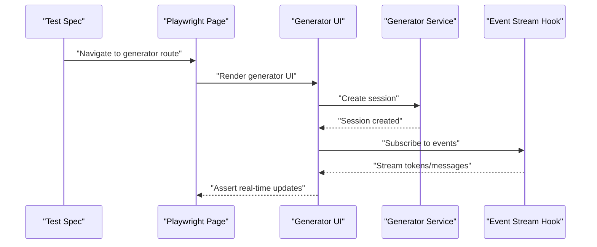

**Diagram sources**
- [generator-streaming.spec.js:1-5](file://frontend/e2e/generator-streaming.spec.js#L1-L5)
- [api.generator.v1.js:4-80](file://frontend/src/services/api.generator.v1.js#L4-L80)
- [useGeneratorSessionStream.js:1-12](file://frontend/src/hooks/useGeneratorSessionStream.js#L1-L12)

**Section sources**
- [generator-streaming.spec.js:1-5](file://frontend/e2e/generator-streaming.spec.js#L1-L5)
- [api.generator.v1.js:1-80](file://frontend/src/services/api.generator.v1.js#L1-L80)
- [useGeneratorSessionStream.js:1-12](file://frontend/src/hooks/useGeneratorSessionStream.js#L1-L12)

### Responsive Design Testing
Responsive tests set device viewports to simulate mobile and tablet experiences.

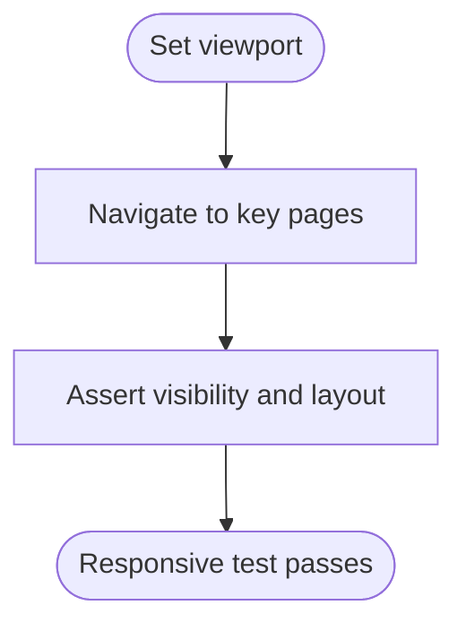

**Diagram sources**
- [responsive-mobile.spec.js:1-7](file://frontend/e2e/responsive-mobile.spec.js#L1-L7)

**Section sources**
- [responsive-mobile.spec.js:1-7](file://frontend/e2e/responsive-mobile.spec.js#L1-L7)

### Dashboard and Live Preview Interactions
Smoke tests validate core routes and interactions, including live preview and results pages. These tests initialize mock job data via session storage to exercise UI components that depend on active jobs.

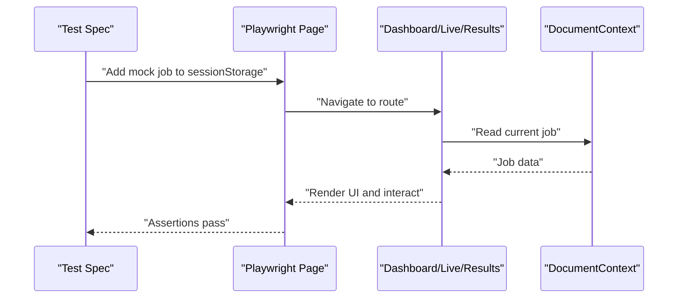

**Diagram sources**
- [smoke.spec.js:5-23](file://frontend/e2e/smoke.spec.js#L5-L23)

**Section sources**
- [smoke.spec.js:1-68](file://frontend/e2e/smoke.spec.js#L1-L68)

### Template Management Testing
Template list tests ensure the templates page loads without crashing and displays content.

**Section sources**
- [template-list.spec.js:1-11](file://frontend/e2e/template-list.spec.js#L1-L11)

### Additional Test Categories
- History and generator-related flows: generator-history.spec.js
- Live preview types and updates: formatter-live-preview.spec.js
- Protected routes and onboarding tours: protected-routes.spec.js, onboarding-tour-next.spec.js, onboarding-tour-skip.spec.js
- Multi-file uploads and quotas: generator-multi-upload.spec.js, multi-upload-max-files.spec.js
- Guest uploads: guest-upload.spec.js, guest-upload-pdf.spec.js
- Export formats and LaTeX downloads: formatter-download-formats.spec.js, latex-export-download.spec.js
- Quality checks and editing: formatter-quality.spec.js, formatter-edit.spec.js
- Compare and batch operations: formatter-compare.spec.js, formatter-batch.spec.js
- Settings and profile updates: settings.spec.js, profile-update.spec.js
- Forgot/reset password: forgot-password.spec.js, reset-password.spec.js
- Plan gating and account deletion: plan-gating.spec.js, account-deletion.spec.js
- Admin access and error boundaries: admin-access.spec.js, error-boundary.spec.js
- Dark mode and navigation toggles: dark-mode.spec.js, navigation-sidebar-toggle.spec.js
- Landing page and smoke: landing-page.spec.js, smoke.spec.js

**Section sources**
- [generator-history.spec.js:1-11](file://frontend/e2e/generator-history.spec.js#L1-L11)
- [formatter-live-preview.spec.js:1-5](file://frontend/e2e/formatter-live-preview.spec.js#L1-L5)
- [protected-routes.spec.js:1-10](file://frontend/e2e/protected-routes.spec.js#L1-L10)
- [onboarding-tour-next.spec.js:1-50](file://frontend/e2e/onboarding-tour-next.spec.js#L1-L50)
- [onboarding-tour-skip.spec.js:1-50](file://frontend/e2e/onboarding-tour-skip.spec.js#L1-L50)
- [generator-multi-upload.spec.js:1-50](file://frontend/e2e/generator-multi-upload.spec.js#L1-L50)
- [multi-upload-max-files.spec.js:1-50](file://frontend/e2e/multi-upload-max-files.spec.js#L1-L50)
- [guest-upload.spec.js:1-50](file://frontend/e2e/guest-upload.spec.js#L1-L50)
- [guest-upload-pdf.spec.js:1-50](file://frontend/e2e/guest-upload-pdf.spec.js#L1-L50)
- [formatter-download-formats.spec.js:1-50](file://frontend/e2e/formatter-download-formats.spec.js#L1-L50)
- [latex-export-download.spec.js:1-50](file://frontend/e2e/latex-export-download.spec.js#L1-L50)
- [formatter-quality.spec.js:1-50](file://frontend/e2e/formatter-quality.spec.js#L1-L50)
- [formatter-edit.spec.js:1-50](file://frontend/e2e/formatter-edit.spec.js#L1-L50)
- [formatter-compare.spec.js:1-50](file://frontend/e2e/formatter-compare.spec.js#L1-L50)
- [formatter-batch.spec.js:1-50](file://frontend/e2e/formatter-batch.spec.js#L1-L50)
- [settings.spec.js:1-50](file://frontend/e2e/settings.spec.js#L1-L50)
- [profile-update.spec.js:1-50](file://frontend/e2e/profile-update.spec.js#L1-L50)
- [forgot-password.spec.js:1-50](file://frontend/e2e/forgot-password.spec.js#L1-L50)
- [reset-password.spec.js:1-50](file://frontend/e2e/reset-password.spec.js#L1-L50)
- [plan-gating.spec.js:1-50](file://frontend/e2e/plan-gating.spec.js#L1-L50)
- [account-deletion.spec.js:1-50](file://frontend/e2e/account-deletion.spec.js#L1-L50)
- [admin-access.spec.js:1-50](file://frontend/e2e/admin-access.spec.js#L1-L50)
- [error-boundary.spec.js:1-50](file://frontend/e2e/error-boundary.spec.js#L1-L50)
- [dark-mode.spec.js:1-50](file://frontend/e2e/dark-mode.spec.js#L1-L50)
- [navigation-sidebar-toggle.spec.js:1-50](file://frontend/e2e/navigation-sidebar-toggle.spec.js#L1-L50)
- [landing-page.spec.js:1-50](file://frontend/e2e/landing-page.spec.js#L1-L50)
- [smoke.spec.js:1-68](file://frontend/e2e/smoke.spec.js#L1-L68)

## Enhanced Phase 4 Flows Testing

### Comprehensive Workflow Coverage
The Phase 4 flows testing introduces comprehensive testing infrastructure with 300 lines of sophisticated test coverage. This includes robust authentication handling, advanced state monitoring, realistic API mocking, and complete workflow validation for both formatter and agent functionalities.

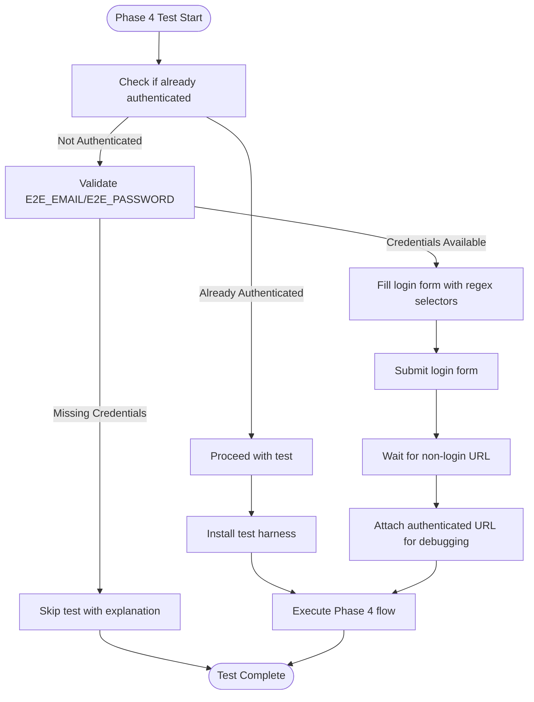

**Diagram sources**
- [phase4-flows.spec.js:7-29](file://frontend/e2e/phase4-flows.spec.js#L7-L29)

**Section sources**
- [phase4-flows.spec.js:1-300](file://frontend/e2e/phase4-flows.spec.js#L1-L300)

### Advanced State Monitoring with Promise.any()
Phase 4 flows implement advanced state monitoring using `Promise.any()` to handle concurrent UI state detection. This approach monitors multiple possible states (proceed to write, writing, error) simultaneously and responds to whichever appears first, providing robust error handling and user experience validation.

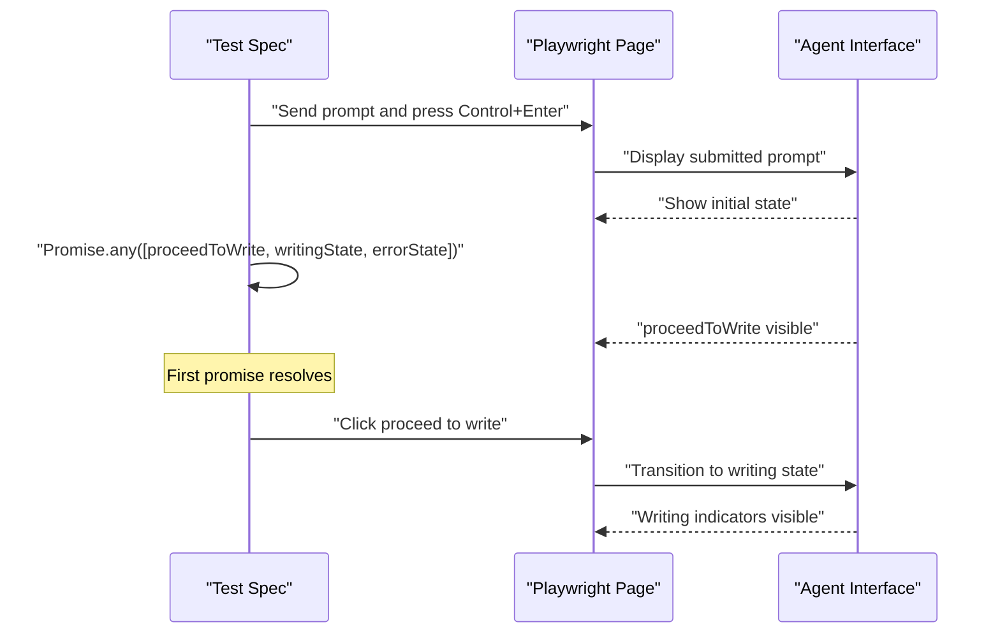

**Diagram sources**
- [phase4-flows.spec.js:288-292](file://frontend/e2e/phase4-flows.spec.js#L288-L292)

**Section sources**
- [phase4-flows.spec.js:269-298](file://frontend/e2e/phase4-flows.spec.js#L269-L298)

### Comprehensive Test Harness Installation
The Phase 4 flows include sophisticated test harness installation that mocks both formatter and agent workflows with realistic API responses, session storage manipulation, and event stream simulation.

Key harness features:
- Formatter harness with job status simulation and progress tracking
- Agent harness with outline generation and approval workflows
- Event stream mocking for real-time agent interactions
- Session storage manipulation for persistent test state
- Route mocking for API endpoints with realistic responses

**Section sources**
- [phase4-flows.spec.js:43-103](file://frontend/e2e/phase4-flows.spec.js#L43-L103)
- [phase4-flows.spec.js:105-235](file://frontend/e2e/phase4-flows.spec.js#L105-L235)

### Enhanced Selector Strategies
Phase 4 flows demonstrate improved selector strategies using regular expressions for more robust element identification. These selectors handle multiple language variations and edge cases common in internationalized applications.

Selector examples from Phase 4 flows:
- Email/password fields: `/email address|email/i`, `/password/i`
- Process buttons: `/process document|re-process manuscript/i`
- Chat placeholders: `/type your prompt here|message|type|prompt|ask/i`
- Action buttons: `/proceed to write/i`, `/download/i`

**Section sources**
- [phase4-flows.spec.js:19-22](file://frontend/e2e/phase4-flows.spec.js#L19-L22)
- [phase4-flows.spec.js:40-44](file://frontend/e2e/phase4-flows.spec.js#L40-L44)
- [phase4-flows.spec.js:63-67](file://frontend/e2e/phase4-flows.spec.js#L63-L67)
- [phase4-flows.spec.js:71-74](file://frontend/e2e/phase4-flows.spec.js#L71-L74)

### CI/CD Environment Variable Configuration
The CI/CD pipeline includes comprehensive environment variable configuration for agent authentication, enabling automated testing in production-like environments without exposing sensitive credentials.

Environment variables configured:
- `PLAYWRIGHT_BASE_URL`: Production frontend URL for test execution
- `E2E_EMAIL`: Email for agent authentication
- `E2E_PASSWORD`: Password for agent authentication
- `CI`: Flag indicating CI environment for test configuration

**Section sources**
- [e2e-production.yml:50-55](file://.github/workflows/e2e-production.yml#L50-L55)

## Upload Journey Testing

### Comprehensive Upload Processing Workflow
The new upload-journey.spec.js provides comprehensive end-to-end testing for the complete upload processing workflow, validating the complete journey from file selection to download completion. This 46-line test suite ensures robust validation of the entire document processing pipeline.

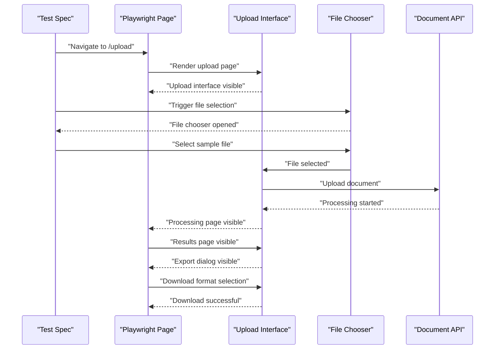

**Diagram sources**
- [upload-journey.spec.js:4-46](file://frontend/e2e/upload-journey.spec.js#L4-L46)

**Section sources**
- [upload-journey.spec.js:1-48](file://frontend/e2e/upload-journey.spec.js#L1-L48)

### Realistic File Upload Simulation
The upload journey test implements realistic file upload simulation using Playwright's filechooser capabilities and path resolution. It validates the complete upload processing pipeline with proper error handling and state validation.

Key testing features:
- Sample file selection using existing test assets
- File chooser interaction simulation
- Upload progress validation
- Processing page transition verification
- Results page validation with quality metrics
- Export dialog interaction and format selection

**Section sources**
- [upload-journey.spec.js:5-46](file://frontend/e2e/upload-journey.spec.js#L5-L46)

### End-to-End Workflow Validation
The upload journey test validates the complete end-to-end workflow ensuring that users can successfully upload documents, process them through the formatting pipeline, and download the formatted results. This comprehensive validation covers all major user touchpoints and error scenarios.

**Section sources**
- [upload-journey.spec.js:4-46](file://frontend/e2e/upload-journey.spec.js#L4-L46)

## Authentication and State Management

### Enhanced Auth Context Implementation
The authentication system implements sophisticated state management with improved error handling and race condition prevention. The AuthContext provides robust authentication state monitoring with proper cleanup procedures.

Key authentication features:
- Session verification against Supabase server
- Race condition prevention during sign-in/sign-up
- Automatic cleanup of stale authentication data
- Support for multiple authentication providers

**Section sources**
- [AuthContext.jsx:65-172](file://frontend/src/context/AuthContext.jsx#L65-L172)

### Production-Ready Authentication Flow
The enhanced authentication flow supports production environments with proper error handling and graceful degradation when authentication services are unavailable.

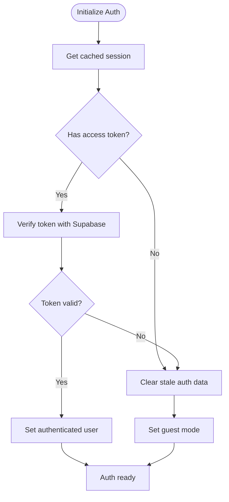

**Diagram sources**
- [AuthContext.jsx:68-135](file://frontend/src/context/AuthContext.jsx#L68-L135)

**Section sources**
- [AuthContext.jsx:16-340](file://frontend/src/context/AuthContext.jsx#L16-L340)

## Dependency Analysis
Playwright depends on the frontend package scripts and configuration. The CI workflow installs Playwright browsers and runs tests against a configured base URL with environment variables for agent authentication. The expanded test infrastructure now includes comprehensive upload journey testing and enhanced Phase 4 flows validation.

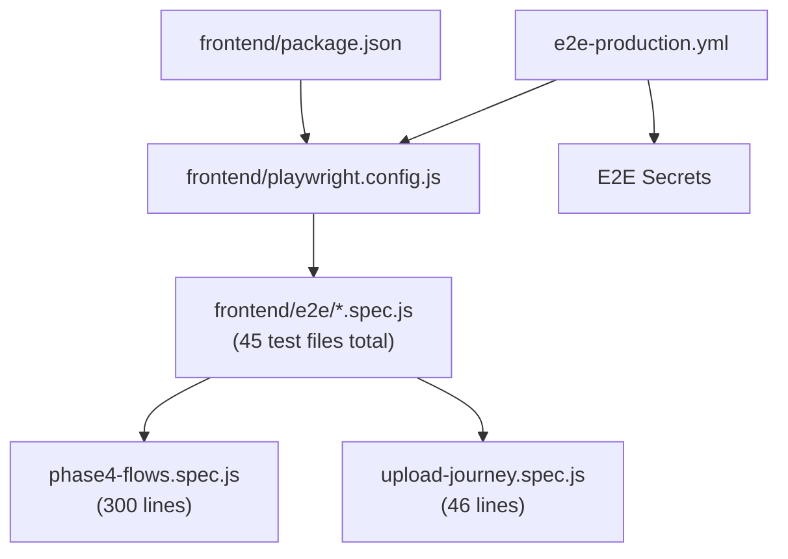

**Diagram sources**
- [package.json:6-16](file://frontend/package.json#L6-L16)
- [playwright.config.js:1-50](file://frontend/playwright.config.js#L1-L50)
- [e2e-production.yml:1-60](file://.github/workflows/e2e-production.yml#L1-L60)

**Section sources**
- [package.json:1-69](file://frontend/package.json#L1-L69)
- [playwright.config.js:1-50](file://frontend/playwright.config.js#L1-L50)
- [.github/workflows/e2e-production.yml:1-60](file://.github/workflows/e2e-production.yml#L1-L60)

## Performance Considerations
- Parallelism: Disable full parallelism locally; use 4 workers; CI uses 1 worker for stability.
- Retries: Enable retries on CI to mitigate flakiness.
- Tracing: Enable trace collection on first retry to capture failure context.
- Local dev server: Reuse existing server to avoid repeated startup overhead.
- Viewport testing: Use targeted viewport sizes to reduce test runtime while validating responsiveness.
- State monitoring: Use Promise.any() for efficient concurrent state detection in complex workflows.
- Test timeouts: Extended timeouts (240 seconds) for Phase 4 flows to accommodate production processing delays.
- API mocking: Comprehensive route mocking reduces external dependency latency and improves test reliability.

## Troubleshooting Guide
Common issues and resolutions:
- Flaky tests: Increase retries on CI; collect traces on first retry for failure analysis.
- Local vs. CI differences: Ensure consistent environment variables (e.g., PLAYWRIGHT_BASE_URL, E2E_EMAIL, E2E_PASSWORD).
- Authentication failures: Verify Supabase client initialization and redirect paths; check environment variable configuration.
- Upload timeouts: Adjust waitUntil and timeout options; consider chunked uploads for large files.
- Real-time updates: Confirm event stream URLs and hook subscriptions.
- Mock data: Initialize session storage with required job data for routes dependent on active jobs.
- Phase 4 flow failures: Verify agent authentication credentials and network connectivity to backend services.
- Upload journey failures: Check file path resolution and test asset availability.
- Test harness issues: Validate route mocking configurations and session storage setup.

**Section sources**
- [playwright.config.js:14-28](file://frontend/playwright.config.js#L14-L28)
- [e2e-production.yml:33-37](file://.github/workflows/e2e-production.yml#L33-L37)
- [api.auth.js:28-38](file://frontend/src/services/api.auth.js#L28-L38)
- [useUpload.js:267-290](file://frontend/src/hooks/useUpload.js#L267-L290)
- [useGeneratorSessionStream.js:5-11](file://frontend/src/hooks/useGeneratorSessionStream.js#L5-L11)
- [smoke.spec.js:5-23](file://frontend/e2e/smoke.spec.js#L5-L23)
- [phase4-flows.spec.js:15-18](file://frontend/e2e/phase4-flows.spec.js#L15-L18)
- [upload-journey.spec.js:18-20](file://frontend/e2e/upload-journey.spec.js#L18-L20)

## Conclusion
The Playwright E2E suite comprehensively validates the Next.js application's critical user workflows with significantly expanded testing infrastructure. The addition of 45 test files now provides robust coverage for authentication, document formatting, generator features, and responsive design. The enhanced Phase 4 flows testing with 300 lines of comprehensive workflow validation, combined with the new upload-journey.spec.js providing 46 lines of end-to-end upload processing validation, ensures production-grade reliability. Key improvements include robust authentication handling with environment variable configuration, advanced state monitoring using Promise.any(), better selector strategies for internationalized applications, comprehensive API mocking for realistic testing scenarios, and CI/CD integration for production-like testing. With focused test categories, robust configuration, and clear testing patterns, teams can maintain reliable coverage for all critical user workflows while ensuring consistent, maintainable, and effective E2E testing with production-grade reliability.

## Appendices

### Writing Robust E2E Tests
- Prefer explicit waits for critical UI elements.
- Use beforeEach hooks to initialize required state (e.g., session storage).
- Isolate tests with minimal shared state.
- Capture traces on failure to aid debugging.
- Validate both happy paths and error conditions.
- Implement Promise.any() for concurrent state monitoring in complex workflows.
- Use comprehensive test harness installation for realistic API mocking.
- Implement proper timeout handling for production-like delays.

### Handling Asynchronous Operations
- Use hooks/services that expose status polling and event streams.
- Assert real-time updates by subscribing to event endpoints.
- Manage upload progress and cancellation via AbortController.
- Implement Promise.any() for efficient concurrent state detection.
- Use expect.poll() for reliable state validation in complex workflows.
- Implement comprehensive error handling for API failures.

**Section sources**
- [useUpload.js:89-196](file://frontend/src/hooks/useUpload.js#L89-L196)
- [useGeneratorSessionStream.js:5-11](file://frontend/src/hooks/useGeneratorSessionStream.js#L5-L11)
- [phase4-flows.spec.js:288-292](file://frontend/e2e/phase4-flows.spec.js#L288-L292)

### Managing Test Data
- Initialize mock jobs via addInitScript for routes requiring active jobs.
- Use fixture-like patterns to seed data for authenticated flows.
- Keep test data minimal and deterministic.
- Leverage environment variables for production-like test data.
- Implement comprehensive test harness installation for realistic scenarios.
- Use session storage manipulation for persistent test state.

**Section sources**
- [smoke.spec.js:5-23](file://frontend/e2e/smoke.spec.js#L5-L23)
- [phase4-flows.spec.js:4-5](file://frontend/e2e/phase4-flows.spec.js#L4-L5)
- [phase4-flows.spec.js:105-151](file://frontend/e2e/phase4-flows.spec.js#L105-L151)

### Browser Compatibility and Responsive Testing
- Extend projects to include Firefox and Safari for broader compatibility.
- Add viewport-specific tests for mobile and tablet breakpoints.
- Validate layout shifts and interactive elements across devices.
- Use responsive test patterns for cross-device validation.

**Section sources**
- [playwright.config.js:32-38](file://frontend/playwright.config.js#L32-L38)
- [responsive-mobile.spec.js:3-7](file://frontend/e2e/responsive-mobile.spec.js#L3-L7)

### Performance Testing Scenarios
- Measure page load times for key routes.
- Benchmark upload throughput with chunked uploads.
- Track generator session latency and token streaming rates.
- Monitor authentication flow performance with environment variable configuration.
- Validate test harness performance and API mocking efficiency.
- Test upload journey performance with various file sizes and network conditions.

### Enhanced Authentication Testing Patterns
- Implement environment variable-based authentication for CI/CD pipelines.
- Use regex-based selectors for robust internationalized UI element identification.
- Leverage Promise.any() for efficient state monitoring in complex workflows.
- Handle authentication failures gracefully with proper test skipping and error reporting.
- Implement comprehensive test harness installation for realistic authentication scenarios.

**Section sources**
- [phase4-flows.spec.js:7-29](file://frontend/e2e/phase4-flows.spec.js#L7-L29)
- [phase4-flows.spec.js:288-292](file://frontend/e2e/phase4-flows.spec.js#L288-L292)
- [e2e-production.yml:50-55](file://.github/workflows/e2e-production.yml#L50-L55)

### Upload Journey Testing Patterns
- Implement comprehensive file upload simulation with realistic file chooser interaction.
- Validate complete upload processing pipeline from selection to completion.
- Test export dialog interaction and format selection validation.
- Implement proper timeout handling for upload processing delays.
- Validate error handling and recovery scenarios in upload workflows.
- Use existing test assets for reliable file upload validation.

**Section sources**
- [upload-journey.spec.js:4-46](file://frontend/e2e/upload-journey.spec.js#L4-L46)
- [upload-journey.spec.js:18-20](file://frontend/e2e/upload-journey.spec.js#L18-L20)