# Vitest Unit & Component Testing

<cite>
**Referenced Files in This Document**
- [vitest.config.js](file://frontend/vitest.config.js)
- [setup.js](file://frontend/src/test/setup.js)
- [navigation.js](file://frontend/__mocks__/next/navigation.js)
- [package.json](file://frontend/package.json)
- [tsconfig.json](file://frontend/tsconfig.json)
- [jsconfig.json](file://frontend/jsconfig.json)
- [AppShell.auth-redirect.test.jsx](file://frontend/src/test/AppShell.auth-redirect.test.jsx)
- [AuthGuard.test.jsx](file://frontend/src/test/AuthGuard.test.jsx)
- [ErrorBoundary.test.jsx](file://frontend/src/test/ErrorBoundary.test.jsx)
- [StatusBadge.test.jsx](file://frontend/src/test/StatusBadge.test.jsx)
- [useGeneratorState.test.js](file://frontend/src/test/useGeneratorState.test.js)
- [AuthContext.initialization.test.jsx](file://frontend/src/test/AuthContext.initialization.test.jsx)
- [Header.auth-state.test.jsx](file://frontend/src/test/Header.auth-state.test.jsx)
- [Footer.test.jsx](file://frontend/src/test/Footer.test.jsx)
</cite>

## Table of Contents
1. [Introduction](#introduction)
2. [Project Structure](#project-structure)
3. [Core Components](#core-components)
4. [Architecture Overview](#architecture-overview)
5. [Detailed Component Analysis](#detailed-component-analysis)
6. [Dependency Analysis](#dependency-analysis)
7. [Performance Considerations](#performance-considerations)
8. [Troubleshooting Guide](#troubleshooting-guide)
9. [Conclusion](#conclusion)
10. [Appendices](#appendices)

## Introduction
This document provides comprehensive guidance for unit and component testing of React components and hooks using Vitest in the frontend. It explains the Vitest configuration, the jsdom environment for DOM manipulation, mock setups for Next.js navigation, and best practices for testing. The current test suite covers critical components such as AppShell, AuthGuard, ErrorBoundary, StatusBadge, and the useGeneratorState hook, along with supporting tests for AuthContext initialization, Header, and Footer.

## Project Structure
The frontend testing setup is organized under the frontend directory with the following key areas:
- Vitest configuration defines aliases, JSX automatic transformation, jsdom environment, and test file inclusion patterns.
- Test setup initializes @testing-library/jest-dom for extended DOM matchers.
- Mocks for Next.js navigation are centralized to isolate routing dependencies.
- Component and hook tests reside under src/test with focused assertions on behavior and state transitions.

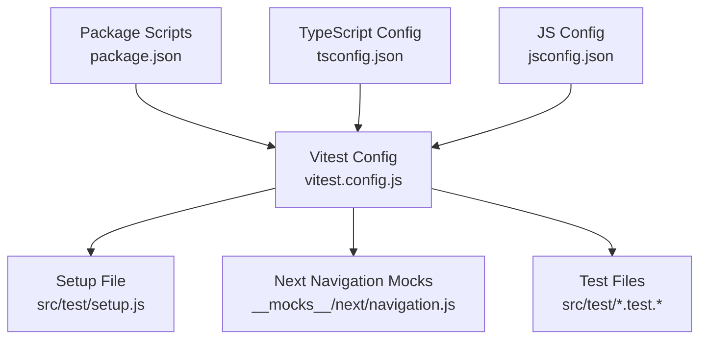

**Diagram sources**
- [vitest.config.js:1-33](file://frontend/vitest.config.js#L1-L33)
- [setup.js:1-2](file://frontend/src/test/setup.js#L1-L2)
- [navigation.js:1-16](file://frontend/__mocks__/next/navigation.js#L1-L16)
- [package.json:6-16](file://frontend/package.json#L6-L16)
- [tsconfig.json:1-48](file://frontend/tsconfig.json#L1-L48)
- [jsconfig.json:1-32](file://frontend/jsconfig.json#L1-L32)

**Section sources**
- [vitest.config.js:1-33](file://frontend/vitest.config.js#L1-L33)
- [setup.js:1-2](file://frontend/src/test/setup.js#L1-L2)
- [navigation.js:1-16](file://frontend/__mocks__/next/navigation.js#L1-L16)
- [package.json:6-16](file://frontend/package.json#L6-L16)
- [tsconfig.json:1-48](file://frontend/tsconfig.json#L1-L48)
- [jsconfig.json:1-32](file://frontend/jsconfig.json#L1-L32)

## Core Components
This section documents the Vitest configuration and environment setup that enable React component and hook testing.

- Aliases and Module Resolution
  - The configuration sets up the @ alias to resolve from the project root and maps testing libraries and Next.js navigation to mocks for isolated testing.
  - These aliases align with TypeScript and JS configs to ensure consistent resolution during tests.

- JSX Automatic Transformation
  - esbuild is configured with jsx: 'automatic' to transform JSX without explicit React imports, matching Next.js behavior.

- jsdom Environment
  - The jsdom environment provides a DOM-like API for rendering components and simulating browser behaviors such as window events and element interactions.

- Test File Patterns and Setup
  - Tests are included via src/**/*.{test,spec}.{js,jsx,ts,tsx}, excluding legacy archives.
  - A setup file imports @testing-library/jest-dom to extend expect with DOM-related matchers.

- Next.js Navigation Mocks
  - next/navigation is mocked to provide deterministic router and navigation APIs for route-dependent components.

**Section sources**
- [vitest.config.js:4-32](file://frontend/vitest.config.js#L4-L32)
- [setup.js:1-2](file://frontend/src/test/setup.js#L1-L2)
- [navigation.js:1-16](file://frontend/__mocks__/next/navigation.js#L1-L16)
- [tsconfig.json:26-30](file://frontend/tsconfig.json#L26-L30)
- [jsconfig.json:4-28](file://frontend/jsconfig.json#L4-L28)

## Architecture Overview
The testing architecture leverages Vitest with jsdom to simulate a browser environment, enabling component rendering and interaction. Mocks isolate external dependencies (routing, authentication, services), while the setup file extends assertion capabilities.

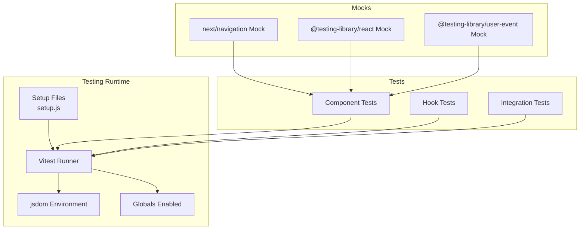

**Diagram sources**
- [vitest.config.js:16-26](file://frontend/vitest.config.js#L16-L26)
- [setup.js:1-2](file://frontend/src/test/setup.js#L1-L2)
- [navigation.js:1-16](file://frontend/__mocks__/next/navigation.js#L1-L16)

## Detailed Component Analysis

### AppShell Authentication Redirect Test
This test verifies AppShell behavior for authenticated users on the landing route and guest mode bypass.

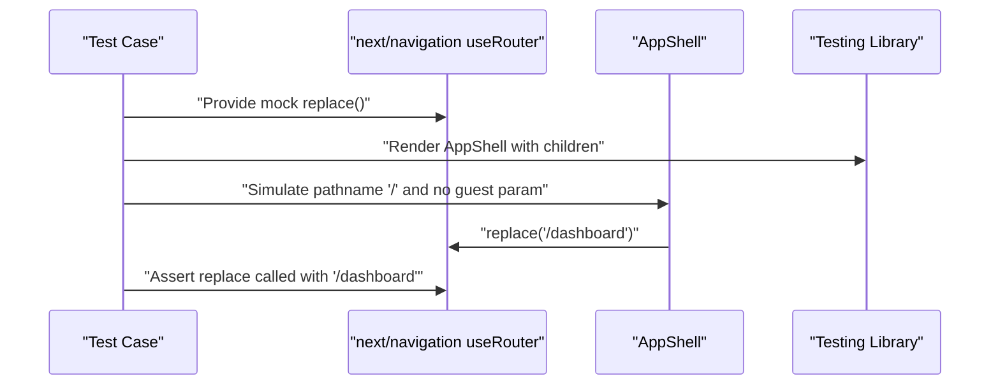

**Diagram sources**
- [AppShell.auth-redirect.test.jsx:23-66](file://frontend/src/test/AppShell.auth-redirect.test.jsx#L23-L66)
- [navigation.js:3-10](file://frontend/__mocks__/next/navigation.js#L3-L10)

**Section sources**
- [AppShell.auth-redirect.test.jsx:1-88](file://frontend/src/test/AppShell.auth-redirect.test.jsx#L1-L88)
- [navigation.js:1-16](file://frontend/__mocks__/next/navigation.js#L1-L16)

### AuthGuard Route Protection Test
This test validates redirection logic for unauthenticated users and admin-only routes.

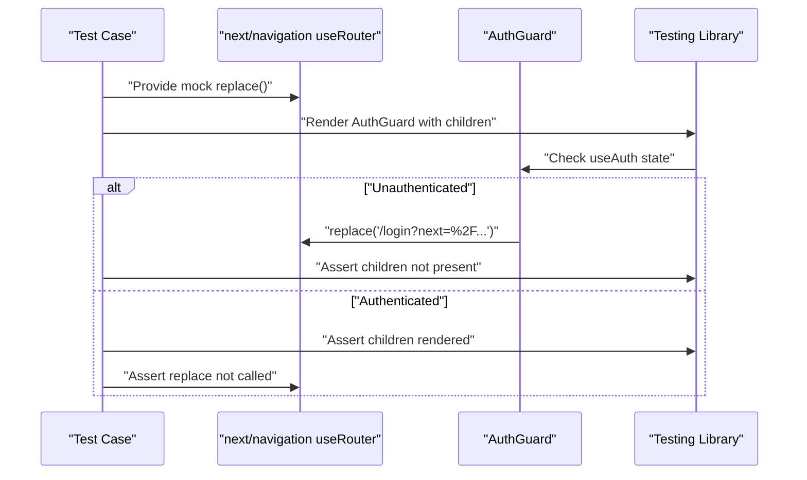

**Diagram sources**
- [AuthGuard.test.jsx:11-41](file://frontend/src/test/AuthGuard.test.jsx#L11-L41)
- [navigation.js:3-10](file://frontend/__mocks__/next/navigation.js#L3-L10)

**Section sources**
- [AuthGuard.test.jsx:1-75](file://frontend/src/test/AuthGuard.test.jsx#L1-L75)
- [navigation.js:1-16](file://frontend/__mocks__/next/navigation.js#L1-L16)

### ErrorBoundary Recovery Test
This test ensures the ErrorBoundary renders fallback UI and recovers when children throw errors.

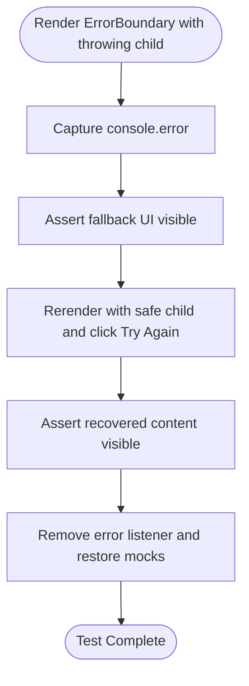

**Diagram sources**
- [ErrorBoundary.test.jsx:15-72](file://frontend/src/test/ErrorBoundary.test.jsx#L15-L72)

**Section sources**
- [ErrorBoundary.test.jsx:1-74](file://frontend/src/test/ErrorBoundary.test.jsx#L1-L74)

### StatusBadge Rendering Test
This test validates label rendering for various status values, including case normalization and fallback behavior.

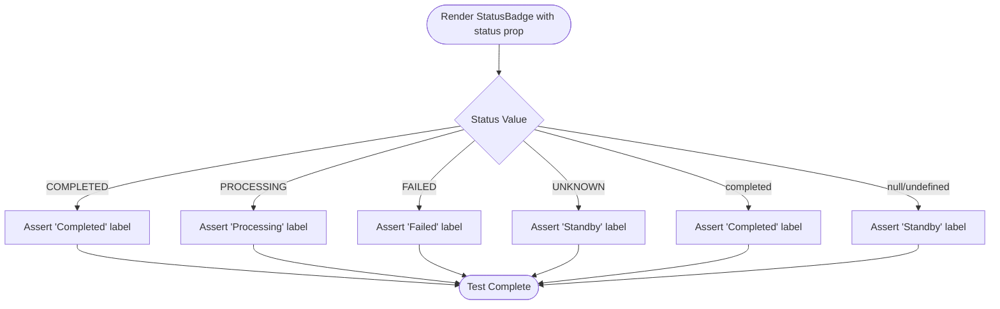

**Diagram sources**
- [StatusBadge.test.jsx:6-35](file://frontend/src/test/StatusBadge.test.jsx#L6-L35)

**Section sources**
- [StatusBadge.test.jsx:1-37](file://frontend/src/test/StatusBadge.test.jsx#L1-L37)

### useGeneratorState Hook Test
This test demonstrates comprehensive hook testing including step navigation, streaming status updates, file download simulation, and state reset.

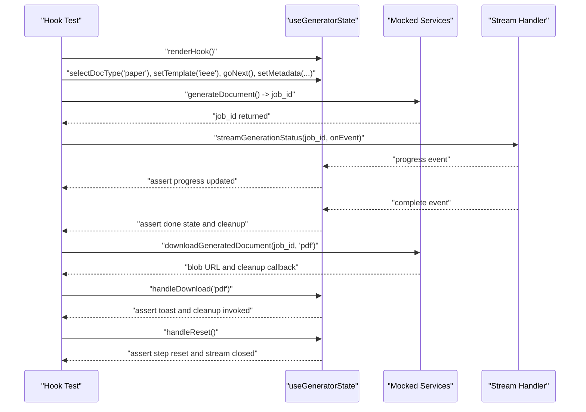

**Diagram sources**
- [useGeneratorState.test.js:58-201](file://frontend/src/test/useGeneratorState.test.js#L58-L201)

**Section sources**
- [useGeneratorState.test.js:1-202](file://frontend/src/test/useGeneratorState.test.js#L1-L202)

### AuthContext Initialization Test
This test verifies AuthProvider behavior for session validation, user state propagation, and sign-out cleanup.

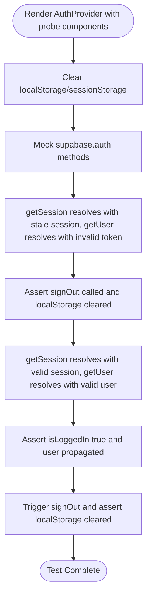

**Diagram sources**
- [AuthContext.initialization.test.jsx:55-159](file://frontend/src/test/AuthContext.initialization.test.jsx#L55-L159)

**Section sources**
- [AuthContext.initialization.test.jsx:1-160](file://frontend/src/test/AuthContext.initialization.test.jsx#L1-L160)

### Header Authentication State Test
This test checks Header rendering differences based on authentication state and route context.

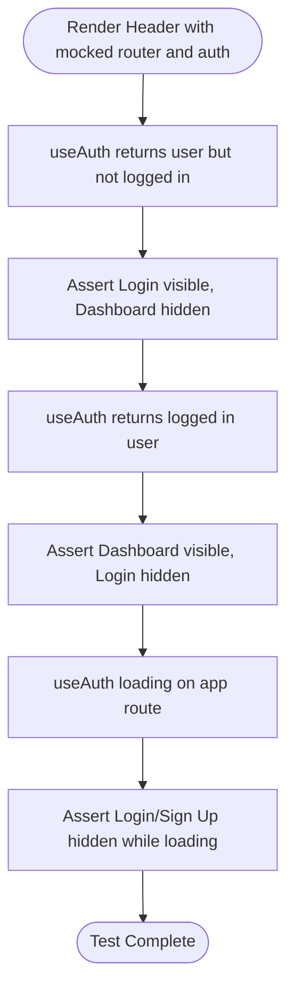

**Diagram sources**
- [Header.auth-state.test.jsx:19-73](file://frontend/src/test/Header.auth-state.test.jsx#L19-L73)
- [navigation.js:3-10](file://frontend/__mocks__/next/navigation.js#L3-L10)

**Section sources**
- [Header.auth-state.test.jsx:1-75](file://frontend/src/test/Header.auth-state.test.jsx#L1-L75)
- [navigation.js:1-16](file://frontend/__mocks__/next/navigation.js#L1-L16)

### Footer Links Test
This test validates Footer navigation links for both app and landing variants.

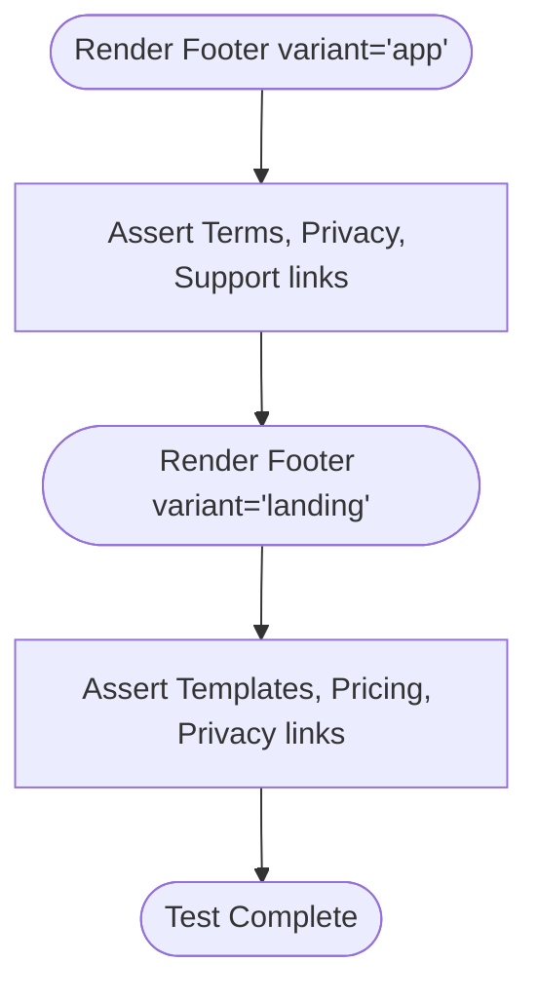

**Diagram sources**
- [Footer.test.jsx:9-25](file://frontend/src/test/Footer.test.jsx#L9-L25)

**Section sources**
- [Footer.test.jsx:1-26](file://frontend/src/test/Footer.test.jsx#L1-L26)

## Dependency Analysis
The testing configuration and setup create a cohesive dependency chain that enables reliable component and hook tests.

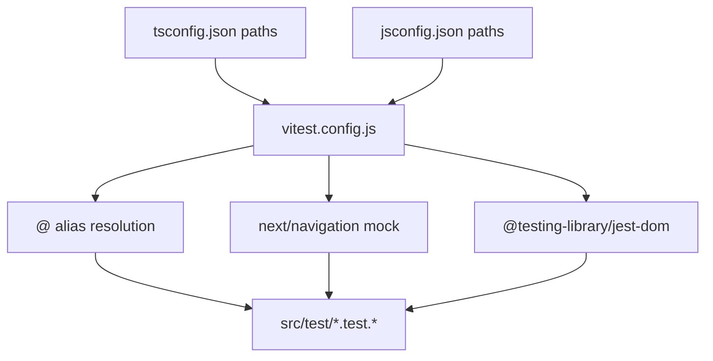

**Diagram sources**
- [vitest.config.js:5-11](file://frontend/vitest.config.js#L5-L11)
- [tsconfig.json:26-30](file://frontend/tsconfig.json#L26-L30)
- [jsconfig.json:4-28](file://frontend/jsconfig.json#L4-L28)

**Section sources**
- [vitest.config.js:1-33](file://frontend/vitest.config.js#L1-L33)
- [tsconfig.json:1-48](file://frontend/tsconfig.json#L1-L48)
- [jsconfig.json:1-32](file://frontend/jsconfig.json#L1-L32)

## Performance Considerations
- Prefer mocking external services and routers to avoid network overhead and flaky tests.
- Use fake timers for asynchronous operations to control time-sensitive assertions deterministically.
- Keep tests focused on single behaviors to minimize re-renders and improve speed.
- Leverage hoisted mocks for shared mocks across tests to reduce setup overhead.

## Troubleshooting Guide
Common issues and resolutions:
- Missing DOM matchers
  - Ensure the setup file imports @testing-library/jest-dom so expect extensions are available.
  - Reference: [setup.js:1](file://frontend/src/test/setup.js#L1-L1)

- Next.js navigation failures
  - Verify next/navigation is mocked consistently across tests.
  - Reference: [navigation.js:1-16](file://frontend/__mocks__/next/navigation.js#L1-L16)

- Test file discovery issues
  - Confirm test files match src/**/*.{test,spec}.{js,jsx,ts,tsx} pattern and are not excluded by configuration.
  - Reference: [vitest.config.js:20-25](file://frontend/vitest.config.js#L20-L25)

- Type resolution errors
  - Align alias paths in tsconfig.json and jsconfig.json with Vitest resolve.alias.
  - References: [tsconfig.json:26-30](file://frontend/tsconfig.json#L26-L30), [jsconfig.json:4-28](file://frontend/jsconfig.json#L4-L28)

- Asynchronous timing issues
  - Use waitFor or fake timers for stream events and downloads.
  - References: [useGeneratorState.test.js:150-177](file://frontend/src/test/useGeneratorState.test.js#L150-L177)

**Section sources**
- [setup.js:1-2](file://frontend/src/test/setup.js#L1-L2)
- [navigation.js:1-16](file://frontend/__mocks__/next/navigation.js#L1-L16)
- [vitest.config.js:20-25](file://frontend/vitest.config.js#L20-L25)
- [tsconfig.json:26-30](file://frontend/tsconfig.json#L26-L30)
- [jsconfig.json:4-28](file://frontend/jsconfig.json#L4-L28)
- [useGeneratorState.test.js:150-177](file://frontend/src/test/useGeneratorState.test.js#L150-L177)

## Conclusion
The Vitest configuration and test suite provide a robust foundation for React component and hook testing. By leveraging jsdom, module aliases, and targeted mocks, the tests remain fast, deterministic, and maintainable. The existing suite demonstrates effective patterns for route protection, error boundaries, status rendering, and complex hook workflows, serving as a guide for extending coverage to other components and hooks.

## Appendices

### Test Execution Commands
- Run all tests: npm test
- Watch mode: npm run test:watch
- E2E tests: npm run test:e2e

**Section sources**
- [package.json:11-15](file://frontend/package.json#L11-L15)