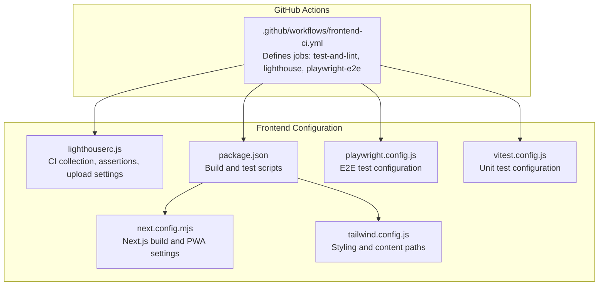
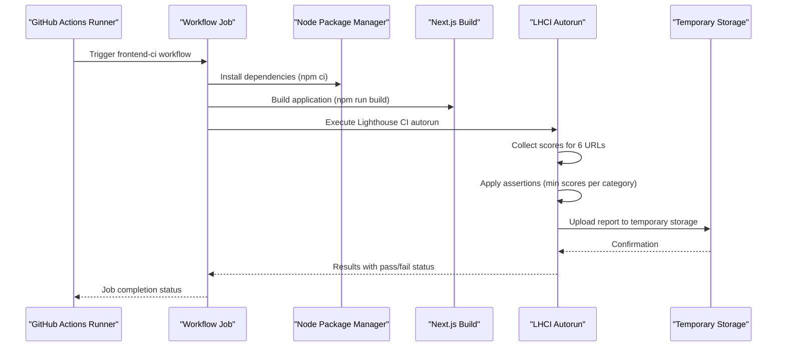
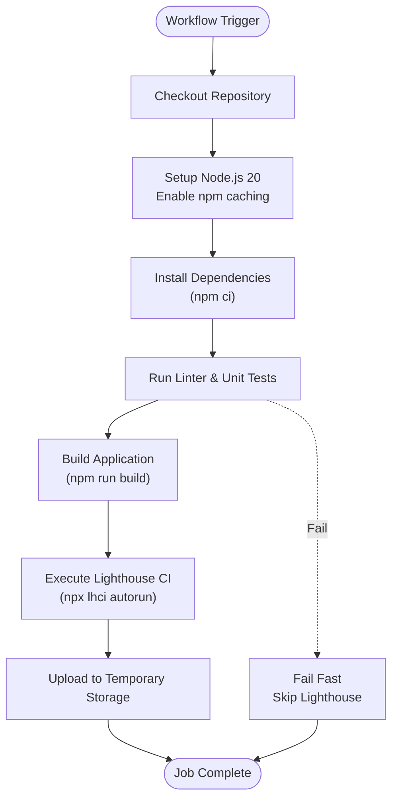
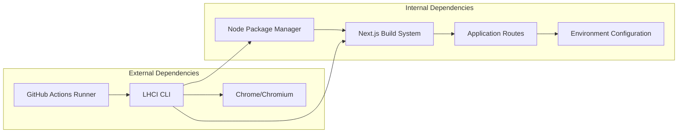

# Lighthouse CI Integration

<cite>
**Referenced Files in This Document**
- [frontend-ci.yml](file://.github/workflows/frontend-ci.yml)
- [lighthouserc.js](file://frontend/lighthouserc.js)
- [package.json](file://frontend/package.json)
- [playwright.config.js](file://frontend/playwright.config.js)
- [vitest.config.js](file://frontend/vitest.config.js)
- [next.config.mjs](file://frontend/next.config.mjs)
- [tailwind.config.js](file://frontend/tailwind.config.js)
</cite>

## Table of Contents
1. [Introduction](#introduction)
2. [Project Structure](#project-structure)
3. [Core Components](#core-components)
4. [Architecture Overview](#architecture-overview)
5. [Detailed Component Analysis](#detailed-component-analysis)
6. [Dependency Analysis](#dependency-analysis)
7. [Performance Considerations](#performance-considerations)
8. [Troubleshooting Guide](#troubleshooting-guide)
9. [Conclusion](#conclusion)

## Introduction
This document provides comprehensive documentation for the Lighthouse CI Integration within the automated manuscript formatter project. The integration ensures continuous performance, accessibility, best practices, and SEO scoring for the frontend application through automated testing in GitHub Actions. The setup includes configuration for collecting scores across multiple application routes, asserting minimum score thresholds, and uploading results to temporary storage for visibility and trend tracking.

## Project Structure
The Lighthouse CI integration spans three primary areas:
- GitHub Actions workflow orchestration for frontend quality gates
- Lighthouse configuration defining URLs to test, scoring assertions, and upload targets
- Frontend build and development scripts supporting local and CI environments

**Diagram sources**
- [frontend-ci.yml:1-89](file://.github/workflows/frontend-ci.yml#L1-L89)
- [lighthouserc.js:1-29](file://frontend/lighthouserc.js#L1-L29)
- [package.json:1-69](file://frontend/package.json#L1-L69)
- [playwright.config.js:1-50](file://frontend/playwright.config.js#L1-L50)
- [vitest.config.js:1-34](file://frontend/vitest.config.js#L1-L34)
- [next.config.mjs:1-43](file://frontend/next.config.mjs#L1-L43)
- [tailwind.config.js:1-55](file://frontend/tailwind.config.js#L1-L55)

**Section sources**
- [frontend-ci.yml:1-89](file://.github/workflows/frontend-ci.yml#L1-L89)
- [lighthouserc.js:1-29](file://frontend/lighthouserc.js#L1-L29)
- [package.json:1-69](file://frontend/package.json#L1-L69)

## Core Components
The Lighthouse CI integration comprises three core components:

### GitHub Actions Workflow
The frontend CI workflow defines three jobs:
- test-and-lint: Runs ESLint and Vitest for code quality and unit tests
- lighthouse: Builds the application and executes Lighthouse CI autorun
- playwright-e2e: Installs browsers and runs Playwright end-to-end tests

Key characteristics:
- Uses Node.js 20 with npm caching for optimal performance
- Executes in Ubuntu runners for consistent Linux environment
- Requires successful completion of test-and-lint before running Lighthouse
- Utilizes LHCI GitHub App token for result reporting

### Lighthouse Configuration
The lighthouserc.js file defines:
- Collection URLs: Tests six primary routes including home, dashboard, upload, settings, live, and agent pages
- Server startup: Uses Next.js start command to serve the built application
- Upload target: Temporary public storage for sharing reports
- Assertions: Enforces minimum scores across four categories:
  - Performance: 0.8 minimum
  - Accessibility: 0.9 minimum
  - Best Practices: 0.9 minimum
  - SEO: 0.9 minimum
- Preset: Uses lighthouse:no-pwa to focus on web app quality rather than Progressive Web App features

### Frontend Build Pipeline
The integration relies on:
- Next.js build system for optimized production builds
- npm scripts for development, testing, and building
- Tailwind CSS for styling with comprehensive content path configuration
- Playwright and Vitest for complementary quality assurance

**Section sources**
- [frontend-ci.yml:13-64](file://.github/workflows/frontend-ci.yml#L13-L64)
- [lighthouserc.js:3-28](file://frontend/lighthouserc.js#L3-L28)
- [package.json:6-16](file://frontend/package.json#L6-L16)

## Architecture Overview
The Lighthouse CI integration follows a sequential execution pattern within GitHub Actions:

**Diagram sources**
- [frontend-ci.yml:38-64](file://.github/workflows/frontend-ci.yml#L38-L64)
- [lighthouserc.js:4-26](file://frontend/lighthouserc.js#L4-L26)

## Detailed Component Analysis

### GitHub Actions Workflow Analysis
The frontend CI workflow demonstrates robust CI/CD practices:

#### Job Dependencies
- lighthouse job explicitly depends on test-and-lint completion
- playwright-e2e runs independently after test-and-lint
- Sequential execution ensures quality gates before performance testing

#### Environment Configuration
- Node.js 20 with npm caching reduces build times
- Working directory isolation ensures proper execution context
- Secrets integration through LHCI_GITHUB_APP_TOKEN enables result reporting

#### Execution Flow
1. Checkout repository
2. Setup Node.js environment
3. Install dependencies using package-lock.json
4. Run linting and unit tests
5. Build application for production
6. Execute Lighthouse CI autorun with assertion checks

**Diagram sources**
- [frontend-ci.yml:14-64](file://.github/workflows/frontend-ci.yml#L14-L64)

**Section sources**
- [frontend-ci.yml:1-89](file://.github/workflows/frontend-ci.yml#L1-L89)

### Lighthouse Configuration Analysis
The lighthouserc.js configuration implements comprehensive coverage:

#### URL Collection Strategy
Tests six critical user journeys:
- Home page (/)
- Dashboard (/dashboard)
- Upload interface (/upload)
- Settings (/settings)
- Live preview (/live)
- Agent interface (/agent)

This selection ensures coverage of core application functionality and user workflows.

#### Assertion Strategy
Minimum score thresholds enforce quality standards:
- Performance: 0.8 (baseline acceptable performance)
- Accessibility: 0.9 (high priority for inclusive design)
- Best Practices: 0.9 (code quality and maintainability)
- SEO: 0.9 (discoverability and indexing)

#### Scoring Focus
Uses lighthouse:no-pwa preset to emphasize web application quality over PWA-specific features, aligning with the project's Next.js web app architecture.

**Section sources**
- [lighthouserc.js:4-26](file://frontend/lighthouserc.js#L4-L26)

### Frontend Build and Test Configuration
The frontend configuration supports both development and CI environments:

#### Next.js Configuration
- React strict mode enabled for development error detection
- Package optimization for tree-shaking heavy dependencies
- Rewrites mapping metrics endpoint to API route
- PWA integration with Sentry for error monitoring

#### Testing Infrastructure
- Vitest for unit testing with JSDOM environment
- Playwright for end-to-end browser testing
- Comprehensive alias configuration for testing libraries
- Tailwind CSS integration with extended color palette and typography

**Section sources**
- [next.config.mjs:12-27](file://frontend/next.config.mjs#L12-L27)
- [vitest.config.js:16-26](file://frontend/vitest.config.js#L16-L26)
- [playwright.config.js:9-49](file://frontend/playwright.config.js#L9-L49)

## Dependency Analysis
The Lighthouse CI integration has minimal external dependencies but relies on several internal components:

**Diagram sources**
- [frontend-ci.yml:59-63](file://.github/workflows/frontend-ci.yml#L59-L63)
- [lighthouserc.js:13-13](file://frontend/lighthouserc.js#L13-L13)

### Integration Points
- GitHub Actions runner provides isolated Linux environment
- Node.js ecosystem manages dependencies and build processes
- Next.js serves as both development server and production build target
- Application routes define the scope of performance testing

### Quality Gates
The integration creates a multi-layered quality assurance pipeline:
1. Code linting and unit testing (Vitest)
2. End-to-end testing (Playwright)
3. Performance and quality auditing (Lighthouse CI)

**Section sources**
- [frontend-ci.yml:38-89](file://.github/workflows/frontend-ci.yml#L38-L89)

## Performance Considerations
The Lighthouse CI integration incorporates several performance optimization strategies:

### Build Optimization
- npm ci ensures deterministic dependency installation
- Node.js 20 with npm caching reduces cold start times
- Next.js optimized builds minimize bundle sizes
- Tree-shaking configuration removes unused code

### Test Coverage Strategy
- Six critical routes provide comprehensive coverage
- Sequential execution prevents resource contention
- Separate E2E testing avoids interference with performance metrics
- Assertions prevent regressions in critical quality areas

### Resource Management
- Ubuntu runners provide consistent performance baseline
- Single worker configuration in CI prevents browser overload
- Reuse existing server option minimizes startup overhead

## Troubleshooting Guide

### Common Issues and Solutions

#### Lighthouse Score Regressions
**Symptoms**: Lighthouse job fails despite passing unit tests
**Causes**: 
- Performance bottlenecks in specific routes
- Accessibility violations in UI components
- SEO issues with meta tags or structured data
- Best practice violations in code structure

**Solutions**:
- Review Lighthouse detailed reports in GitHub Actions artifacts
- Focus on categories with failing assertions
- Audit specific routes identified in the failing URLs
- Implement recommended improvements incrementally

#### Build Failures in CI
**Symptoms**: Lighthouse job fails during build phase
**Causes**:
- Missing environment variables in CI
- Dependency installation issues
- Build configuration problems

**Solutions**:
- Verify NODE_OPTIONS and environment variable configuration
- Check npm cache and dependency resolution logs
- Compare local build output with CI logs
- Ensure all required dependencies are included in package.json

#### Route Coverage Issues
**Symptoms**: Specific routes not being tested by Lighthouse
**Causes**:
- Dynamic routing not handled by static URL list
- Authentication requirements blocking access
- Route-specific dependencies not available in CI

**Solutions**:
- Add dynamic routes to lighthouserc.js URL array
- Implement authentication bypass for CI testing
- Ensure all route dependencies are available in build
- Test individual routes locally before adding to CI

### Debugging Workflow
1. **Local Reproduction**: Run Lighthouse locally using the same configuration
2. **CI Logs Analysis**: Examine detailed logs from failing GitHub Actions
3. **Selective Testing**: Test individual routes to isolate issues
4. **Incremental Fixes**: Address issues in order of impact (accessibility, performance, SEO)
5. **Verification**: Confirm fixes with subsequent CI runs

**Section sources**
- [lighthouserc.js:5-12](file://frontend/lighthouserc.js#L5-L12)
- [frontend-ci.yml:59-63](file://.github/workflows/frontend-ci.yml#L59-L63)

## Conclusion
The Lighthouse CI Integration provides a robust foundation for maintaining high-quality user experiences across the automated manuscript formatter's frontend application. The integration successfully combines multiple quality assurance layers through GitHub Actions, ensuring that performance, accessibility, best practices, and SEO standards are consistently met. The configuration's emphasis on six critical user routes provides comprehensive coverage while maintaining manageable execution times. The modular approach allows for incremental improvements and targeted optimizations based on specific quality area needs.

The integration demonstrates best practices for CI/CD quality gates, with clear separation between linting/unit testing, E2E testing, and performance auditing. This layered approach ensures that issues are caught early in the development cycle while providing actionable insights for continuous improvement of the user experience.