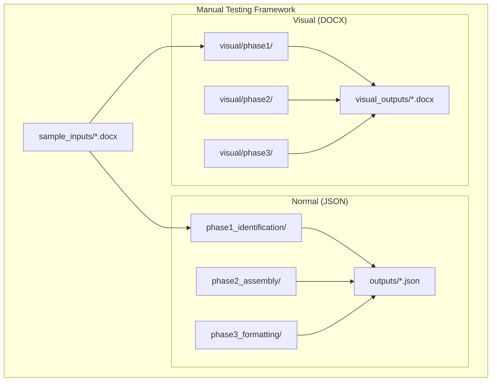
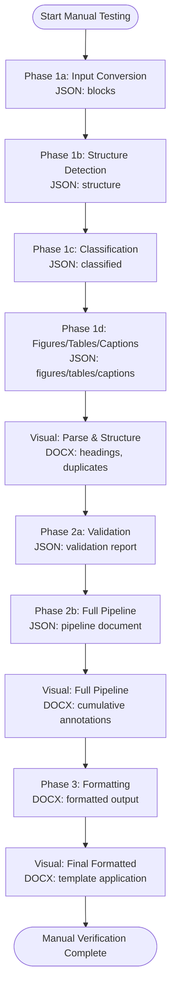
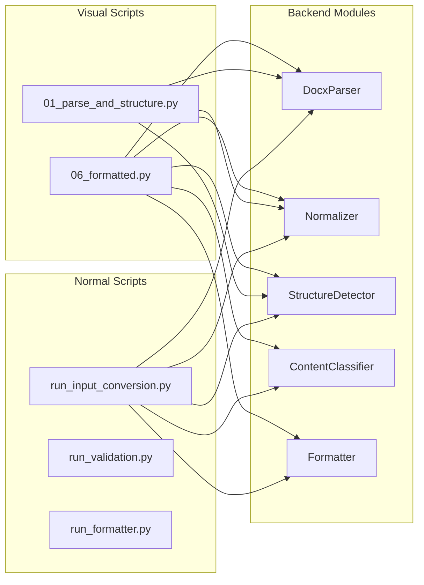

# Manual Testing Overview

<cite>
**Referenced Files in This Document**
- [TESTING_COMMANDS.md](file://backend/manual_tests/TESTING_COMMANDS.md)
- [README_1.md](file://backend/manual_tests/README_1.md)
- [README_VISUAL.md](file://backend/manual_tests/README_VISUAL.md)
- [README.md](file://backend/manual_tests/sample_inputs/README.md)
- [run_input_conversion.py](file://backend/manual_tests/normal/phase1/run_input_conversion.py)
- [run_validation.py](file://backend/manual_tests/normal/phase2/run_validation.py)
- [run_formatter.py](file://backend/manual_tests/normal/phase3/run_formatter.py)
- [01_parse_and_structure.py](file://backend/manual_tests/visual/phase1/01_parse_and_structure.py)
- [06_formatted.py](file://backend/manual_tests/visual/phase3/06_formatted.py)
- [MANUAL_TESTING_LOG.md](file://backend/MANUAL_TESTING_LOG.md)
- [Testing.md](file://docs/Testing.md)
- [backend README.md](file://backend/README.md)
</cite>

## Table of Contents
1. [Introduction](#introduction)
2. [Project Structure](#project-structure)
3. [Core Components](#core-components)
4. [Architecture Overview](#architecture-overview)
5. [Detailed Component Analysis](#detailed-component-analysis)
6. [Dependency Analysis](#dependency-analysis)
7. [Performance Considerations](#performance-considerations)
8. [Troubleshooting Guide](#troubleshooting-guide)
9. [Conclusion](#conclusion)
10. [Appendices](#appendices)

## Introduction
This document provides a comprehensive manual testing overview for the Automated Academic Manuscript Formatter. It explains the manual testing philosophy, objectives, and quality assurance approach, and describes the command structure, execution procedures, and test environment setup. It also clarifies the relationship between automated and manual testing, when manual testing is preferred, and how manual verification fits into the overall QA process. Finally, it outlines guidelines for systematic manual testing execution, test case documentation standards, and regression testing procedures.

## Project Structure
Manual testing is organized into two complementary frameworks:
- Normal (JSON-focused) tests: Each script executes a pipeline stage and writes structured JSON outputs for inspection.
- Visual (DOCX-focused) tests: Each script produces annotated DOCX files that are opened in Microsoft Word for visual verification.

Key directories and files:
- Normal tests: backend/manual_tests/normal/phase1/, backend/manual_tests/normal/phase2/, backend/manual_tests/normal/phase3/
- Visual tests: backend/manual_tests/visual/phase1/, backend/manual_tests/visual/phase2/, backend/manual_tests/visual/phase3/
- Output directories: backend/manual_tests/outputs/ (JSON), backend/manual_tests/visual_outputs/ (DOCX)
- Command reference: backend/manual_tests/TESTING_COMMANDS.md
- Workflow and principles: backend/manual_tests/README_1.md, backend/manual_tests/README_VISUAL.md
- Sample inputs: backend/manual_tests/sample_inputs/README.md
- Manual testing log: backend/MANUAL_TESTING_LOG.md
- Backend testing strategy: docs/Testing.md
- Backend overview and manual testing pointers: backend/README.md

**Diagram sources**
- [TESTING_COMMANDS.md:1-285](file://backend/manual_tests/TESTING_COMMANDS.md#L1-L285)
- [README_1.md:1-211](file://backend/manual_tests/README_1.md#L1-L211)
- [README_VISUAL.md:1-203](file://backend/manual_tests/README_VISUAL.md#L1-L203)

**Section sources**
- [TESTING_COMMANDS.md:1-285](file://backend/manual_tests/TESTING_COMMANDS.md#L1-L285)
- [README_1.md:1-211](file://backend/manual_tests/README_1.md#L1-L211)
- [README_VISUAL.md:1-203](file://backend/manual_tests/README_VISUAL.md#L1-L203)
- [README.md:1-78](file://backend/manual_tests/sample_inputs/README.md#L1-L78)

## Core Components
Manual testing is composed of three layers:
- Phase 1: Identification Verification (parsing, structure detection, classification, figures, tables, references)
- Phase 2: Assembly & Deduplication (validation and full pipeline assembly)
- Phase 3: Formatting (final DOCX generation and visual inspection)

Each layer includes both Normal and Visual scripts. Normal scripts produce JSON artifacts for precise inspection, while Visual scripts produce annotated DOCX files for human review in Word.

Key execution commands and outputs are cataloged in the manual testing commands reference.

**Section sources**
- [TESTING_COMMANDS.md:50-285](file://backend/manual_tests/TESTING_COMMANDS.md#L50-L285)
- [README_1.md:30-211](file://backend/manual_tests/README_1.md#L30-L211)
- [README_VISUAL.md:29-195](file://backend/manual_tests/README_VISUAL.md#L29-L195)

## Architecture Overview
Manual testing follows a staged, layered approach:
- Input Conversion (Phase 1a) → Structure Detection (Phase 1b) → Classification (Phase 1c) → Figures/Tables/Captions (Phase 1d) → Validation (Phase 2a) → Full Pipeline (Phase 2b) → Formatting (Phase 3)
- Each stage validates correctness before proceeding to the next.
- Visual inspection is performed after each major stage to catch duplication, heading issues, caption placement, and reference problems.

**Diagram sources**
- [README_1.md:30-170](file://backend/manual_tests/README_1.md#L30-L170)
- [README_VISUAL.md:29-162](file://backend/manual_tests/README_VISUAL.md#L29-L162)

## Detailed Component Analysis

### Manual Testing Philosophy and Objectives
- Stability validation, crash prevention, and lifecycle correctness are primary goals.
- Manual verification focuses on duplication checks, heading hierarchy, caption placement, and reference formatting.
- Feature completeness and AI correctness are out of scope for manual testing; they are covered by automated tests and integration checks.

**Section sources**
- [MANUAL_TESTING_LOG.md:3-10](file://backend/MANUAL_TESTING_LOG.md#L3-L10)

### Manual Testing Command Structure and Execution Procedures
- Normal tests: Each script takes a DOCX input and writes JSON outputs under manual_tests/outputs/.
- Visual tests: Each script writes annotated DOCX outputs under manual_tests/visual_outputs/ and instructs manual inspection in Word.
- Commands are grouped by phase and type in the manual testing commands reference.

Execution steps:
- Prepare sample inputs or use existing uploads.
- Run Phase 1 scripts to extract and annotate content.
- Inspect JSON outputs and DOCX annotations; report findings.
- Proceed to Phase 2 validation and assembly.
- Perform Phase 3 formatting and final visual inspection.

**Section sources**
- [TESTING_COMMANDS.md:50-285](file://backend/manual_tests/TESTING_COMMANDS.md#L50-L285)
- [README_1.md:30-211](file://backend/manual_tests/README_1.md#L30-L211)
- [README_VISUAL.md:29-195](file://backend/manual_tests/README_VISUAL.md#L29-L195)
- [README.md:1-78](file://backend/manual_tests/sample_inputs/README.md#L1-L78)

### Test Environment Setup
- Backend runtime: Python 3.12 required; FastAPI server runs locally.
- Services: Docker-based services (Redis, DB, GROBID) are recommended for integration tests; manual testing scripts operate independently of these services.
- Tools: Microsoft Word for visual inspection of annotated DOCX outputs; JSON viewers for Normal outputs.

**Section sources**
- [backend README.md:55-79](file://backend/README.md#L55-L79)
- [Testing.md:14-48](file://docs/Testing.md#L14-L48)

### Relationship Between Automated and Manual Testing
- Automated tests cover unit, integration, contract, and E2E flows; they provide fast feedback and regression coverage.
- Manual testing validates pipeline stability, lifecycle correctness, and visual quality where automation is insufficient (e.g., duplication, heading hierarchy, caption placement).
- Manual verification is not a replacement for automated testing but complements it by focusing on observable outcomes and user-facing quality.

**Section sources**
- [Testing.md:8-146](file://docs/Testing.md#L8-L146)
- [MANUAL_TESTING_LOG.md:6-10](file://backend/MANUAL_TESTING_LOG.md#L6-L10)

### When Manual Testing Is Preferred
Manual testing is preferred for:
- Detecting duplication across the pipeline
- Verifying heading hierarchy and spacing
- Confirming caption placement (figures below, tables above)
- Ensuring reference formatting consistency
- Validating final DOCX quality in Word

These checks rely on human judgment and visual inspection, which automated tests cannot fully replicate.

**Section sources**
- [README_1.md:145-170](file://backend/manual_tests/README_1.md#L145-L170)
- [README_VISUAL.md:136-162](file://backend/manual_tests/README_VISUAL.md#L136-L162)

### Role of Manual Verification in Quality Assurance
Manual verification acts as a final gate:
- Stop after each phase and report findings.
- Fix at the correct layer: pipeline logic for duplicates, formatter for formatting issues.
- Do not proceed if duplicates are found; re-run from the beginning of the affected phase.

**Section sources**
- [README_1.md:172-200](file://backend/manual_tests/README_1.md#L172-L200)
- [README_VISUAL.md:165-194](file://backend/manual_tests/README_VISUAL.md#L165-L194)

### Systematic Manual Testing Execution Guidelines
- Follow the staged workflow: Phase 1 → Phase 2 → Phase 3.
- After each stage, open outputs (JSON or DOCX) and report findings.
- If duplicates are found, fix pipeline logic and re-run from the beginning of the affected phase.
- For formatting issues (no duplicates), fix formatter logic and re-run the formatting stage only.

**Section sources**
- [README_1.md:172-200](file://backend/manual_tests/README_1.md#L172-L200)
- [README_VISUAL.md:165-194](file://backend/manual_tests/README_VISUAL.md#L165-L194)

### Test Case Documentation Standards
- Document test cases with clear descriptions, Swagger steps, expected outcomes, and failure indicators.
- Maintain an append-only manual testing log with date, tester, test IDs, results, and notes.

**Section sources**
- [MANUAL_TESTING_LOG.md:13-82](file://backend/MANUAL_TESTING_LOG.md#L13-L82)

### Regression Testing Procedures
- Use the staged manual testing workflow to regress new changes.
- Focus on duplication checks, heading hierarchy, caption placement, and reference formatting.
- Keep a record of findings in the manual testing log to track regressions and resolutions.

**Section sources**
- [README_1.md:172-200](file://backend/manual_tests/README_1.md#L172-L200)
- [MANUAL_TESTING_LOG.md:76-82](file://backend/MANUAL_TESTING_LOG.md#L76-L82)

## Dependency Analysis
Manual testing scripts depend on backend pipeline modules and write outputs to dedicated directories. The Normal and Visual frameworks are independent but aligned in their staging order.

**Diagram sources**
- [run_input_conversion.py:13-52](file://backend/manual_tests/normal/phase1/run_input_conversion.py#L13-L52)
- [run_validation.py:17-18](file://backend/manual_tests/normal/phase2/run_validation.py#L17-L18)
- [run_formatter.py:32-89](file://backend/manual_tests/normal/phase3/run_formatter.py#L32-L89)
- [01_parse_and_structure.py:25-30](file://backend/manual_tests/visual/phase1/01_parse_and_structure.py#L25-L30)
- [06_formatted.py:32-38](file://backend/manual_tests/visual/phase3/06_formatted.py#L32-L38)

**Section sources**
- [run_input_conversion.py:13-63](file://backend/manual_tests/normal/phase1/run_input_conversion.py#L13-L63)
- [run_validation.py:17-175](file://backend/manual_tests/normal/phase2/run_validation.py#L17-L175)
- [run_formatter.py:32-135](file://backend/manual_tests/normal/phase3/run_formatter.py#L32-L135)
- [01_parse_and_structure.py:25-175](file://backend/manual_tests/visual/phase1/01_parse_and_structure.py#L25-L175)
- [06_formatted.py:32-140](file://backend/manual_tests/visual/phase3/06_formatted.py#L32-L140)

## Performance Considerations
- Manual testing is not performance-oriented; it prioritizes correctness and clarity.
- Prefer smaller, focused test inputs to reduce processing time.
- Use the staged approach to isolate issues quickly and avoid unnecessary reprocessing.

## Troubleshooting Guide
Common issues and remedies:
- Missing or incorrect outputs: Verify script arguments and working directory; ensure backend is on the Python path.
- Duplicates found in visual outputs: Fix pipeline logic (identification or assembly), re-run from the beginning of the affected phase.
- Formatting failures: Ensure the pipeline passes validation; fix formatter logic and re-run the formatting stage only.
- Environment blockers: Confirm Python 3.12, install required dependencies, and address any import collisions.

**Section sources**
- [README_1.md:172-200](file://backend/manual_tests/README_1.md#L172-L200)
- [README_VISUAL.md:165-194](file://backend/manual_tests/README_VISUAL.md#L165-L194)
- [Testing.md:50-57](file://docs/Testing.md#L50-L57)

## Conclusion
Manual testing in this project is a structured, staged process designed to validate pipeline stability, prevent duplication, and ensure high-quality visual output. It complements automated testing by focusing on observable outcomes and user-facing quality. By following the documented procedures, maintaining clear records, and isolating fixes to the correct layer, teams can efficiently maintain quality and reliability.

## Appendices

### Appendix A: Quick Start Commands
- Phase 1a Input Conversion: [run_input_conversion.py](file://backend/manual_tests/normal/phase1/run_input_conversion.py)
- Phase 1b Structure Detection: [01_parse_and_structure.py](file://backend/manual_tests/visual/phase1/01_parse_and_structure.py)
- Phase 2a Validation: [run_validation.py](file://backend/manual_tests/normal/phase2/run_validation.py)
- Phase 3 Formatting: [run_formatter.py](file://backend/manual_tests/normal/phase3/run_formatter.py)
- Visual Final: [06_formatted.py](file://backend/manual_tests/visual/phase3/06_formatted.py)

**Section sources**
- [TESTING_COMMANDS.md:50-285](file://backend/manual_tests/TESTING_COMMANDS.md#L50-L285)