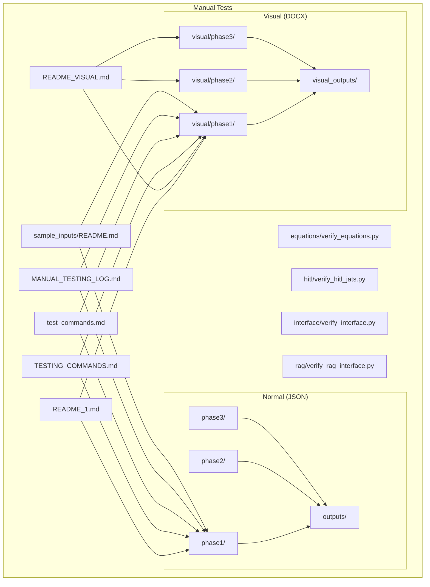
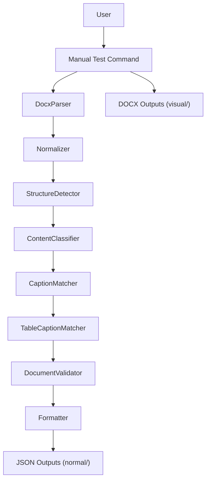
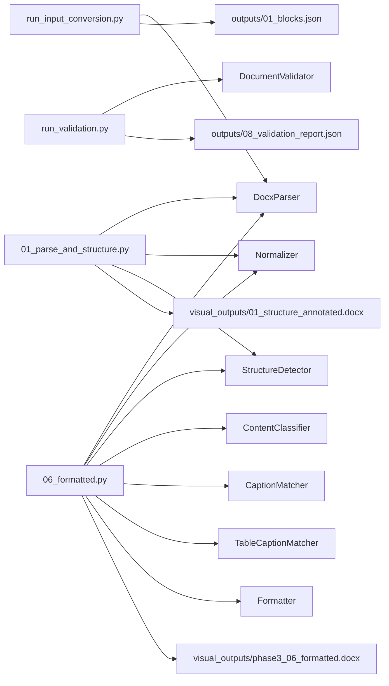

# Manual Testing

<cite>
**Referenced Files in This Document**
- [README_1.md](file://backend/manual_tests/README_1.md)
- [README_VISUAL.md](file://backend/manual_tests/README_VISUAL.md)
- [TESTING_COMMANDS.md](file://backend/manual_tests/TESTING_COMMANDS.md)
- [test_commands.md](file://backend/manual_tests/test_commands.md)
- [MANUAL_TESTING_LOG.md](file://backend/MANUAL_TESTING_LOG.md)
- [README.md](file://backend/manual_tests/sample_inputs/README.md)
- [verify_equations.py](file://backend/manual_tests/equations/verify_equations.py)
- [verify_hitl_jats.py](file://backend/manual_tests/hitl/verify_hitl_jats.py)
- [verify_interface.py](file://backend/manual_tests/interface/verify_interface.py)
- [verify_rag_interface.py](file://backend/manual_tests/rag/verify_rag_interface.py)
- [run_input_conversion.py](file://backend/manual_tests/normal/phase1/run_input_conversion.py)
- [01_parse_and_structure.py](file://backend/manual_tests/visual/phase1/01_parse_and_structure.py)
- [run_validation.py](file://backend/manual_tests/normal/phase2/run_validation.py)
- [06_formatted.py](file://backend/manual_tests/visual/phase3/06_formatted.py)
</cite>

## Table of Contents
1. [Introduction](#introduction)
2. [Project Structure](#project-structure)
3. [Core Components](#core-components)
4. [Architecture Overview](#architecture-overview)
5. [Detailed Component Analysis](#detailed-component-analysis)
6. [Dependency Analysis](#dependency-analysis)
7. [Performance Considerations](#performance-considerations)
8. [Troubleshooting Guide](#troubleshooting-guide)
9. [Conclusion](#conclusion)
10. [Appendices](#appendices)

## Introduction
This document provides comprehensive manual testing procedures and workflows for the ScholarForm AI backend. It explains the manual testing directory structure, visual testing procedures, interface verification, and specialized test scripts. It also documents the three phases of manual testing (phase1, phase2, phase3) with their focus areas, visual output generation and verification, and commands for equation verification, Human-in-the-loop (HITL) verification, and Retrieval-Augmented Generation (RAG) interface testing. Finally, it includes guidelines for systematic manual testing, test case documentation, and regression testing procedures.

## Project Structure
Manual testing is organized under the backend manual_tests directory with two complementary approaches:
- Normal tests: produce JSON outputs for detailed data inspection.
- Visual tests: produce annotated DOCX outputs for visual inspection in Microsoft Word.

Key directories and files:
- normal/: JSON-based outputs for detailed inspection
  - phase1/: Identification verification (parsing, structure, classification, figures, tables, references)
  - phase2/: Assembly and deduplication checks
  - phase3/: Final formatting
- visual/: DOCX-based outputs for visual inspection
  - phase1/: Identification stages (structure, classification, figures/tables, references, numbering, insertion)
  - phase2/: Full pipeline assembly
  - phase3/: Final formatted output
- outputs/: JSON artifacts produced by normal tests
- visual_outputs/: DOCX artifacts produced by visual tests
- Specialized scripts:
  - equations/verify_equations.py
  - hitl/verify_hitl_jats.py
  - interface/verify_interface.py
  - rag/verify_rag_interface.py
- Guides:
  - README_1.md (high-level workflow)
  - README_VISUAL.md (visual testing framework)
  - TESTING_COMMANDS.md (command catalog)
  - test_commands.md (alternative command catalog)
  - MANUAL_TESTING_LOG.md (static test cases and execution log)
  - sample_inputs/README.md (sample input guidance)

**Diagram sources**
- [README_1.md:1-211](file://backend/manual_tests/README_1.md#L1-L211)
- [README_VISUAL.md:1-203](file://backend/manual_tests/README_VISUAL.md#L1-L203)
- [TESTING_COMMANDS.md:1-285](file://backend/manual_tests/TESTING_COMMANDS.md#L1-L285)
- [test_commands.md:1-347](file://backend/manual_tests/test_commands.md#L1-L347)
- [MANUAL_TESTING_LOG.md:1-82](file://backend/MANUAL_TESTING_LOG.md#L1-L82)
- [README.md:1-78](file://backend/manual_tests/sample_inputs/README.md#L1-L78)

**Section sources**
- [README_1.md:1-211](file://backend/manual_tests/README_1.md#L1-L211)
- [README_VISUAL.md:1-203](file://backend/manual_tests/README_VISUAL.md#L1-L203)
- [TESTING_COMMANDS.md:1-285](file://backend/manual_tests/TESTING_COMMANDS.md#L1-L285)
- [test_commands.md:1-347](file://backend/manual_tests/test_commands.md#L1-L347)
- [MANUAL_TESTING_LOG.md:1-82](file://backend/MANUAL_TESTING_LOG.md#L1-L82)
- [README.md:1-78](file://backend/manual_tests/sample_inputs/README.md#L1-L78)

## Core Components
- Phase 1: Identification Verification
  - Parsing and block extraction
  - Structure detection (headings)
  - Semantic classification
  - Figure detection and caption matching
  - Figure numbering and insertion points
  - Table extraction, caption matching, numbering, and insertion
  - Reference detection
  - Optional: Equation detection, NLP enrichment, OCR diagnostics, model validation
- Phase 2: Assembly and Deduplication
  - Validation checks for duplicates and completeness
  - Full pipeline assembly (no formatting)
- Phase 3: Formatting
  - Final DOCX formatting with selected template
- Visual Testing Framework
  - DOCX-in, DOCX-out annotated outputs for visual inspection
  - Cumulative stages with clear acceptance criteria
- Specialized Scripts
  - Equation verification (MathML conversion)
  - HITL and JATS export verification
  - Interface verification for semantic parser and RAG engine
- Static Test Cases and Execution Log
  - Stability validation, crash prevention, lifecycle correctness
  - Non-functional API behavior documented as static test cases

**Section sources**
- [README_1.md:5-27](file://backend/manual_tests/README_1.md#L5-L27)
- [README_1.md:32-170](file://backend/manual_tests/README_1.md#L32-L170)
- [README_VISUAL.md:11-25](file://backend/manual_tests/README_VISUAL.md#L11-L25)
- [README_VISUAL.md:29-163](file://backend/manual_tests/README_VISUAL.md#L29-L163)
- [TESTING_COMMANDS.md:5-46](file://backend/manual_tests/TESTING_COMMANDS.md#L5-L46)
- [test_commands.md:5-52](file://backend/manual_tests/test_commands.md#L5-L52)
- [MANUAL_TESTING_LOG.md:13-76](file://backend/MANUAL_TESTING_LOG.md#L13-L76)

## Architecture Overview
The manual testing architecture supports two complementary workflows:
- Normal workflow: Each stage writes JSON outputs for detailed inspection and validation.
- Visual workflow: Each stage writes annotated DOCX outputs for visual inspection in Word.

**Diagram sources**
- [run_input_conversion.py:18-62](file://backend/manual_tests/normal/phase1/run_input_conversion.py#L18-L62)
- [01_parse_and_structure.py:62-84](file://backend/manual_tests/visual/phase1/01_parse_and_structure.py#L62-L84)
- [run_validation.py:20-175](file://backend/manual_tests/normal/phase2/run_validation.py#L20-L175)
- [06_formatted.py:52-91](file://backend/manual_tests/visual/phase3/06_formatted.py#L52-L91)

## Detailed Component Analysis

### Phase 1: Identification Verification
Focus areas:
- Input conversion and parsing
- Structure detection (headings)
- Semantic classification
- Figure detection, caption matching, numbering, insertion
- Table extraction, caption matching, numbering, insertion
- Reference detection
- Optional: Equation detection, NLP enrichment, OCR diagnostics, model validation

Manual commands and outputs:
- Input conversion: run_input_conversion.py → outputs/01_blocks.json
- Structure: run_structure.py → outputs/02_structure.json
- Classification: run_classifier.py → outputs/03_classified.json
- Figures: run_figure_detection.py → outputs/04_figures.json; caption matching → outputs/05_figures_with_captions.json; numbering → outputs/05b_figures_numbered.json; insertion → outputs/05c_figures_insertion.json
- Tables: run_table_extraction.py → outputs/06_tables.json; caption matching → outputs/07_tables_with_captions.json; numbering → outputs/06b_tables_numbered.json; insertion → outputs/06c_tables_insertion.json
- References: run_reference_detection.py → outputs/12_references.json
- Optional: run_nlp_debug.py → outputs/13_nlp_debug.json; run_ocr_debug.py; run_model_validation.py

Visual equivalents:
- 01_parse_and_structure.py → visual_outputs/01_structure_annotated.docx
- 02_classification.py → visual_outputs/02_classified_annotated.docx
- 03_figures_tables.py → visual_outputs/03_figures_tables_annotated.docx
- 04_references.py → visual_outputs/04_references_annotated.docx
- 05b_figure_numbering.py → visual_outputs/05b_figure_numbering_annotated.docx
- 05c_figure_insertion.py → visual_outputs/05c_figure_insertion_annotated.docx
- 06b_table_numbering.py → visual_outputs/06b_table_numbering_annotated.docx
- 06c_table_insertion.py → visual_outputs/06c_table_insertion_annotated.docx

Decision flow:
- Stop after each phase and report findings.
- Fix at the correct layer: identification vs formatting.
- Do not skip phases; do not auto-fix without verification.

**Section sources**
- [README_1.md:32-102](file://backend/manual_tests/README_1.md#L32-L102)
- [TESTING_COMMANDS.md:50-239](file://backend/manual_tests/TESTING_COMMANDS.md#L50-L239)
- [test_commands.md:56-290](file://backend/manual_tests/test_commands.md#L56-L290)
- [README_VISUAL.md:29-124](file://backend/manual_tests/README_VISUAL.md#L29-L124)

### Phase 2: Assembly and Deduplication
Focus areas:
- Validation to ensure no duplicates
- Full pipeline assembly (no formatting)

Manual commands and outputs:
- Validation: run_validation.py → outputs/08_validation_report.json
  - Acceptance criteria: has_any_duplicates false; counts of unique vs total blocks/figures/tables consistent
- Full pipeline assembly: run_pipeline.py → outputs/09_pipeline_document.json

Visual equivalent:
- 05_full_pipeline.py → visual_outputs/05_full_pipeline_annotated.docx
  - Red duplicate annotations and cumulative summary

Decision flow:
- If duplicates found → fix pipeline logic, re-run from Phase 1
- If no duplicates → proceed to Phase 3

**Section sources**
- [README_1.md:106-132](file://backend/manual_tests/README_1.md#L106-L132)
- [TESTING_COMMANDS.md:241-266](file://backend/manual_tests/TESTING_COMMANDS.md#L241-L266)
- [test_commands.md:292-329](file://backend/manual_tests/test_commands.md#L292-L329)
- [README_VISUAL.md:106-124](file://backend/manual_tests/README_VISUAL.md#L106-L124)

### Phase 3: Formatting
Focus area:
- Final DOCX formatting with selected template

Manual commands and outputs:
- Formatter: run_formatter.py → outputs/10_formatted_<template>.docx
- Visual final check: 06_formatted.py → visual_outputs/phase3_06_formatted.docx

Manual inspection checklist:
- Duplication check (headings, figures, tables, references)
- Heading hierarchy (H1 > H2 > H3) and spacing
- Caption placement (figures below; tables above)
- Reference formatting (consistent style, no duplicates, proper numbering)
- Completeness (no missing sections)

Decision flow:
- If formatting issues (no duplicates) → fix formatter only, re-run Phase 3
- Otherwise → done

**Section sources**
- [README_1.md:135-170](file://backend/manual_tests/README_1.md#L135-L170)
- [TESTING_COMMANDS.md:269-285](file://backend/manual_tests/TESTING_COMMANDS.md#L269-L285)
- [test_commands.md:331-347](file://backend/manual_tests/test_commands.md#L331-L347)
- [README_VISUAL.md:127-162](file://backend/manual_tests/README_VISUAL.md#L127-L162)

### Visual Testing Framework
Purpose:
- Provide DOCX-in, DOCX-out manual testing for visual inspection of the pipeline
- Detect duplication, heading issues, caption problems, and reference repetition

Directory structure:
- visual/phase1/: parse and structure, classification, figures/tables, references, numbering, insertion
- visual/phase2/: full pipeline assembly
- visual/phase3/: final formatted output
- visual_outputs/: generated annotated DOCX files

Workflow:
- Run stage-specific script with a DOCX input
- Open the generated annotated DOCX in Microsoft Word
- Inspect highlights, annotations, and summaries
- Report findings before proceeding to the next stage

Decision tree:
- If any stage has duplicates or errors → fix pipeline logic, re-run from Stage 1
- If Stage 5 has duplicates → do not proceed to Stage 6
- If Stage 6 has formatting issues (no duplicates) → fix formatter, re-run Stage 6

**Section sources**
- [README_VISUAL.md:1-203](file://backend/manual_tests/README_VISUAL.md#L1-L203)

### Specialized Test Scripts
Equation Verification:
- Script: equations/verify_equations.py
- Validates MathML generation from OMML fragments
- Acceptance: MathML contains expected tags

HITL and JATS Export:
- Script: hitl/verify_hitl_jats.py
- Verifies critical review status and JATS XML generation with MathML

Interface Verification:
- Script: interface/verify_interface.py
- Verifies semantic parser interface methods (detect_boundaries, reconcile_fragmented_headings)

RAG Interface Testing:
- Script: rag/verify_rag_interface.py
- Verifies RAG engine interface methods (query_rules, query_guidelines)

**Section sources**
- [verify_equations.py:1-59](file://backend/manual_tests/equations/verify_equations.py#L1-L59)
- [verify_hitl_jats.py:1-77](file://backend/manual_tests/hitl/verify_hitl_jats.py#L1-L77)
- [verify_interface.py:1-46](file://backend/manual_tests/interface/verify_interface.py#L1-L46)
- [verify_rag_interface.py:1-42](file://backend/manual_tests/rag/verify_rag_interface.py#L1-L42)

### Visual Output Generation and Verification
Generation:
- Normal tests write JSON outputs to manual_tests/outputs/
- Visual tests write annotated DOCX outputs to manual_tests/visual_outputs/

Verification:
- Open DOCX in Microsoft Word
- Use color highlights and annotations to verify:
  - Headings and levels
  - Figure/table captions
  - Duplicates and split/merge behavior
  - Final formatting compliance

**Section sources**
- [run_input_conversion.py:44-59](file://backend/manual_tests/normal/phase1/run_input_conversion.py#L44-L59)
- [01_parse_and_structure.py:122-155](file://backend/manual_tests/visual/phase1/01_parse_and_structure.py#L122-L155)
- [06_formatted.py:110-125](file://backend/manual_tests/visual/phase3/06_formatted.py#L110-L125)

### Manual Testing Phases and Focus Areas
- Phase 1: Identification
  - Caption matching, figure detection, table extraction, full pipeline validation (assembly)
- Phase 2: Assembly
  - Duplication checks and full pipeline assembly
- Phase 3: Formatting
  - Final DOCX formatting and visual verification

**Section sources**
- [README_1.md:5-27](file://backend/manual_tests/README_1.md#L5-L27)
- [README_1.md:32-170](file://backend/manual_tests/README_1.md#L32-L170)

## Dependency Analysis
Manual tests depend on backend pipeline components and models. The dependency chain is straightforward: each stage composes earlier stages and passes a PipelineDocument through processors.

**Diagram sources**
- [run_input_conversion.py:16-52](file://backend/manual_tests/normal/phase1/run_input_conversion.py#L16-L52)
- [01_parse_and_structure.py:28-84](file://backend/manual_tests/visual/phase1/01_parse_and_structure.py#L28-L84)
- [run_validation.py:17-175](file://backend/manual_tests/normal/phase2/run_validation.py#L17-L175)
- [06_formatted.py:32-91](file://backend/manual_tests/visual/phase3/06_formatted.py#L32-L91)

**Section sources**
- [run_input_conversion.py:16-52](file://backend/manual_tests/normal/phase1/run_input_conversion.py#L16-L52)
- [01_parse_and_structure.py:28-84](file://backend/manual_tests/visual/phase1/01_parse_and_structure.py#L28-L84)
- [run_validation.py:17-175](file://backend/manual_tests/normal/phase2/run_validation.py#L17-L175)
- [06_formatted.py:32-91](file://backend/manual_tests/visual/phase3/06_formatted.py#L32-L91)

## Performance Considerations
- Prefer visual tests for quick macro-level checks; use normal tests for detailed debugging.
- Limit concurrent runs to avoid resource contention during OCR and external service calls.
- Use representative sample inputs to reduce iteration cycles.

## Troubleshooting Guide
Common issues and resolutions:
- Duplicates found in Phase 1 or 2:
  - Fix pipeline logic (identification or assembly), re-run from the first stage.
- OCR-related failures:
  - Use run_ocr_debug.py to verify system dependencies and PdfOCR instantiation.
- Equation MathML generation failures:
  - Use verify_equations.py to validate OMML-to-MathML conversion.
- HITL/JATS export anomalies:
  - Use verify_hitl_jats.py to confirm critical review status and JATS XML content.
- Interface method errors:
  - Use verify_interface.py for semantic parser methods and verify_rag_interface.py for RAG engine methods.
- Static test case failures:
  - Refer to MANUAL_TESTING_LOG.md for documented non-functional API behavior and expected outcomes.

**Section sources**
- [README_1.md:172-186](file://backend/manual_tests/README_1.md#L172-L186)
- [README_VISUAL.md:165-179](file://backend/manual_tests/README_VISUAL.md#L165-L179)
- [test_commands.md:97-114](file://backend/manual_tests/test_commands.md#L97-L114)
- [verify_equations.py:10-59](file://backend/manual_tests/equations/verify_equations.py#L10-L59)
- [verify_hitl_jats.py:13-65](file://backend/manual_tests/hitl/verify_hitl_jats.py#L13-L65)
- [verify_interface.py:10-46](file://backend/manual_tests/interface/verify_interface.py#L10-L46)
- [verify_rag_interface.py:9-42](file://backend/manual_tests/rag/verify_rag_interface.py#L9-L42)
- [MANUAL_TESTING_LOG.md:13-76](file://backend/MANUAL_TESTING_LOG.md#L13-L76)

## Conclusion
The manual testing framework provides robust, layered validation of the ScholarForm AI pipeline. By following the three-phase workflow—identification, assembly/deduplication, and formatting—and leveraging both normal and visual outputs, testers can systematically detect and resolve issues early. Specialized scripts further ensure correctness of critical subsystems like equations, HITL/JATS, and RAG interfaces. Static test cases capture non-functional behavior, while the visual framework enables efficient, human-driven verification.

## Appendices

### A. Manual Testing Commands Catalog
- Phase 1 (Normal):
  - run_input_conversion.py → outputs/01_blocks.json
  - run_structure.py → outputs/02_structure.json
  - run_classifier.py → outputs/03_classified.json
  - run_figure_detection.py → outputs/04_figures.json
  - run_caption_matching.py → outputs/05_figures_with_captions.json
  - run_figure_numbering.py → outputs/05b_figures_numbered.json
  - run_figure_insertion.py → outputs/05c_figures_insertion.json
  - run_table_extraction.py → outputs/06_tables.json
  - run_table_caption_matching.py → outputs/07_tables_with_captions.json
  - run_table_numbering.py → outputs/06b_tables_numbered.json
  - run_table_insertion.py → outputs/06c_tables_insertion.json
  - run_reference_detection.py → outputs/12_references.json
  - run_nlp_debug.py → outputs/13_nlp_debug.json
  - run_ocr_debug.py
  - run_model_validation.py
- Phase 1 (Visual):
  - 01_parse_and_structure.py → visual_outputs/01_structure_annotated.docx
  - 02_classification.py → visual_outputs/02_classified_annotated.docx
  - 03_figures_tables.py → visual_outputs/03_figures_tables_annotated.docx
  - 04_references.py → visual_outputs/04_references_annotated.docx
  - 05b_figure_numbering.py → visual_outputs/05b_figure_numbering_annotated.docx
  - 05c_figure_insertion.py → visual_outputs/05c_figure_insertion_annotated.docx
  - 06b_table_numbering.py → visual_outputs/06b_table_numbering_annotated.docx
  - 06c_table_insertion.py → visual_outputs/06c_table_insertion_annotated.docx
- Phase 2 (Normal):
  - run_validation.py → outputs/08_validation_report.json
  - run_pipeline.py → outputs/09_pipeline_document.json
- Phase 2 (Visual):
  - 05_full_pipeline.py → visual_outputs/05_full_pipeline_annotated.docx
- Phase 3 (Normal):
  - run_formatter.py → outputs/10_formatted_<template>.docx
- Phase 3 (Visual):
  - 06_formatted.py → visual_outputs/phase3_06_formatted.docx
- Specialized:
  - equations/verify_equations.py
  - hitl/verify_hitl_jats.py
  - interface/verify_interface.py
  - rag/verify_rag_interface.py

**Section sources**
- [TESTING_COMMANDS.md:5-285](file://backend/manual_tests/TESTING_COMMANDS.md#L5-L285)
- [test_commands.md:5-347](file://backend/manual_tests/test_commands.md#L5-L347)

### B. Systematic Manual Testing Guidelines
- Stop after each phase and report findings.
- Fix at the correct layer: identification vs formatting.
- Do not skip phases; do not redesign the pipeline.
- Do not auto-fix without verification.
- Use sample inputs or existing uploads as needed.

**Section sources**
- [README_1.md:190-200](file://backend/manual_tests/README_1.md#L190-L200)
- [README_VISUAL.md:183-194](file://backend/manual_tests/README_VISUAL.md#L183-L194)

### C. Test Case Documentation and Regression Procedures
- Static test cases:
  - Document upload and job creation
  - Asynchronous status polling
  - Server reload handling
  - Database interrupt resilience
  - Document edit reprocessing
- Execution log:
  - Append-only record of manual test runs with tester, test IDs, results, and notes.

**Section sources**
- [MANUAL_TESTING_LOG.md:13-76](file://backend/MANUAL_TESTING_LOG.md#L13-L76)
- [MANUAL_TESTING_LOG.md:76-82](file://backend/MANUAL_TESTING_LOG.md#L76-L82)