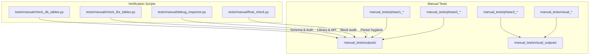
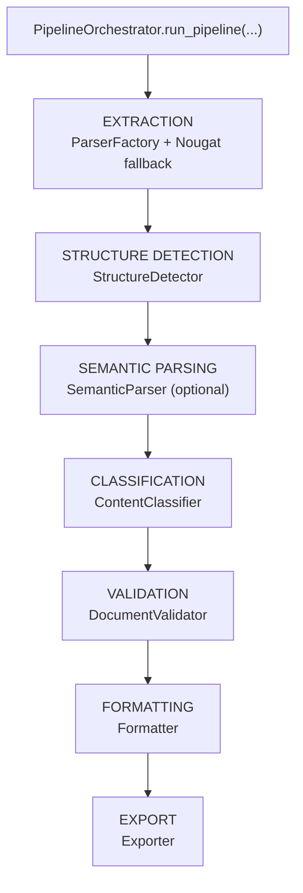
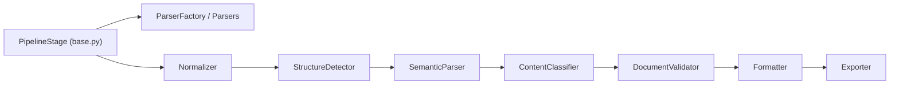

# Pipeline Validation

<cite>
**Referenced Files in This Document**
- [TESTING_COMMANDS.md](file://backend/manual_tests/TESTING_COMMANDS.md)
- [test_commands.md](file://backend/manual_tests/test_commands.md)
- [README_1.md](file://backend/manual_tests/README_1.md)
- [MANUAL_TESTING_LOG.md](file://backend/MANUAL_TESTING_LOG.md)
- [check_db_tables.py](file://backend/tests/manual/check_db_tables.py)
- [check_fitz_tables.py](file://backend/tests/manual/check_fitz_tables.py)
- [debug_inspector.py](file://backend/tests/manual/debug_inspector.py)
- [final_check.py](file://backend/tests/manual/final_check.py)
- [orchestrator.py](file://backend/app/pipeline/orchestrator.py)
- [base.py](file://backend/app/pipeline/base.py)
</cite>

## Table of Contents
1. [Introduction](#introduction)
2. [Project Structure](#project-structure)
3. [Core Components](#core-components)
4. [Architecture Overview](#architecture-overview)
5. [Detailed Component Analysis](#detailed-component-analysis)
6. [Dependency Analysis](#dependency-analysis)
7. [Performance Considerations](#performance-considerations)
8. [Troubleshooting Guide](#troubleshooting-guide)
9. [Conclusion](#conclusion)
10. [Appendices](#appendices)

## Introduction
This document defines comprehensive pipeline validation procedures for the end-to-end document processing pipeline. It covers manual testing scripts, database and system checks, validation criteria, integration point verification, and system-wide testing workflows. The goal is to ensure reproducible, layered validation from content identification through final formatted output, with clear expected outcomes and troubleshooting steps.

## Project Structure
The validation assets are organized under two primary areas:
- backend/manual_tests: Command-driven, phase-based manual tests that exercise individual pipeline stages and produce JSON or DOCX artifacts for inspection.
- backend/tests/manual: Standalone verification scripts for database schema, third-party library availability, and internal component health.

**Diagram sources**
- [TESTING_COMMANDS.md:50-285](file://backend/manual_tests/TESTING_COMMANDS.md#L50-L285)
- [test_commands.md:56-347](file://backend/manual_tests/test_commands.md#L56-L347)
- [README_1.md:30-211](file://backend/manual_tests/README_1.md#L30-L211)
- [check_db_tables.py:11-52](file://backend/tests/manual/check_db_tables.py#L11-L52)
- [check_fitz_tables.py:1-19](file://backend/tests/manual/check_fitz_tables.py#L1-L19)
- [debug_inspector.py:13-46](file://backend/tests/manual/debug_inspector.py#L13-L46)
- [final_check.py:8-28](file://backend/tests/manual/final_check.py#L8-L28)

**Section sources**
- [TESTING_COMMANDS.md:1-285](file://backend/manual_tests/TESTING_COMMANDS.md#L1-L285)
- [test_commands.md:1-347](file://backend/manual_tests/test_commands.md#L1-L347)
- [README_1.md:1-211](file://backend/manual_tests/README_1.md#L1-L211)

## Core Components
- Phase 1: Identification Verification
  - Input conversion, structure detection, classification, figures, tables, captions, numbering, insertion anchors, references, and optional enrichment/debugging steps.
- Phase 2: Assembly & Deduplication
  - Validation to ensure no duplicates and full pipeline assembly without formatting.
- Phase 3: Formatting
  - Final DOCX generation and visual inspection.

Execution commands and expected outputs are documented in the manual test guides. Verification scripts provide database/table checks, library capability checks, block-level debug inspection, and final parser hygiene checks.

**Section sources**
- [TESTING_COMMANDS.md:50-285](file://backend/manual_tests/TESTING_COMMANDS.md#L50-L285)
- [test_commands.md:56-347](file://backend/manual_tests/test_commands.md#L56-L347)
- [README_1.md:30-211](file://backend/manual_tests/README_1.md#L30-L211)

## Architecture Overview
The pipeline orchestrator coordinates stages, updates status, and persists partial results on failure. It integrates external services (e.g., GROBID, Docling) and supports timeouts and retries. The manual tests exercise the same stages independently to validate each layer.

**Diagram sources**
- [orchestrator.py:522-1227](file://backend/app/pipeline/orchestrator.py#L522-L1227)

**Section sources**
- [orchestrator.py:73-1227](file://backend/app/pipeline/orchestrator.py#L73-L1227)

## Detailed Component Analysis

### Phase 1: Identification Verification
- Input Conversion & Parsing
  - Validates block extraction from DOCX.
  - Expected: JSON output with blocks; no duplicates.
- Structure Detection
  - Validates headings and hierarchy.
  - Expected: JSON with detected headings and levels.
- Semantic Classification
  - Validates section type assignment.
  - Expected: JSON with classified sections.
- Figures
  - Extraction, caption matching, numbering, insertion anchors.
  - Expected: JSON outputs per step; DOCX annotations for visual inspection.
- Tables
  - Extraction, caption matching, numbering, insertion anchors.
  - Expected: JSON outputs per step; DOCX annotations for visual inspection.
- References
  - Bibliography parsing.
  - Expected: JSON and annotated DOCX.
- Optional: Equation detection, NLP enrichment, OCR toolchain, domain model integrity.

Execution commands and expected outputs are provided in the manual test guides.

**Section sources**
- [TESTING_COMMANDS.md:52-239](file://backend/manual_tests/TESTING_COMMANDS.md#L52-L239)
- [test_commands.md:58-289](file://backend/manual_tests/test_commands.md#L58-L289)
- [README_1.md:32-103](file://backend/manual_tests/README_1.md#L32-L103)

### Phase 2: Assembly & Deduplication
- Validation Check
  - Ensures no duplicates exist before assembly.
  - Expected: JSON report with counts and uniqueness checks.
- Full Pipeline Assembly (No Formatting)
  - Validates complete document structure without formatting.
  - Expected: JSON pipeline document; no crashes; processing history free of errors.

Decision tree: if duplicates found, fix pipeline logic and restart from Phase 1; otherwise proceed to Phase 3.

**Section sources**
- [TESTING_COMMANDS.md:241-267](file://backend/manual_tests/TESTING_COMMANDS.md#L241-L267)
- [test_commands.md:292-329](file://backend/manual_tests/test_commands.md#L292-L329)
- [README_1.md:106-133](file://backend/manual_tests/README_1.md#L106-L133)

### Phase 3: Formatting
- Final Output Generation
  - Generates publication-ready DOCX with selected template.
  - Expected: Final DOCX; manual inspection checklist includes duplication checks, heading hierarchy, caption placement, reference formatting, and completeness.

**Section sources**
- [TESTING_COMMANDS.md:269-285](file://backend/manual_tests/TESTING_COMMANDS.md#L269-L285)
- [test_commands.md:331-347](file://backend/manual_tests/test_commands.md#L331-L347)
- [README_1.md:135-170](file://backend/manual_tests/README_1.md#L135-L170)

### Validation Criteria and Integration Point Verification
- Duplicate-free assembly: validation report must show no duplicates across blocks, figures, and tables.
- Status polling stability: backend status endpoint must reflect phase transitions and handle transient failures gracefully.
- Integration resilience: orchestrator must tolerate external service unavailability and mark status appropriately.
- Database integrity: core application tables and auth schema must be present and reachable.

**Section sources**
- [README_1.md:110-119](file://backend/manual_tests/README_1.md#L110-L119)
- [MANUAL_TESTING_LOG.md:15-72](file://backend/MANUAL_TESTING_LOG.md#L15-L72)

### System-wide Testing Procedures
- Upload and job creation: verify asynchronous job initiation and job ID presence.
- Status polling: verify phase progression and stability during processing.
- Crash prevention: verify server reload handling and status marking.
- Database resilience: verify graceful degradation on DB interruption.
- Edit reprocessing: verify non-destructive editing flow and status progression.

**Section sources**
- [MANUAL_TESTING_LOG.md:15-72](file://backend/MANUAL_TESTING_LOG.md#L15-L72)

### Database and System Checks
- Database table verification
  - Confirms presence of core tables and Supabase auth schema.
- FITZ table detection
  - Verifies PyMuPDF availability and table-finding capability.
- Debug inspection
  - Audits block counts and metadata across parsing, normalization, structure detection, and classification.
- Final system checks
  - Validates parser method hygiene and content extraction behavior.

**Section sources**
- [check_db_tables.py:11-52](file://backend/tests/manual/check_db_tables.py#L11-L52)
- [check_fitz_tables.py:1-19](file://backend/tests/manual/check_fitz_tables.py#L1-L19)
- [debug_inspector.py:13-46](file://backend/tests/manual/debug_inspector.py#L13-L46)
- [final_check.py:8-28](file://backend/tests/manual/final_check.py#L8-L28)

## Dependency Analysis
The pipeline stages follow a strict order and rely on shared models and utilities. The orchestrator enforces timeouts, retries, and status updates, while manual tests exercise the same stages independently.

**Diagram sources**
- [base.py:4-24](file://backend/app/pipeline/base.py#L4-L24)
- [orchestrator.py:450-521](file://backend/app/pipeline/orchestrator.py#L450-L521)

**Section sources**
- [base.py:4-24](file://backend/app/pipeline/base.py#L4-L24)
- [orchestrator.py:450-521](file://backend/app/pipeline/orchestrator.py#L450-L521)

## Performance Considerations
- Concurrency control: pipeline uses a semaphore to limit concurrent jobs and avoid resource exhaustion.
- Timeouts: stages enforce bounded execution via thread pool and timeout helpers.
- Optional AI layers: semantic parsing can be disabled in fast mode to reduce latency.
- External integrations: GROBID and Docling are executed in parallel with bounded timeouts; fallbacks are applied when available.

**Section sources**
- [orchestrator.py:69-72](file://backend/app/pipeline/orchestrator.py#L69-L72)
- [orchestrator.py:212-234](file://backend/app/pipeline/orchestrator.py#L212-L234)
- [orchestrator.py:252-270](file://backend/app/pipeline/orchestrator.py#L252-L270)
- [orchestrator.py:649-715](file://backend/app/pipeline/orchestrator.py#L649-L715)

## Troubleshooting Guide
- Duplicate detection failures
  - Re-run Phase 1 steps to confirm identification accuracy; re-run validation and assembly if duplicates persist.
- Status polling anomalies
  - Verify backend connectivity and database availability; check for server reload interruptions.
- Database schema issues
  - Run database table verification script to confirm presence of core and auth schemas.
- Library capability issues
  - Run FITZ table detection script to verify PyMuPDF installation and table-finding API availability.
- Block-level debugging
  - Use debug inspector to audit block counts and metadata across stages.
- Parser hygiene
  - Run final check to ensure parser methods are correctly implemented and content extraction behaves as expected.

**Section sources**
- [README_1.md:172-186](file://backend/manual_tests/README_1.md#L172-L186)
- [check_db_tables.py:11-52](file://backend/tests/manual/check_db_tables.py#L11-L52)
- [check_fitz_tables.py:1-19](file://backend/tests/manual/check_fitz_tables.py#L1-L19)
- [debug_inspector.py:13-46](file://backend/tests/manual/debug_inspector.py#L13-L46)
- [final_check.py:8-28](file://backend/tests/manual/final_check.py#L8-L28)

## Conclusion
The pipeline validation framework combines phase-based manual tests with targeted verification scripts to ensure robustness across identification, assembly, and formatting. By following the documented commands, expected outcomes, and troubleshooting steps, teams can systematically validate end-to-end behavior, integrate external services safely, and maintain system health.

## Appendices

### Execution Methods and Expected Outcomes
- Phase 1 scripts
  - Use commands from the manual test guides to run each identification step and inspect JSON outputs.
- Phase 2 scripts
  - Run validation and assembly steps; interpret JSON reports for duplicates and completeness.
- Phase 3 scripts
  - Generate final DOCX and perform manual inspection per the checklist.
- Verification scripts
  - Execute database and system checks prior to full pipeline runs.

**Section sources**
- [TESTING_COMMANDS.md:50-285](file://backend/manual_tests/TESTING_COMMANDS.md#L50-L285)
- [test_commands.md:56-347](file://backend/manual_tests/test_commands.md#L56-L347)
- [README_1.md:30-211](file://backend/manual_tests/README_1.md#L30-L211)