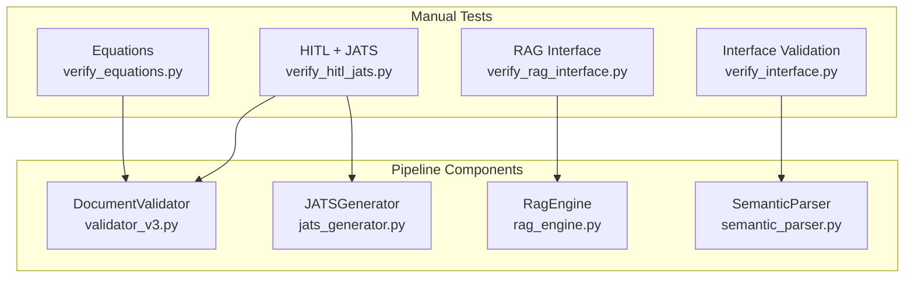
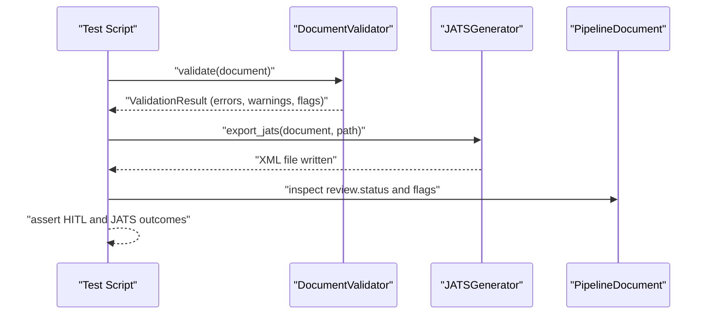
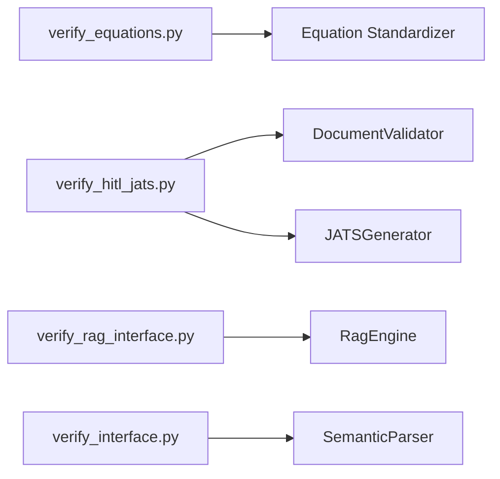

# Specialized Testing

<cite>
**Referenced Files in This Document**
- [README.md](file://backend/README.md)
- [MANUAL_TESTING_LOG.md](file://backend/MANUAL_TESTING_LOG.md)
- [TESTING_COMMANDS.md](file://backend/manual_tests/TESTING_COMMANDS.md)
- [test_commands.md](file://backend/manual_tests/test_commands.md)
- [README.md](file://backend/manual_tests/sample_inputs/README.md)
- [verify_equations.py](file://backend/manual_tests/equations/verify_equations.py)
- [validator_v3.py](file://backend/app/pipeline/validation/validator_v3.py)
- [verify_hitl_jats.py](file://backend/manual_tests/hitl/verify_hitl_jats.py)
- [jats_generator.py](file://backend/app/pipeline/export/jats_generator.py)
- [verify_rag_interface.py](file://backend/manual_tests/rag/verify_rag_interface.py)
- [rag_engine.py](file://backend/app/pipeline/intelligence/rag_engine.py)
- [verify_interface.py](file://backend/manual_tests/interface/verify_interface.py)
- [semantic_parser.py](file://backend/app/pipeline/intelligence/semantic_parser.py)
</cite>

## Table of Contents
1. [Introduction](#introduction)
2. [Project Structure](#project-structure)
3. [Core Components](#core-components)
4. [Architecture Overview](#architecture-overview)
5. [Detailed Component Analysis](#detailed-component-analysis)
6. [Dependency Analysis](#dependency-analysis)
7. [Performance Considerations](#performance-considerations)
8. [Troubleshooting Guide](#troubleshooting-guide)
9. [Conclusion](#conclusion)

## Introduction
This document describes specialized testing procedures for domain-specific verification in the Automated Academic Manuscript Formatter. It covers:
- Equation verification testing (OMML to MathML conversion)
- Human-in-the-loop (HITL) validation and JATS XML export
- Retrieval Augmented Generation (RAG) interface testing
- Interface validation for semantic parsing

It explains the purpose, execution methods, expected outcomes, and interpretation of results for each test. Guidance is also provided for running tests, interpreting outcomes, and addressing domain-specific issues.

## Project Structure
The specialized tests are located under backend/manual_tests and exercise core pipeline components:
- Equations: OMML-to-MathML standardization
- HITL + JATS: Validation and JATS export with MathML
- RAG: Retrieval interface for formatting guidelines
- Interface: Semantic boundary detection and heading reconciliation

**Diagram sources**
- [verify_equations.py:1-59](file://backend/manual_tests/equations/verify_equations.py#L1-L59)
- [validator_v3.py:34-145](file://backend/app/pipeline/validation/validator_v3.py#L34-L145)
- [verify_hitl_jats.py:1-77](file://backend/manual_tests/hitl/verify_hitl_jats.py#L1-L77)
- [jats_generator.py:8-157](file://backend/app/pipeline/export/jats_generator.py#L8-L157)
- [verify_rag_interface.py:1-42](file://backend/manual_tests/rag/verify_rag_interface.py#L1-L42)
- [rag_engine.py:106-527](file://backend/app/pipeline/intelligence/rag_engine.py#L106-L527)
- [verify_interface.py:1-46](file://backend/manual_tests/interface/verify_interface.py#L1-L46)
- [semantic_parser.py](file://backend/app/pipeline/intelligence/semantic_parser.py)

**Section sources**
- [README.md:63-73](file://backend/README.md#L63-L73)
- [TESTING_COMMANDS.md:1-285](file://backend/manual_tests/TESTING_COMMANDS.md#L1-L285)
- [test_commands.md:1-347](file://backend/manual_tests/test_commands.md#L1-L347)

## Core Components
- Equation Standardizer: Converts OMML fragments to MathML and populates equation records.
- DocumentValidator: Performs structural and content validation, computes HITL flags, and aggregates errors/warnings.
- JATS Generator: Produces JATS XML with metadata, sections, and MathML equations.
- RagEngine: Provides retrieval of publisher-specific formatting guidelines with ChromaDB-backed or native fallback.
- Semantic Parser: Detects boundaries and reconciles fragmented headings.

**Section sources**
- [verify_equations.py:10-58](file://backend/manual_tests/equations/verify_equations.py#L10-L58)
- [validator_v3.py:34-145](file://backend/app/pipeline/validation/validator_v3.py#L34-L145)
- [jats_generator.py:8-157](file://backend/app/pipeline/export/jats_generator.py#L8-L157)
- [rag_engine.py:106-527](file://backend/app/pipeline/intelligence/rag_engine.py#L106-L527)
- [semantic_parser.py](file://backend/app/pipeline/intelligence/semantic_parser.py)

## Architecture Overview
The specialized tests exercise the following flows:
- Equation verification: constructs a PipelineDocument with an OMML equation, standardizes it, and asserts MathML presence and structure.
- HITL + JATS: validates a document with low-confidence blocks, inspects review flags, exports JATS, and verifies MathML presence.
- RAG interface: initializes RagEngine and exercises query_rules and query_guidelines methods.
- Interface validation: initializes SemanticParser and exercises detect_boundaries and reconcile_fragmented_headings.

**Diagram sources**
- [validator_v3.py:62-145](file://backend/app/pipeline/validation/validator_v3.py#L62-L145)
- [verify_hitl_jats.py:36-64](file://backend/manual_tests/hitl/verify_hitl_jats.py#L36-L64)
- [jats_generator.py:20-43](file://backend/app/pipeline/export/jats_generator.py#L20-L43)

## Detailed Component Analysis

### Equation Verification Testing
Purpose:
- Verify OMML-to-MathML conversion and equation metadata handling.

Execution:
- Run the dedicated verification script against a sample OMML fragment.
- The script constructs a minimal PipelineDocument with an Equation containing OMML, standardizes it, and prints verification outcomes.

Expected outcomes:
- MathML is generated and contains expected tags.
- Verification messages indicate success, partial, or failure.

Interpretation:
- Success: MathML present and includes required elements.
- Partial: MathML generated but lacks expected tags.
- Failure: No MathML produced.

Guidelines:
- Ensure the equation OMML is well-formed.
- Confirm Equation model fields are populated (e.g., equation_id, index, omml).
- Validate that the standardizer is invoked and modifies the equation record.

**Section sources**
- [verify_equations.py:10-58](file://backend/manual_tests/equations/verify_equations.py#L10-L58)

### Human-in-the-loop (HITL) and JATS Verification
Purpose:
- Validate HITL flagging for low-confidence content and ensure JATS export includes MathML.

Execution:
- Run the HITL + JATS verification script.
- The script creates a PipelineDocument with a low-confidence block and an equation with MathML, runs validation, and exports JATS.

Expected outcomes:
- Review status indicates critical when confidence thresholds are met.
- JATS export succeeds and contains expected formula tags.

Interpretation:
- HITL Critical Flag: Indicates the document requires human review based on confidence thresholds.
- JATS MathML: Confirms equations are embedded in JATS as either inline or block formulas.

Guidelines:
- Provide realistic confidence values to trigger HITL flags.
- Include MathML-equation pairs to verify export correctness.
- Inspect exported XML for presence of disp-formula or inline-formula with MathML content.

**Section sources**
- [verify_hitl_jats.py:13-64](file://backend/manual_tests/hitl/verify_hitl_jats.py#L13-L64)
- [validator_v3.py:119-121](file://backend/app/pipeline/validation/validator_v3.py#L119-L121)
- [jats_generator.py:144-156](file://backend/app/pipeline/export/jats_generator.py#L144-L156)

### RAG Interface Testing
Purpose:
- Verify the RAG engine’s public interface for retrieving publisher-specific formatting guidelines.

Execution:
- Run the RAG interface verification script.
- The script initializes RagEngine via its singleton accessor and exercises query_rules and query_guidelines.

Expected outcomes:
- Methods exist and return results; query_rules returns rule dictionaries with text and metadata.
- query_guidelines returns guideline texts filtered by publisher and intent.

Interpretation:
- Success: Methods callable and return non-empty results.
- Failure: Missing methods or exceptions cause early exit.

Guidelines:
- Ensure the knowledge base is seeded or available; the engine supports native fallback when ChromaDB is unavailable.
- Use realistic publisher names and section intents to retrieve meaningful results.

**Section sources**
- [verify_rag_interface.py:9-38](file://backend/manual_tests/rag/verify_rag_interface.py#L9-L38)
- [rag_engine.py:423-490](file://backend/app/pipeline/intelligence/rag_engine.py#L423-L490)

### Interface Validation Procedures
Purpose:
- Validate semantic parsing interfaces for boundary detection and heading reconciliation.

Execution:
- Run the interface verification script.
- The script initializes SemanticParser via its singleton accessor and exercises detect_boundaries and reconcile_fragmented_headings.

Expected outcomes:
- detect_boundaries repairs and returns blocks with corrected types.
- reconcile_fragmented_headings returns a reconciled set of blocks.

Interpretation:
- Success: Methods callable and return processed blocks.
- Failure: Missing methods or exceptions cause early exit.

Guidelines:
- Provide varied block inputs (unknown, body, headings) to exercise repair logic.
- Verify returned block types and text preservation.

**Section sources**
- [verify_interface.py:10-42](file://backend/manual_tests/interface/verify_interface.py#L10-L42)
- [semantic_parser.py](file://backend/app/pipeline/intelligence/semantic_parser.py)

## Dependency Analysis
The specialized tests depend on pipeline components and models. The following diagram shows key dependencies:

**Diagram sources**
- [verify_equations.py:7-44](file://backend/manual_tests/equations/verify_equations.py#L7-L44)
- [validator_v3.py:34-145](file://backend/app/pipeline/validation/validator_v3.py#L34-L145)
- [jats_generator.py:8-157](file://backend/app/pipeline/export/jats_generator.py#L8-L157)
- [verify_rag_interface.py:7-11](file://backend/manual_tests/rag/verify_rag_interface.py#L7-L11)
- [rag_engine.py:106-527](file://backend/app/pipeline/intelligence/rag_engine.py#L106-L527)
- [verify_interface.py:7-12](file://backend/manual_tests/interface/verify_interface.py#L7-L12)
- [semantic_parser.py](file://backend/app/pipeline/intelligence/semantic_parser.py)

**Section sources**
- [verify_equations.py:7-44](file://backend/manual_tests/equations/verify_equations.py#L7-L44)
- [verify_hitl_jats.py:38-53](file://backend/manual_tests/hitl/verify_hitl_jats.py#L38-L53)
- [verify_rag_interface.py:10-11](file://backend/manual_tests/rag/verify_rag_interface.py#L10-L11)
- [verify_interface.py:11-12](file://backend/manual_tests/interface/verify_interface.py#L11-L12)

## Performance Considerations
- Equation conversion: OMML parsing and MathML generation are lightweight; performance is dominated by DOM operations.
- HITL + JATS: Validation and export are I/O bound; ensure sufficient disk space and file permissions.
- RAG: Embedding model loading and ChromaDB initialization may incur overhead; native fallback avoids heavy dependencies.
- Interface validation: Boundary detection and heading reconciliation are CPU-bound; keep input sizes reasonable for interactive testing.

## Troubleshooting Guide
Common issues and resolutions:
- Equation MathML missing:
  - Verify OMML is well-formed and passed to the standardizer.
  - Confirm the equation record is attached to a PipelineDocument and processed.
- HITL flag not triggered:
  - Adjust block confidence values below thresholds to force critical status.
  - Ensure validation is executed before inspecting review status.
- JATS export missing MathML:
  - Confirm equations have MathML populated before export.
  - Validate JATSGenerator processes equations and writes XML.
- RAG methods unavailable:
  - Initialize RagEngine via its singleton accessor.
  - Expect native fallback when ChromaDB is unavailable; results may be less accurate.
- Interface methods missing:
  - Initialize SemanticParser via its singleton accessor.
  - Ensure blocks are properly constructed before invoking repair/reconciliation methods.

Operational checks:
- Use the backend README’s manual testing guidance to run trusted profiles and unit tests to ensure environment stability.
- Consult the manual testing log for lifecycle and stability validations.

**Section sources**
- [README.md:63-73](file://backend/README.md#L63-L73)
- [MANUAL_TESTING_LOG.md:1-82](file://backend/MANUAL_TESTING_LOG.md#L1-L82)

## Conclusion
These specialized tests provide targeted verification for equations, HITL/JATS export, RAG retrieval, and semantic parsing interfaces. By following the execution steps, interpreting outcomes, and applying the troubleshooting guidance, you can validate domain-specific behaviors and ensure robustness across environments.