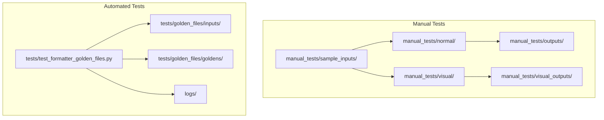
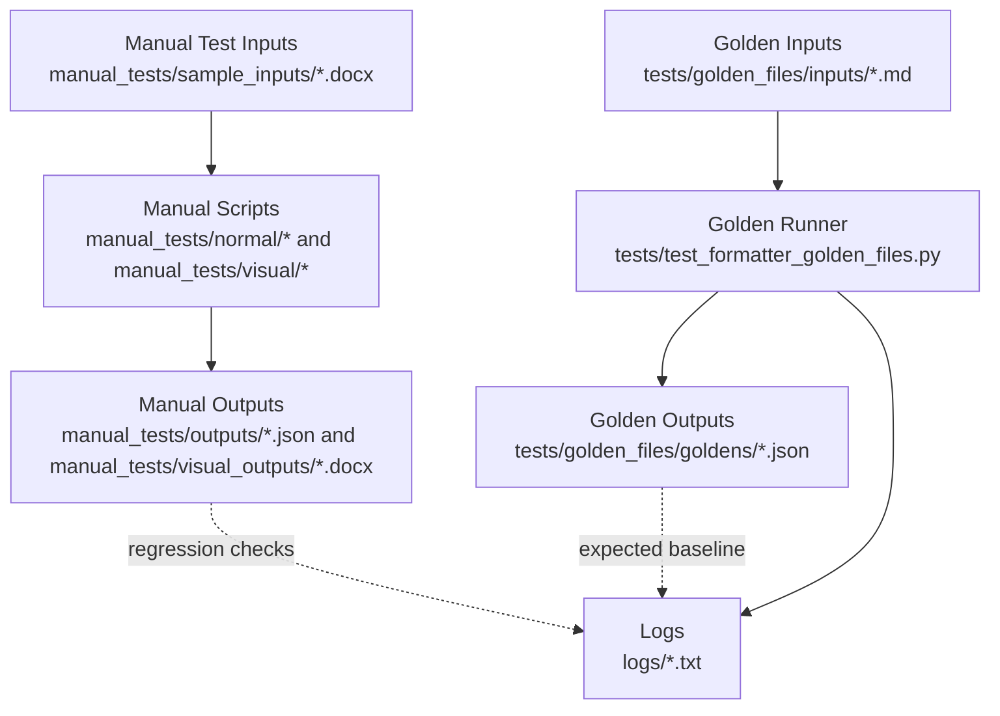
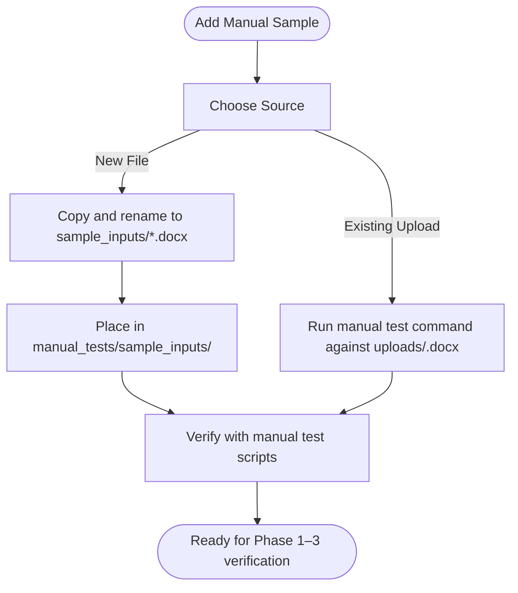
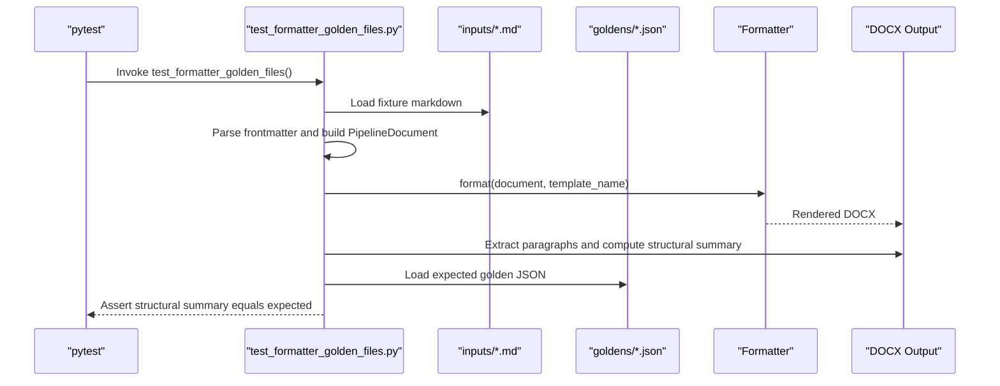
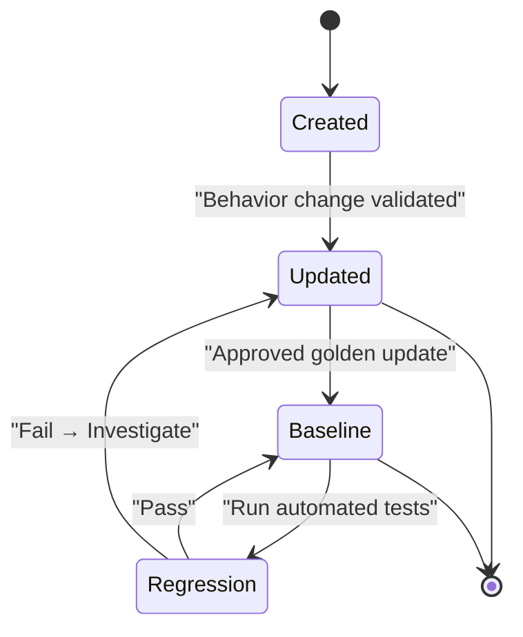
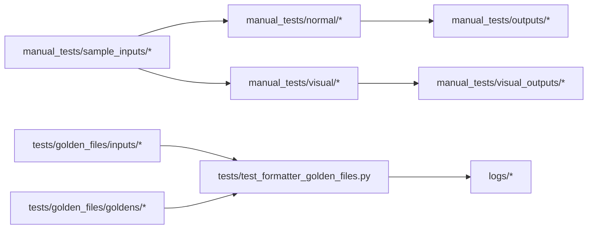

# Test Data Management

<cite>
**Referenced Files in This Document**
- [TESTING_COMMANDS.md](file://backend/manual_tests/TESTING_COMMANDS.md)
- [test_commands.md](file://backend/manual_tests/test_commands.md)
- [README.md (Sample Inputs)](file://backend/manual_tests/sample_inputs/README.md)
- [test_formatter_golden_files.py](file://backend/tests/test_formatter_golden_files.py)
- [test_output_v6.txt](file://backend/logs/test_output_v6.txt)
- [test_final_output_v6.txt](file://backend/logs/test_final_output_v6.txt)
</cite>

## Table of Contents
1. [Introduction](#introduction)
2. [Project Structure](#project-structure)
3. [Core Components](#core-components)
4. [Architecture Overview](#architecture-overview)
5. [Detailed Component Analysis](#detailed-component-analysis)
6. [Dependency Analysis](#dependency-analysis)
7. [Performance Considerations](#performance-considerations)
8. [Troubleshooting Guide](#troubleshooting-guide)
9. [Conclusion](#conclusion)
10. [Appendices](#appendices)

## Introduction
This document defines the test data management procedures for the project’s automated manuscript formatting pipeline. It covers:
- Sample input handling for manual and automated tests
- Golden file validation for expected output
- Test data organization across directories
- Lifecycle and version management of test data
- Regression testing maintenance
- Guidelines for adding new test cases, updating golden files, and keeping test data consistent across environments

## Project Structure
The repository organizes test data and validation in two primary areas:
- Manual test harness and sample inputs under backend/manual_tests
- Automated golden-file tests under backend/tests

Key directories and roles:
- backend/manual_tests/sample_inputs: Stores curated DOCX samples for manual verification
- backend/manual_tests/normal and backend/manual_tests/visual: Scripts and outputs for stepwise pipeline verification
- backend/tests/golden_files/inputs: Markdown fixture inputs for automated golden-file tests
- backend/tests/golden_files/goldens: Expected JSON outputs for validation
- backend/tests/test_formatter_golden_files.py: Automated test runner validating against golden files
- backend/logs: Historical test outputs for regression tracking

**Diagram sources**
- [TESTING_COMMANDS.md:1-46](file://backend/manual_tests/TESTING_COMMANDS.md#L1-L46)
- [test_commands.md:5-52](file://backend/manual_tests/test_commands.md#L5-L52)
- [test_formatter_golden_files.py:22-25](file://backend/tests/test_formatter_golden_files.py#L22-L25)

**Section sources**
- [TESTING_COMMANDS.md:5-46](file://backend/manual_tests/TESTING_COMMANDS.md#L5-L46)
- [test_commands.md:5-52](file://backend/manual_tests/test_commands.md#L5-L52)
- [test_formatter_golden_files.py:22-25](file://backend/tests/test_formatter_golden_files.py#L22-L25)

## Core Components
- Sample input directory structure for manual testing
  - Purpose: Provide curated DOCX files for stepwise verification across parsing, identification, assembly, and formatting
  - Required files: simple.docx, with_figures.docx, with_tables.docx, with_equations.docx
  - Guidance: Add renamed uploads or use existing uploads directly via manual test commands

- Automated golden-file test suite
  - Inputs: Markdown fixtures under tests/golden_files/inputs
  - Expected outputs: JSON under tests/golden_files/goldens
  - Runner: tests/test_formatter_golden_files.py validates structural summary against goldens

- Logging and regression outputs
  - Historical outputs stored under logs for comparison and regression tracking

**Section sources**
- [README.md (Sample Inputs):1-78](file://backend/manual_tests/sample_inputs/README.md#L1-L78)
- [test_commands.md:5-52](file://backend/manual_tests/test_commands.md#L5-L52)
- [test_formatter_golden_files.py:22-25](file://backend/tests/test_formatter_golden_files.py#L22-L25)
- [test_output_v6.txt](file://backend/logs/test_output_v6.txt)
- [test_final_output_v6.txt](file://backend/logs/test_final_output_v6.txt)

## Architecture Overview
The test data management architecture separates manual verification from automated regression testing while sharing a common goal: validating pipeline correctness across templates and document types.

**Diagram sources**
- [TESTING_COMMANDS.md:5-46](file://backend/manual_tests/TESTING_COMMANDS.md#L5-L46)
- [test_commands.md:5-52](file://backend/manual_tests/test_commands.md#L5-L52)
- [test_formatter_golden_files.py:22-25](file://backend/tests/test_formatter_golden_files.py#L22-L25)
- [test_output_v6.txt](file://backend/logs/test_output_v6.txt)
- [test_final_output_v6.txt](file://backend/logs/test_final_output_v6.txt)

## Detailed Component Analysis

### Manual Sample Input Handling
- Directory: backend/manual_tests/sample_inputs
- Purpose: Provide deterministic, curated DOCX files for manual verification across pipeline phases
- Required files and purposes:
  - simple.docx: Basic academic paper for parsing and classification
  - with_figures.docx: Adds figures and captions for detection and numbering
  - with_tables.docx: Adds tables and captions for extraction and numbering
  - with_equations.docx: Adds inline and display math for OMML and MathML handling
- Adding new inputs:
  - Copy from backend/uploads/ and rename per naming convention
  - Alternatively, run manual test commands directly against existing uploads

**Diagram sources**
- [README.md (Sample Inputs):56-78](file://backend/manual_tests/sample_inputs/README.md#L56-L78)
- [TESTING_COMMANDS.md:52-80](file://backend/manual_tests/TESTING_COMMANDS.md#L52-L80)
- [test_commands.md:58-72](file://backend/manual_tests/test_commands.md#L58-L72)

**Section sources**
- [README.md (Sample Inputs):1-78](file://backend/manual_tests/sample_inputs/README.md#L1-L78)
- [TESTING_COMMANDS.md:5-46](file://backend/manual_tests/TESTING_COMMANDS.md#L5-L46)
- [test_commands.md:5-52](file://backend/manual_tests/test_commands.md#L5-L52)

### Golden File System: Inputs and Expected Outputs
- Inputs: Markdown fixtures under tests/golden_files/inputs
  - Format: YAML frontmatter followed by structured content
  - Parser: tests/test_formatter_golden_files.py reads frontmatter and body, builds PipelineDocument
- Expected outputs: JSON under tests/golden_files/goldens
  - Content: Structural summaries (e.g., section counts, heading hierarchy, reference counts)
- Runner: tests/test_formatter_golden_files.py
  - Loads golden JSON
  - Builds PipelineDocument from fixture MD
  - Renders DOCX via Formatter
  - Extracts structural summary from rendered DOCX
  - Asserts equality against expected summary

**Diagram sources**
- [test_formatter_golden_files.py:222-252](file://backend/tests/test_formatter_golden_files.py#L222-L252)

**Section sources**
- [test_formatter_golden_files.py:22-25](file://backend/tests/test_formatter_golden_files.py#L22-L25)
- [test_formatter_golden_files.py:56-194](file://backend/tests/test_formatter_golden_files.py#L56-L194)
- [test_formatter_golden_files.py:197-234](file://backend/tests/test_formatter_golden_files.py#L197-L234)
- [test_formatter_golden_files.py:237-252](file://backend/tests/test_formatter_golden_files.py#L237-L252)

### Test Data Formats and Preparation
- Manual test formats
  - Inputs: DOCX files placed in manual_tests/sample_inputs/
  - Outputs: JSON in manual_tests/outputs/, DOCX in manual_tests/visual_outputs/
  - Commands: See manual test command guides for invocation and expected outputs
- Automated test formats
  - Inputs: Markdown fixtures with YAML frontmatter and body content
  - Expected outputs: JSON containing structural expectations
  - Runner: Python-based test that renders DOCX and compares structural summary

**Section sources**
- [TESTING_COMMANDS.md:5-46](file://backend/manual_tests/TESTING_COMMANDS.md#L5-L46)
- [test_commands.md:5-52](file://backend/manual_tests/test_commands.md#L5-L52)
- [test_formatter_golden_files.py:28-47](file://backend/tests/test_formatter_golden_files.py#L28-L47)
- [test_formatter_golden_files.py:56-194](file://backend/tests/test_formatter_golden_files.py#L56-L194)

### Test Data Lifecycle and Version Management
- Creation
  - Manual: Add curated DOCX files to manual_tests/sample_inputs/
  - Automated: Add markdown fixtures to tests/golden_files/inputs and expected JSON to tests/golden_files/goldens
- Execution
  - Manual: Run scripts under manual_tests/normal/ and manual_tests/visual/
  - Automated: Execute pytest against tests/test_formatter_golden_files.py
- Regression maintenance
  - Compare current outputs with historical logs under logs/
  - Update goldens only when behavior change is intentional and validated
- Versioning
  - Templates: Managed under app/templates and contracts under app/pipeline/contracts
  - Test fixtures: Named by template (e.g., ieee, apa, acm, nature, resume)

**Diagram sources**
- [test_formatter_golden_files.py:237-252](file://backend/tests/test_formatter_golden_files.py#L237-L252)

**Section sources**
- [test_formatter_golden_files.py:237-252](file://backend/tests/test_formatter_golden_files.py#L237-L252)
- [test_output_v6.txt](file://backend/logs/test_output_v6.txt)
- [test_final_output_v6.txt](file://backend/logs/test_final_output_v6.txt)

### Regression Testing Data Maintenance
- Use logs under backend/logs to compare current outputs with previous runs
- When updating goldens, ensure:
  - Changes are intentional and documented
  - All related templates are consistently updated
  - Manual verification is performed for critical regressions

**Section sources**
- [test_output_v6.txt](file://backend/logs/test_output_v6.txt)
- [test_final_output_v6.txt](file://backend/logs/test_final_output_v6.txt)

## Dependency Analysis
- Manual tests depend on:
  - Sample inputs in manual_tests/sample_inputs
  - Scripts in manual_tests/normal and manual_tests/visual
  - Outputs in manual_tests/outputs and manual_tests/visual_outputs
- Automated tests depend on:
  - Golden inputs in tests/golden_files/inputs
  - Golden outputs in tests/golden_files/goldens
  - Runner in tests/test_formatter_golden_files.py
  - Logs in backend/logs for regression tracking

**Diagram sources**
- [TESTING_COMMANDS.md:5-46](file://backend/manual_tests/TESTING_COMMANDS.md#L5-L46)
- [test_commands.md:5-52](file://backend/manual_tests/test_commands.md#L5-L52)
- [test_formatter_golden_files.py:22-25](file://backend/tests/test_formatter_golden_files.py#L22-L25)

**Section sources**
- [TESTING_COMMANDS.md:5-46](file://backend/manual_tests/TESTING_COMMANDS.md#L5-L46)
- [test_commands.md:5-52](file://backend/manual_tests/test_commands.md#L5-L52)
- [test_formatter_golden_files.py:22-25](file://backend/tests/test_formatter_golden_files.py#L22-L25)

## Performance Considerations
- Prefer batch execution of manual test phases to reduce repeated parsing overhead
- Use logs to avoid re-running long pipelines when investigating regressions
- Keep golden-file fixtures minimal and focused to speed up automated validation

## Troubleshooting Guide
Common issues and resolutions:
- Missing manual test outputs
  - Ensure the correct manual test command is used for the desired phase and that the input file exists in manual_tests/sample_inputs or uploads
- Golden-file assertion failures
  - Review the generated DOCX structural summary and compare with the expected golden JSON
  - Update goldens only after validating the new behavior is intentional
- Environment inconsistencies
  - Align template and contract paths used by the formatter with those referenced in the runner
  - Confirm logs under backend/logs reflect the expected outputs for regression checks

**Section sources**
- [TESTING_COMMANDS.md:52-80](file://backend/manual_tests/TESTING_COMMANDS.md#L52-L80)
- [test_commands.md:58-72](file://backend/manual_tests/test_commands.md#L58-L72)
- [test_formatter_golden_files.py:237-252](file://backend/tests/test_formatter_golden_files.py#L237-L252)
- [test_output_v6.txt](file://backend/logs/test_output_v6.txt)
- [test_final_output_v6.txt](file://backend/logs/test_final_output_v6.txt)

## Conclusion
This document established standardized procedures for managing test data across manual and automated workflows. By adhering to the sample input structure, golden-file validation, and regression maintenance practices outlined here, teams can ensure consistent, reliable testing across environments and templates.

## Appendices
- Quick reference: Manual test commands and expected outputs are documented in the manual test command guides
- Automated test runner: Validates structural summaries against goldens and writes logs for regression tracking