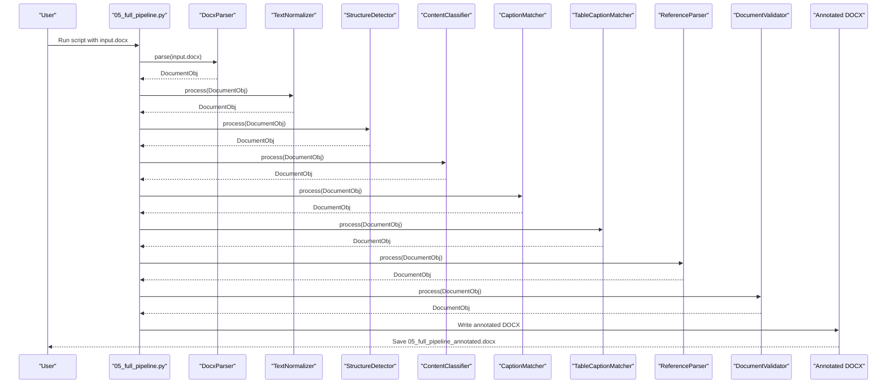
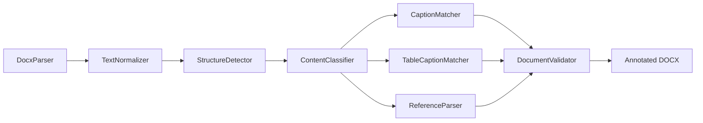

# Phase 1 Testing

<cite>
**Referenced Files in This Document**
- [01_parse_and_structure.py](file://backend/manual_tests/visual/phase1/01_parse_and_structure.py)
- [01b_equations_visual.py](file://backend/manual_tests/visual/phase1/01b_equations_visual.py)
- [02_classification.py](file://backend/manual_tests/visual/phase1/02_classification.py)
- [03_figures_tables.py](file://backend/manual_tests/visual/phase1/03_figures_tables.py)
- [04_references.py](file://backend/manual_tests/visual/phase1/04_references.py)
- [05_full_pipeline.py](file://backend/manual_tests/visual/phase1/05_full_pipeline.py)
- [05b_figure_numbering.py](file://backend/manual_tests/visual/phase1/05b_figure_numbering.py)
- [05c_figure_insertion.py](file://backend/manual_tests/visual/phase1/05c_figure_insertion.py)
- [06_formatted.py](file://backend/manual_tests/visual/phase1/06_formatted.py)
- [06b_table_numbering.py](file://backend/manual_tests/visual/phase1/06b_table_numbering.py)
- [06c_table_insertion.py](file://backend/manual_tests/visual/phase1/06c_table_insertion.py)
</cite>

## Table of Contents
1. [Introduction](#introduction)
2. [Project Structure](#project-structure)
3. [Core Components](#core-components)
4. [Architecture Overview](#architecture-overview)
5. [Detailed Component Analysis](#detailed-component-analysis)
6. [Dependency Analysis](#dependency-analysis)
7. [Performance Considerations](#performance-considerations)
8. [Troubleshooting Guide](#troubleshooting-guide)
9. [Conclusion](#conclusion)

## Introduction
This document describes Phase 1 visual testing procedures for early-stage document processing validation. It explains the nine key visual verification scripts that validate parsing, structure detection, classification, figures and tables, references, full pipeline execution, and formatting. Each script produces a color-annotated DOCX for visual inspection, enabling quick identification of anomalies and ensuring quality criteria are met before advancing to later phases.

## Project Structure
The Phase 1 visual tests reside under backend/manual_tests/visual/phase1. Each script is self-contained, imports the backend pipeline modules, executes a staged processing workflow, and writes a human-readable annotated DOCX to backend/manual_tests/visual_outputs.

```mermaid
graph TB
subgraph "Manual Visual Tests"
S1["01_parse_and_structure.py"]
S1b["01b_equations_visual.py"]
S2["02_classification.py"]
S3["03_figures_tables.py"]
S4["04_references.py"]
S5["05_full_pipeline.py"]
S5b["05b_figure_numbering.py"]
S5c["05c_figure_insertion.py"]
S6["06_formatted.py"]
S6b["06b_table_numbering.py"]
S6c["06c_table_insertion.py"]
end
subgraph "Pipeline Modules"
P1["DocxParser"]
P2["TextNormalizer"]
P3["StructureDetector"]
P4["ContentClassifier"]
P5["CaptionMatcher"]
P6["TableCaptionMatcher"]
P7["ReferenceParser"]
P8["DocumentValidator"]
P9["Formatter"]
end
S1 --> P1
S1 --> P2
S1 --> P3
S1b --> P1
S1b --> P2
S2 --> P1
S2 --> P2
S2 --> P3
S2 --> P4
S3 --> P1
S3 --> P2
S3 --> P3
S3 --> P4
S3 --> P5
S3 --> P6
S4 --> P1
S4 --> P2
S4 --> P3
S4 --> P4
S4 --> P7
S5 --> P1
S5 --> P2
S5 --> P3
S5 --> P4
S5 --> P5
S5 --> P6
S5 --> P7
S5 --> P8
S5b --> P1
S5b --> P2
S5b --> P3
S5b --> P4
S5b --> P5
S5c --> P1
S5c --> P2
S5c --> P3
S5c --> P4
S5c --> P5
S6 --> P1
S6 --> P2
S6 --> P3
S6 --> P4
S6 --> P5
S6 --> P6
S6 --> P7
S6 --> P8
S6 --> P9
S6b --> P1
S6b --> P2
S6b --> P3
S6b --> P4
S6b --> P6
S6c --> P1
S6c --> P2
S6c --> P3
S6c --> P4
S6c --> P6
```

**Diagram sources**
- [01_parse_and_structure.py:25-31](file://backend/manual_tests/visual/phase1/01_parse_and_structure.py#L25-L31)
- [01b_equations_visual.py:14-19](file://backend/manual_tests/visual/phase1/01b_equations_visual.py#L14-L19)
- [02_classification.py:15-23](file://backend/manual_tests/visual/phase1/02_classification.py#L15-L23)
- [03_figures_tables.py:15-25](file://backend/manual_tests/visual/phase1/03_figures_tables.py#L15-L25)
- [04_references.py:15-24](file://backend/manual_tests/visual/phase1/04_references.py#L15-L24)
- [05_full_pipeline.py:15-27](file://backend/manual_tests/visual/phase1/05_full_pipeline.py#L15-L27)
- [05b_figure_numbering.py:15-23](file://backend/manual_tests/visual/phase1/05b_figure_numbering.py#L15-L23)
- [05c_figure_insertion.py:15-23](file://backend/manual_tests/visual/phase1/05c_figure_insertion.py#L15-L23)
- [06_formatted.py:7-20](file://backend/manual_tests/visual/phase1/06_formatted.py#L7-L20)
- [06b_table_numbering.py:15-23](file://backend/manual_tests/visual/phase1/06b_table_numbering.py#L15-L23)
- [06c_table_insertion.py:15-23](file://backend/manual_tests/visual/phase1/06c_table_insertion.py#L15-L23)

**Section sources**
- [01_parse_and_structure.py:1-175](file://backend/manual_tests/visual/phase1/01_parse_and_structure.py#L1-L175)
- [01b_equations_visual.py:1-85](file://backend/manual_tests/visual/phase1/01b_equations_visual.py#L1-L85)
- [02_classification.py:1-115](file://backend/manual_tests/visual/phase1/02_classification.py#L1-L115)
- [03_figures_tables.py:1-136](file://backend/manual_tests/visual/phase1/03_figures_tables.py#L1-L136)
- [04_references.py:1-94](file://backend/manual_tests/visual/phase1/04_references.py#L1-L94)
- [05_full_pipeline.py:1-119](file://backend/manual_tests/visual/phase1/05_full_pipeline.py#L1-L119)
- [05b_figure_numbering.py:1-89](file://backend/manual_tests/visual/phase1/05b_figure_numbering.py#L1-L89)
- [05c_figure_insertion.py:1-96](file://backend/manual_tests/visual/phase1/05c_figure_insertion.py#L1-L96)
- [06_formatted.py:1-121](file://backend/manual_tests/visual/phase1/06_formatted.py#L1-L121)
- [06b_table_numbering.py:1-89](file://backend/manual_tests/visual/phase1/06b_table_numbering.py#L1-L89)
- [06c_table_insertion.py:1-96](file://backend/manual_tests/visual/phase1/06c_table_insertion.py#L1-L96)

## Core Components
Each script follows a consistent pattern:
- Parse input DOCX
- Normalize text
- Detect structure and classify blocks
- Apply specialized processing (caption matching, reference parsing, numbering, insertion anchors)
- Produce a color-highlighted annotated DOCX with inline comments summarizing findings

Quality criteria across scripts:
- Visual consistency: color highlights and inline comments clearly mark categories
- Completeness: counts of figures, tables, references, headings, and blocks are reported
- Accuracy: headings, captions, and anchors are correctly identified
- Integrity: duplicates and split/merged blocks are tracked and flagged

Anomaly detection:
- Duplicates: blocks with repeated IDs (non-split)
- Split/merge: blocks marked as split parts
- Missing data: missing image data or rendering errors
- Incorrect anchors: mismatched insertion indices

**Section sources**
- [01_parse_and_structure.py:32-155](file://backend/manual_tests/visual/phase1/01_parse_and_structure.py#L32-L155)
- [02_classification.py:24-111](file://backend/manual_tests/visual/phase1/02_classification.py#L24-L111)
- [03_figures_tables.py:26-131](file://backend/manual_tests/visual/phase1/03_figures_tables.py#L26-L131)
- [04_references.py:25-90](file://backend/manual_tests/visual/phase1/04_references.py#L25-L90)
- [05_full_pipeline.py:28-115](file://backend/manual_tests/visual/phase1/05_full_pipeline.py#L28-L115)
- [05b_figure_numbering.py:59-84](file://backend/manual_tests/visual/phase1/05b_figure_numbering.py#L59-L84)
- [05c_figure_insertion.py:59-91](file://backend/manual_tests/visual/phase1/05c_figure_insertion.py#L59-L91)
- [06b_table_numbering.py:59-84](file://backend/manual_tests/visual/phase1/06b_table_numbering.py#L59-L84)
- [06c_table_insertion.py:59-91](file://backend/manual_tests/visual/phase1/06c_table_insertion.py#L59-L91)

## Architecture Overview
The Phase 1 visual tests orchestrate the backend pipeline in a staged manner, then produce a human-readable annotated DOCX. The following sequence diagram maps the end-to-end flow for the full pipeline visual test.

**Diagram sources**
- [05_full_pipeline.py:67-84](file://backend/manual_tests/visual/phase1/05_full_pipeline.py#L67-L84)

## Detailed Component Analysis

### 01_parse_and_structure.py
Purpose: Validate parsing and structure detection by highlighting detected headings and annotating block metadata.

Processing logic:
- Parse DOCX, normalize text, detect structure
- Count headings and duplicates/splits
- Write annotated DOCX with:
  - Yellow highlights for headings
  - Blue inline comments with heading levels
  - Red highlights for duplicates
  - Summary dashboard

Quality criteria:
- Headings are consistently highlighted and annotated
- Duplicate blocks are flagged
- Split/merged blocks are tracked

Anomaly detection:
- Duplicate block IDs (non-split)
- Unexpected red highlights indicating duplication

**Section sources**
- [01_parse_and_structure.py:45-171](file://backend/manual_tests/visual/phase1/01_parse_and_structure.py#L45-L171)

### 01b_equations_visual.py
Purpose: Visual verification of equation detection.

Processing logic:
- Parse and normalize
- Iterate blocks and highlight those associated with detected equations
- Add inline comments for equation blocks

Quality criteria:
- Equation blocks are highlighted and labeled
- Counts of total blocks and equations are reported

Anomaly detection:
- Missed equations (blocks that look like equations but are not flagged)
- Over-highlighting of short arithmetic-like lines

**Section sources**
- [01b_equations_visual.py:25-81](file://backend/manual_tests/visual/phase1/01b_equations_visual.py#L25-L81)

### 02_classification.py
Purpose: Visual verification of semantic classification.

Processing logic:
- Parse, normalize, detect structure, classify
- Generate a color-coded annotated DOCX with type counts

Quality criteria:
- Each block type receives a consistent highlight color
- Inline comments indicate detected types
- Summary dashboard shows counts per type

Anomaly detection:
- Unknown or unexpected types
- Misclassification of headings or captions

**Section sources**
- [02_classification.py:50-111](file://backend/manual_tests/visual/phase1/02_classification.py#L50-L111)

### 03_figures_tables.py
Purpose: Visual verification of figure and table caption matching.

Processing logic:
- Parse, normalize, structure, classify, match captions
- Render figures and tables in output DOCX
- Highlight figure/table captions

Quality criteria:
- Captions are highlighted and labeled
- Figures rendered with placeholder images when raw data is present
- Tables rendered via TableRenderer

Anomaly detection:
- Missing image data for figures
- Render errors for tables
- Unmatched captions

**Section sources**
- [03_figures_tables.py:31-131](file://backend/manual_tests/visual/phase1/03_figures_tables.py#L31-L131)

### 04_references.py
Purpose: Visual verification of reference parsing.

Processing logic:
- Parse, normalize, structure, classify, parse references
- Highlight reference headings and entries

Quality criteria:
- Reference heading and entries are highlighted and labeled
- Counts of total blocks and reference entries are reported

Anomaly detection:
- Missing reference entries
- Incorrect classification of reference content

**Section sources**
- [04_references.py:30-90](file://backend/manual_tests/visual/phase1/04_references.py#L30-L90)

### 05_full_pipeline.py
Purpose: End-to-end visual validation from parsing through validation.

Processing logic:
- Run all pipeline stages: parse → normalize → structure → classify → figures → tables → references → validate
- Produce a comprehensive annotated DOCX with validation status and counts

Quality criteria:
- All major block types are color-highlighted
- Validation status and counts are visible in the summary
- Errors and warnings are captured

Anomaly detection:
- Validation failures
- Excessive errors or warnings
- Missing figures/tables/references

**Section sources**
- [05_full_pipeline.py:50-115](file://backend/manual_tests/visual/phase1/05_full_pipeline.py#L50-L115)

### 05b_figure_numbering.py
Purpose: Visual verification of sequential figure numbering.

Processing logic:
- Run parse → normalize → structure → classify → figure caption matching
- Assign sequential numbers to figures
- Highlight matched captions and annotate with figure numbers

Quality criteria:
- Captions are highlighted and numbered sequentially
- Numbers align with expected order

Anomaly detection:
- Gaps or duplicates in numbering
- Unnumbered matched captions

**Section sources**
- [05b_figure_numbering.py:29-84](file://backend/manual_tests/visual/phase1/05b_figure_numbering.py#L29-L84)

### 05c_figure_insertion.py
Purpose: Visual verification of figure insertion anchor detection.

Processing logic:
- Run parse → normalize → structure → classify → figure caption matching
- Compute insertion anchors as the next index after the caption
- Highlight matched captions and annotate insertion targets

Quality criteria:
- Captions are highlighted with insertion anchor indices
- Anchor indices are consistent with caption positions

Anomaly detection:
- Missing anchors
- Incorrect anchor indices

**Section sources**
- [05c_figure_insertion.py:29-91](file://backend/manual_tests/visual/phase1/05c_figure_insertion.py#L29-L91)

### 06_formatted.py
Purpose: Visual verification of formatted output.

Processing logic:
- Run full pipeline including formatting (optional, depends on template availability)
- Annotate original DOCX with highlights and inline type labels
- Prepend a QA dashboard with validation and counts

Quality criteria:
- All blocks are color-highlighted by type
- Dashboard indicates whether formatting was applied and lists counts
- No rendering errors in the annotated output

Anomaly detection:
- Formatting skipped due to missing contract
- Errors during formatting
- Inconsistent highlighting or missing annotations

**Section sources**
- [06_formatted.py:21-108](file://backend/manual_tests/visual/phase1/06_formatted.py#L21-L108)

### 06b_table_numbering.py
Purpose: Visual verification of sequential table numbering.

Processing logic:
- Run parse → normalize → structure → classify → table caption matching
- Assign sequential numbers to tables
- Highlight matched captions and annotate with table numbers

Quality criteria:
- Captions are highlighted and numbered sequentially
- Numbers align with expected order

Anomaly detection:
- Gaps or duplicates in numbering
- Unnumbered matched captions

**Section sources**
- [06b_table_numbering.py:29-84](file://backend/manual_tests/visual/phase1/06b_table_numbering.py#L29-L84)

### 06c_table_insertion.py
Purpose: Visual verification of table insertion anchor detection.

Processing logic:
- Run parse → normalize → structure → classify → table caption matching
- Compute insertion anchors as the next index after the caption
- Highlight matched captions and annotate insertion targets

Quality criteria:
- Captions are highlighted with insertion anchor indices
- Anchor indices are consistent with caption positions

Anomaly detection:
- Missing anchors
- Incorrect anchor indices

**Section sources**
- [06c_table_insertion.py:29-91](file://backend/manual_tests/visual/phase1/06c_table_insertion.py#L29-L91)

## Dependency Analysis
The scripts depend on the backend pipeline modules. The following diagram shows module-level dependencies used by the visual tests.

**Diagram sources**
- [01_parse_and_structure.py:28-31](file://backend/manual_tests/visual/phase1/01_parse_and_structure.py#L28-L31)
- [02_classification.py:18-23](file://backend/manual_tests/visual/phase1/02_classification.py#L18-L23)
- [03_figures_tables.py:18-25](file://backend/manual_tests/visual/phase1/03_figures_tables.py#L18-L25)
- [04_references.py:18-24](file://backend/manual_tests/visual/phase1/04_references.py#L18-L24)
- [05_full_pipeline.py:18-27](file://backend/manual_tests/visual/phase1/05_full_pipeline.py#L18-L27)
- [05b_figure_numbering.py:18-23](file://backend/manual_tests/visual/phase1/05b_figure_numbering.py#L18-L23)
- [05c_figure_insertion.py:18-23](file://backend/manual_tests/visual/phase1/05c_figure_insertion.py#L18-L23)
- [06_formatted.py:10-19](file://backend/manual_tests/visual/phase1/06_formatted.py#L10-L19)
- [06b_table_numbering.py:18-23](file://backend/manual_tests/visual/phase1/06b_table_numbering.py#L18-L23)
- [06c_table_insertion.py:18-23](file://backend/manual_tests/visual/phase1/06c_table_insertion.py#L18-L23)

**Section sources**
- [01_parse_and_structure.py:28-31](file://backend/manual_tests/visual/phase1/01_parse_and_structure.py#L28-L31)
- [02_classification.py:18-23](file://backend/manual_tests/visual/phase1/02_classification.py#L18-L23)
- [03_figures_tables.py:18-25](file://backend/manual_tests/visual/phase1/03_figures_tables.py#L18-L25)
- [04_references.py:18-24](file://backend/manual_tests/visual/phase1/04_references.py#L18-L24)
- [05_full_pipeline.py:18-27](file://backend/manual_tests/visual/phase1/05_full_pipeline.py#L18-L27)
- [05b_figure_numbering.py:18-23](file://backend/manual_tests/visual/phase1/05b_figure_numbering.py#L18-L23)
- [05c_figure_insertion.py:18-23](file://backend/manual_tests/visual/phase1/05c_figure_insertion.py#L18-L23)
- [06_formatted.py:10-19](file://backend/manual_tests/visual/phase1/06_formatted.py#L10-L19)
- [06b_table_numbering.py:18-23](file://backend/manual_tests/visual/phase1/06b_table_numbering.py#L18-L23)
- [06c_table_insertion.py:18-23](file://backend/manual_tests/visual/phase1/06c_table_insertion.py#L18-L23)

## Performance Considerations
- Each script runs the minimal required pipeline stages to reduce runtime while preserving diagnostic value.
- Rendering figures and tables introduces overhead; disable or limit for large documents when necessary.
- Color mapping and inline comments are lightweight; avoid excessive reformatting of the output DOCX.

## Troubleshooting Guide
Common issues and resolutions:
- Missing output DOCX: Ensure the script is executed with a valid input path and that the visual_outputs directory exists or can be created.
- Formatting skipped: The formatted output script attempts formatting conditionally; absence of a publisher contract or errors will cause skipping. Check logs for messages indicating skipped formatting.
- Missing image data: When rendering figures, missing image bytes lead to placeholders. Verify that figure extraction and caption matching succeeded.
- Incorrect anchors: If insertion anchors are missing or incorrect, confirm that caption matching produced caption_block_id values and that block indices are sequential.
- Validation failure: Review validation errors and warnings captured in the full pipeline output to identify structural or content issues.

**Section sources**
- [06_formatted.py:44-52](file://backend/manual_tests/visual/phase1/06_formatted.py#L44-L52)
- [03_figures_tables.py:114-122](file://backend/manual_tests/visual/phase1/03_figures_tables.py#L114-L122)
- [05c_figure_insertion.py:63-67](file://backend/manual_tests/visual/phase1/05c_figure_insertion.py#L63-L67)
- [06c_table_insertion.py:63-67](file://backend/manual_tests/visual/phase1/06c_table_insertion.py#L63-L67)
- [05_full_pipeline.py:93-101](file://backend/manual_tests/visual/phase1/05_full_pipeline.py#L93-L101)

## Conclusion
The Phase 1 visual testing suite provides a structured, repeatable method to validate early-stage document processing. By leveraging color highlights, inline comments, and summary dashboards, each script enables rapid identification of anomalies and ensures adherence to quality criteria before progressing to later phases. Consistent execution of these scripts guarantees reliable, transparent validation outcomes.