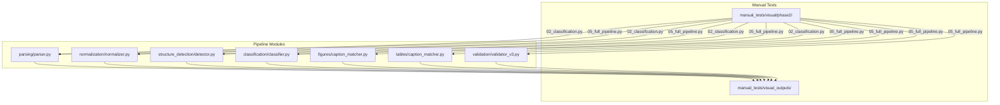
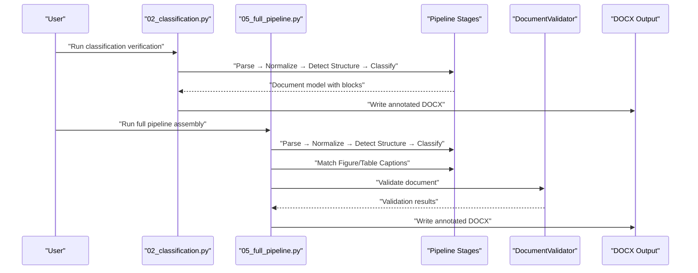
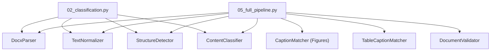

# Phase 2 Testing

<cite>
**Referenced Files in This Document**
- [02_classification.py](file://backend/manual_tests/visual/phase2/02_classification.py)
- [05_full_pipeline.py](file://backend/manual_tests/visual/phase2/05_full_pipeline.py)
- [README_VISUAL.md](file://backend/manual_tests/README_VISUAL.md)
- [TESTING_COMMANDS.md](file://backend/manual_tests/TESTING_COMMANDS.md)
- [validator_v3.py](file://backend/app/pipeline/validation/validator_v3.py)
- [document.py](file://backend/app/models/document.py)
</cite>

## Table of Contents
1. [Introduction](#introduction)
2. [Project Structure](#project-structure)
3. [Core Components](#core-components)
4. [Architecture Overview](#architecture-overview)
5. [Detailed Component Analysis](#detailed-component-analysis)
6. [Dependency Analysis](#dependency-analysis)
7. [Performance Considerations](#performance-considerations)
8. [Troubleshooting Guide](#troubleshooting-guide)
9. [Conclusion](#conclusion)

## Introduction
This document describes Phase 2 visual testing procedures for validating intermediate-stage document processing. It focuses on two key visual verification scripts:
- Phase 2 Classification Verification (02_classification.py)
- Phase 2 Full Pipeline Assembly (05_full_pipeline.py)

These scripts produce annotated DOCX outputs designed for manual inspection in Microsoft Word. They validate:
- Phase transition integrity between parsing, normalization, structure detection, classification, and assembly
- Processing stage integration and deduplication
- Quality assurance outcomes prior to formatting

Expected outcomes include color-coded block type annotations, summary dashboards, and explicit warnings for duplication and structural issues. The document also outlines validation workflows, comparison procedures against baseline results, failure identification, thresholds, and corrective actions.

## Project Structure
Phase 2 visual tests reside under the backend manual_tests/visual/phase2 directory and generate outputs into manual_tests/visual_outputs. The scripts integrate pipeline components to assemble a document model and annotate it for visual inspection.

**Diagram sources**
- [02_classification.py:38-73](file://backend/manual_tests/visual/phase2/02_classification.py#L38-L73)
- [05_full_pipeline.py:39-55](file://backend/manual_tests/visual/phase2/05_full_pipeline.py#L39-L55)
- [validator_v3.py:34-145](file://backend/app/pipeline/validation/validator_v3.py#L34-L145)

**Section sources**
- [README_VISUAL.md:11-25](file://backend/manual_tests/README_VISUAL.md#L11-L25)
- [TESTING_COMMANDS.md:29-46](file://backend/manual_tests/TESTING_COMMANDS.md#L29-L46)

## Core Components
- Phase 2 Classification Verification (02_classification.py)
  - Executes parsing, normalization, structure detection, and classification
  - Produces an annotated DOCX with color-coded block type labels and a summary dashboard
  - Validates classification integrity after assembly

- Phase 2 Full Pipeline Assembly (05_full_pipeline.py)
  - Executes parsing, normalization, structure detection, classification, figure/table caption matching, and validation
  - Produces a comprehensive annotated DOCX highlighting blocks and summarizing counts
  - Serves as the integration checkpoint for deduplication and structural completeness

- Validation Engine (validator_v3.py)
  - Provides structural and content validation, including section completeness, figures, tables, references, and integrity checks
  - Updates document state with validation results and logs processing stage metadata

**Section sources**
- [02_classification.py:39-150](file://backend/manual_tests/visual/phase2/02_classification.py#L39-L150)
- [05_full_pipeline.py:39-128](file://backend/manual_tests/visual/phase2/05_full_pipeline.py#L39-L128)
- [validator_v3.py:34-145](file://backend/app/pipeline/validation/validator_v3.py#L34-L145)

## Architecture Overview
The Phase 2 visual tests orchestrate pipeline stages to build a document model and render it as an annotated DOCX. The flow integrates parsing, normalization, structure detection, classification, caption matching, and validation.

**Diagram sources**
- [02_classification.py:56-73](file://backend/manual_tests/visual/phase2/02_classification.py#L56-L73)
- [05_full_pipeline.py:42-55](file://backend/manual_tests/visual/phase2/05_full_pipeline.py#L42-L55)
- [validator_v3.py:62-145](file://backend/app/pipeline/validation/validator_v3.py#L62-L145)

## Detailed Component Analysis

### Phase 2 Classification Verification (02_classification.py)
Purpose:
- Re-verify classification after assembly by running parsing, normalization, structure detection, and classification
- Produce a color-coded annotated DOCX for manual inspection

Processing logic:
- Parses DOCX into a document model
- Normalizes text content
- Detects document structure (headings)
- Classifies blocks into semantic types
- Counts and reports block type distribution
- Generates an annotated DOCX with:
  - Summary dashboard
  - Color-coded block type annotations
  - Per-block type labels

Validation workflow:
- Input: DOCX path via command-line argument
- Output: annotated DOCX in manual_tests/visual_outputs
- Visual inspection checklist:
  - Verify correct classification of sections (title, author, abstract, headings, body, captions, references)
  - Confirm no classification corruption after assembly
  - Ensure all sections are labeled consistently

Comparison procedure:
- Compare block type distributions and annotations against baseline expectations
- Validate that color-coded labels align with expected semantics

Failure indicators:
- Unexpected block types or misclassified segments
- Inconsistent labeling across similar content
- Excessive unknown or ambiguous classifications

Corrective actions:
- Inspect and refine classification rules or training data
- Adjust normalization or structure detection parameters
- Re-run from earlier stages if upstream issues are suspected

**Section sources**
- [02_classification.py:39-150](file://backend/manual_tests/visual/phase2/02_classification.py#L39-L150)

### Phase 2 Full Pipeline Assembly (05_full_pipeline.py)
Purpose:
- Verify complete pipeline assembly with visual annotations
- Check for duplication and structural completeness prior to formatting

Processing logic:
- Executes parsing, normalization, structure detection, classification, figure caption matching, and table caption matching
- Aggregates blocks, figures, and tables
- Creates a comprehensive annotated DOCX with:
  - QA dashboard summary
  - Highlighted block types
  - Type annotations per block

Validation workflow:
- Input: DOCX path via command-line argument
- Output: annotated DOCX in manual_tests/visual_outputs
- Visual inspection checklist:
  - Verify all blocks are processed
  - Check for RED duplicate warnings
  - Confirm no data loss or corruption

Comparison procedure:
- Compare totals (blocks, figures, tables, block types) against baseline
- Validate that the pipeline produces a coherent document structure

Failure indicators:
- Presence of duplicate warnings
- Missing figures/tables or captions
- Structural inconsistencies (e.g., missing headings)

Corrective actions:
- Address duplication issues in earlier stages
- Re-run the pipeline after fixing structural or classification issues
- Investigate caption matching logic if figures/tables lack captions

**Section sources**
- [05_full_pipeline.py:39-128](file://backend/manual_tests/visual/phase2/05_full_pipeline.py#L39-L128)

### Validation Engine Integration (validator_v3.py)
Role:
- Provides structural and content validation during the full pipeline assembly
- Updates document state with validation results and logs processing metadata

Key behaviors:
- Section completeness checks driven by contract rules
- Figure and table validation (missing captions)
- Reference validation (missing authors, titles, years)
- Integrity checks and optional CrossRef DOI validation
- Confidence-based Human-in-the-Loop signals

Integration with Phase 2:
- Full pipeline assembly invokes the validator to produce validation results
- The annotated DOCX includes summary statistics reflecting validation outcomes

**Section sources**
- [validator_v3.py:34-145](file://backend/app/pipeline/validation/validator_v3.py#L34-L145)

### Phase Transition Validation Criteria
- Parsing → Normalization: Ensure text integrity and block continuity
- Normalization → Structure Detection: Preserve semantic boundaries
- Structure Detection → Classification: Accurate heading and section demarcation
- Classification → Assembly: Correct block types and minimal ambiguity
- Assembly → Validation: Deduplication and structural completeness

Validation thresholds:
- Zero duplication warnings
- All required sections present according to contract rules
- No structural violations flagged by the validator

Corrective action procedures:
- If duplication is found, fix pipeline logic and re-run from the beginning
- If formatting issues appear without duplication, adjust formatting logic and re-run the formatting stage only

**Section sources**
- [README_VISUAL.md:165-179](file://backend/manual_tests/README_VISUAL.md#L165-L179)
- [TESTING_COMMANDS.md:241-267](file://backend/manual_tests/TESTING_COMMANDS.md#L241-L267)

## Dependency Analysis
The Phase 2 visual tests depend on pipeline modules and produce DOCX outputs consumed by manual reviewers.

**Diagram sources**
- [02_classification.py:56-73](file://backend/manual_tests/visual/phase2/02_classification.py#L56-L73)
- [05_full_pipeline.py:42-55](file://backend/manual_tests/visual/phase2/05_full_pipeline.py#L42-L55)
- [validator_v3.py:62-145](file://backend/app/pipeline/validation/validator_v3.py#L62-L145)

**Section sources**
- [02_classification.py:28-31](file://backend/manual_tests/visual/phase2/02_classification.py#L28-L31)
- [05_full_pipeline.py:31-37](file://backend/manual_tests/visual/phase2/05_full_pipeline.py#L31-L37)

## Performance Considerations
- Visual tests are designed for inspection rather than speed; prioritize correctness over throughput
- Keep input DOCX sizes reasonable for timely annotation generation
- Avoid unnecessary reprocessing by caching intermediate results when feasible

## Troubleshooting Guide
Common issues and resolutions:
- Missing output DOCX:
  - Verify the script was invoked with a valid input path
  - Ensure the visual_outputs directory exists or can be created

- Unexpected block types:
  - Inspect classification rules and training data
  - Re-run parsing and normalization steps independently

- Duplicate warnings:
  - Investigate upstream duplication sources
  - Re-run the pipeline after fixing structural or classification issues

- Validation failures:
  - Address missing sections, captions, or references
  - Review integrity and cross-reference checks

- Command invocation:
  - Use documented commands from the testing guides to ensure correct usage

**Section sources**
- [README_VISUAL.md:31-124](file://backend/manual_tests/README_VISUAL.md#L31-L124)
- [TESTING_COMMANDS.md:241-285](file://backend/manual_tests/TESTING_COMMANDS.md#L241-L285)

## Conclusion
Phase 2 visual testing establishes robust validation checkpoints for intermediate-stage document processing. The classification verification and full pipeline assembly scripts provide clear, color-coded annotations and summary dashboards to support manual inspection. By adhering to the documented workflows, validation thresholds, and corrective actions, teams can ensure reliable pipeline integration and high-quality outputs prior to formatting.