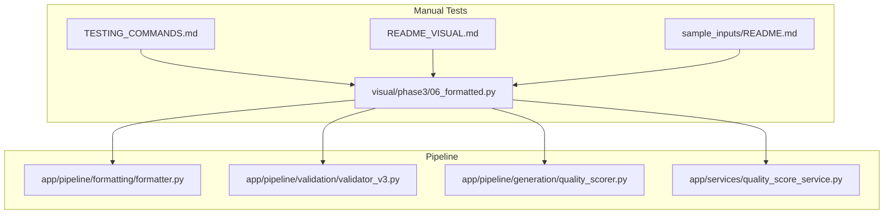
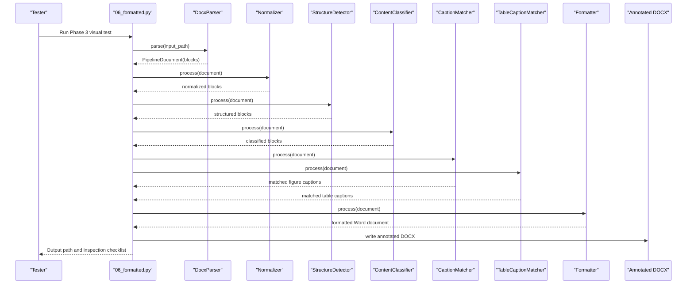
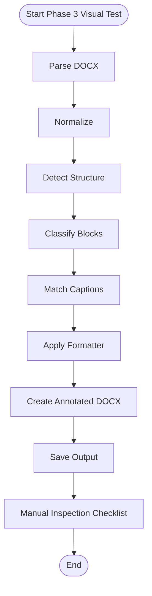
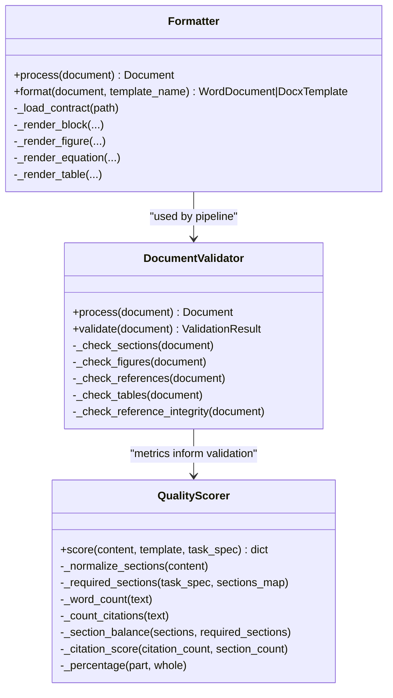
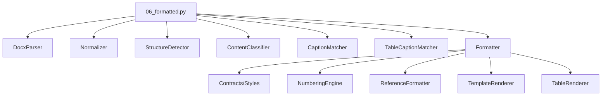

# Phase 3 Testing

<cite>
**Referenced Files in This Document**
- [06_formatted.py](file://backend/manual_tests/visual/phase3/06_formatted.py)
- [README_VISUAL.md](file://backend/manual_tests/README_VISUAL.md)
- [TESTING_COMMANDS.md](file://backend/manual_tests/TESTING_COMMANDS.md)
- [run_formatter.py](file://backend/manual_tests/normal/phase3/run_formatter.py)
- [formatter.py](file://backend/app/pipeline/formatting/formatter.py)
- [validator_v3.py](file://backend/app/pipeline/validation/validator_v3.py)
- [quality_scorer.py](file://backend/app/pipeline/generation/quality_scorer.py)
- [quality_score_service.py](file://backend/app/services/quality_score_service.py)
- [README.md (Sample Inputs)](file://backend/manual_tests/sample_inputs/README.md)
</cite>

## Table of Contents
1. [Introduction](#introduction)
2. [Project Structure](#project-structure)
3. [Core Components](#core-components)
4. [Architecture Overview](#architecture-overview)
5. [Detailed Component Analysis](#detailed-component-analysis)
6. [Dependency Analysis](#dependency-analysis)
7. [Performance Considerations](#performance-considerations)
8. [Troubleshooting Guide](#troubleshooting-guide)
9. [Conclusion](#conclusion)
10. [Appendices](#appendices)

## Introduction
This document defines Phase 3 visual testing procedures for final output validation and quality assurance. It focuses on the formatted output validation script (06_formatted.py), the final verification stage, and the end-to-end validation workflow. It explains the expected characteristics of the final formatted document, validation workflows, acceptance criteria, and guidelines for final review and documentation.

## Project Structure
Phase 3 visual testing is organized under the manual_tests/visual/phase3 directory and complements the broader manual testing framework. The key elements are:
- Visual test runner for final formatting verification
- Visual inspection outputs in DOCX format
- Supporting documentation and command references
- Underlying formatter implementation and validation services

**Diagram sources**
- [06_formatted.py:1-140](file://backend/manual_tests/visual/phase3/06_formatted.py#L1-L140)
- [README_VISUAL.md:1-203](file://backend/manual_tests/README_VISUAL.md#L1-L203)
- [TESTING_COMMANDS.md:1-285](file://backend/manual_tests/TESTING_COMMANDS.md#L1-L285)
- [formatter.py:1-800](file://backend/app/pipeline/formatting/formatter.py#L1-L800)
- [validator_v3.py:1-277](file://backend/app/pipeline/validation/validator_v3.py#L1-L277)
- [quality_scorer.py:1-123](file://backend/app/pipeline/generation/quality_scorer.py#L1-L123)
- [quality_score_service.py:92-128](file://backend/app/services/quality_score_service.py#L92-L128)
- [README.md (Sample Inputs):1-78](file://backend/manual_tests/sample_inputs/README.md#L1-L78)

**Section sources**
- [06_formatted.py:1-140](file://backend/manual_tests/visual/phase3/06_formatted.py#L1-L140)
- [README_VISUAL.md:1-203](file://backend/manual_tests/README_VISUAL.md#L1-L203)
- [TESTING_COMMANDS.md:1-285](file://backend/manual_tests/TESTING_COMMANDS.md#L1-L285)
- [README.md (Sample Inputs):1-78](file://backend/manual_tests/sample_inputs/README.md#L1-L78)

## Core Components
- Phase 3 visual test runner (06_formatted.py): Executes the full pipeline up to formatting, applies template formatting, and generates an annotated DOCX for manual inspection.
- Formatter (formatter.py): Applies template-driven formatting, numbering, and layout to produce a Word document.
- Validation (validator_v3.py): Performs structural and content checks to ensure completeness and integrity prior to formatting.
- Quality scoring (quality_scorer.py and quality_score_service.py): Computes structural and content quality metrics for evaluation.

Key responsibilities:
- Final formatting verification and completeness checks
- Duplication detection and correction before formatting
- Template application and visual consistency
- Acceptance criteria for human review

**Section sources**
- [06_formatted.py:40-140](file://backend/manual_tests/visual/phase3/06_formatted.py#L40-L140)
- [formatter.py:35-290](file://backend/app/pipeline/formatting/formatter.py#L35-L290)
- [validator_v3.py:34-145](file://backend/app/pipeline/validation/validator_v3.py#L34-L145)
- [quality_scorer.py:15-52](file://backend/app/pipeline/generation/quality_scorer.py#L15-L52)
- [quality_score_service.py:98-128](file://backend/app/services/quality_score_service.py#L98-L128)

## Architecture Overview
The Phase 3 visual testing workflow integrates pipeline stages, the formatter, and validation services to produce a final DOCX for manual inspection.

**Diagram sources**
- [06_formatted.py:52-125](file://backend/manual_tests/visual/phase3/06_formatted.py#L52-L125)
- [formatter.py:49-290](file://backend/app/pipeline/formatting/formatter.py#L49-L290)

## Detailed Component Analysis

### Phase 3 Visual Test Runner (06_formatted.py)
Role:
- Executes the pipeline up to formatting
- Applies template formatting via the Formatter
- Generates an annotated DOCX for manual inspection

Processing logic:
- Parses input DOCX into a PipelineDocument
- Normalizes, detects structure, classifies blocks, matches captions
- Applies formatting with error handling for missing contracts
- Creates an annotated DOCX summarizing blocks and metadata

Validation workflow:
- Produces a DOCX with block-level annotations
- Highlights block types for quick visual verification
- Provides a summary header with template and counts

Acceptance criteria:
- No exceptions during formatting
- Annotated DOCX saved successfully
- Manual inspection confirms duplication-free, properly formatted output

**Diagram sources**
- [06_formatted.py:52-125](file://backend/manual_tests/visual/phase3/06_formatted.py#L52-L125)

**Section sources**
- [06_formatted.py:40-140](file://backend/manual_tests/visual/phase3/06_formatted.py#L40-L140)

### Final Formatting and Validation Services
Formatter:
- Loads template and contract
- Applies numbering, references, and layout
- Renders blocks, figures, equations, and tables
- Supports docxtpl and legacy python-docx rendering modes

Validation:
- Checks section completeness and order
- Validates figures and tables for captions
- Reviews references for critical fields
- Optionally validates DOIs via CrossRef

Quality scoring:
- Computes template compliance and content completeness
- Scores citation density and section balance
- Produces overall quality metrics

**Diagram sources**
- [formatter.py:35-290](file://backend/app/pipeline/formatting/formatter.py#L35-L290)
- [validator_v3.py:34-145](file://backend/app/pipeline/validation/validator_v3.py#L34-L145)
- [quality_scorer.py:15-52](file://backend/app/pipeline/generation/quality_scorer.py#L15-L52)

**Section sources**
- [formatter.py:35-290](file://backend/app/pipeline/formatting/formatter.py#L35-L290)
- [validator_v3.py:34-145](file://backend/app/pipeline/validation/validator_v3.py#L34-L145)
- [quality_scorer.py:15-52](file://backend/app/pipeline/generation/quality_scorer.py#L15-L52)
- [quality_score_service.py:98-128](file://backend/app/services/quality_score_service.py#L98-L128)

### Expected Final Formatted Document Characteristics
- Duplication-free content
- Correct heading hierarchy and visual distinction
- Proper caption placement (figures below, tables above)
- Consistent reference formatting and numbering
- Complete sections and content presence
- Page layout and margins per template contract
- Optional extras: TOC, page numbers, borders, line numbers

Acceptance criteria:
- Manual inspection passes checklist
- No red “duplicate” annotations in the annotated DOCX
- Template-specific formatting applied consistently
- References and citations verified for accuracy and completeness

**Section sources**
- [README_VISUAL.md:127-162](file://backend/manual_tests/README_VISUAL.md#L127-L162)
- [formatter.py:107-290](file://backend/app/pipeline/formatting/formatter.py#L107-L290)

### Validation Workflows and Procedures
- Pre-formatting validation: Ensure no duplicates and structural integrity
- Final formatting: Apply template and produce annotated DOCX
- Manual review: Verify duplication, headings, captions, references, and completeness
- Optional: Compute quality metrics for structural completeness and citation density

Decision flow:
- If duplicates found before formatting, fix pipeline logic and re-run from the beginning
- If formatting issues found after validation, fix formatter logic only and re-run Phase 3

**Section sources**
- [README_VISUAL.md:165-179](file://backend/manual_tests/README_VISUAL.md#L165-L179)
- [validator_v3.py:68-145](file://backend/app/pipeline/validation/validator_v3.py#L68-L145)

### Guidelines for Final Review Procedures
- Open the annotated DOCX in Microsoft Word
- Follow the checklist: duplication, headings, captions, references, completeness
- Document findings and categorize issues (pipeline vs. formatting)
- Re-run only the affected stage after corrections
- Do not skip stages or proceed with duplicates

**Section sources**
- [README_VISUAL.md:197-203](file://backend/manual_tests/README_VISUAL.md#L197-L203)

### Quality Scoring Systems and Documentation Requirements
- Structural quality metrics: template compliance, content completeness, citation count, section balance
- Overall score derived from weighted components
- Documentation requirements: include metrics, validation results, and reviewer notes

**Section sources**
- [quality_scorer.py:15-52](file://backend/app/pipeline/generation/quality_scorer.py#L15-L52)
- [quality_score_service.py:98-128](file://backend/app/services/quality_score_service.py#L98-L128)

## Dependency Analysis
The Phase 3 visual test depends on the pipeline components and formatter. The formatter itself depends on contracts, style mapping, numbering, reference formatting, and template rendering.

**Diagram sources**
- [06_formatted.py:32-84](file://backend/manual_tests/visual/phase3/06_formatted.py#L32-L84)
- [formatter.py:35-47](file://backend/app/pipeline/formatting/formatter.py#L35-L47)

**Section sources**
- [06_formatted.py:32-84](file://backend/manual_tests/visual/phase3/06_formatted.py#L32-L84)
- [formatter.py:35-47](file://backend/app/pipeline/formatting/formatter.py#L35-L47)

## Performance Considerations
- Prefer docxtpl rendering when available for faster and more robust template application
- Minimize redundant rendering passes by consolidating operations
- Use safe execution wrappers to prevent single failures from blocking the entire pipeline
- Keep formatting options aligned with template capabilities to reduce fallback logic

[No sources needed since this section provides general guidance]

## Troubleshooting Guide
Common issues and resolutions:
- Formatting skipped due to missing contract: ensure template assets exist and contracts are valid
- Exceptions during formatting: review logs and rerun with minimal input to isolate the issue
- Missing captions or incorrect numbering: verify caption matching and numbering engine behavior
- Validation warnings about missing references: confirm references are present and properly parsed

**Section sources**
- [06_formatted.py:82-88](file://backend/manual_tests/visual/phase3/06_formatted.py#L82-L88)
- [validator_v3.py:174-217](file://backend/app/pipeline/validation/validator_v3.py#L174-L217)

## Conclusion
Phase 3 visual testing ensures the final formatted document meets publication standards through a structured workflow: pre-formatting validation, template-driven formatting, and manual inspection. By following the documented procedures, acceptance criteria, and quality scoring guidelines, teams can reliably validate output quality and maintain consistency across templates.

[No sources needed since this section summarizes without analyzing specific files]

## Appendices

### Appendix A: Phase 3 Command References
- Visual test runner: python manual_tests/visual/phase3/06_formatted.py <input> [--template <template>]
- Normal formatter test: python manual_tests/normal/phase3/run_formatter.py <input> [--template <template>]

**Section sources**
- [TESTING_COMMANDS.md:274-284](file://backend/manual_tests/TESTING_COMMANDS.md#L274-L284)
- [README_VISUAL.md:127-134](file://backend/manual_tests/README_VISUAL.md#L127-L134)

### Appendix B: Sample Inputs
- Use simple.docx, with_figures.docx, with_tables.docx, with_equations.docx for testing
- Alternatively, run tests directly on files in uploads/

**Section sources**
- [README.md (Sample Inputs):1-78](file://backend/manual_tests/sample_inputs/README.md#L1-L78)