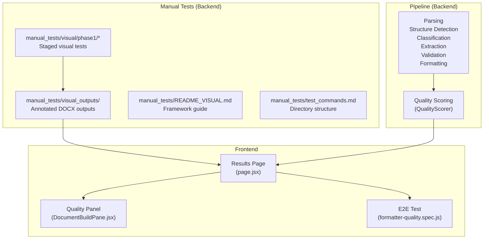
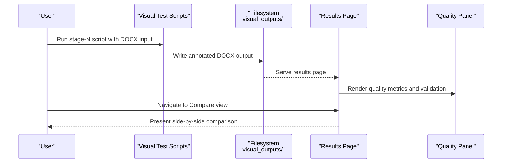
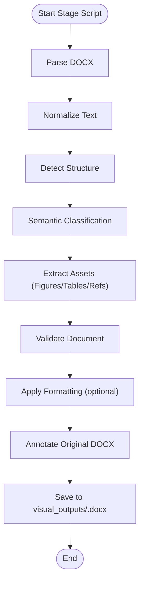
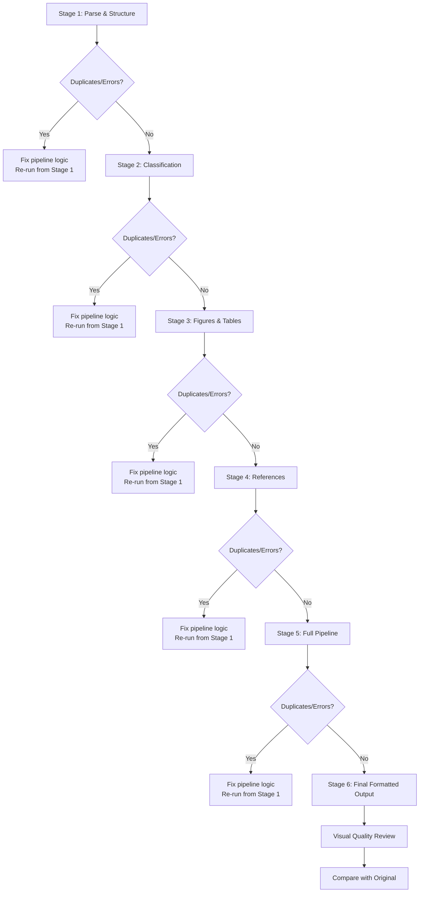
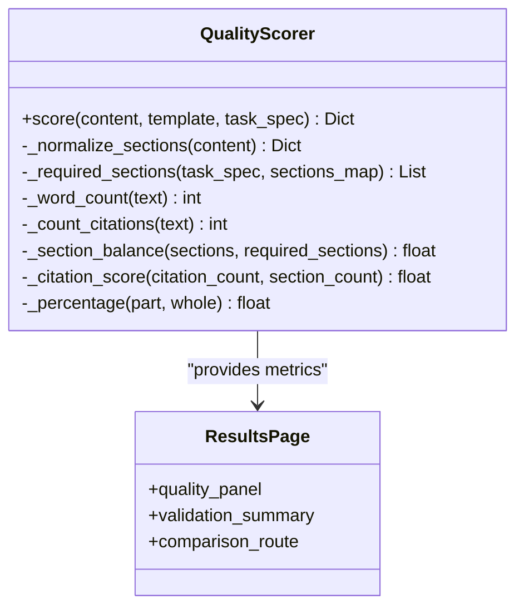
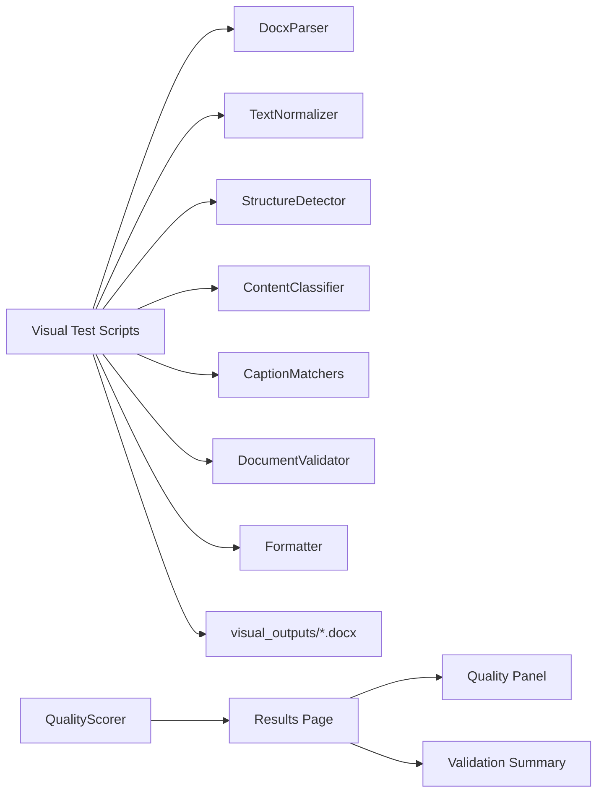

# Visual Output Management

<cite>
**Referenced Files in This Document**
- [README_VISUAL.md](file://backend/manual_tests/README_VISUAL.md)
- [test_commands.md](file://backend/manual_tests/test_commands.md)
- [01_parse_and_structure.py](file://backend/manual_tests/visual/phase1/01_parse_and_structure.py)
- [02_classification.py](file://backend/manual_tests/visual/phase1/02_classification.py)
- [03_figures_tables.py](file://backend/manual_tests/visual/phase1/03_figures_tables.py)
- [04_references.py](file://backend/manual_tests/visual/phase1/04_references.py)
- [05_full_pipeline.py](file://backend/manual_tests/visual/phase1/05_full_pipeline.py)
- [06_formatted.py](file://backend/manual_tests/visual/phase1/06_formatted.py)
- [quality_scorer.py](file://backend/app/pipeline/generation/quality_scorer.py)
- [page.jsx](file://frontend/app/(formatter)/results/page.jsx)
- [DocumentBuildPane.jsx](file://frontend/src/components/generator/DocumentBuildPane.jsx)
- [formatter-quality.spec.js](file://frontend/e2e/formatter-quality.spec.js)
</cite>

## Table of Contents
1. [Introduction](#introduction)
2. [Project Structure](#project-structure)
3. [Core Components](#core-components)
4. [Architecture Overview](#architecture-overview)
5. [Detailed Component Analysis](#detailed-component-analysis)
6. [Dependency Analysis](#dependency-analysis)
7. [Performance Considerations](#performance-considerations)
8. [Troubleshooting Guide](#troubleshooting-guide)
9. [Conclusion](#conclusion)
10. [Appendices](#appendices)

## Introduction
This document defines the visual output management procedures and quality control processes for the automated manuscript formatting pipeline. It explains how visual outputs are generated, stored, organized, and compared, and outlines the quality assessment criteria, comparison workflows, and archival practices for visual test evidence. The goal is to enable reproducible, traceable, and auditable visual validation of document transformations from raw DOCX inputs through parsing, classification, extraction, validation, and formatting.

## Project Structure
The visual output management system centers around a staged, DOCX-centric manual testing framework and a frontend quality panel that surfaces numerical and categorical quality signals. The backend generates annotated DOCX outputs per stage, while the frontend presents a quality dashboard and validation summaries.

**Diagram sources**
- [README_VISUAL.md:1-203](file://backend/manual_tests/README_VISUAL.md#L1-L203)
- [test_commands.md:5-52](file://backend/manual_tests/test_commands.md#L5-L52)
- [01_parse_and_structure.py:1-175](file://backend/manual_tests/visual/phase1/01_parse_and_structure.py#L1-L175)
- [02_classification.py:1-115](file://backend/manual_tests/visual/phase1/02_classification.py#L1-L115)
- [03_figures_tables.py:1-136](file://backend/manual_tests/visual/phase1/03_figures_tables.py#L1-L136)
- [04_references.py:1-94](file://backend/manual_tests/visual/phase1/04_references.py#L1-L94)
- [05_full_pipeline.py:1-119](file://backend/manual_tests/visual/phase1/05_full_pipeline.py#L1-L119)
- [06_formatted.py:1-121](file://backend/manual_tests/visual/phase1/06_formatted.py#L1-L121)
- [quality_scorer.py:1-123](file://backend/app/pipeline/generation/quality_scorer.py#L1-L123)
- [page.jsx](file://frontend/app/(formatter)/results/page.jsx#L290-L489)
- [DocumentBuildPane.jsx:26-50](file://frontend/src/components/generator/DocumentBuildPane.jsx#L26-L50)
- [formatter-quality.spec.js:1-5](file://frontend/e2e/formatter-quality.spec.js#L1-L5)

**Section sources**
- [README_VISUAL.md:1-203](file://backend/manual_tests/README_VISUAL.md#L1-L203)
- [test_commands.md:5-52](file://backend/manual_tests/test_commands.md#L5-L52)

## Core Components
- Visual testing framework: A staged pipeline that produces annotated DOCX outputs for inspection at each stage.
- Storage and naming convention: Outputs are written under a dedicated directory with stage-specific filenames.
- Quality scoring: Numerical quality metrics computed from structured content and template requirements.
- Frontend quality panel: Visual rendering of quality metrics and validation outcomes for user review.
- Comparison workflow: A dedicated route to compare formatted results against the original document.

**Section sources**
- [README_VISUAL.md:1-203](file://backend/manual_tests/README_VISUAL.md#L1-L203)
- [01_parse_and_structure.py:45-175](file://backend/manual_tests/visual/phase1/01_parse_and_structure.py#L45-L175)
- [02_classification.py:50-115](file://backend/manual_tests/visual/phase1/02_classification.py#L50-L115)
- [03_figures_tables.py:31-136](file://backend/manual_tests/visual/phase1/03_figures_tables.py#L31-L136)
- [04_references.py:30-94](file://backend/manual_tests/visual/phase1/04_references.py#L30-L94)
- [05_full_pipeline.py:50-119](file://backend/manual_tests/visual/phase1/05_full_pipeline.py#L50-L119)
- [06_formatted.py:21-121](file://backend/manual_tests/visual/phase1/06_formatted.py#L21-L121)
- [quality_scorer.py:15-123](file://backend/app/pipeline/generation/quality_scorer.py#L15-L123)
- [page.jsx](file://frontend/app/(formatter)/results/page.jsx#L290-L489)
- [DocumentBuildPane.jsx:26-50](file://frontend/src/components/generator/DocumentBuildPane.jsx#L26-L50)

## Architecture Overview
The visual output lifecycle spans backend generation, storage, and frontend presentation. The backend stages produce annotated DOCX files; the frontend renders quality metrics and validation outcomes; and a comparison route enables side-by-side evaluation against the original.

**Diagram sources**
- [README_VISUAL.md:29-203](file://backend/manual_tests/README_VISUAL.md#L29-L203)
- [01_parse_and_structure.py:45-175](file://backend/manual_tests/visual/phase1/01_parse_and_structure.py#L45-L175)
- [02_classification.py:50-115](file://backend/manual_tests/visual/phase1/02_classification.py#L50-L115)
- [03_figures_tables.py:31-136](file://backend/manual_tests/visual/phase1/03_figures_tables.py#L31-L136)
- [04_references.py:30-94](file://backend/manual_tests/visual/phase1/04_references.py#L30-L94)
- [05_full_pipeline.py:50-119](file://backend/manual_tests/visual/phase1/05_full_pipeline.py#L50-L119)
- [06_formatted.py:21-121](file://backend/manual_tests/visual/phase1/06_formatted.py#L21-L121)
- [page.jsx](file://frontend/app/(formatter)/results/page.jsx#L290-L489)

## Detailed Component Analysis

### Visual Output Generation and Storage
- Purpose: Produce annotated DOCX outputs for visual inspection at each pipeline stage.
- Inputs: DOCX files from uploads or sample sets.
- Outputs: Annotated DOCX files under a shared directory with stage-specific filenames.
- Storage convention:
  - Directory: A central outputs folder for staged visual results.
  - Naming: Descriptive prefixes indicating stage and purpose (e.g., structure, classification, figures/tables, references, full pipeline, formatted).
  - Organization: Separate directories for each phase to isolate outputs by stage.

**Diagram sources**
- [01_parse_and_structure.py:62-155](file://backend/manual_tests/visual/phase1/01_parse_and_structure.py#L62-L155)
- [02_classification.py:67-110](file://backend/manual_tests/visual/phase1/02_classification.py#L67-L110)
- [03_figures_tables.py:60-130](file://backend/manual_tests/visual/phase1/03_figures_tables.py#L60-L130)
- [04_references.py:59-89](file://backend/manual_tests/visual/phase1/04_references.py#L59-L89)
- [05_full_pipeline.py:67-114](file://backend/manual_tests/visual/phase1/05_full_pipeline.py#L67-L114)
- [06_formatted.py:24-107](file://backend/manual_tests/visual/phase1/06_formatted.py#L24-L107)

**Section sources**
- [README_VISUAL.md:11-25](file://backend/manual_tests/README_VISUAL.md#L11-L25)
- [test_commands.md:5-52](file://backend/manual_tests/test_commands.md#L5-L52)
- [01_parse_and_structure.py:45-175](file://backend/manual_tests/visual/phase1/01_parse_and_structure.py#L45-L175)
- [02_classification.py:50-115](file://backend/manual_tests/visual/phase1/02_classification.py#L50-L115)
- [03_figures_tables.py:31-136](file://backend/manual_tests/visual/phase1/03_figures_tables.py#L31-L136)
- [04_references.py:30-94](file://backend/manual_tests/visual/phase1/04_references.py#L30-L94)
- [05_full_pipeline.py:50-119](file://backend/manual_tests/visual/phase1/05_full_pipeline.py#L50-L119)
- [06_formatted.py:21-121](file://backend/manual_tests/visual/phase1/06_formatted.py#L21-L121)

### Visual Output Comparison Workflows
- Staged inspection: Each stage’s annotated DOCX is reviewed for correctness before advancing.
- Decision tree: If duplicates or errors are found at a stage, fixes are applied and the pipeline re-executed from the beginning of that stage.
- Final formatted output: After passing validation, a final annotated DOCX is produced for comprehensive review.
- Comparison route: The frontend provides a comparison view to evaluate the formatted output against the original.

**Diagram sources**
- [README_VISUAL.md:165-179](file://backend/manual_tests/README_VISUAL.md#L165-L179)
- [01_parse_and_structure.py:121-153](file://backend/manual_tests/visual/phase1/01_parse_and_structure.py#L121-L153)
- [05_full_pipeline.py:86-114](file://backend/manual_tests/visual/phase1/05_full_pipeline.py#L86-L114)
- [06_formatted.py:21-107](file://backend/manual_tests/visual/phase1/06_formatted.py#L21-L107)
- [page.jsx](file://frontend/app/(formatter)/results/page.jsx#L474-L483)

**Section sources**
- [README_VISUAL.md:165-179](file://backend/manual_tests/README_VISUAL.md#L165-L179)
- [page.jsx](file://frontend/app/(formatter)/results/page.jsx#L474-L483)

### Quality Assessment Criteria and Scoring
- Backend quality scoring:
  - Computes template compliance, content completeness, citation count, word count, and section balance.
  - Aggregates weighted scores into an overall quality score.
- Frontend quality panel:
  - Displays overall score, template compliance, content completeness, and citation count.
  - Provides color-coded progress bars and textual descriptors for quick interpretation.
- Validation outcomes:
  - Presents errors, warnings, and advisories for actionable insights.

**Diagram sources**
- [quality_scorer.py:15-123](file://backend/app/pipeline/generation/quality_scorer.py#L15-L123)
- [page.jsx](file://frontend/app/(formatter)/results/page.jsx#L290-L489)

**Section sources**
- [quality_scorer.py:15-123](file://backend/app/pipeline/generation/quality_scorer.py#L15-L123)
- [page.jsx](file://frontend/app/(formatter)/results/page.jsx#L290-L489)
- [DocumentBuildPane.jsx:26-50](file://frontend/src/components/generator/DocumentBuildPane.jsx#L26-L50)

### Retrieval Procedures and Archival Practices
- Retrieval:
  - Locate outputs in the visual outputs directory by stage and filename.
  - Open annotated DOCX files in a compatible viewer for inspection.
- Archival:
  - Maintain a dated record of runs and outputs.
  - Preserve original inputs alongside processed outputs for traceability.
  - Store quality metrics and validation logs alongside visual artifacts for auditability.

[No sources needed since this section provides general guidance]

## Dependency Analysis
The visual output system depends on backend pipeline stages and frontend rendering components. The backend scripts depend on internal pipeline modules, while the frontend consumes backend-provided quality metrics and validation data.

**Diagram sources**
- [01_parse_and_structure.py:28-30](file://backend/manual_tests/visual/phase1/01_parse_and_structure.py#L28-L30)
- [02_classification.py:18-22](file://backend/manual_tests/visual/phase1/02_classification.py#L18-L22)
- [03_figures_tables.py:18-24](file://backend/manual_tests/visual/phase1/03_figures_tables.py#L18-L24)
- [04_references.py:18-23](file://backend/manual_tests/visual/phase1/04_references.py#L18-L23)
- [05_full_pipeline.py:18-26](file://backend/manual_tests/visual/phase1/05_full_pipeline.py#L18-L26)
- [06_formatted.py:10-19](file://backend/manual_tests/visual/phase1/06_formatted.py#L10-L19)
- [quality_scorer.py:15-123](file://backend/app/pipeline/generation/quality_scorer.py#L15-L123)
- [page.jsx](file://frontend/app/(formatter)/results/page.jsx#L290-L489)

**Section sources**
- [01_parse_and_structure.py:28-30](file://backend/manual_tests/visual/phase1/01_parse_and_structure.py#L28-L30)
- [02_classification.py:18-22](file://backend/manual_tests/visual/phase1/02_classification.py#L18-L22)
- [03_figures_tables.py:18-24](file://backend/manual_tests/visual/phase1/03_figures_tables.py#L18-L24)
- [04_references.py:18-23](file://backend/manual_tests/visual/phase1/04_references.py#L18-L23)
- [05_full_pipeline.py:18-26](file://backend/manual_tests/visual/phase1/05_full_pipeline.py#L18-L26)
- [06_formatted.py:10-19](file://backend/manual_tests/visual/phase1/06_formatted.py#L10-L19)
- [quality_scorer.py:15-123](file://backend/app/pipeline/generation/quality_scorer.py#L15-L123)
- [page.jsx](file://frontend/app/(formatter)/results/page.jsx#L290-L489)

## Performance Considerations
- Prefer incremental stages to localize issues early and reduce reprocessing overhead.
- Use batch processing for multiple inputs to amortize startup costs.
- Limit heavy rendering operations (e.g., table and figure rendering) to necessary stages to minimize runtime.
- Cache intermediate results when feasible to accelerate iterative development.

[No sources needed since this section provides general guidance]

## Troubleshooting Guide
- Duplicates or inconsistencies found during inspection:
  - Re-run the failing stage from the beginning to rebuild the document state.
  - Inspect the summary dashboards embedded in annotated outputs for counts and statuses.
- Formatting not applied:
  - Confirm template availability and contract presence; formatting may be conditionally applied.
- Quality panel shows no data:
  - Ensure backend quality scoring is enabled and returning metrics.
  - Verify that the results page receives the quality payload from the backend.

**Section sources**
- [README_VISUAL.md:165-179](file://backend/manual_tests/README_VISUAL.md#L165-L179)
- [01_parse_and_structure.py:89-116](file://backend/manual_tests/visual/phase1/01_parse_and_structure.py#L89-L116)
- [05_full_pipeline.py:90-101](file://backend/manual_tests/visual/phase1/05_full_pipeline.py#L90-L101)
- [06_formatted.py:44-51](file://backend/manual_tests/visual/phase1/06_formatted.py#L44-L51)
- [page.jsx](file://frontend/app/(formatter)/results/page.jsx#L375-L383)

## Conclusion
The visual output management system provides a robust, staged approach to validating manuscript transformations. By generating annotated DOCX outputs per stage, maintaining clear storage conventions, and surfacing quality metrics in the frontend, teams can efficiently detect and resolve issues early, ensuring high-quality, compliant outputs suitable for submission.

[No sources needed since this section summarizes without analyzing specific files]

## Appendices

### Appendix A: Visual Output Storage Conventions
- Directory: Centralized outputs folder for staged visual results.
- Naming: Stage-specific prefixes and descriptive suffixes.
- Organization: Phase-separated directories to isolate outputs.

**Section sources**
- [README_VISUAL.md:11-25](file://backend/manual_tests/README_VISUAL.md#L11-L25)
- [test_commands.md:5-52](file://backend/manual_tests/test_commands.md#L5-L52)

### Appendix B: Quality Metrics and Thresholds
- Metrics: Template compliance, content completeness, citation count, word count, section balance, overall score.
- Presentation: Numeric values and color-coded indicators in the frontend quality panel.

**Section sources**
- [quality_scorer.py:15-123](file://backend/app/pipeline/generation/quality_scorer.py#L15-L123)
- [page.jsx](file://frontend/app/(formatter)/results/page.jsx#L290-L489)