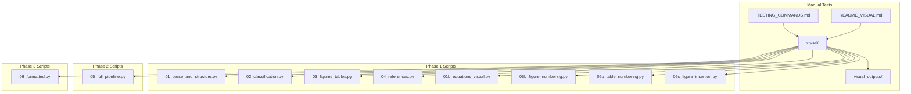
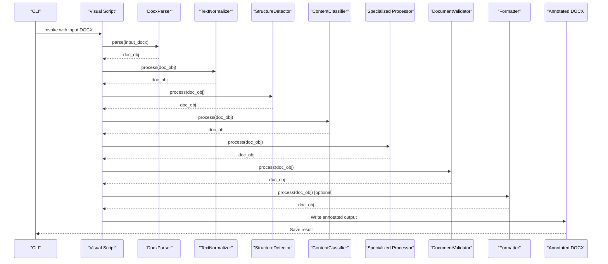
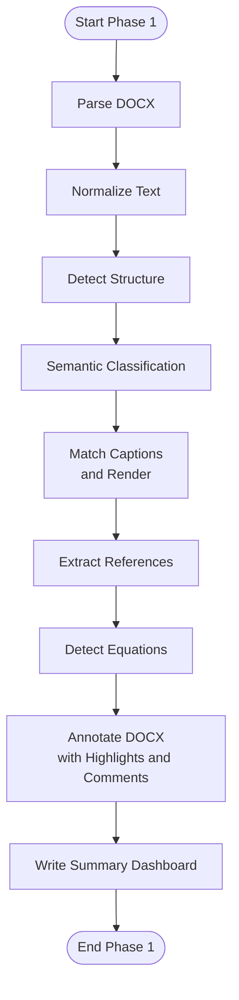
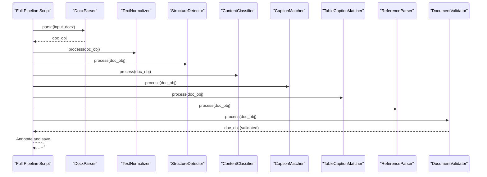
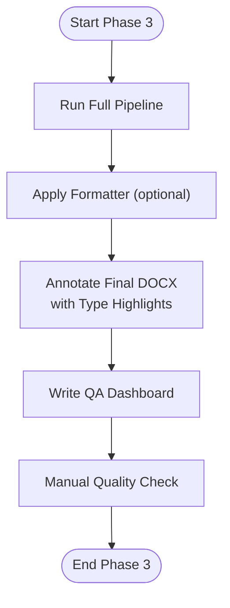
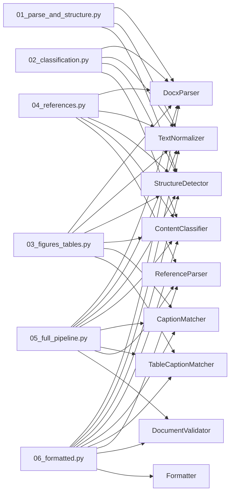

# Visual Testing

<cite>
**Referenced Files in This Document**
- [README_VISUAL.md](file://backend/manual_tests/README_VISUAL.md)
- [TESTING_COMMANDS.md](file://backend/manual_tests/TESTING_COMMANDS.md)
- [01_parse_and_structure.py](file://backend/manual_tests/visual/phase1/01_parse_and_structure.py)
- [02_classification.py](file://backend/manual_tests/visual/phase1/02_classification.py)
- [03_figures_tables.py](file://backend/manual_tests/visual/phase1/03_figures_tables.py)
- [04_references.py](file://backend/manual_tests/visual/phase1/04_references.py)
- [05_full_pipeline.py](file://backend/manual_tests/visual/phase1/05_full_pipeline.py)
- [06_formatted.py](file://backend/manual_tests/visual/phase1/06_formatted.py)
- [01b_equations_visual.py](file://backend/manual_tests/visual/phase1/01b_equations_visual.py)
- [05b_figure_numbering.py](file://backend/manual_tests/visual/phase1/05b_figure_numbering.py)
- [06b_table_numbering.py](file://backend/manual_tests/visual/phase1/06b_table_numbering.py)
- [05c_figure_insertion.py](file://backend/manual_tests/visual/phase1/05c_figure_insertion.py)
</cite>

## Table of Contents
1. [Introduction](#introduction)
2. [Project Structure](#project-structure)
3. [Core Components](#core-components)
4. [Architecture Overview](#architecture-overview)
5. [Detailed Component Analysis](#detailed-component-analysis)
6. [Dependency Analysis](#dependency-analysis)
7. [Performance Considerations](#performance-considerations)
8. [Troubleshooting Guide](#troubleshooting-guide)
9. [Conclusion](#conclusion)

## Introduction
This document describes the visual testing framework used to manually verify the ScholarForm AI pipeline that transforms DOCX manuscripts into formatted academic outputs. The framework is structured as a three-phase visual verification process:
- Phase 1: Identification and structure validation (parse, structure detection, classification, figures/tables, references)
- Phase 2: Assembly and deduplication (validation and full pipeline assembly)
- Phase 3: Formatting and final output validation

Each phase produces an annotated DOCX file that is opened in Microsoft Word for visual inspection. The goal is to detect duplication, incorrect headings, caption placement issues, and reference inconsistencies, and to ensure the final formatted output meets quality criteria.

## Project Structure
The visual testing scripts are located under backend/manual_tests/visual and produce outputs under backend/manual_tests/visual_outputs. The primary documentation for the visual testing workflow is provided in README_VISUAL.md and TESTING_COMMANDS.md.

**Diagram sources**
- [README_VISUAL.md:11-25](file://backend/manual_tests/README_VISUAL.md#L11-L25)
- [TESTING_COMMANDS.md:29-46](file://backend/manual_tests/TESTING_COMMANDS.md#L29-L46)

**Section sources**
- [README_VISUAL.md:11-25](file://backend/manual_tests/README_VISUAL.md#L11-L25)
- [TESTING_COMMANDS.md:29-46](file://backend/manual_tests/TESTING_COMMANDS.md#L29-L46)

## Core Components
The visual testing framework consists of six core phases, each implemented as a standalone Python script that:
- Executes a subset of the pipeline stages
- Produces a new DOCX annotated with metadata and highlights
- Writes a summary dashboard at the top of the document

Key phases and their responsibilities:
- Parse and structure detection: Highlights headings, marks duplicates, and reports counts
- Semantic classification: Color-codes block types for quick visual verification
- Figures and tables: Highlights captions and renders embedded figures/tables
- References: Highlights reference headings and entries
- Full pipeline: Aggregates all previous annotations plus validation status
- Formatted output: Applies formatting and annotates final output

Quality criteria per phase:
- Phase 1: No duplicate blocks; correct heading levels; proper splitting behavior
- Phase 2: No validation errors; no duplicate content across the pipeline
- Phase 3: No duplication; correct heading hierarchy; proper caption placement; consistent reference formatting; completeness verified

**Section sources**
- [README_VISUAL.md:31-162](file://backend/manual_tests/README_VISUAL.md#L31-L162)
- [TESTING_COMMANDS.md:50-285](file://backend/manual_tests/TESTING_COMMANDS.md#L50-L285)

## Architecture Overview
The visual testing scripts orchestrate pipeline components to build a document object, then render an annotated DOCX. The flow is consistent across phases: parse → normalize → structure detection → classification → specialized processing → annotation → save.

**Diagram sources**
- [01_parse_and_structure.py:62-84](file://backend/manual_tests/visual/phase1/01_parse_and_structure.py#L62-L84)
- [02_classification.py:77-79](file://backend/manual_tests/visual/phase1/02_classification.py#L77-L79)
- [03_figures_tables.py:60-64](file://backend/manual_tests/visual/phase1/03_figures_tables.py#L60-L64)
- [04_references.py:59-61](file://backend/manual_tests/visual/phase1/04_references.py#L59-L61)
- [05_full_pipeline.py:77-84](file://backend/manual_tests/visual/phase1/05_full_pipeline.py#L77-L84)
- [06_formatted.py:35-47](file://backend/manual_tests/visual/phase1/06_formatted.py#L35-L47)

## Detailed Component Analysis

### Phase 1: Identification and Structure Validation
Focus: Parse and structure validation, classification verification, figure/table processing, and equation detection.

- Parse and structure detection (01_parse_and_structure.py)
  - Highlights headings in yellow and adds blue comments indicating heading levels
  - Marks duplicates in red and includes a summary dashboard
  - Validates splitting behavior and reports counts
  - Expected outcome: Clean separation of blocks, correct heading hierarchy, zero duplicates

- Semantic classification (02_classification.py)
  - Color-codes block types (e.g., abstract, headings, references, figures, tables)
  - Adds blue comments with the detected type
  - Provides a dashboard summary of counts per type
  - Expected outcome: Accurate semantic labeling across the document

- Figures and tables (03_figures_tables.py)
  - Matches captions to figures/tables and highlights them in turquoise
  - Renders figures and tables into the annotated DOCX
  - Sorts elements by index to preserve order
  - Expected outcome: All figures/tables captured with correct captions; rendered visuals aid placement checks

- References (04_references.py)
  - Highlights reference headings and entries
  - Adds a dashboard with total blocks and reference counts
  - Expected outcome: All references extracted without duplication

- Equations (01b_equations_visual.py)
  - Identifies equation blocks and highlights them
  - Adds a summary dashboard for equation objects
  - Expected outcome: Equations clearly marked for verification

**Diagram sources**
- [01_parse_and_structure.py:62-84](file://backend/manual_tests/visual/phase1/01_parse_and_structure.py#L62-L84)
- [02_classification.py:77-79](file://backend/manual_tests/visual/phase1/02_classification.py#L77-L79)
- [03_figures_tables.py:60-64](file://backend/manual_tests/visual/phase1/03_figures_tables.py#L60-L64)
- [04_references.py:59-61](file://backend/manual_tests/visual/phase1/04_references.py#L59-L61)
- [01b_equations_visual.py:42-46](file://backend/manual_tests/visual/phase1/01b_equations_visual.py#L42-L46)

**Section sources**
- [01_parse_and_structure.py:11-171](file://backend/manual_tests/visual/phase1/01_parse_and_structure.py#L11-L171)
- [02_classification.py:24-111](file://backend/manual_tests/visual/phase1/02_classification.py#L24-L111)
- [03_figures_tables.py:26-132](file://backend/manual_tests/visual/phase1/03_figures_tables.py#L26-L132)
- [04_references.py:25-90](file://backend/manual_tests/visual/phase1/04_references.py#L25-L90)
- [01b_equations_visual.py:25-81](file://backend/manual_tests/visual/phase1/01b_equations_visual.py#L25-L81)

### Phase 2: Assembly and Deduplication
Focus: Full pipeline assembly and validation to ensure no duplication before formatting.

- Full pipeline (05_full_pipeline.py)
  - Executes parsing, normalization, structure detection, classification, caption matching, reference parsing, and validation
  - Aggregates all annotations from earlier phases
  - Includes a validation dashboard with PASS/FAIL and counts of errors/warnings
  - Expected outcome: PASS validation; no duplicate content; comprehensive coverage of document elements

**Diagram sources**
- [05_full_pipeline.py:67-84](file://backend/manual_tests/visual/phase1/05_full_pipeline.py#L67-L84)

**Section sources**
- [05_full_pipeline.py:50-115](file://backend/manual_tests/visual/phase1/05_full_pipeline.py#L50-L115)

### Phase 3: Formatting and Final Output Validation
Focus: Apply formatting and verify final output quality.

- Formatted output (06_formatted.py)
  - Executes the full pipeline including formatting (if template contract is available)
  - Creates a visual dashboard at the top indicating formatting status, template used, and counts
  - Highlights all blocks by type and appends type labels to each paragraph
  - Expected outcome: No duplication; correct heading hierarchy; proper caption placement; consistent reference formatting; completeness verified

- Additional figure/table numbering and insertion scripts
  - Figure numbering (05b_figure_numbering.py): Verifies sequential numbering and highlights captions
  - Table numbering (06b_table_numbering.py): Verifies sequential numbering and highlights captions
  - Figure insertion (05c_figure_insertion.py): Marks insertion anchors for figures

**Diagram sources**
- [06_formatted.py:24-52](file://backend/manual_tests/visual/phase1/06_formatted.py#L24-L52)
- [06_formatted.py:79-107](file://backend/manual_tests/visual/phase1/06_formatted.py#L79-L107)

**Section sources**
- [06_formatted.py:21-108](file://backend/manual_tests/visual/phase1/06_formatted.py#L21-L108)
- [05b_figure_numbering.py:29-85](file://backend/manual_tests/visual/phase1/05b_figure_numbering.py#L29-L85)
- [06b_table_numbering.py:29-85](file://backend/manual_tests/visual/phase1/06b_table_numbering.py#L29-L85)
- [05c_figure_insertion.py:29-92](file://backend/manual_tests/visual/phase1/05c_figure_insertion.py#L29-L92)

## Dependency Analysis
The visual scripts depend on the backend pipeline modules and use python-docx to create annotated outputs. They share common stages (parsing, normalization, structure detection, classification) while specializing in later stages (caption matching, reference parsing, validation, formatting).

**Diagram sources**
- [01_parse_and_structure.py:28-30](file://backend/manual_tests/visual/phase1/01_parse_and_structure.py#L28-L30)
- [02_classification.py:18-22](file://backend/manual_tests/visual/phase1/02_classification.py#L18-L22)
- [03_figures_tables.py:18-24](file://backend/manual_tests/visual/phase1/03_figures_tables.py#L18-L24)
- [04_references.py:18-23](file://backend/manual_tests/visual/phase1/04_references.py#L18-L23)
- [05_full_pipeline.py:18-26](file://backend/manual_tests/visual/phase1/05_full_pipeline.py#L18-L26)
- [06_formatted.py:10-19](file://backend/manual_tests/visual/phase1/06_formatted.py#L10-L19)

**Section sources**
- [01_parse_and_structure.py:28-30](file://backend/manual_tests/visual/phase1/01_parse_and_structure.py#L28-L30)
- [02_classification.py:18-22](file://backend/manual_tests/visual/phase1/02_classification.py#L18-L22)
- [03_figures_tables.py:18-24](file://backend/manual_tests/visual/phase1/03_figures_tables.py#L18-L24)
- [04_references.py:18-23](file://backend/manual_tests/visual/phase1/04_references.py#L18-L23)
- [05_full_pipeline.py:18-26](file://backend/manual_tests/visual/phase1/05_full_pipeline.py#L18-L26)
- [06_formatted.py:10-19](file://backend/manual_tests/visual/phase1/06_formatted.py#L10-L19)

## Performance Considerations
- Rendering figures and tables: The scripts render images and tables into the annotated DOCX, which can increase file size and processing time. Consider limiting the number of figures/tables in test inputs for faster iteration.
- Validation overhead: Running the full pipeline (including validation) in Phase 2 and Phase 3 introduces additional processing time. Use representative inputs to balance thoroughness and speed.
- Annotation strategy: Adding comments and highlights is lightweight, but excessive annotations can reduce readability. Keep annotations concise and focused.

## Troubleshooting Guide
Common issues and resolutions:
- Missing or incorrect headings
  - Cause: Structure detection misclassification
  - Action: Inspect the structure detection output and adjust thresholds or rules if necessary
- Duplicate blocks
  - Cause: Normalization splitting or ID reuse
  - Action: Review splitting behavior and ensure duplicates are filtered out before assembly
- Incorrect figure/table captions
  - Cause: Caption matching errors
  - Action: Verify caption proximity and metadata; re-run caption matching
- Missing references
  - Cause: Reference parsing failure
  - Action: Check reference section structure and rerun reference parsing
- Formatting errors
  - Cause: Template contract missing or formatter exceptions
  - Action: Ensure template contract exists; handle exceptions gracefully and rerun formatting

Interpretation guidelines:
- Zero duplicates: Proceed to next phase
- Validation FAIL: Fix pipeline logic, re-run from Phase 1
- Formatting warnings: Address formatting issues, re-run Phase 3 only

**Section sources**
- [README_VISUAL.md:165-179](file://backend/manual_tests/README_VISUAL.md#L165-L179)
- [06_formatted.py:44-51](file://backend/manual_tests/visual/phase1/06_formatted.py#L44-L51)

## Conclusion
The visual testing framework provides a robust, layered approach to verifying manuscript formatting accuracy. By progressing through phases—identification, assembly, and formatting—and using annotated DOCX outputs for inspection, teams can quickly identify and resolve issues. Adhering to the documented quality criteria and troubleshooting steps ensures reliable, publication-ready outputs.