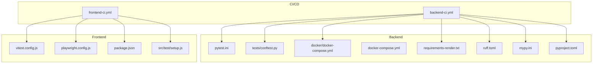
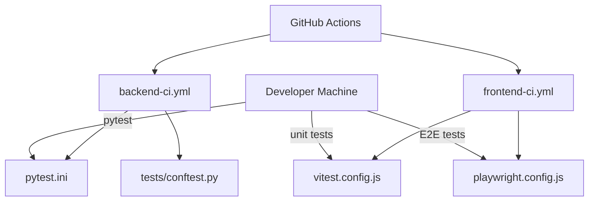
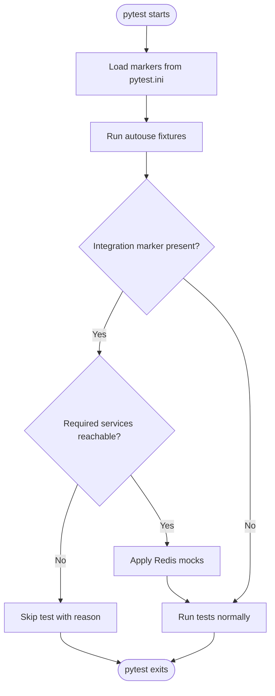
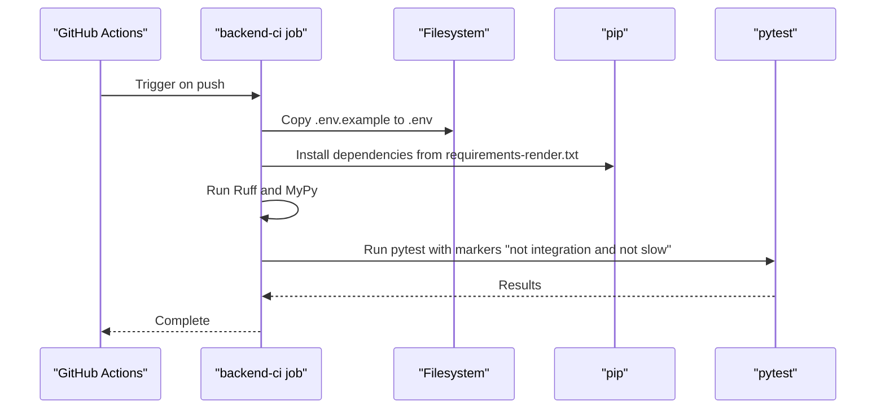
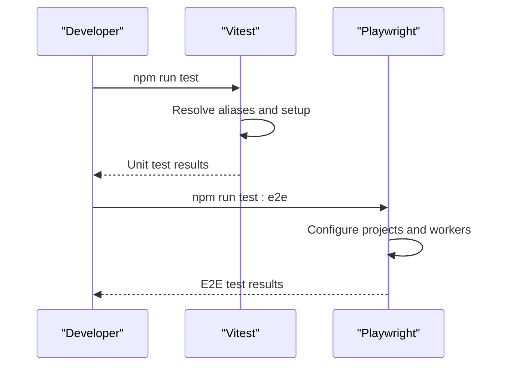
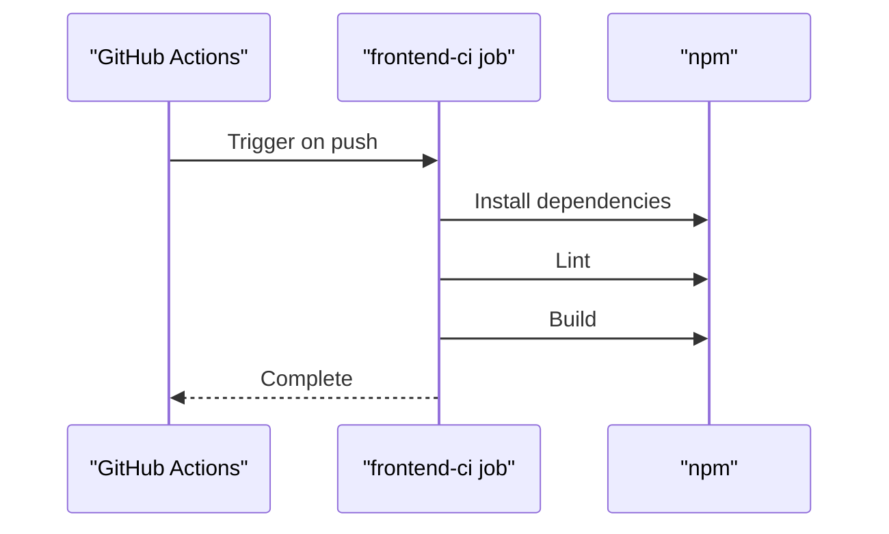
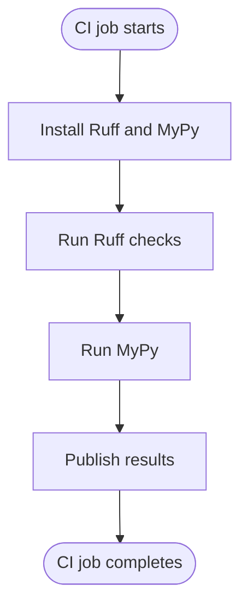
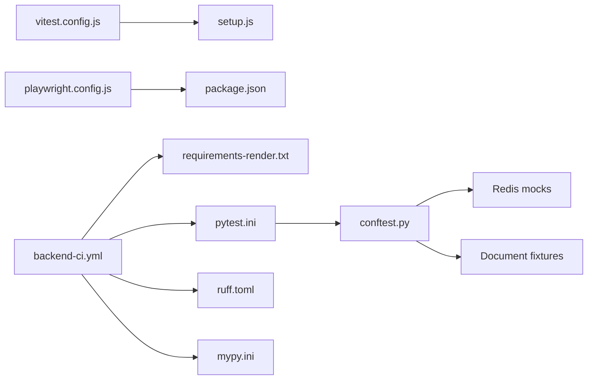

# Test Infrastructure

<cite>
**Referenced Files in This Document**
- [backend-ci.yml](file://.github/workflows/backend-ci.yml)
- [frontend-ci.yml](file://.github/workflows/frontend-ci.yml)
- [pytest.ini](file://backend/pytest.ini)
- [pyproject.toml](file://backend/pyproject.toml)
- [conftest.py](file://backend/tests/conftest.py)
- [docker-compose.yml](file://backend/docker/docker-compose.yml)
- [docker-compose.yml](file://backend/docker-compose.yml)
- [vitest.config.js](file://frontend/vitest.config.js)
- [playwright.config.js](file://frontend/playwright.config.js)
- [setup.js](file://frontend/src/test/setup.js)
- [package.json](file://frontend/package.json)
- [mypy.ini](file://backend/mypy.ini)
- [ruff.toml](file://backend/ruff.toml)
- [requirements-render.txt](file://backend/requirements-render.txt)
</cite>

## Table of Contents
1. [Introduction](#introduction)
2. [Project Structure](#project-structure)
3. [Core Components](#core-components)
4. [Architecture Overview](#architecture-overview)
5. [Detailed Component Analysis](#detailed-component-analysis)
6. [Dependency Analysis](#dependency-analysis)
7. [Performance Considerations](#performance-considerations)
8. [Troubleshooting Guide](#troubleshooting-guide)
9. [Conclusion](#conclusion)
10. [Appendices](#appendices)

## Introduction
This document describes the complete test infrastructure for the automated manuscript formatter project. It covers the backend and frontend testing environments, CI/CD pipelines, Docker Compose services used during tests, configuration files, environment variables, test data management, and service mocking strategies. It also provides practical guidance for setting up local testing environments and integrating tests into CI/CD.

## Project Structure
The repository organizes tests and CI/CD configurations by domain:
- Backend tests and CI are under backend/
- Frontend tests and CI are under frontend/
- CI/CD workflows are under .github/workflows/

Key areas covered:
- Backend pytest configuration and fixtures
- Frontend Vitest and Playwright configurations
- Docker Compose services for Redis, Grobid, and related dependencies
- CI/CD job definitions for backend and frontend
- Static analysis and linting integration in CI



**Diagram sources**
- [backend-ci.yml:1-41](file://.github/workflows/backend-ci.yml#L1-L41)
- [frontend-ci.yml:1-31](file://.github/workflows/frontend-ci.yml#L1-L31)
- [pytest.ini:1-28](file://backend/pytest.ini#L1-L28)
- [conftest.py:1-112](file://backend/tests/conftest.py#L1-L112)
- [docker-compose.yml:1-100](file://backend/docker/docker-compose.yml#L1-L100)
- [docker-compose.yml:1-7](file://backend/docker-compose.yml#L1-L7)
- [requirements-render.txt:1-136](file://backend/requirements-render.txt#L1-L136)
- [ruff.toml:1-11](file://backend/ruff.toml#L1-L11)
- [mypy.ini:1-10](file://backend/mypy.ini#L1-L10)
- [pyproject.toml:1-9](file://backend/pyproject.toml#L1-L9)
- [vitest.config.js:1-34](file://frontend/vitest.config.js#L1-L34)
- [playwright.config.js:1-48](file://frontend/playwright.config.js#L1-L48)
- [package.json:1-62](file://frontend/package.json#L1-L62)
- [setup.js:1-2](file://frontend/src/test/setup.js#L1-L2)

**Section sources**
- [backend-ci.yml:1-41](file://.github/workflows/backend-ci.yml#L1-L41)
- [frontend-ci.yml:1-31](file://.github/workflows/frontend-ci.yml#L1-L31)
- [pytest.ini:1-28](file://backend/pytest.ini#L1-L28)
- [conftest.py:1-112](file://backend/tests/conftest.py#L1-L112)
- [docker-compose.yml:1-100](file://backend/docker/docker-compose.yml#L1-L100)
- [docker-compose.yml:1-7](file://backend/docker-compose.yml#L1-L7)
- [requirements-render.txt:1-136](file://backend/requirements-render.txt#L1-L136)
- [ruff.toml:1-11](file://backend/ruff.toml#L1-L11)
- [mypy.ini:1-10](file://backend/mypy.ini#L1-L10)
- [pyproject.toml:1-9](file://backend/pyproject.toml#L1-L9)
- [vitest.config.js:1-34](file://frontend/vitest.config.js#L1-L34)
- [playwright.config.js:1-48](file://frontend/playwright.config.js#L1-L48)
- [package.json:1-62](file://frontend/package.json#L1-L62)
- [setup.js:1-2](file://frontend/src/test/setup.js#L1-L2)

## Core Components
- Backend test runner and configuration:
  - pytest.ini defines test discovery, markers, and warnings filtering.
  - conftest.py provides global fixtures, service reachability checks, and Redis mocking.
  - CI installs dependencies via requirements-render.txt and runs pytest with selected markers.
- Frontend test runner and configuration:
  - Vitest configuration sets up aliases, environment, and test file inclusion/exclusion.
  - Playwright configuration controls browser projects, retries, workers, and optional dev server.
  - package.json scripts expose test commands for unit and E2E tests.
- Docker Compose services for test dependencies:
  - Redis for caching and Celery broker.
  - Grobid for metadata extraction.
  - Optional Celery workers for async processing in test environments.

**Section sources**
- [pytest.ini:1-28](file://backend/pytest.ini#L1-L28)
- [conftest.py:1-112](file://backend/tests/conftest.py#L1-L112)
- [backend-ci.yml:1-41](file://.github/workflows/backend-ci.yml#L1-L41)
- [requirements-render.txt:1-136](file://backend/requirements-render.txt#L1-L136)
- [vitest.config.js:1-34](file://frontend/vitest.config.js#L1-L34)
- [playwright.config.js:1-48](file://frontend/playwright.config.js#L1-L48)
- [package.json:1-62](file://frontend/package.json#L1-L62)
- [docker-compose.yml:1-100](file://backend/docker/docker-compose.yml#L1-L100)

## Architecture Overview
The test architecture integrates local development and CI/CD:
- Backend CI runs static analysis (Ruff, MyPy), installs dependencies, and executes unit tests while skipping integration and slow tests by default.
- Frontend CI runs linting and builds the Next.js app.
- Tests can rely on mocked services (e.g., Redis) or real services orchestrated via Docker Compose.



**Diagram sources**
- [backend-ci.yml:1-41](file://.github/workflows/backend-ci.yml#L1-L41)
- [frontend-ci.yml:1-31](file://.github/workflows/frontend-ci.yml#L1-L31)
- [pytest.ini:1-28](file://backend/pytest.ini#L1-L28)
- [conftest.py:1-112](file://backend/tests/conftest.py#L1-L112)
- [vitest.config.js:1-34](file://frontend/vitest.config.js#L1-L34)
- [playwright.config.js:1-48](file://frontend/playwright.config.js#L1-L48)

## Detailed Component Analysis

### Backend Test Configuration and Fixtures
- pytest.ini:
  - Defines test discovery paths, markers for categorizing tests, and warning filters.
  - Uses asyncio_mode = auto for async tests.
- conftest.py:
  - Provides autouse fixtures to skip integration tests when required services are unreachable.
  - Mocks Redis globally for streaming, rate limiting, and caching to avoid external dependencies.
  - Supplies reusable document fixtures for pipeline testing.



**Diagram sources**
- [pytest.ini:16-27](file://backend/pytest.ini#L16-L27)
- [conftest.py:37-58](file://backend/tests/conftest.py#L37-L58)

**Section sources**
- [pytest.ini:1-28](file://backend/pytest.ini#L1-L28)
- [conftest.py:1-112](file://backend/tests/conftest.py#L1-L112)

### Backend CI/CD Workflow
- backend-ci.yml:
  - Checks out code, sets up Python 3.12, prepares environment by copying .env.example to .env, installs dependencies from requirements-render.txt, and runs Ruff and MyPy.
  - Executes pytest excluding integration and slow tests by default.



**Diagram sources**
- [backend-ci.yml:14-40](file://.github/workflows/backend-ci.yml#L14-L40)
- [requirements-render.txt:1-136](file://backend/requirements-render.txt#L1-L136)

**Section sources**
- [backend-ci.yml:1-41](file://.github/workflows/backend-ci.yml#L1-L41)
- [requirements-render.txt:1-136](file://backend/requirements-render.txt#L1-L136)

### Frontend Test Configuration
- Vitest configuration:
  - Sets up module aliases, JSX automatic transform, jsdom environment, and test file inclusion patterns.
  - Excludes legacy directories and allows broader filesystem access for aliases.
- Playwright configuration:
  - Controls parallelism, retries, workers, and reporters.
  - Optionally launches a local dev server when PLAYWRIGHT_BASE_URL is not set.
- package.json scripts:
  - Exposes test commands for unit, watch, and E2E modes.



**Diagram sources**
- [vitest.config.js:4-32](file://frontend/vitest.config.js#L4-L32)
- [playwright.config.js:9-47](file://frontend/playwright.config.js#L9-L47)
- [package.json:6-16](file://frontend/package.json#L6-L16)

**Section sources**
- [vitest.config.js:1-34](file://frontend/vitest.config.js#L1-L34)
- [playwright.config.js:1-48](file://frontend/playwright.config.js#L1-L48)
- [package.json:1-62](file://frontend/package.json#L1-L62)
- [setup.js:1-2](file://frontend/src/test/setup.js#L1-L2)

### Frontend CI/CD Workflow
- frontend-ci.yml:
  - Checks out code, sets up Node 20, installs dependencies with npm ci, runs linting, and builds the project.



**Diagram sources**
- [frontend-ci.yml:14-30](file://.github/workflows/frontend-ci.yml#L14-L30)

**Section sources**
- [frontend-ci.yml:1-31](file://.github/workflows/frontend-ci.yml#L1-L31)

### Docker Compose for Test Services
- backend/docker/docker-compose.yml:
  - Defines services for Grobid, Redis, ClamAV, and Celery workers.
  - Configures environment variables for Redis, Celery broker/result backend, GROBID URLs, and ClamAV host/port.
  - Includes healthchecks for Grobid and persistent volumes for Redis and Grobid data.
- backend/docker-compose.yml:
  - Minimal Grobid service definition for quick testing.

```mermaid
graph TB
subgraph "Test Services"
REDIS["Redis"]
GROBID["Grobid"]
CLAMAV["ClamAV"]
CW1["Celery Worker (interactive)"]
CW2["Celery Worker (batch)"]
end
REDIS <- --> CW1
REDIS <- --> CW2
GROBID <- --> CW1
GROBID <- --> CW2
CLAMAV <- --> CW1
CLAMAV <- --> CW2
```

**Diagram sources**
- [docker-compose.yml:1-100](file://backend/docker/docker-compose.yml#L1-L100)
- [docker-compose.yml:1-7](file://backend/docker-compose.yml#L1-L7)

**Section sources**
- [docker-compose.yml:1-100](file://backend/docker/docker-compose.yml#L1-L100)
- [docker-compose.yml:1-7](file://backend/docker-compose.yml#L1-L7)

### Static Analysis and Linting Integration
- Ruff configuration:
  - Target Python version, line length, selected lint rules, and per-file ignores for Alembic and tests.
- MyPy configuration:
  - Ignores missing imports and follows imports behavior for type checking.
- CI runs Ruff and MyPy to enforce code quality.



**Diagram sources**
- [backend-ci.yml:32-37](file://.github/workflows/backend-ci.yml#L32-L37)
- [ruff.toml:1-11](file://backend/ruff.toml#L1-L11)
- [mypy.ini:1-10](file://backend/mypy.ini#L1-L10)

**Section sources**
- [ruff.toml:1-11](file://backend/ruff.toml#L1-L11)
- [mypy.ini:1-10](file://backend/mypy.ini#L1-L10)
- [backend-ci.yml:32-37](file://.github/workflows/backend-ci.yml#L32-L37)

## Dependency Analysis
- Backend test dependencies are installed from requirements-render.txt, including FastAPI, SQLAlchemy, Redis, Celery, HTTP clients, NLP libraries, and monitoring packages.
- Frontend test dependencies include Vitest, Playwright, Testing Library, and Next.js ecosystem packages.
- CI workflows depend on environment preparation (.env creation) and deterministic dependency installation.



**Diagram sources**
- [pytest.ini:1-28](file://backend/pytest.ini#L1-L28)
- [conftest.py:1-112](file://backend/tests/conftest.py#L1-L112)
- [vitest.config.js:1-34](file://frontend/vitest.config.js#L1-L34)
- [playwright.config.js:1-48](file://frontend/playwright.config.js#L1-L48)
- [setup.js:1-2](file://frontend/src/test/setup.js#L1-L2)
- [package.json:1-62](file://frontend/package.json#L1-L62)
- [backend-ci.yml:14-29](file://.github/workflows/backend-ci.yml#L14-L29)
- [requirements-render.txt:1-136](file://backend/requirements-render.txt#L1-L136)
- [ruff.toml:1-11](file://backend/ruff.toml#L1-L11)
- [mypy.ini:1-10](file://backend/mypy.ini#L1-L10)

**Section sources**
- [requirements-render.txt:1-136](file://backend/requirements-render.txt#L1-L136)
- [package.json:1-62](file://frontend/package.json#L1-L62)
- [backend-ci.yml:14-29](file://.github/workflows/backend-ci.yml#L14-L29)

## Performance Considerations
- CI disables parallel tests on workers in non-CI environments to reduce resource contention during local development.
- Playwright limits workers to 1 on CI and uses retries only on CI to balance reliability and speed.
- Backend pytest excludes slow and integration tests by default to keep local feedback fast.

[No sources needed since this section provides general guidance]

## Troubleshooting Guide
- Integration tests skipped unexpectedly:
  - Verify required services (Redis, Grobid) are reachable using the same host and port environment variables used by the test fixtures.
  - Confirm that the environment variables align with the Docker Compose network and service names.
- Redis mocking issues:
  - Ensure that all imports using Redis are patched by the global mock fixture applied by conftest.py.
- Frontend test environment:
  - Confirm jsdom environment is initialized via setup.js and that aliases resolve correctly in Vitest configuration.
  - For Playwright, ensure the dev server is running or set PLAYWRIGHT_BASE_URL appropriately.

**Section sources**
- [conftest.py:29-44](file://backend/tests/conftest.py#L29-L44)
- [conftest.py:46-58](file://backend/tests/conftest.py#L46-L58)
- [setup.js:1-2](file://frontend/src/test/setup.js#L1-L2)
- [playwright.config.js:6-8](file://frontend/playwright.config.js#L6-L8)

## Conclusion
The test infrastructure combines robust backend and frontend configurations with CI/CD automation and Dockerized dependencies. Backend tests leverage pytest markers, global fixtures, and service reachability checks, while frontend tests use Vitest and Playwright with sensible defaults for local and CI environments. The Docker Compose setup provides essential services for realistic integration testing.

[No sources needed since this section summarizes without analyzing specific files]

## Appendices

### Environment Variables and Test Data Management
- Environment preparation:
  - CI copies .env.example to .env to ensure tests have required variables.
- Service connectivity:
  - Backend tests check Redis and Grobid reachability using environment variables for host and port.
- Test data:
  - Document fixtures in conftest.py provide reusable test documents for pipeline logic.

**Section sources**
- [backend-ci.yml:23-24](file://.github/workflows/backend-ci.yml#L23-L24)
- [conftest.py:29-34](file://backend/tests/conftest.py#L29-L34)
- [conftest.py:72-111](file://backend/tests/conftest.py#L72-L111)

### Local Setup Guidelines
- Backend:
  - Install dependencies from requirements-render.txt.
  - Run pytest with default markers to execute unit tests.
  - Optionally start Redis and Grobid via Docker Compose for integration tests.
- Frontend:
  - Install dependencies with npm ci.
  - Run unit tests with Vitest and E2E tests with Playwright.
  - Use npm scripts for linting and building.

**Section sources**
- [requirements-render.txt:1-136](file://backend/requirements-render.txt#L1-L136)
- [backend-ci.yml:28-29](file://.github/workflows/backend-ci.yml#L28-L29)
- [package.json:6-16](file://frontend/package.json#L6-L16)

### CI/CD Pipeline Configuration
- Backend CI:
  - Python setup, dependency installation, Ruff, MyPy, and pytest execution.
- Frontend CI:
  - Node setup, dependency installation, linting, and build.

**Section sources**
- [backend-ci.yml:18-40](file://.github/workflows/backend-ci.yml#L18-L40)
- [frontend-ci.yml:18-30](file://.github/workflows/frontend-ci.yml#L18-L30)