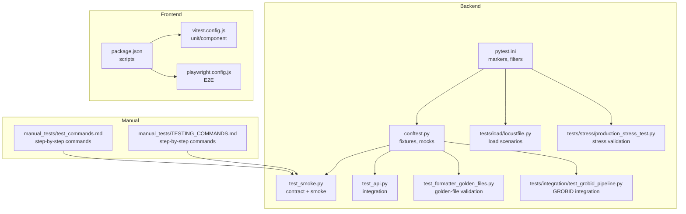
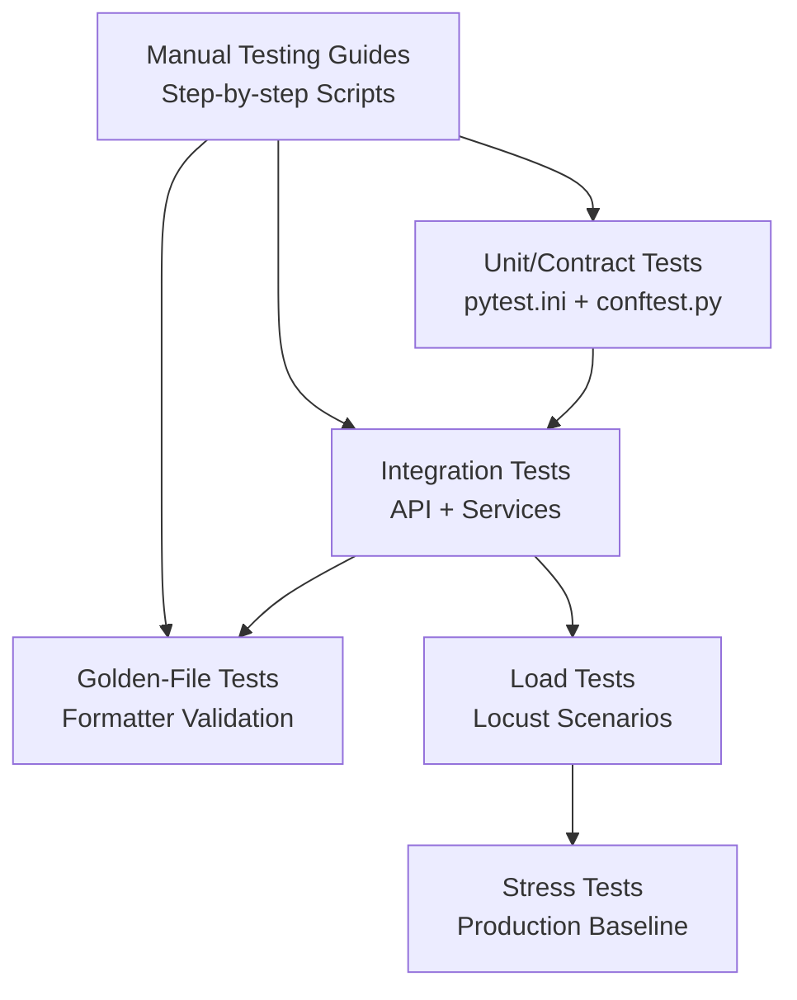
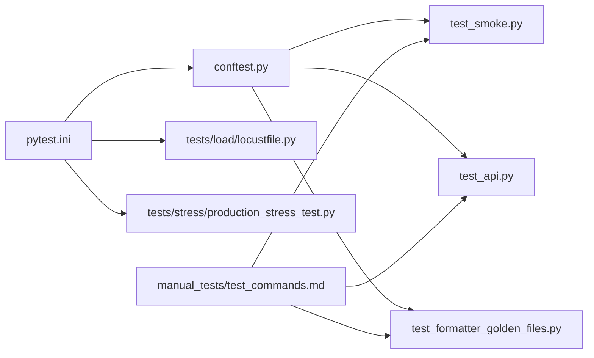

# Testing Best Practices

<cite>
**Referenced Files in This Document**
- [pytest.ini](file://backend/pytest.ini)
- [conftest.py](file://backend/tests/conftest.py)
- [test_smoke.py](file://backend/tests/test_smoke.py)
- [test_api.py](file://backend/tests/test_api.py)
- [test_formatter_golden_files.py](file://backend/tests/test_formatter_golden_files.py)
- [locustfile.py](file://backend/tests/load/locustfile.py)
- [production_stress_test.py](file://backend/tests/stress/production_stress_test.py)
- [test_grobid_pipeline.py](file://backend/tests/integration/test_grobid_pipeline.py)
- [Testing.md](file://docs/Testing.md)
- [TESTING_COMMANDS.md](file://backend/manual_tests/TESTING_COMMANDS.md)
- [test_commands.md](file://backend/manual_tests/test_commands.md)
- [vitest.config.js](file://frontend/vitest.config.js)
- [playwright.config.js](file://frontend/playwright.config.js)
- [package.json](file://frontend/package.json)
</cite>

## Table of Contents
1. [Introduction](#introduction)
2. [Project Structure](#project-structure)
3. [Core Components](#core-components)
4. [Architecture Overview](#architecture-overview)
5. [Detailed Component Analysis](#detailed-component-analysis)
6. [Dependency Analysis](#dependency-analysis)
7. [Performance Considerations](#performance-considerations)
8. [Troubleshooting Guide](#troubleshooting-guide)
9. [Conclusion](#conclusion)
10. [Appendices](#appendices)

## Introduction
This document consolidates testing best practices for the document processing pipeline, covering backend and frontend testing strategies, methodologies, and operational procedures. It focuses on:
- Writing and organizing tests across unit, integration, contract, performance, and stress domains
- Managing test data and golden files
- Debugging and triaging test failures
- Scaling testing with load and stress tests
- Maintaining test reliability across environments via CI and automation
- Reporting and documentation standards

## Project Structure
The repository provides a comprehensive testing ecosystem:
- Backend: pytest-based suites with markers, fixtures, smoke and integration tests, golden-file validation, load and stress tests
- Frontend: Vitest for unit/component tests and Playwright for E2E tests
- Manual testing aids for pipeline phases and visual inspection
- CI workflows orchestrated via GitHub Actions

**Diagram sources**
- [pytest.ini:1-28](file://backend/pytest.ini#L1-L28)
- [conftest.py:1-112](file://backend/tests/conftest.py#L1-L112)
- [test_smoke.py:1-269](file://backend/tests/test_smoke.py#L1-L269)
- [test_api.py:1-366](file://backend/tests/test_api.py#L1-L366)
- [test_formatter_golden_files.py:1-253](file://backend/tests/test_formatter_golden_files.py#L1-L253)
- [locustfile.py:1-139](file://backend/tests/load/locustfile.py#L1-L139)
- [production_stress_test.py:1-172](file://backend/tests/stress/production_stress_test.py#L1-L172)
- [test_grobid_pipeline.py:1-255](file://backend/tests/integration/test_grobid_pipeline.py#L1-L255)
- [vitest.config.js:1-34](file://frontend/vitest.config.js#L1-L34)
- [playwright.config.js:1-48](file://frontend/playwright.config.js#L1-L48)
- [package.json:1-62](file://frontend/package.json#L1-L62)
- [test_commands.md:1-347](file://backend/manual_tests/test_commands.md#L1-L347)
- [TESTING_COMMANDS.md:1-285](file://backend/manual_tests/TESTING_COMMANDS.md#L1-L285)

**Section sources**
- [pytest.ini:1-28](file://backend/pytest.ini#L1-L28)
- [conftest.py:1-112](file://backend/tests/conftest.py#L1-L112)
- [Testing.md:1-146](file://docs/Testing.md#L1-L146)
- [vitest.config.js:1-34](file://frontend/vitest.config.js#L1-L34)
- [playwright.config.js:1-48](file://frontend/playwright.config.js#L1-L48)
- [package.json:1-62](file://frontend/package.json#L1-L62)
- [test_commands.md:1-347](file://backend/manual_tests/test_commands.md#L1-L347)
- [TESTING_COMMANDS.md:1-285](file://backend/manual_tests/TESTING_COMMANDS.md#L1-L285)

## Core Components
- Test configuration and markers: centralized in pytest.ini with explicit markers for unit, integration, performance, contract, and service categories
- Shared fixtures and mocks: global Redis, rate limit, and stream mocks in conftest.py; document fixtures for pipeline testing
- Contract and smoke tests: endpoint-level validations ensuring schema stability and basic functionality
- Integration tests: API and external service behavior (e.g., GROBID) with performance SLAs
- Golden-file testing: deterministic formatting validation across templates
- Load and stress tests: Locust-based concurrency scenarios and production stress validation framework
- Manual testing guides: step-by-step commands for pipeline phases and visual inspection

**Section sources**
- [pytest.ini:16-28](file://backend/pytest.ini#L16-L28)
- [conftest.py:37-112](file://backend/tests/conftest.py#L37-L112)
- [test_smoke.py:59-269](file://backend/tests/test_smoke.py#L59-L269)
- [test_api.py:14-366](file://backend/tests/test_api.py#L14-L366)
- [test_formatter_golden_files.py:222-253](file://backend/tests/test_formatter_golden_files.py#L222-L253)
- [locustfile.py:1-139](file://backend/tests/load/locustfile.py#L1-L139)
- [production_stress_test.py:19-172](file://backend/tests/stress/production_stress_test.py#L19-L172)
- [test_grobid_pipeline.py:19-255](file://backend/tests/integration/test_grobid_pipeline.py#L19-L255)
- [test_commands.md:1-347](file://backend/manual_tests/test_commands.md#L1-L347)
- [TESTING_COMMANDS.md:1-285](file://backend/manual_tests/TESTING_COMMANDS.md#L1-L285)

## Architecture Overview
The testing architecture separates concerns across layers:
- Unit and contract tests validate internal logic and API contracts
- Integration tests validate external dependencies and end-to-end flows
- Golden-file tests enforce formatting determinism
- Load and stress tests validate scalability and reliability under realistic loads
- Manual testing supports reproducible, visual verification of pipeline stages

**Diagram sources**
- [pytest.ini:1-28](file://backend/pytest.ini#L1-L28)
- [conftest.py:1-112](file://backend/tests/conftest.py#L1-L112)
- [test_smoke.py:1-269](file://backend/tests/test_smoke.py#L1-L269)
- [test_api.py:1-366](file://backend/tests/test_api.py#L1-L366)
- [test_formatter_golden_files.py:1-253](file://backend/tests/test_formatter_golden_files.py#L1-L253)
- [locustfile.py:1-139](file://backend/tests/load/locustfile.py#L1-L139)
- [production_stress_test.py:1-172](file://backend/tests/stress/production_stress_test.py#L1-L172)
- [test_commands.md:1-347](file://backend/manual_tests/test_commands.md#L1-L347)
- [TESTING_COMMANDS.md:1-285](file://backend/manual_tests/TESTING_COMMANDS.md#L1-L285)

## Detailed Component Analysis

### Test Configuration and Organization
- Centralized markers enable selective runs by category (unit, integration, performance, contract, service)
- Filters exclude slow or manual test directories from default runs
- Async mode configured for async endpoints and services

Best practices:
- Use markers consistently to categorize tests
- Keep filters updated to avoid unintended inclusion of manual or heavy tests
- Prefer autouse fixtures for global mocks and environment setup

**Section sources**
- [pytest.ini:1-28](file://backend/pytest.ini#L1-L28)

### Shared Fixtures and Mocks
- Global Redis, rate-limit, and stream mocks reduce flakiness and speed up tests
- Document fixtures provide minimal and full PipelineDocument instances for focused testing

Best practices:
- Isolate side effects with patches and mocks
- Provide reusable fixtures for domain models to simplify test setup
- Avoid relying on external services unless marked integration

**Section sources**
- [conftest.py:37-112](file://backend/tests/conftest.py#L37-L112)

### Contract and Smoke Tests
- Validate endpoint schemas, response envelopes, and basic flows
- Smoke tests exercise critical paths (templates, upload, health, generator sessions, live preview, signed downloads)

Best practices:
- Treat contract tests as regression safeguards for API stability
- Keep smoke tests minimal and fast; they inform quick environment health checks

**Section sources**
- [test_smoke.py:59-269](file://backend/tests/test_smoke.py#L59-L269)

### API Integration Tests
- Validate health, readiness, CORS, rate limiting exemptions, document status, and export flows
- Include negative and edge-case validations (unsupported formats, warnings states)

Best practices:
- Mock external clients to simulate success/failure modes
- Verify headers and status codes explicitly
- Ensure guest-access endpoints remain functional without auth

**Section sources**
- [test_api.py:14-366](file://backend/tests/test_api.py#L14-L366)

### Golden-File Formatting Tests
- Deterministic formatting validation across templates using Markdown fixtures and DOCX outputs
- Structural summaries compare headings, references, and metadata presence

Best practices:
- Maintain golden files per template and update only on intentional formatting changes
- Normalize inputs and formatting options to keep diffs meaningful
- Use structural summaries to detect regressions in structure and metadata

**Section sources**
- [test_formatter_golden_files.py:222-253](file://backend/tests/test_formatter_golden_files.py#L222-L253)

### Load and Stress Testing
- Locust scenarios model realistic concurrency: uploads, status polling, templates, and WebSocket previews
- Production stress test validates “none” template baseline with real documents and structural checks

Best practices:
- Define SLAs per scenario (e.g., P99 thresholds) and instrument measurements
- Warm services before steady-state measurements
- Use representative inputs and vary concurrency to uncover bottlenecks

**Section sources**
- [locustfile.py:1-139](file://backend/tests/load/locustfile.py#L1-L139)
- [production_stress_test.py:19-172](file://backend/tests/stress/production_stress_test.py#L19-L172)

### Integration Tests for External Pipelines
- GROBID availability, metadata extraction, performance SLAs, and fallback behavior
- Pipeline orchestration tests with mocked databases and external clients

Best practices:
- Skip or mark degraded-service tests to avoid false negatives
- Validate performance targets and error handling paths
- Ensure graceful degradation when external services are unavailable

**Section sources**
- [test_grobid_pipeline.py:19-255](file://backend/tests/integration/test_grobid_pipeline.py#L19-L255)

### Manual Testing Procedures
- Step-by-step commands for each pipeline phase (identification, assembly, formatting)
- Visual inspection outputs for annotated DOCX files
- Separate guides for normal and visual verification

Best practices:
- Use manual commands to reproduce issues quickly
- Capture outputs and annotate discrepancies for triage
- Maintain a checklist aligned with critical flows

**Section sources**
- [test_commands.md:1-347](file://backend/manual_tests/test_commands.md#L1-L347)
- [TESTING_COMMANDS.md:1-285](file://backend/manual_tests/TESTING_COMMANDS.md#L1-L285)

### Frontend Testing Infrastructure
- Vitest with jsdom for unit and component tests
- Playwright for E2E tests with HTML reporter and controlled worker counts
- Scripts in package.json streamline test execution

Best practices:
- Install required testing libraries and align versions
- Prefer small, isolated unit tests with deterministic mocks
- Focus E2E on critical user journeys and expand gradually

**Section sources**
- [vitest.config.js:1-34](file://frontend/vitest.config.js#L1-L34)
- [playwright.config.js:1-48](file://frontend/playwright.config.js#L1-L48)
- [package.json:1-62](file://frontend/package.json#L1-L62)
- [Testing.md:70-107](file://docs/Testing.md#L70-L107)

## Dependency Analysis
Key relationships:
- pytest.ini governs discovery and filtering; conftest.py provides shared fixtures and environment toggles
- Smoke and API tests depend on mocked services to remain fast and reliable
- Golden-file tests depend on the formatter and template assets
- Load and stress tests depend on realistic inputs and external services (when applicable)
- Manual testing guides complement automated suites by enabling reproducible, visual verification

**Diagram sources**
- [pytest.ini:1-28](file://backend/pytest.ini#L1-L28)
- [conftest.py:1-112](file://backend/tests/conftest.py#L1-L112)
- [test_smoke.py:1-269](file://backend/tests/test_smoke.py#L1-L269)
- [test_api.py:1-366](file://backend/tests/test_api.py#L1-L366)
- [test_formatter_golden_files.py:1-253](file://backend/tests/test_formatter_golden_files.py#L1-L253)
- [locustfile.py:1-139](file://backend/tests/load/locustfile.py#L1-L139)
- [production_stress_test.py:1-172](file://backend/tests/stress/production_stress_test.py#L1-L172)
- [test_commands.md:1-347](file://backend/manual_tests/test_commands.md#L1-L347)

**Section sources**
- [pytest.ini:1-28](file://backend/pytest.ini#L1-L28)
- [conftest.py:1-112](file://backend/tests/conftest.py#L1-L112)
- [test_smoke.py:1-269](file://backend/tests/test_smoke.py#L1-L269)
- [test_api.py:1-366](file://backend/tests/test_api.py#L1-L366)
- [test_formatter_golden_files.py:1-253](file://backend/tests/test_formatter_golden_files.py#L1-L253)
- [locustfile.py:1-139](file://backend/tests/load/locustfile.py#L1-L139)
- [production_stress_test.py:1-172](file://backend/tests/stress/production_stress_test.py#L1-L172)
- [test_commands.md:1-347](file://backend/manual_tests/test_commands.md#L1-L347)

## Performance Considerations
- Define SLAs per scenario (e.g., upload ACK latency, status polling, WebSocket round-trip)
- Warm services before steady-state measurements to avoid cold-start skew
- Use representative inputs and vary concurrency to uncover bottlenecks
- Monitor external service performance (e.g., GROBID) and enforce timeouts and fallbacks

[No sources needed since this section provides general guidance]

## Troubleshooting Guide
Common issues and resolutions:
- Import collisions and asyncio mode: ensure Python version alignment and configure asyncio mode appropriately
- Missing environment variables: mock external dependencies or skip integration tests when services are unavailable
- Frontend missing dependencies: install required testing libraries as indicated in the testing strategy
- E2E stubs: fill critical path tests with real DOM assertions to improve reliability

**Section sources**
- [Testing.md:50-146](file://docs/Testing.md#L50-L146)

## Conclusion
A robust testing strategy balances fast unit and contract tests, reliable integration validations, deterministic formatting checks, and scalable load/stress assessments. By leveraging markers, shared fixtures, golden files, and manual verification aids, teams can maintain high confidence across environments and continuously improve reliability.

[No sources needed since this section summarizes without analyzing specific files]

## Appendices

### Test Methodologies and Guidelines
- Test-driven development: write contract and smoke tests first to define expected behavior, then implement and validate with integration and golden-file tests
- Test organization: group by responsibility (unit, integration, contract, performance, stress) and use markers for selective execution
- Code coverage: prioritize critical paths (templates, upload, health, exports) and ensure representative inputs for coverage

[No sources needed since this section provides general guidance]

### Debugging Techniques for Test Failures
- Narrow scope: run specific markers or subsets of tests to isolate failures
- Inspect logs and outputs: capture request/response payloads and visual outputs for manual inspection
- Use mocks strategically: replace external services to reproduce and verify error conditions
- Reproduce manually: leverage manual testing commands to validate pipeline stages independently

**Section sources**
- [test_smoke.py:59-269](file://backend/tests/test_smoke.py#L59-L269)
- [test_api.py:14-366](file://backend/tests/test_api.py#L14-L366)
- [test_commands.md:1-347](file://backend/manual_tests/test_commands.md#L1-L347)
- [TESTING_COMMANDS.md:1-285](file://backend/manual_tests/TESTING_COMMANDS.md#L1-L285)

### Test Data Management and Golden Files
- Maintain fixtures and golden files per template and update only on intentional formatting changes
- Normalize inputs and formatting options to keep diffs meaningful
- Use structural summaries to detect regressions in structure and metadata presence

**Section sources**
- [test_formatter_golden_files.py:197-253](file://backend/tests/test_formatter_golden_files.py#L197-L253)

### Performance and Scalability Testing
- Define SLAs per scenario and instrument measurements
- Warm services before steady-state measurements
- Validate external service performance and enforce fallbacks

**Section sources**
- [locustfile.py:1-139](file://backend/tests/load/locustfile.py#L1-L139)
- [test_grobid_pipeline.py:109-229](file://backend/tests/integration/test_grobid_pipeline.py#L109-L229)

### Test Automation and Continuous Integration
- Use CI workflows to run backend and frontend tests consistently
- Configure frontend scripts to execute unit and E2E tests
- Gate merges with smoke and contract tests to prevent regressions

**Section sources**
- [package.json:6-16](file://frontend/package.json#L6-L16)
- [Testing.md:127-146](file://docs/Testing.md#L127-L146)