# Testing Strategy

<cite>
**Referenced Files in This Document**
- [pytest.ini](file://backend/pytest.ini)
- [conftest.py](file://backend/tests/conftest.py)
- [integration/conftest.py](file://backend/tests/integration/conftest.py)
- [test_api.py](file://backend/tests/test_api.py)
- [test_api_contracts.py](file://backend/tests/test_api_contracts.py)
- [test_endpoint_contracts.py](file://backend/tests/test_endpoint_contracts.py)
- [test_cleanup_automation.py](file://backend/tests/test_cleanup_automation.py)
- [test_enhancement_queue_threshold.py](file://backend/tests/test_enhancement_queue_threshold.py)
- [test_persona_kpi_dashboard.py](file://backend/tests/test_persona_kpi_dashboard.py)
- [A11y.focus.test.jsx](file://frontend/src/test/A11y.focus.test.jsx)
- [contract.test.js](file://frontend/src/test/contract.test.js)
- [schemas.js](file://frontend/src/lib/schemas.js)
- [locustfile.py](file://backend/tests/load/locustfile.py)
- [production_stress_test.py](file://backend/tests/stress/production_stress_test.py)
- [playwright.config.js](file://frontend/playwright.config.js)
- [vitest.config.js](file://frontend/vitest.config.js)
- [auth-flow.spec.js](file://frontend/e2e/auth-flow.spec.js)
- [formatter-upload.spec.js](file://frontend/e2e/formatter-upload.spec.js)
- [login.spec.js](file://frontend/e2e/login.spec.js)
- [setup.js](file://frontend/src/test/setup.js)
- [backend-ci.yml](file://.github/workflows/backend-ci.yml)
- [frontend-ci.yml](file://.github/workflows/frontend-ci.yml)
- [e2e-production.yml](file://.github/workflows/e2e-production.yml)
- [deploy-staging.yml](file://.github/workflows/deploy-staging.yml)
- [deploy-production.yml](file://.github/workflows/deploy-production.yml)
</cite>

## Update Summary
**Changes Made**
- Added comprehensive contract testing framework with new test_api_contracts.py and test_endpoint_contracts.py
- Integrated accessibility testing with A11y.focus.test.jsx for frontend components
- Enhanced frontend testing with Zod-based contract validation through contract.test.js
- Added cleanup automation tests for file management and Celery task scheduling
- Implemented enhancement queue threshold testing for pipeline optimization
- Included persona KPI dashboard validation for monitoring infrastructure
- Expanded testing methodology to cover API envelope contracts, frontend schemas, and accessibility compliance

## Table of Contents
1. [Introduction](#introduction)
2. [Project Structure](#project-structure)
3. [Core Components](#core-components)
4. [Architecture Overview](#architecture-overview)
5. [Detailed Component Analysis](#detailed-component-analysis)
6. [Contract Testing Framework](#contract-testing-framework)
7. [Accessibility Testing](#accessibility-testing)
8. [Enhanced Testing Infrastructure](#enhanced-testing-infrastructure)
9. [Dependency Analysis](#dependency-analysis)
10. [Performance Considerations](#performance-considerations)
11. [Troubleshooting Guide](#troubleshooting-guide)
12. [Conclusion](#conclusion)
13. [Appendices](#appendices)

## Introduction
This document defines the complete testing strategy and implementation approach for the Automated Academic Docx Manuscript Formatter. The testing infrastructure has been significantly enhanced with comprehensive contract testing, accessibility validation, and expanded automation testing capabilities. It covers unit testing, integration testing with external services, end-to-end testing with Playwright, accessibility testing, contract validation, and manual testing workflows. The document explains test organization, fixture usage, mocking strategies, continuous integration pipelines, performance and load testing, best practices, test data management, and maintenance guidelines for different environments and deployment scenarios.

## Project Structure
The repository organizes testing across four enhanced layers:
- Backend Python tests: unit, integration, contract, performance, and automation tests
- Frontend JavaScript/TypeScript tests: unit tests with Vitest, accessibility tests, and contract validation
- Manual testing scripts and commands for pipeline phases
- Monitoring and dashboard validation for operational insights

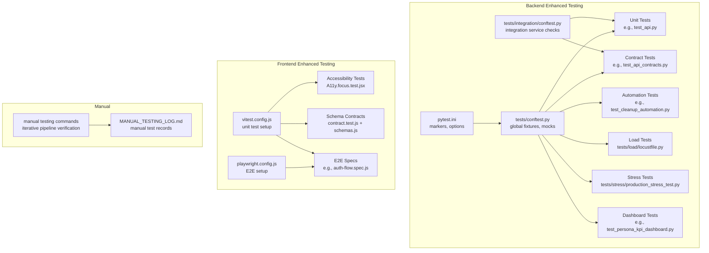

**Diagram sources**
- [pytest.ini:1-28](file://backend/pytest.ini#L1-L28)
- [conftest.py:1-112](file://backend/tests/conftest.py#L1-L112)
- [integration/conftest.py:1-41](file://backend/tests/integration/conftest.py#L1-L41)
- [test_api.py:1-200](file://backend/tests/test_api.py#L1-L200)
- [test_api_contracts.py:1-1193](file://backend/tests/test_api_contracts.py#L1-L1193)
- [test_endpoint_contracts.py:1-173](file://backend/tests/test_endpoint_contracts.py#L1-L173)
- [test_cleanup_automation.py:1-48](file://backend/tests/test_cleanup_automation.py#L1-L48)
- [test_enhancement_queue_threshold.py:1-98](file://backend/tests/test_enhancement_queue_threshold.py#L1-L98)
- [test_persona_kpi_dashboard.py:1-16](file://backend/tests/test_persona_kpi_dashboard.py#L1-L16)
- [A11y.focus.test.jsx:1-137](file://frontend/src/test/A11y.focus.test.jsx#L1-L137)
- [contract.test.js:1-45](file://frontend/src/test/contract.test.js#L1-L45)
- [schemas.js:1-267](file://frontend/src/lib/schemas.js#L1-L267)
- [locustfile.py:1-139](file://backend/tests/load/locustfile.py#L1-L139)
- [production_stress_test.py:1-172](file://backend/tests/stress/production_stress_test.py#L1-L172)
- [vitest.config.js:1-34](file://frontend/vitest.config.js#L1-L34)
- [playwright.config.js:1-48](file://frontend/playwright.config.js#L1-L48)
- [auth-flow.spec.js](file://frontend/e2e/auth-flow.spec.js)
- [login.spec.js](file://frontend/e2e/login.spec.js)

**Section sources**
- [pytest.ini:1-28](file://backend/pytest.ini#L1-L28)
- [conftest.py:1-112](file://backend/tests/conftest.py#L1-L112)
- [integration/conftest.py:1-41](file://backend/tests/integration/conftest.py#L1-L41)
- [vitest.config.js:1-34](file://frontend/vitest.config.js#L1-L34)
- [playwright.config.js:1-48](file://frontend/playwright.config.js#L1-L48)

## Core Components
- **Enhanced Test Runner Configuration**: pytest.ini defines comprehensive markers for categorizing tests including new contract, automation, and accessibility testing categories.
- **Advanced Backend Fixtures**: conftest.py provides global Redis, rate-limit, and cache mocks, plus reusable document fixtures for pipeline tests with enhanced mock management.
- **Contract Testing Infrastructure**: New comprehensive contract testing framework validates API response envelopes, error codes, and data structures across all major endpoints.
- **Accessibility Testing Framework**: Dedicated A11y tests ensure proper ARIA attributes, focus management, and screen reader compatibility for critical components.
- **Schema Validation Testing**: Frontend contract tests validate Zod schemas for API responses, ensuring type safety and preventing contract drift.
- **Automation Testing**: Cleanup automation tests validate file management, retention policies, and Celery task scheduling for operational reliability.
- **Queue Threshold Testing**: Enhancement queue threshold tests validate pipeline optimization logic for background task processing.
- **Dashboard Validation**: Persona KPI dashboard tests ensure monitoring infrastructure integrity and metric exposure.
- **Integration Service Readiness**: Integration conftest.py ensures external services (e.g., Redis, GROBID) are reachable before running integration tests.
- **Frontend Unit Testing**: vitest.config.js configures the jsdom environment and aliases for testing utilities with enhanced setup.
- **Frontend E2E Testing**: playwright.config.js configures browser targets, retries, workers, and optional local dev server startup.
- **Manual Testing**: Comprehensive command guides and logs support iterative, visual verification of pipeline phases.

**Section sources**
- [pytest.ini:16-28](file://backend/pytest.ini#L16-L28)
- [conftest.py:37-112](file://backend/tests/conftest.py#L37-L112)
- [integration/conftest.py:24-41](file://backend/tests/integration/conftest.py#L24-L41)
- [test_api_contracts.py:1-1193](file://backend/tests/test_api_contracts.py#L1-L1193)
- [A11y.focus.test.jsx:1-137](file://frontend/src/test/A11y.focus.test.jsx#L1-L137)
- [contract.test.js:1-45](file://frontend/src/test/contract.test.js#L1-L45)
- [schemas.js:1-267](file://frontend/src/lib/schemas.js#L1-L267)
- [test_cleanup_automation.py:1-48](file://backend/tests/test_cleanup_automation.py#L1-L48)
- [test_enhancement_queue_threshold.py:1-98](file://backend/tests/test_enhancement_queue_threshold.py#L1-L98)
- [test_persona_kpi_dashboard.py:1-16](file://backend/tests/test_persona_kpi_dashboard.py#L1-L16)
- [test_endpoint_contracts.py:1-173](file://backend/tests/test_endpoint_contracts.py#L1-L173)
- [test_api.py:14-200](file://backend/tests/test_api.py#L14-L200)
- [locustfile.py:1-139](file://backend/tests/load/locustfile.py#L1-L139)
- [production_stress_test.py:1-172](file://backend/tests/stress/production_stress_test.py#L1-L172)
- [vitest.config.js:1-34](file://frontend/vitest.config.js#L1-L34)
- [playwright.config.js:1-48](file://frontend/playwright.config.js#L1-L48)

## Architecture Overview
The enhanced testing architecture separates concerns across layers and environments while enabling deterministic execution via fixtures, comprehensive contract validation, and accessibility compliance testing.

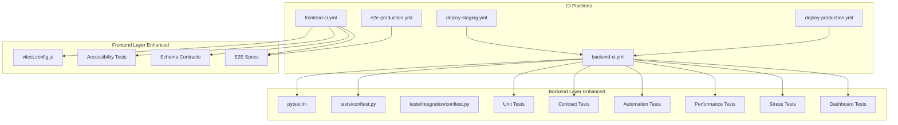

**Diagram sources**
- [backend-ci.yml](file://.github/workflows/backend-ci.yml)
- [frontend-ci.yml](file://.github/workflows/frontend-ci.yml)
- [e2e-production.yml](file://.github/workflows/e2e-production.yml)
- [deploy-staging.yml](file://.github/workflows/deploy-staging.yml)
- [deploy-production.yml](file://.github/workflows/deploy-production.yml)
- [pytest.ini:1-28](file://backend/pytest.ini#L1-L28)
- [conftest.py:1-112](file://backend/tests/conftest.py#L1-L112)
- [integration/conftest.py:1-41](file://backend/tests/integration/conftest.py#L1-L41)
- [vitest.config.js:1-34](file://frontend/vitest.config.js#L1-L34)
- [playwright.config.js:1-48](file://frontend/playwright.config.js#L1-L48)

## Detailed Component Analysis

### Backend Unit Testing
- **Purpose**: Validate individual components and API endpoints in isolation with enhanced contract validation.
- **Organization**: Tests are grouped by feature and categorized with comprehensive markers (unit, integration, contract, automation).
- **Fixtures and Mocks**: Global Redis, rate limit, and cache mocks simplify endpoint tests and avoid external dependencies.
- **Contract Validation**: Example test_api_contracts.py demonstrates comprehensive API envelope validation, error code testing, and data structure verification.
- **Example**: test_api.py demonstrates health checks, CORS behavior, rate limiting exemptions, and document summary endpoints with targeted mocks.

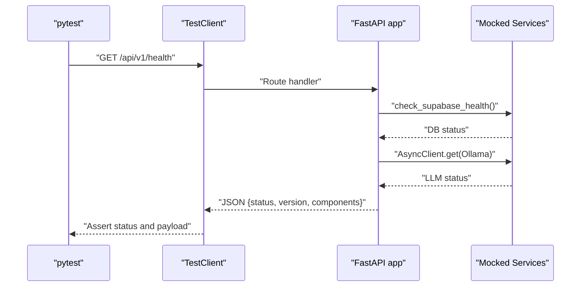

**Diagram sources**
- [test_api.py:24-101](file://backend/tests/test_api.py#L24-L101)

**Section sources**
- [pytest.ini:16-28](file://backend/pytest.ini#L16-L28)
- [conftest.py:46-58](file://backend/tests/conftest.py#L46-L58)
- [test_api.py:14-200](file://backend/tests/test_api.py#L14-L200)

### Backend Contract Testing Framework
- **Purpose**: Validate API response envelopes, error codes, and data structures across all major endpoints to prevent contract drift.
- **Comprehensive Coverage**: Tests validate success responses, error envelopes, authentication requirements, and data validation scenarios.
- **API Envelope Validation**: Ensures consistent response structure with data, error, request_id, and timestamp fields.
- **Error Code Testing**: Validates specific error codes (e.g., UNAUTHORIZED, INVALID_SESSION_REQUEST, DOCUMENT_NOT_FOUND) across different scenarios.
- **Data Structure Verification**: Confirms payload schemas match backend expectations and frontend consumption requirements.
- **Authentication and Authorization**: Tests access control, RBAC enforcement, and admin route protection.
- **File Upload Validation**: Comprehensive testing of upload limits, file types, magic bytes validation, and batch processing constraints.

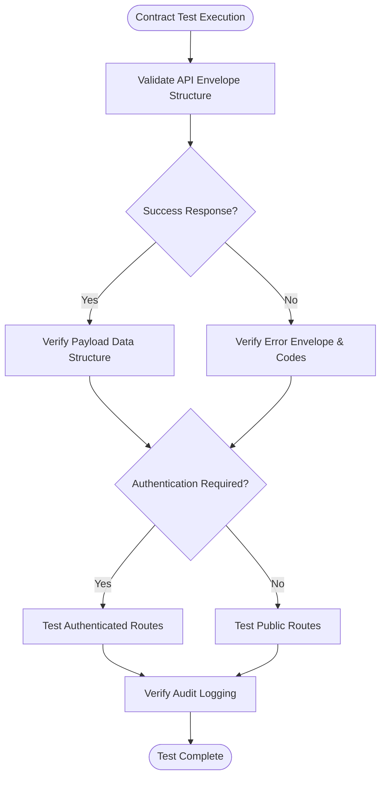

**Diagram sources**
- [test_api_contracts.py:67-1193](file://backend/tests/test_api_contracts.py#L67-L1193)
- [test_endpoint_contracts.py:62-173](file://backend/tests/test_endpoint_contracts.py#L62-L173)

**Section sources**
- [test_api_contracts.py:1-1193](file://backend/tests/test_api_contracts.py#L1-L1193)
- [test_endpoint_contracts.py:1-173](file://backend/tests/test_endpoint_contracts.py#L1-L173)

### Backend Automation Testing
- **Purpose**: Validate cleanup automation, file management, and Celery task scheduling for operational reliability.
- **Cleanup Validation**: Tests stranded file removal based on retention policies and timestamp validation.
- **Celery Task Scheduling**: Verifies daily cleanup schedule configuration and recursive cleanup functionality.
- **File Management**: Ensures proper file handling, directory structure maintenance, and cleanup efficiency.

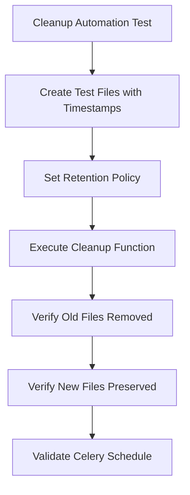

**Diagram sources**
- [test_cleanup_automation.py:10-48](file://backend/tests/test_cleanup_automation.py#L10-L48)

**Section sources**
- [test_cleanup_automation.py:1-48](file://backend/tests/test_cleanup_automation.py#L1-L48)

### Backend Queue Threshold Testing
- **Purpose**: Validate pipeline optimization logic that determines whether to use Celery queues or background tasks based on estimated duration.
- **Threshold Logic**: Tests minimum queue thresholds for document processing and synthesis pipelines.
- **Task Dispatch Validation**: Ensures long-running tasks use Celery queues while short tasks execute in background.
- **Performance Optimization**: Validates intelligent task routing for optimal system performance.

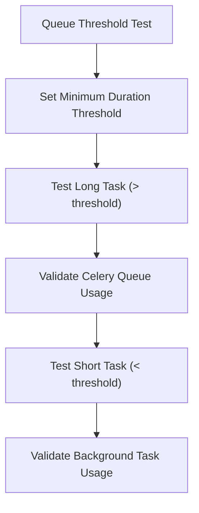

**Diagram sources**
- [test_enhancement_queue_threshold.py:16-98](file://backend/tests/test_enhancement_queue_threshold.py#L16-L98)

**Section sources**
- [test_enhancement_queue_threshold.py:1-98](file://backend/tests/test_enhancement_queue_threshold.py#L1-L98)

### Backend Dashboard Validation
- **Purpose**: Ensure monitoring infrastructure integrity and proper metric exposure through dashboard validation.
- **Dashboard Existence**: Validates that persona KPI dashboard files exist and are properly formatted.
- **Metric Validation**: Confirms essential metrics (persona_events_total, persona_operation_duration_seconds) are exposed.
- **Dashboard Integrity**: Ensures dashboard contains required visualization components and labels.

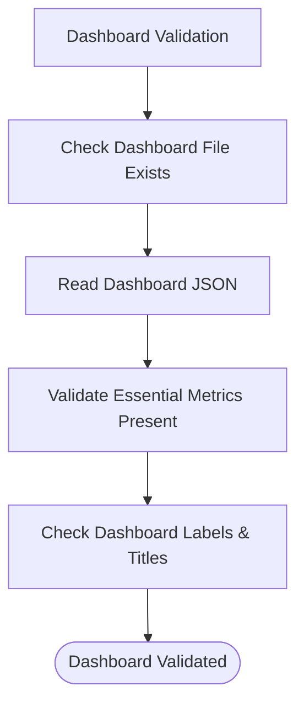

**Diagram sources**
- [test_persona_kpi_dashboard.py:6-16](file://backend/tests/test_persona_kpi_dashboard.py#L6-L16)

**Section sources**
- [test_persona_kpi_dashboard.py:1-16](file://backend/tests/test_persona_kpi_dashboard.py#L1-L16)

### Frontend Unit Testing with Vitest
- **Purpose**: Validate React components, hooks, services, and utilities in a jsdom environment with enhanced accessibility and schema validation.
- **Configuration**: vitest.config.js sets up aliases, jsdom environment, and include/exclude patterns.
- **Setup**: src/test/setup.js initializes testing utilities and environment.
- **Accessibility Testing**: Dedicated A11y tests ensure proper ARIA attributes, focus management, and screen reader compatibility.
- **Schema Validation**: Contract tests validate Zod schemas for API responses, ensuring type safety and preventing contract drift.

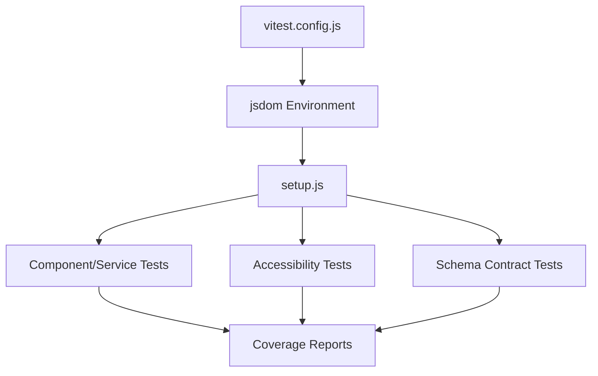

**Diagram sources**
- [vitest.config.js:1-34](file://frontend/vitest.config.js#L1-L34)
- [setup.js](file://frontend/src/test/setup.js)
- [A11y.focus.test.jsx:1-137](file://frontend/src/test/A11y.focus.test.jsx#L1-L137)
- [contract.test.js:1-45](file://frontend/src/test/contract.test.js#L1-L45)

**Section sources**
- [vitest.config.js:1-34](file://frontend/vitest.config.js#L1-L34)
- [setup.js](file://frontend/src/test/setup.js)
- [A11y.focus.test.jsx:1-137](file://frontend/src/test/A11y.focus.test.jsx#L1-L137)
- [contract.test.js:1-45](file://frontend/src/test/contract.test.js#L1-L45)
- [schemas.js:1-267](file://frontend/src/lib/schemas.js#L1-L267)

### Frontend Accessibility Testing
- **Purpose**: Ensure web accessibility compliance through comprehensive ARIA attribute validation and focus management testing.
- **Component Coverage**: Tests critical components including NotificationBell, Stepper, ExportDialog, and UpgradeModal.
- **ARIA Attributes**: Validates proper roles, labels, expanded states, and modal attributes for screen readers.
- **Focus Management**: Ensures proper focus handling, keyboard navigation, and interactive element accessibility.
- **Screen Reader Compatibility**: Tests descriptive labels and announcements for assistive technologies.

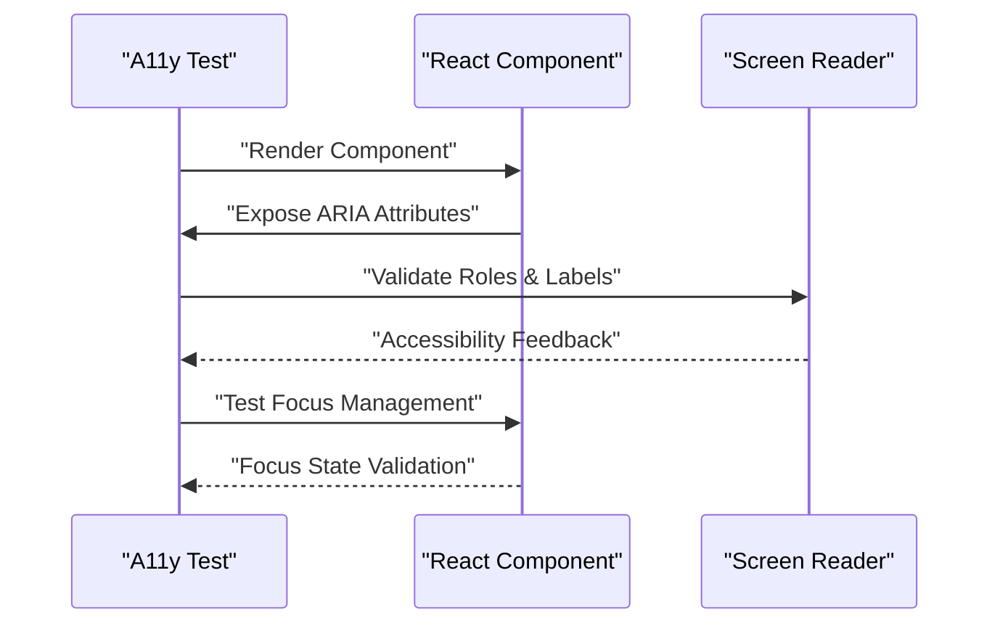

**Diagram sources**
- [A11y.focus.test.jsx:29-137](file://frontend/src/test/A11y.focus.test.jsx#L29-L137)

**Section sources**
- [A11y.focus.test.jsx:1-137](file://frontend/src/test/A11y.focus.test.jsx#L1-L137)

### Frontend Schema Contract Testing
- **Purpose**: Validate frontend Zod schemas against backend API responses to prevent contract drift and ensure type safety.
- **Schema Coverage**: Tests UserProfileSchema, JobStatusResponseSchema, and other critical frontend schemas.
- **Validation Logic**: Ensures proper field validation, min/max length constraints, and optional field handling.
- **Error Handling**: Validates that schema parsing correctly handles invalid data and provides meaningful error messages.
- **Unknown Field Support**: Tests passthrough functionality for additional server fields without breaking validation.

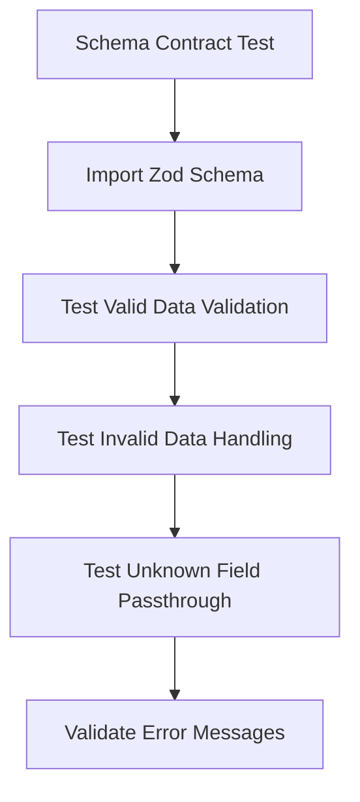

**Diagram sources**
- [contract.test.js:7-45](file://frontend/src/test/contract.test.js#L7-L45)
- [schemas.js:242-267](file://frontend/src/lib/schemas.js#L242-L267)

**Section sources**
- [contract.test.js:1-45](file://frontend/src/test/contract.test.js#L1-L45)
- [schemas.js:1-267](file://frontend/src/lib/schemas.js#L1-L267)

### Frontend End-to-End Testing with Playwright
- **Purpose**: Automate real-browser user journeys across the application with enhanced testing coverage.
- **Configuration**: playwright.config.js defines projects, retries, workers, tracing, and optional dev server startup.
- **Specs**: E2E specs cover authentication, upload flows, preview, and UI interactions with comprehensive test scenarios.

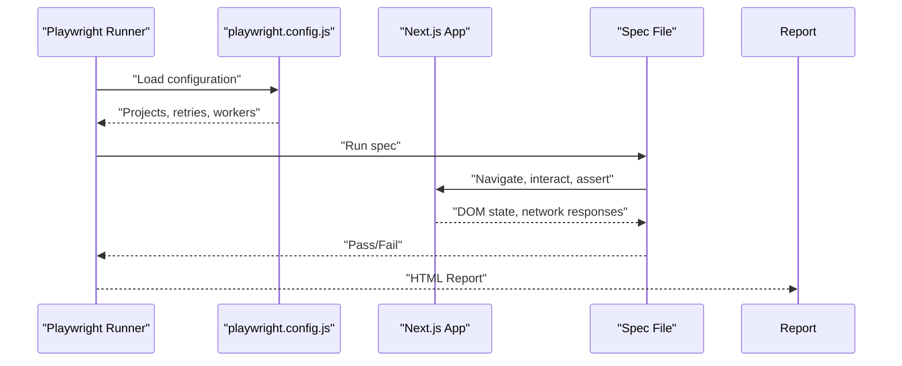

**Diagram sources**
- [playwright.config.js:9-47](file://frontend/playwright.config.js#L9-L47)
- [auth-flow.spec.js](file://frontend/e2e/auth-flow.spec.js)
- [formatter-upload.spec.js](file://frontend/e2e/formatter-upload.spec.js)
- [login.spec.js](file://frontend/e2e/login.spec.js)

**Section sources**
- [playwright.config.js:1-48](file://frontend/playwright.config.js#L1-L48)
- [auth-flow.spec.js](file://frontend/e2e/auth-flow.spec.js)
- [formatter-upload.spec.js](file://frontend/e2e/formatter-upload.spec.js)
- [login.spec.js](file://frontend/e2e/login.spec.js)

### Manual Testing Workflows
- **Purpose**: Iterative, visual verification of pipeline phases with annotated outputs and comprehensive validation.
- **Structure**: Commands are organized by phase (identification, assembly, formatting) and include both JSON and DOCX outputs.
- **Execution**: Scripts produce intermediate and final outputs for visual inspection and validation.

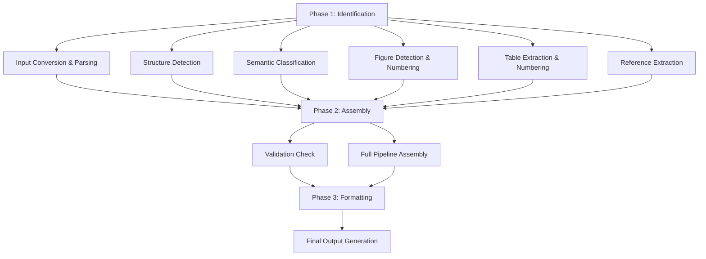

**Diagram sources**
- [test_commands.md:5-52](file://backend/manual_tests/test_commands.md#L5-L52)

**Section sources**
- [test_commands.md:1-347](file://backend/manual_tests/test_commands.md#L1-L347)

## Contract Testing Framework
The contract testing framework provides comprehensive validation of API behavior and data structures across all major endpoints. This framework ensures that backend API responses maintain consistent envelopes, proper error handling, and validated data structures that frontend components can consume reliably.

### Key Contract Testing Features
- **API Envelope Validation**: Ensures consistent response structure with data, error, request_id, and timestamp fields across all endpoints.
- **Error Code Standardization**: Validates specific error codes (UNAUTHORIZED, INVALID_SESSION_REQUEST, DOCUMENT_NOT_FOUND, etc.) with appropriate HTTP status codes.
- **Authentication Testing**: Comprehensive testing of protected routes, RBAC enforcement, and admin-only endpoints.
- **Data Validation Coverage**: Tests file upload constraints, batch processing limits, and payload validation scenarios.
- **Audit Logging Integration**: Validates that all contract tests properly log audit actions for compliance and monitoring.

### Contract Test Categories
- **Health Checks**: Validates /api/v1/health endpoints with proper status reporting and request ID propagation.
- **Authentication**: Tests protected routes with proper authorization and error handling for unauthorized access.
- **Document Operations**: Comprehensive testing of upload, status, preview, download, and deletion operations with file validation.
- **Generator Sessions**: Validates agent and multi-document generation workflows with proper session management.
- **Synthesis Sessions**: Tests multi-document synthesis with file count constraints and processing validation.
- **Template Management**: Ensures template listing and access rules are properly enforced.
- **Billing Webhooks**: Validates webhook processing with signature verification and proper error handling.

**Section sources**
- [test_api_contracts.py:1-1193](file://backend/tests/test_api_contracts.py#L1-L1193)
- [test_endpoint_contracts.py:1-173](file://backend/tests/test_endpoint_contracts.py#L1-L173)

## Accessibility Testing
The accessibility testing framework ensures that the frontend application meets WCAG standards and provides proper accessibility for users with disabilities. This testing approach focuses on ARIA attributes, keyboard navigation, screen reader compatibility, and focus management.

### Accessibility Testing Components
- **ARIA Attribute Validation**: Tests proper roles, labels, expanded states, and modal attributes for screen readers.
- **Focus Management**: Ensures proper focus handling, keyboard navigation, and interactive element accessibility.
- **Component Coverage**: Validates critical components including NotificationBell, Stepper, ExportDialog, and UpgradeModal.
- **Screen Reader Compatibility**: Tests descriptive labels and announcements for assistive technologies.
- **Keyboard Navigation**: Validates tab order, focus traps, and keyboard-only operation.

### Accessibility Test Categories
- **NotificationBell**: Tests button roles, aria-haspopup, aria-expanded states, and menu accessibility.
- **Stepper Component**: Validates list roles, aria-current attributes, and step labeling.
- **ExportDialog**: Ensures dialog roles, aria-modal attributes, and initial focus management.
- **UpgradeModal**: Tests modal accessibility and focus trapping mechanisms.

**Section sources**
- [A11y.focus.test.jsx:1-137](file://frontend/src/test/A11y.focus.test.jsx#L1-L137)

## Enhanced Testing Infrastructure
The enhanced testing infrastructure provides comprehensive coverage across multiple dimensions of application quality assurance, ensuring reliability, performance, and user experience across all components.

### Automation Testing Capabilities
- **File Management**: Validates cleanup automation with retention policies and timestamp-based file removal.
- **Task Scheduling**: Tests Celery task scheduling and recursive cleanup functionality.
- **Queue Management**: Implements intelligent task routing based on estimated processing duration.

### Monitoring and Dashboard Validation
- **Dashboard Integrity**: Ensures monitoring dashboards exist and contain required metrics.
- **Metric Exposure**: Validates essential metrics like persona_events_total and persona_operation_duration_seconds.
- **Infrastructure Reliability**: Tests dashboard file existence and proper JSON formatting.

### Frontend Schema Validation
- **Type Safety**: Validates Zod schemas for API responses to prevent runtime errors.
- **Contract Drift Prevention**: Ensures frontend and backend schemas remain synchronized.
- **Error Handling**: Tests schema validation with invalid data and provides meaningful error messages.

**Section sources**
- [test_cleanup_automation.py:1-48](file://backend/tests/test_cleanup_automation.py#L1-L48)
- [test_enhancement_queue_threshold.py:1-98](file://backend/tests/test_enhancement_queue_threshold.py#L1-L98)
- [test_persona_kpi_dashboard.py:1-16](file://backend/tests/test_persona_kpi_dashboard.py#L1-L16)
- [contract.test.js:1-45](file://frontend/src/test/contract.test.js#L1-L45)
- [schemas.js:1-267](file://frontend/src/lib/schemas.js#L1-L267)

## Dependency Analysis
- **Backend Test Dependencies**:
  - pytest.ini markers drive selective execution and categorization including new contract, automation, and accessibility testing.
  - conftest.py injects global mocks and document fixtures with enhanced mock management.
  - integration/conftest.py gates tests based on external service availability.
  - test_api_contracts.py provides comprehensive API envelope validation and error code testing.
  - test_cleanup_automation.py validates file management and Celery task scheduling.
  - test_enhancement_queue_threshold.py tests pipeline optimization logic.
  - test_persona_kpi_dashboard.py ensures monitoring infrastructure integrity.
  - test_endpoint_contracts.py validates core endpoint behaviors and response structures.
- **Frontend Test Dependencies**:
  - vitest.config.js configures environment and aliases with enhanced setup.
  - A11y.focus.test.jsx provides accessibility testing framework.
  - contract.test.js validates Zod schemas for API responses.
  - schemas.js defines comprehensive frontend validation schemas.
  - playwright.config.js configures browser projects and dev server behavior.
- **CI/CD Dependencies**:
  - backend-ci.yml, frontend-ci.yml orchestrate enhanced unit and integration runs.
  - e2e-production.yml executes E2E tests against deployed environments.
  - deploy-staging.yml and deploy-production.yml prepare environments for testing.

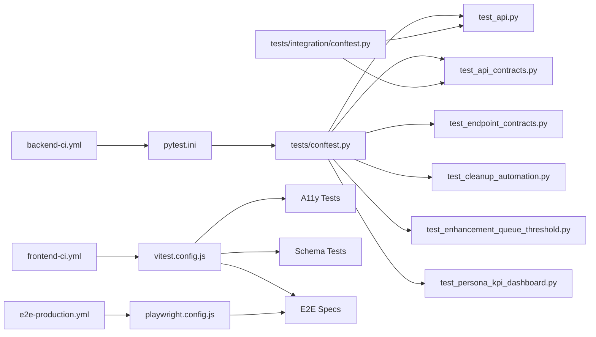

**Diagram sources**
- [pytest.ini:1-28](file://backend/pytest.ini#L1-L28)
- [conftest.py:1-112](file://backend/tests/conftest.py#L1-L112)
- [integration/conftest.py:1-41](file://backend/tests/integration/conftest.py#L1-L41)
- [test_api.py:1-200](file://backend/tests/test_api.py#L1-L200)
- [test_api_contracts.py:1-1193](file://backend/tests/test_api_contracts.py#L1-L1193)
- [test_endpoint_contracts.py:1-173](file://backend/tests/test_endpoint_contracts.py#L1-L173)
- [test_cleanup_automation.py:1-48](file://backend/tests/test_cleanup_automation.py#L1-L48)
- [test_enhancement_queue_threshold.py:1-98](file://backend/tests/test_enhancement_queue_threshold.py#L1-L98)
- [test_persona_kpi_dashboard.py:1-16](file://backend/tests/test_persona_kpi_dashboard.py#L1-L16)
- [vitest.config.js:1-34](file://frontend/vitest.config.js#L1-L34)
- [A11y.focus.test.jsx:1-137](file://frontend/src/test/A11y.focus.test.jsx#L1-L137)
- [contract.test.js:1-45](file://frontend/src/test/contract.test.js#L1-L45)
- [schemas.js:1-267](file://frontend/src/lib/schemas.js#L1-L267)
- [playwright.config.js:1-48](file://frontend/playwright.config.js#L1-L48)
- [backend-ci.yml](file://.github/workflows/backend-ci.yml)
- [frontend-ci.yml](file://.github/workflows/frontend-ci.yml)
- [e2e-production.yml](file://.github/workflows/e2e-production.yml)

**Section sources**
- [pytest.ini:1-28](file://backend/pytest.ini#L1-L28)
- [conftest.py:1-112](file://backend/tests/conftest.py#L1-L112)
- [integration/conftest.py:1-41](file://backend/tests/integration/conftest.py#L1-L41)
- [test_api.py:1-200](file://backend/tests/test_api.py#L1-L200)
- [test_api_contracts.py:1-1193](file://backend/tests/test_api_contracts.py#L1-L1193)
- [test_endpoint_contracts.py:1-173](file://backend/tests/test_endpoint_contracts.py#L1-L173)
- [test_cleanup_automation.py:1-48](file://backend/tests/test_cleanup_automation.py#L1-L48)
- [test_enhancement_queue_threshold.py:1-98](file://backend/tests/test_enhancement_queue_threshold.py#L1-L98)
- [test_persona_kpi_dashboard.py:1-16](file://backend/tests/test_persona_kpi_dashboard.py#L1-L16)
- [vitest.config.js:1-34](file://frontend/vitest.config.js#L1-L34)
- [A11y.focus.test.jsx:1-137](file://frontend/src/test/A11y.focus.test.jsx#L1-L137)
- [contract.test.js:1-45](file://frontend/src/test/contract.test.js#L1-L45)
- [schemas.js:1-267](file://frontend/src/lib/schemas.js#L1-L267)
- [playwright.config.js:1-48](file://frontend/playwright.config.js#L1-L48)
- [backend-ci.yml](file://.github/workflows/backend-ci.yml)
- [frontend-ci.yml](file://.github/workflows/frontend-ci.yml)
- [e2e-production.yml](file://.github/workflows/e2e-production.yml)

## Performance Considerations
- **Contract Test Optimization**: Use targeted patches and mock setups to minimize test execution time while maintaining comprehensive coverage.
- **Accessibility Test Efficiency**: Group related accessibility tests and use shared setup functions to reduce redundant component rendering.
- **Schema Validation Performance**: Cache Zod schema instances and reuse validation functions across multiple test cases.
- **Automation Test Isolation**: Ensure cleanup automation tests use temporary directories and proper cleanup to avoid test interference.
- **Queue Threshold Testing**: Use controlled timing scenarios and mock task execution to validate threshold logic without actual processing delays.
- **Dashboard Validation**: Cache dashboard file contents and use efficient JSON parsing to minimize I/O overhead in monitoring tests.

## Troubleshooting Guide
- **Contract Test Failures**:
  - Verify API envelope structure matches expected format with data, error, request_id, and timestamp fields.
  - Check error codes align with HTTP status codes and validate specific error messages for different failure scenarios.
  - Ensure authentication requirements are properly tested and RBAC enforcement is working correctly.
- **Accessibility Test Issues**:
  - Confirm ARIA attributes match expected values and component renders properly with proper roles and labels.
  - Verify focus management works correctly and keyboard navigation follows expected patterns.
  - Test screen reader compatibility by checking descriptive labels and announcements.
- **Schema Validation Errors**:
  - Validate Zod schemas handle edge cases and provide meaningful error messages for invalid data.
  - Check passthrough functionality allows additional server fields without breaking validation.
  - Ensure type constraints (min/max lengths, enum values) are properly enforced.
- **Automation Test Failures**:
  - Verify file timestamps are set correctly and retention policies are applied as expected.
  - Check Celery task scheduling configuration and recursive cleanup functionality.
  - Validate cleanup automation removes old files while preserving new ones.
- **Integration Tests Skipped Due to Service Unavailability**:
  - Ensure Redis and GROBID are reachable; see integration conftest.py service checks.
- **Frontend E2E Flakiness**:
  - Adjust retries and workers in playwright.config.js; enable trace collection on first retry.
- **Backend Unit Test Failures**:
  - Confirm mocks are correctly applied; verify dependency overrides for authenticated routes.
- **Manual Testing Discrepancies**:
  - Compare outputs and visual annotations; consult manual testing logs for regressions.

**Section sources**
- [integration/conftest.py:24-32](file://backend/tests/integration/conftest.py#L24-L32)
- [playwright.config.js:14-18](file://frontend/playwright.config.js#L14-L18)
- [test_api.py:154-200](file://backend/tests/test_api.py#L154-L200)
- [A11y.focus.test.jsx:1-137](file://frontend/src/test/A11y.focus.test.jsx#L1-L137)
- [contract.test.js:1-45](file://frontend/src/test/contract.test.js#L1-L45)
- [test_cleanup_automation.py:1-48](file://backend/tests/test_cleanup_automation.py#L1-L48)
- [test_enhancement_queue_threshold.py:1-98](file://backend/tests/test_enhancement_queue_threshold.py#L1-L98)
- [test_persona_kpi_dashboard.py:1-16](file://backend/tests/test_persona_kpi_dashboard.py#L1-L16)

## Conclusion
The enhanced testing strategy provides comprehensive coverage across multiple dimensions of quality assurance, including contract validation, accessibility compliance, automation testing, and monitoring infrastructure validation. The expanded testing infrastructure ensures reliable, accessible, and maintainable software delivery across all environments. The combination of unit, integration, contract, accessibility, and automation tests creates a robust testing foundation that accelerates development confidence while maintaining high standards for user experience and system reliability.

## Appendices

### Continuous Integration Testing Pipeline
- **Backend CI**: Runs unit, integration, contract, automation, and performance tests with comprehensive marker-based execution and skip logic based on service availability.
- **Frontend CI**: Executes unit tests, accessibility tests, schema contract validation, and E2E suites with configured retries and workers.
- **E2E Production**: Validates end-to-end flows against production-like environments with enhanced test coverage.
- **Deployments**: Staging and production workflows prepare environments for comprehensive testing across all test categories.

**Section sources**
- [backend-ci.yml](file://.github/workflows/backend-ci.yml)
- [frontend-ci.yml](file://.github/workflows/frontend-ci.yml)
- [e2e-production.yml](file://.github/workflows/e2e-production.yml)
- [deploy-staging.yml](file://.github/workflows/deploy-staging.yml)
- [deploy-production.yml](file://.github/workflows/deploy-production.yml)

### Writing New Tests
- **Backend**:
  - Add unit tests under backend/tests; use pytest.ini markers to categorize including new contract, automation, and accessibility categories.
  - Leverage conftest.py fixtures and mocks; isolate external dependencies with comprehensive patching.
  - Implement contract tests using @pytest.mark.contract decorator for API envelope validation.
  - Add accessibility tests following A11y.test.jsx patterns for component validation.
  - Include automation tests for cleanup and task scheduling validation.
- **Frontend**:
  - Add unit tests under frontend/src/**/*.{test,spec}.{js,jsx,ts,tsx}.
  - Configure vitest.config.js and setup.js as needed.
  - Add accessibility tests under frontend/src/test/ with proper ARIA attribute validation.
  - Include schema contract tests using Zod validation patterns.
  - Add E2E specs under frontend/e2e; configure playwright.config.js for environment.

**Section sources**
- [pytest.ini:16-28](file://backend/pytest.ini#L16-L28)
- [conftest.py:1-112](file://backend/tests/conftest.py#L1-L112)
- [A11y.focus.test.jsx:1-137](file://frontend/src/test/A11y.focus.test.jsx#L1-L137)
- [contract.test.js:1-45](file://frontend/src/test/contract.test.js#L1-L45)
- [schemas.js:1-267](file://frontend/src/lib/schemas.js#L1-L267)
- [vitest.config.js:16-26](file://frontend/vitest.config.js#L16-L26)
- [playwright.config.js:9-28](file://frontend/playwright.config.js#L9-L28)

### Test Data Management
- **Backend**:
  - Use fixtures for reusable domain objects (e.g., PipelineDocument).
  - Store golden files and sample inputs under backend/tests/golden_files and backend/manual_tests/sample_inputs.
  - Implement contract test fixtures for API response validation and error scenario testing.
  - Use temporary directories for automation tests to avoid persistent file system changes.
- **Frontend**:
  - Use test assets under frontend/public or component-specific test folders.
  - Maintain E2E test files under frontend/e2e/test-files.
  - Implement schema test data with proper validation scenarios and edge cases.
  - Use mock data for accessibility testing to ensure consistent component behavior.

**Section sources**
- [conftest.py:70-112](file://backend/tests/conftest.py#L70-L112)
- [test_api_contracts.py:1-1193](file://backend/tests/test_api_contracts.py#L1-L1193)
- [test_cleanup_automation.py:1-48](file://backend/tests/test_cleanup_automation.py#L1-L48)
- [A11y.focus.test.jsx:1-137](file://frontend/src/test/A11y.focus.test.jsx#L1-L137)
- [contract.test.js:1-45](file://frontend/src/test/contract.test.js#L1-L45)

### Debugging Test Failures
- **Backend**:
  - Increase verbosity with pytest.ini; inspect mocked dependencies and overrides.
  - Use targeted patches around failing endpoints; implement detailed logging for contract test failures.
  - Validate API envelope structure and error code consistency in failing contract tests.
  - Check accessibility test component rendering and ARIA attribute validation.
  - Verify schema validation with detailed error message inspection.
- **Frontend**:
  - Enable traces in playwright.config.js; adjust workers and retries.
  - Inspect DOM snapshots and network logs from HTML reports.
  - Validate accessibility test component props and state management.
  - Check schema validation errors and Zod parsing failures.
  - Test focus management and keyboard navigation in failing accessibility tests.

**Section sources**
- [pytest.ini:8-10](file://backend/pytest.ini#L8-L10)
- [playwright.config.js:16-28](file://frontend/playwright.config.js#L16-L28)
- [A11y.focus.test.jsx:1-137](file://frontend/src/test/A11y.focus.test.jsx#L1-L137)
- [contract.test.js:1-45](file://frontend/src/test/contract.test.js#L1-L45)

### Testing Across Environments and Deployments
- **Local Development**:
  - Use pytest markers to run subsets of tests including new contract, automation, and accessibility categories.
  - Rely on mocks for external services with comprehensive patching strategies.
  - Validate contract tests with minimal external dependencies using targeted mocking.
- **CI**:
  - Configure workers and retries per environment; enforce skip-on-unavailable services.
  - Run comprehensive test suites including new contract and accessibility testing categories.
  - Monitor test execution time and optimize expensive contract and automation tests.
- **Staging/Production**:
  - Run E2E tests against deployed instances with enhanced test coverage.
  - Collect traces and reports for all test categories including contract validation.
  - Validate dashboard infrastructure and monitoring metrics in production-like environments.

**Section sources**
- [backend-ci.yml](file://.github/workflows/backend-ci.yml)
- [frontend-ci.yml](file://.github/workflows/frontend-ci.yml)
- [e2e-production.yml](file://.github/workflows/e2e-production.yml)
- [deploy-staging.yml](file://.github/workflows/deploy-staging.yml)
- [deploy-production.yml](file://.github/workflows/deploy-production.yml)