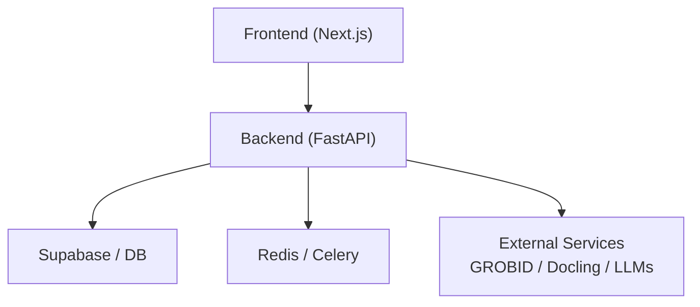
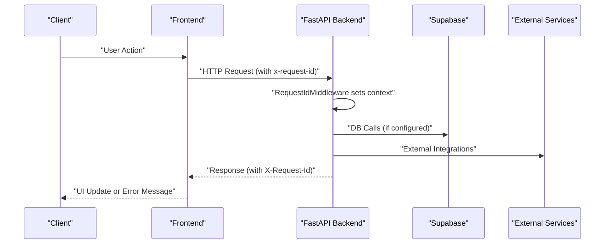
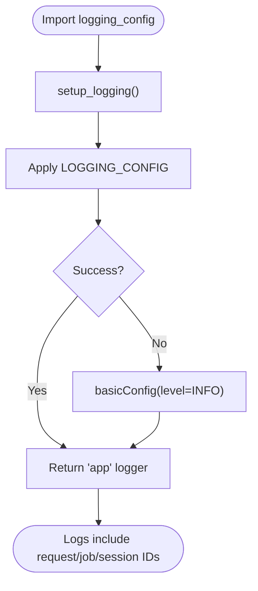
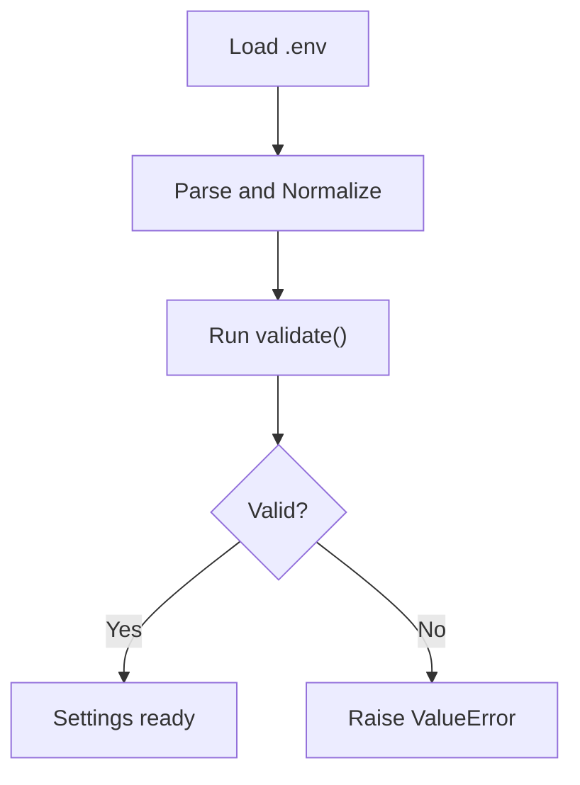
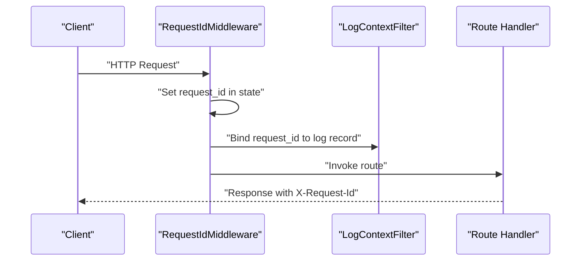
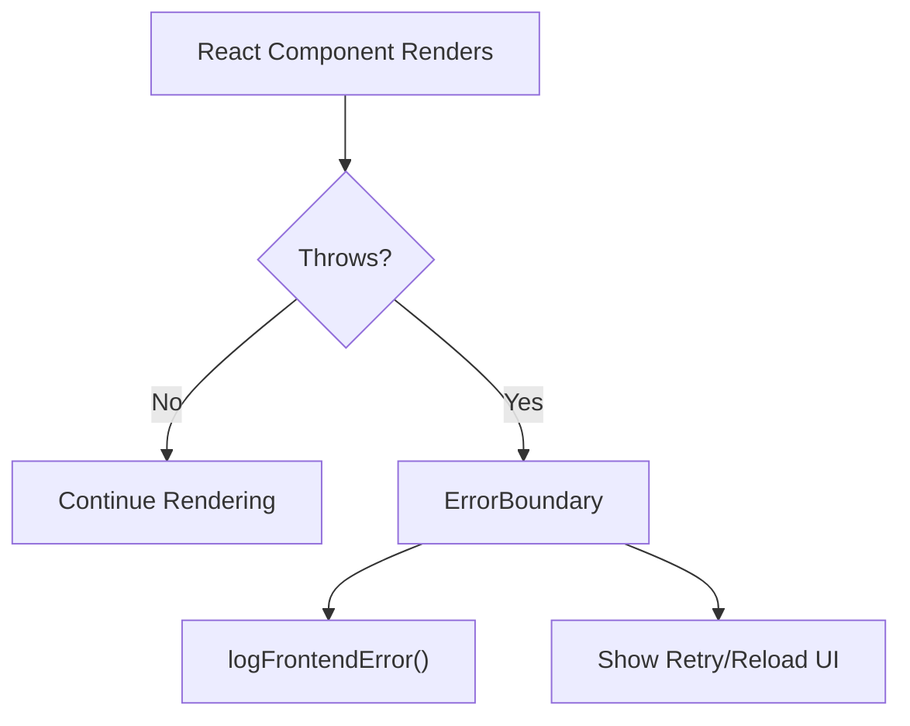
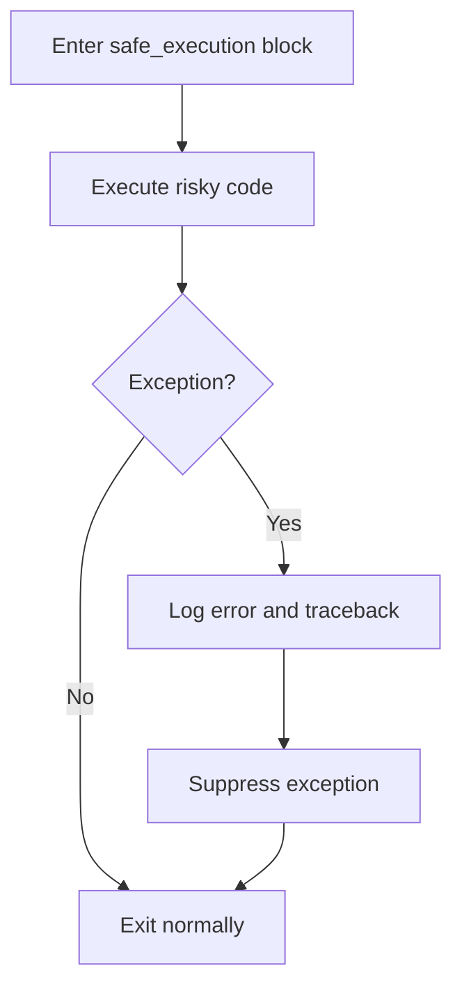
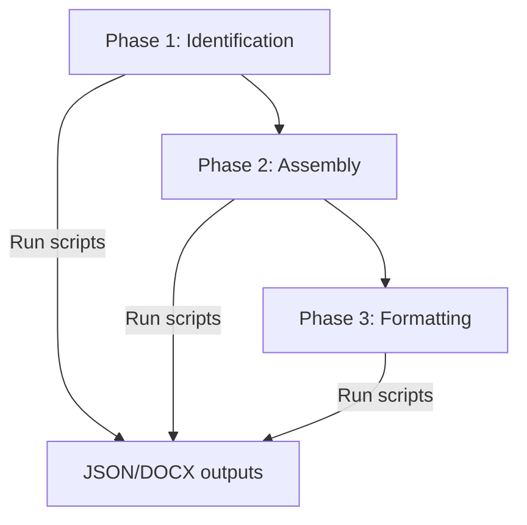
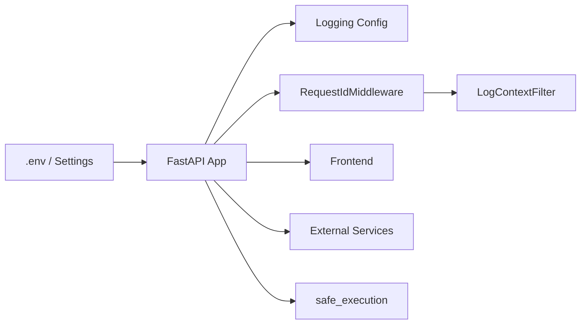

# Troubleshooting & FAQ

<cite>
**Referenced Files in This Document**
- [backend/app/main.py](file://backend/app/main.py)
- [backend/app/config/logging_config.py](file://backend/app/config/logging_config.py)
- [backend/app/config/settings.py](file://backend/app/config/settings.py)
- [backend/app/utils/logging_context.py](file://backend/app/utils/logging_context.py)
- [backend/app/middleware/request_id.py](file://backend/app/middleware/request_id.py)
- [backend/README.md](file://backend/README.md)
- [backend/manual_tests/README_1.md](file://backend/manual_tests/README_1.md)
- [backend/manual_tests/TESTING_COMMANDS.md](file://backend/manual_tests/TESTING_COMMANDS.md)
- [backend/manual_tests/test_commands.md](file://backend/manual_tests/test_commands.md)
- [scripts/generate_env_template.py](file://scripts/generate_env_template.py)
- [frontend/src/components/ErrorBoundary.jsx](file://frontend/src/components/ErrorBoundary.jsx)
- [frontend/src/services/api.core.js](file://frontend/src/services/api.core.js)
- [backend/app/pipeline/safety/safe_execution.py](file://backend/app/pipeline/safety/safe_execution.py)
</cite>

## Table of Contents
1. [Introduction](#introduction)
2. [Project Structure](#project-structure)
3. [Core Components](#core-components)
4. [Architecture Overview](#architecture-overview)
5. [Detailed Component Analysis](#detailed-component-analysis)
6. [Dependency Analysis](#dependency-analysis)
7. [Performance Considerations](#performance-considerations)
8. [Troubleshooting Guide](#troubleshooting-guide)
9. [Conclusion](#conclusion)
10. [Appendices](#appendices)

## Introduction
This document provides comprehensive troubleshooting guidance for the Automated Academic Manuscript Formatter. It covers setup, development, and production issues, with practical diagnostics, logging strategies, configuration checks, and escalation procedures. It also consolidates frequently asked questions about features, limitations, and best practices.

## Project Structure
The system is a FastAPI backend with a modular pipeline and a Next.js frontend. Troubleshooting spans:
- Backend configuration and logging
- Environment variables and settings validation
- Request tracing and context propagation
- Frontend error boundaries and user-facing error messages
- Manual testing scripts to isolate pipeline stages

[No sources needed since this diagram shows conceptual workflow, not actual code structure]

## Core Components
- Logging and structured logs with request/job/session context
- Environment-driven settings with validation and normalization
- Request ID propagation and middleware integration
- Frontend error boundary and friendly error messaging
- Safety net for startup and critical operations
- Manual testing scripts to isolate pipeline stages

**Section sources**
- [backend/app/config/logging_config.py:1-185](file://backend/app/config/logging_config.py#L1-L185)
- [backend/app/config/settings.py:1-422](file://backend/app/config/settings.py#L1-L422)
- [backend/app/utils/logging_context.py:1-115](file://backend/app/utils/logging_context.py#L1-L115)
- [backend/app/middleware/request_id.py:1-74](file://backend/app/middleware/request_id.py#L1-L74)
- [frontend/src/components/ErrorBoundary.jsx:1-90](file://frontend/src/components/ErrorBoundary.jsx#L1-L90)
- [backend/app/pipeline/safety/safe_execution.py:1-42](file://backend/app/pipeline/safety/safe_execution.py#L1-L42)

## Architecture Overview
End-to-end troubleshooting relies on:
- Structured logs enriched with request/job/session IDs
- Health and readiness probes for runtime diagnostics
- Manual testing scripts to verify each pipeline stage
- Frontend error boundary to capture UI-level failures
- Environment template generator to detect missing variables

**Diagram sources**
- [backend/app/middleware/request_id.py:21-74](file://backend/app/middleware/request_id.py#L21-L74)
- [backend/app/main.py:318-358](file://backend/app/main.py#L318-L358)

**Section sources**
- [backend/app/main.py:360-383](file://backend/app/main.py#L360-L383)
- [backend/app/config/logging_config.py:39-157](file://backend/app/config/logging_config.py#L39-L157)

## Detailed Component Analysis

### Logging and Diagnostics
- Structured logging with rotating file handlers and console output
- Context injection for request_id, job_id, session_id
- Configurable verbosity and suppression of noisy third-party loggers
- Fallback to basic logging if structured config fails

**Diagram sources**
- [backend/app/config/logging_config.py:163-185](file://backend/app/config/logging_config.py#L163-L185)

**Section sources**
- [backend/app/config/logging_config.py:1-185](file://backend/app/config/logging_config.py#L1-L185)
- [backend/app/utils/logging_context.py:83-115](file://backend/app/utils/logging_context.py#L83-L115)

### Environment Variables and Settings
- Centralized settings loaded from .env with validation and normalization
- Boolean parsing helpers and confidence clamping
- CORS origin normalization and defaults
- Validation enforced at startup

**Diagram sources**
- [backend/app/config/settings.py:248-257](file://backend/app/config/settings.py#L248-L257)

**Section sources**
- [backend/app/config/settings.py:38-51](file://backend/app/config/settings.py#L38-L51)
- [backend/app/config/settings.py:227-247](file://backend/app/config/settings.py#L227-L247)
- [backend/app/config/settings.py:415-418](file://backend/app/config/settings.py#L415-L418)

### Request Tracing and Context Propagation
- RequestIdMiddleware injects and propagates x-request-id
- Async context binding for job/session IDs
- Filters enrich log records with contextual IDs

**Diagram sources**
- [backend/app/middleware/request_id.py:21-74](file://backend/app/middleware/request_id.py#L21-L74)
- [backend/app/utils/logging_context.py:83-115](file://backend/app/utils/logging_context.py#L83-L115)

**Section sources**
- [backend/app/middleware/request_id.py:1-74](file://backend/app/middleware/request_id.py#L1-L74)
- [backend/app/utils/logging_context.py:17-81](file://backend/app/utils/logging_context.py#L17-L81)

### Frontend Error Boundary and Friendly Messages
- ErrorBoundary captures rendering errors and logs them
- Friendly error messages mapped from HTTP status and endpoint
- Developer-friendly debug details in non-production builds

**Diagram sources**
- [frontend/src/components/ErrorBoundary.jsx:13-30](file://frontend/src/components/ErrorBoundary.jsx#L13-L30)
- [frontend/src/services/api.core.js:845-1062](file://frontend/src/services/api.core.js#L845-L1062)

**Section sources**
- [frontend/src/components/ErrorBoundary.jsx:1-90](file://frontend/src/components/ErrorBoundary.jsx#L1-L90)
- [frontend/src/services/api.core.js:845-1062](file://frontend/src/services/api.core.js#L845-L1062)

### Safety Net for Startup and Critical Operations
- safe_execution context manager suppresses exceptions and logs stack traces
- safe_function decorator provides a convenient wrapper with fallback values

**Diagram sources**
- [backend/app/pipeline/safety/safe_execution.py:9-31](file://backend/app/pipeline/safety/safe_execution.py#L9-L31)

**Section sources**
- [backend/app/pipeline/safety/safe_execution.py:1-42](file://backend/app/pipeline/safety/safe_execution.py#L1-L42)

### Manual Testing Scripts for Pipeline Isolation
- Phase 1: Identification verification (conversion, structure, classification, figures, tables, references)
- Phase 2: Assembly and deduplication (validation, full pipeline)
- Phase 3: Formatting (final DOCX)
- Visual inspection and annotated outputs

**Diagram sources**
- [backend/manual_tests/README_1.md:5-28](file://backend/manual_tests/README_1.md#L5-L28)
- [backend/manual_tests/TESTING_COMMANDS.md:50-285](file://backend/manual_tests/TESTING_COMMANDS.md#L50-L285)
- [backend/manual_tests/test_commands.md:56-347](file://backend/manual_tests/test_commands.md#L56-L347)

**Section sources**
- [backend/manual_tests/README_1.md:30-186](file://backend/manual_tests/README_1.md#L30-L186)
- [backend/manual_tests/TESTING_COMMANDS.md:50-285](file://backend/manual_tests/TESTING_COMMANDS.md#L50-L285)
- [backend/manual_tests/test_commands.md:56-347](file://backend/manual_tests/test_commands.md#L56-L347)

## Dependency Analysis
- Backend depends on environment variables for external services and feature toggles
- Logging depends on settings for structured logging toggle
- Request tracing depends on middleware and context filters
- Frontend depends on backend endpoints and error mapping logic
- Safety net protects startup and critical sections

**Diagram sources**
- [backend/app/config/settings.py:72-422](file://backend/app/config/settings.py#L72-L422)
- [backend/app/config/logging_config.py:39-157](file://backend/app/config/logging_config.py#L39-L157)
- [backend/app/middleware/request_id.py:21-74](file://backend/app/middleware/request_id.py#L21-L74)
- [backend/app/utils/logging_context.py:83-115](file://backend/app/utils/logging_context.py#L83-L115)
- [backend/app/pipeline/safety/safe_execution.py:9-31](file://backend/app/pipeline/safety/safe_execution.py#L9-L31)

**Section sources**
- [backend/app/main.py:262-358](file://backend/app/main.py#L262-L358)
- [backend/app/config/settings.py:248-257](file://backend/app/config/settings.py#L248-L257)

## Performance Considerations
- Preloading AI models can improve latency but increases startup memory usage; disable for constrained environments
- Queue depth metrics are periodically updated and exposed for observability
- File cleanup runs periodically to manage disk usage when enabled
- Global body size limit prevents oversized payloads

**Section sources**
- [backend/app/main.py:198-229](file://backend/app/main.py#L198-L229)
- [backend/app/main.py:138-147](file://backend/app/main.py#L138-L147)
- [backend/app/main.py:106-114](file://backend/app/main.py#L106-L114)
- [backend/app/main.py:301](file://backend/app/main.py#L301)

## Troubleshooting Guide

### Setup and Environment Issues
Common symptoms:
- Missing required environment variables cause startup failures
- CORS preflight failures in development
- Structured logging not applied

Resolution steps:
- Generate or sync environment templates to discover missing variables
  - Use the environment template generator to scan code and produce a .env template
- Validate .env against settings:
  - Required fields are present and normalized
  - Boolean-like values are recognized
- Adjust CORS origins for local development ports
- Enable structured logging only in production-like environments

Diagnostic checklist:
- Confirm environment variables are loaded and validated
- Verify CORS origins include development ports
- Check that structured logging is enabled only when intended

**Section sources**
- [scripts/generate_env_template.py:168-196](file://scripts/generate_env_template.py#L168-L196)
- [backend/app/config/settings.py:54-58](file://backend/app/config/settings.py#L54-L58)
- [backend/app/config/settings.py:61-69](file://backend/app/config/settings.py#L61-L69)
- [backend/app/config/settings.py:227-247](file://backend/app/config/settings.py#L227-L247)
- [backend/app/main.py:70-85](file://backend/app/main.py#L70-L85)
- [backend/app/config/logging_config.py:163-185](file://backend/app/config/logging_config.py#L163-L185)

### Development and Runtime Diagnostics
Common symptoms:
- Requests lack correlation IDs in logs
- Health or readiness probes fail
- UI crashes without user feedback

Resolution steps:
- Ensure RequestIdMiddleware is active and headers propagate
- Inspect logs with request_id, job_id, session_id context
- Use readiness and health endpoints to validate dependencies
- Capture frontend rendering errors with ErrorBoundary and friendly messages

Diagnostic checklist:
- Confirm X-Request-Id in responses
- Verify logs show contextual IDs
- Call /ready and /health to check dependencies
- Check frontend error boundary UI and telemetry logs

**Section sources**
- [backend/app/middleware/request_id.py:21-74](file://backend/app/middleware/request_id.py#L21-L74)
- [backend/app/utils/logging_context.py:83-115](file://backend/app/utils/logging_context.py#L83-L115)
- [backend/app/main.py:360-383](file://backend/app/main.py#L360-L383)
- [frontend/src/components/ErrorBoundary.jsx:13-30](file://frontend/src/components/ErrorBoundary.jsx#L13-L30)
- [frontend/src/services/api.core.js:845-1062](file://frontend/src/services/api.core.js#L845-L1062)

### Pipeline Stage Failures
Common symptoms:
- Duplicate content detected during validation
- Formatting issues after passing identification and assembly
- OCR or external service timeouts

Resolution steps:
- Run phase-specific manual tests to isolate the failure
  - Phase 1: conversion, structure, classification, figures, tables, references
  - Phase 2: validation and full pipeline assembly
  - Phase 3: final formatting
- Inspect JSON outputs and annotated DOCX files
- Adjust timeouts and feature toggles for external services

Diagnostic checklist:
- Stop after each phase and review outputs
- Fix at the correct layer (identification vs formatting)
- Re-run from the beginning of the affected phase

**Section sources**
- [backend/manual_tests/README_1.md:30-186](file://backend/manual_tests/README_1.md#L30-L186)
- [backend/manual_tests/TESTING_COMMANDS.md:50-285](file://backend/manual_tests/TESTING_COMMANDS.md#L50-L285)
- [backend/manual_tests/test_commands.md:56-347](file://backend/manual_tests/test_commands.md#L56-L347)

### Production Observability and Stability
Common symptoms:
- Startup crashes or degraded mode
- Excessive noise from AI libraries
- Memory pressure from model preloading

Resolution steps:
- Use safe_execution to prevent cascading failures during startup
- Disable AI model preloading in low-memory deployments
- Reduce progress bar and tokenizer verbosity
- Monitor queue depths and health/readiness

Diagnostic checklist:
- Review startup logs for safety net messages
- Confirm PRELOAD_AI_MODELS and LOW_MEMORY_MODE settings
- Check readiness and health endpoints
- Observe queue depth metrics

**Section sources**
- [backend/app/pipeline/safety/safe_execution.py:9-31](file://backend/app/pipeline/safety/safe_execution.py#L9-L31)
- [backend/app/main.py:198-229](file://backend/app/main.py#L198-L229)
- [backend/app/main.py:31-36](file://backend/app/main.py#L31-L36)
- [backend/app/main.py:360-383](file://backend/app/main.py#L360-L383)
- [backend/app/main.py:138-147](file://backend/app/main.py#L138-L147)

### Frontend Errors and User Experience
Common symptoms:
- Blank screens or unhandled exceptions
- Unclear error messages for users

Resolution steps:
- Ensure ErrorBoundary is mounted at the top level
- Map HTTP errors to friendly messages
- Provide retry and reload actions

Diagnostic checklist:
- Verify ErrorBoundary renders fallback UI
- Confirm friendly error messages for common statuses
- Test retry and reload actions

**Section sources**
- [frontend/src/components/ErrorBoundary.jsx:13-30](file://frontend/src/components/ErrorBoundary.jsx#L13-L30)
- [frontend/src/services/api.core.js:845-1062](file://frontend/src/services/api.core.js#L845-L1062)

### Frequently Asked Questions

Q: How do I confirm that logs include request correlation IDs?
A: Ensure structured logging is enabled and RequestIdMiddleware is active. Check logs for request_id, job_id, and session_id fields.

Q: Why am I seeing CORS preflight failures locally?
A: Add development ports to CORS origins or rely on automatic loopback additions in debug mode.

Q: How can I verify each stage of the pipeline independently?
A: Use the manual testing scripts for phases 1, 2, and 3. Review JSON and DOCX outputs.

Q: What should I do if the app starts in degraded mode?
A: Check database configuration and connectivity. Review startup logs for warnings.

Q: How do I reduce noise from AI libraries?
A: Set environment variables to suppress progress bars and tokenizer verbosity.

Q: How do I troubleshoot OCR or external service issues?
A: Run OCR debug scripts and adjust timeouts and feature toggles for external services.

Q: What are the limits on upload sizes and rates?
A: Configure MAX_FILE_SIZE, MAX_BATCH_FILES, and UPLOADS_PER_MINUTE in environment variables.

Q: How do I enable queue depth metrics?
A: Ensure Redis is enabled and reachable; periodic updates will populate metrics.

**Section sources**
- [backend/app/config/logging_config.py:163-185](file://backend/app/config/logging_config.py#L163-L185)
- [backend/app/middleware/request_id.py:21-74](file://backend/app/middleware/request_id.py#L21-L74)
- [backend/manual_tests/README_1.md:30-186](file://backend/manual_tests/README_1.md#L30-L186)
- [backend/app/main.py:177-196](file://backend/app/main.py#L177-L196)
- [backend/app/main.py:31-36](file://backend/app/main.py#L31-L36)
- [backend/app/config/settings.py:94-96](file://backend/app/config/settings.py#L94-L96)
- [backend/app/main.py:138-147](file://backend/app/main.py#L138-L147)

### Escalation Procedures and Support Resources
Escalation steps:
- Collect request_id from client headers and correlate with backend logs
- Attach JSON/DOCX outputs from failing manual tests
- Provide environment variables snapshot and health/readiness outputs
- Capture frontend error boundary logs and friendly error messages

Support resources:
- Backend README for architecture and API usage
- Manual testing guides for isolating issues
- Environment template generator to validate configuration completeness

**Section sources**
- [backend/README.md:1-79](file://backend/README.md#L1-L79)
- [backend/manual_tests/README_1.md:30-186](file://backend/manual_tests/README_1.md#L30-L186)
- [scripts/generate_env_template.py:168-196](file://scripts/generate_env_template.py#L168-L196)

## Conclusion
Effective troubleshooting hinges on structured logging with request correlation, validated environment configuration, isolated pipeline testing, and robust frontend error handling. Use the provided diagnostics and escalation steps to quickly identify and resolve issues across setup, development, and production.

## Appendices

### Quick Diagnostic Checklist
- Environment: All required variables present and validated
- Logs: Structured logging enabled; request/job/session IDs visible
- Middleware: RequestIdMiddleware active; X-Request-Id in responses
- Health: /ready and /health endpoints healthy
- Pipeline: Run phase-specific manual tests and inspect outputs
- Frontend: ErrorBoundary active; friendly error messages surfaced
- Performance: Preload AI models appropriately; monitor queue depths

**Section sources**
- [backend/app/config/settings.py:248-257](file://backend/app/config/settings.py#L248-L257)
- [backend/app/config/logging_config.py:163-185](file://backend/app/config/logging_config.py#L163-L185)
- [backend/app/middleware/request_id.py:21-74](file://backend/app/middleware/request_id.py#L21-L74)
- [backend/app/main.py:360-383](file://backend/app/main.py#L360-L383)
- [backend/manual_tests/README_1.md:30-186](file://backend/manual_tests/README_1.md#L30-L186)
- [frontend/src/components/ErrorBoundary.jsx:13-30](file://frontend/src/components/ErrorBoundary.jsx#L13-L30)