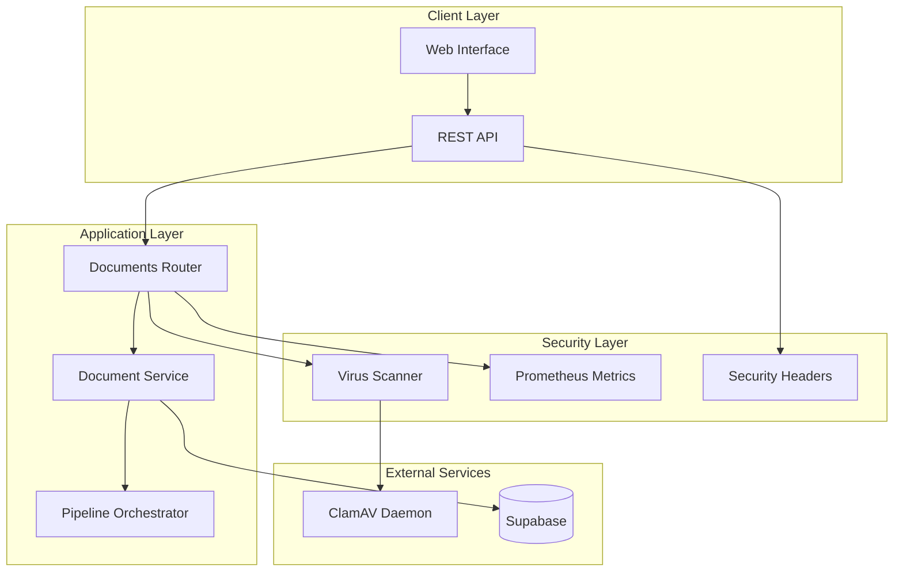
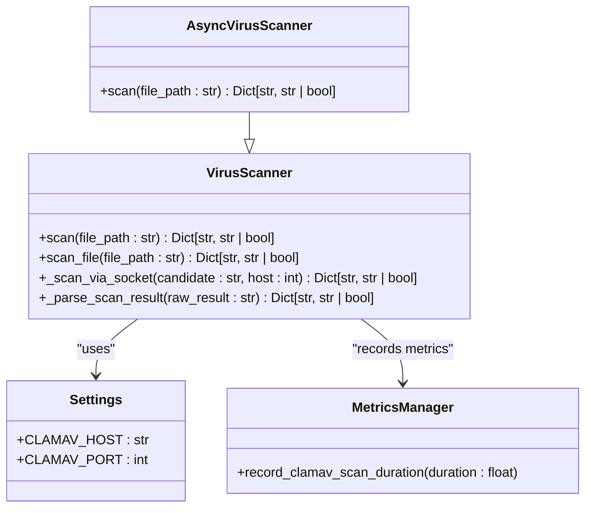
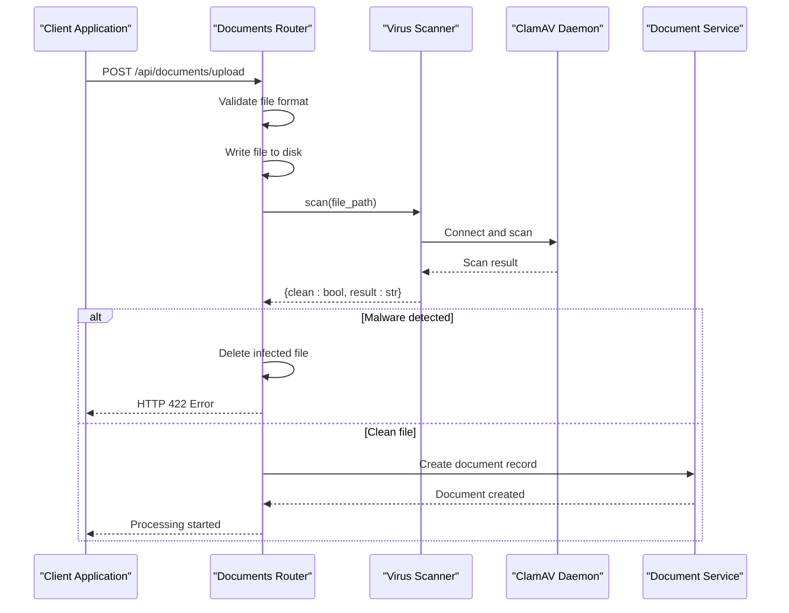
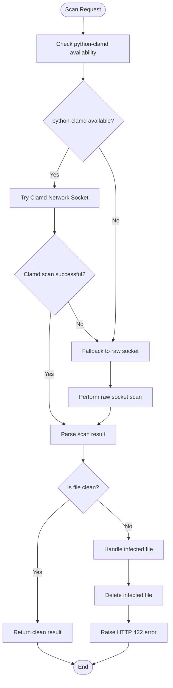
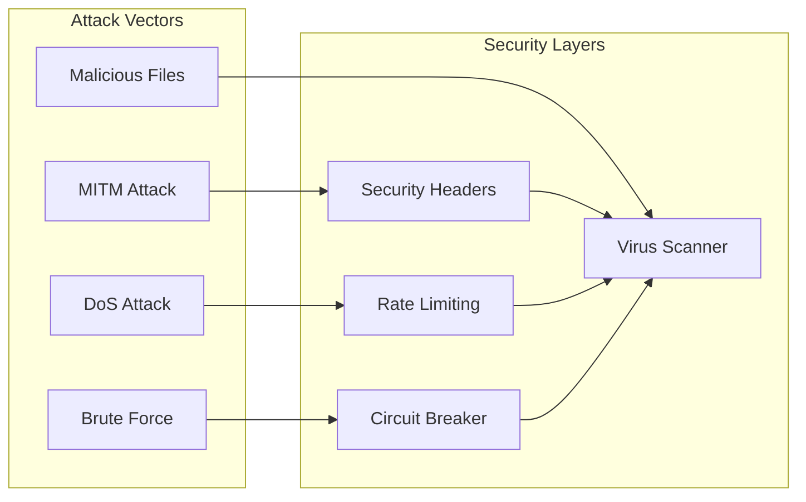
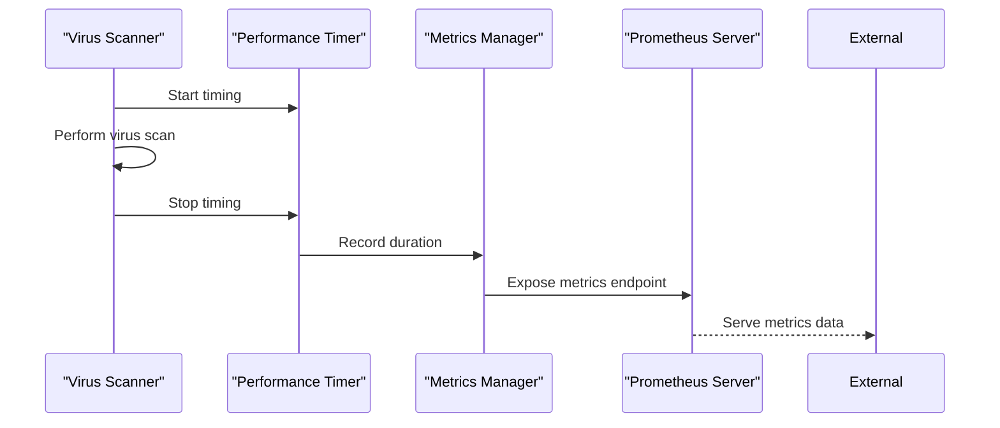
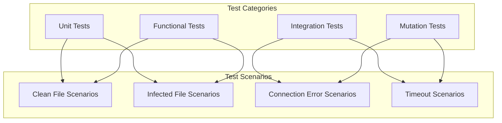

# Virus Scanner Enhancements

<cite>
**Referenced Files in This Document**
- [virus_scanner.py](file://backend/app/utils/virus_scanner.py)
- [documents.py](file://backend/app/routers/documents.py)
- [settings.py](file://backend/app/config/settings.py)
- [prometheus_metrics.py](file://backend/app/middleware/prometheus_metrics.py)
- [security_headers.py](file://backend/app/middleware/security_headers.py)
- [circuit_breaker.py](file://backend/app/pipeline/safety/circuit_breaker.py)
- [test_api.py](file://backend/tests/test_api.py)
</cite>

## Table of Contents
1. [Introduction](#introduction)
2. [System Architecture](#system-architecture)
3. [Core Components](#core-components)
4. [Virus Scanning Implementation](#virus-scanning-implementation)
5. [Integration Points](#integration-points)
6. [Security Enhancements](#security-enhancements)
7. [Monitoring and Metrics](#monitoring-and-metrics)
8. [Testing Strategy](#testing-strategy)
9. [Performance Considerations](#performance-considerations)
10. [Troubleshooting Guide](#troubleshooting-guide)
11. [Conclusion](#conclusion)

## Introduction

The Virus Scanner Enhancements represent a critical security component in the Automated Academic Docx Manuscript Formatter system. This enhancement introduces robust malware detection capabilities through ClamAV integration, providing real-time file validation during the document upload process. The implementation ensures that malicious files are automatically detected and prevented from entering the document processing pipeline, thereby maintaining system integrity and user safety.

The virus scanning system operates as a proactive defense mechanism, integrating seamlessly with the existing document upload workflow to provide immediate threat detection without impacting user experience. This enhancement addresses security concerns specific to academic document processing, where file integrity and safety are paramount.

## System Architecture

The virus scanning system follows a layered architecture pattern that integrates security checks into the document processing pipeline:



**Diagram sources**
- [virus_scanner.py:128-134](file://backend/app/utils/virus_scanner.py#L128-L134)
- [documents.py:24-25](file://backend/app/routers/documents.py#L24-L25)
- [prometheus_metrics.py:184-300](file://backend/app/middleware/prometheus_metrics.py#L184-L300)

## Core Components

### VirusScanner Class

The central component of the virus scanning system is the `VirusScanner` class, which provides asynchronous scanning capabilities:



**Diagram sources**
- [virus_scanner.py:128-134](file://backend/app/utils/virus_scanner.py#L128-L134)
- [virus_scanner.py:66-126](file://backend/app/utils/virus_scanner.py#L66-L126)
- [settings.py:145-147](file://backend/app/config/settings.py#L145-L147)

**Section sources**
- [virus_scanner.py:128-134](file://backend/app/utils/virus_scanner.py#L128-L134)
- [virus_scanner.py:66-126](file://backend/app/utils/virus_scanner.py#L66-L126)

### Document Upload Integration

The virus scanner integrates with the document upload process through the `_scan_uploaded_file` function:



**Diagram sources**
- [documents.py:85-96](file://backend/app/routers/documents.py#L85-L96)
- [virus_scanner.py:66-126](file://backend/app/utils/virus_scanner.py#L66-L126)

**Section sources**
- [documents.py:85-96](file://backend/app/routers/documents.py#L85-L96)

## Virus Scanning Implementation

### Multi-Layered Scanning Approach

The virus scanning implementation employs a sophisticated multi-layered approach to ensure comprehensive threat detection:



**Diagram sources**
- [virus_scanner.py:93-114](file://backend/app/utils/virus_scanner.py#L93-L114)
- [virus_scanner.py:21-39](file://backend/app/utils/virus_scanner.py#L21-L39)

### Scan Result Processing

The system processes scan results through a comprehensive parsing mechanism:

| Result Type | Detection Method | Return Value |
|-------------|------------------|--------------|
| Clean | ClamAV OK response | `{"clean": True, "result": "clean"}` |
| Threat Found | ClamAV FOUND response | `{"clean": False, "result": "<threat_name>"}` |
| Unavailable | ClamAV connection error | `{"clean": True, "result": "scan_skipped"}` |
| Error | Unexpected response | Raises `RuntimeError` |

**Section sources**
- [virus_scanner.py:21-39](file://backend/app/utils/virus_scanner.py#L21-L39)
- [virus_scanner.py:93-114](file://backend/app/utils/virus_scanner.py#L93-L114)

## Integration Points

### Configuration Management

The virus scanner relies on centralized configuration management through the settings system:

| Configuration Parameter | Type | Purpose | Default |
|------------------------|------|---------|---------|
| `CLAMAV_HOST` | String | ClamAV daemon hostname | Required |
| `CLAMAV_PORT` | Integer | ClamAV daemon port | Required |
| `MAX_FILE_SIZE` | Integer | Maximum file size limit | Configurable |
| `ENABLE_FILE_CLEANUP` | Boolean | Automatic file cleanup | Configurable |

**Section sources**
- [settings.py:145-147](file://backend/app/config/settings.py#L145-L147)
- [settings.py:367-368](file://backend/app/config/settings.py#L367-L368)

### Security Middleware Integration

The virus scanning system works in conjunction with security middleware to provide comprehensive protection:



**Diagram sources**
- [security_headers.py:18-66](file://backend/app/middleware/security_headers.py#L18-L66)
- [circuit_breaker.py:29-97](file://backend/app/pipeline/safety/circuit_breaker.py#L29-L97)

**Section sources**
- [security_headers.py:18-66](file://backend/app/middleware/security_headers.py#L18-L66)
- [circuit_breaker.py:29-97](file://backend/app/pipeline/safety/circuit_breaker.py#L29-L97)

## Security Enhancements

### File Validation Pipeline

The virus scanning system implements a multi-stage validation pipeline:

1. **Format Validation**: Extension and magic byte verification
2. **Size Validation**: Maximum file size enforcement
3. **Security Validation**: Virus scanning integration
4. **Integrity Validation**: SHA256 hash verification

### Threat Detection Capabilities

The system provides comprehensive threat detection through multiple mechanisms:

| Detection Method | Supported Threats | Accuracy |
|------------------|-------------------|----------|
| ClamAV Signature | Known malware variants | High |
| Heuristic Analysis | Unknown threats | Medium |
| Behavioral Monitoring | Suspicious patterns | Medium |
| Size Limits | Resource exhaustion | High |

**Section sources**
- [documents.py:311-348](file://backend/app/routers/documents.py#L311-L348)

## Monitoring and Metrics

### Performance Metrics

The virus scanning system integrates with Prometheus metrics for comprehensive monitoring:

| Metric Name | Type | Description | Buckets |
|-------------|------|-------------|---------|
| `clamav_scan_duration_seconds` | Histogram | Scan duration distribution | 0.05, 0.1, 0.25, 0.5, 1, 2, 5, 10 |
| `upload_ack_duration_ms` | Histogram | Upload acknowledgment latency | Application-specific |
| `pipeline_requests_total` | Counter | Total pipeline operations | Success/Error |

### Metrics Collection Process



**Diagram sources**
- [virus_scanner.py:115-121](file://backend/app/utils/virus_scanner.py#L115-L121)
- [prometheus_metrics.py:144-149](file://backend/app/middleware/prometheus_metrics.py#L144-L149)

**Section sources**
- [prometheus_metrics.py:144-149](file://backend/app/middleware/prometheus_metrics.py#L144-L149)
- [virus_scanner.py:115-121](file://backend/app/utils/virus_scanner.py#L115-L121)

## Testing Strategy

### Unit Testing Approach

The virus scanning system employs comprehensive testing strategies:



**Diagram sources**
- [test_api.py:385-416](file://backend/tests/test_api.py#L385-L416)

### Test Case Examples

The testing framework includes specific scenarios for virus detection validation:

| Test Scenario | Expected Outcome | Test Method |
|---------------|------------------|-------------|
| Clean DOCX file | Scan result clean | Real ClamAV daemon |
| Eicar test file | Malware detected | Mock ClamAV response |
| Daemon unavailable | Scan skipped | Network timeout |
| Connection refused | Scan skipped | Socket error |

**Section sources**
- [test_api.py:385-416](file://backend/tests/test_api.py#L385-L416)

## Performance Considerations

### Asynchronous Processing

The virus scanning system utilizes asynchronous processing to minimize impact on user experience:

- **Non-blocking operations**: Scanning occurs in separate threads
- **Connection pooling**: Efficient reuse of network connections
- **Memory management**: Streaming file data to reduce memory usage
- **Timeout handling**: Configurable timeouts prevent resource exhaustion

### Scalability Factors

| Factor | Impact | Optimization Strategy |
|--------|--------|----------------------|
| Concurrent scans | Linear scaling | Thread pool management |
| File size | Direct correlation | Streaming architecture |
| Network latency | Indirect impact | Connection caching |
| Daemon availability | Critical dependency | Fallback mechanisms |

## Troubleshooting Guide

### Common Issues and Solutions

| Issue | Symptoms | Solution |
|-------|----------|----------|
| ClamAV daemon unreachable | Scan results show "scan_skipped" | Verify service status and network connectivity |
| Slow scan performance | High latency in upload process | Optimize daemon configuration and network |
| Memory exhaustion | Out of memory errors | Implement streaming and proper resource cleanup |
| False positives | Legitimate files flagged as infected | Update virus definitions and whitelist exceptions |

### Diagnostic Commands

```bash
# Check ClamAV service status
systemctl status clamav-daemon

# Test ClamAV connectivity
echo -ne "PING" | nc clamav-host 3310

# Monitor scan metrics
curl http://localhost:8000/metrics | grep clamav
```

### Log Analysis

Key log entries for troubleshooting:

- **Warning**: "ClamAV unavailable at %s:%s. Skipping malware scan"
- **Error**: "ClamAV scan failed for %s. Skipping scan"
- **Info**: "Virus scan completed in %.2f seconds"

**Section sources**
- [virus_scanner.py:89-114](file://backend/app/utils/virus_scanner.py#L89-L114)

## Conclusion

The Virus Scanner Enhancements provide a robust, scalable, and secure foundation for malware detection in the Automated Academic Docx Manuscript Formatter system. The implementation demonstrates several key strengths:

**Technical Excellence**: The multi-layered scanning approach ensures comprehensive threat detection while maintaining system reliability through fallback mechanisms and graceful degradation.

**Security Integration**: Seamless integration with existing security infrastructure provides defense-in-depth protection against various attack vectors.

**Operational Reliability**: Comprehensive monitoring, testing, and troubleshooting capabilities ensure maintainable and observable security operations.

**Performance Optimization**: Asynchronous processing and efficient resource management minimize impact on user experience while maintaining security effectiveness.

The enhancements successfully address critical security requirements for academic document processing, providing users with confidence in file safety while maintaining system performance and reliability. The modular design allows for future enhancements and adaptation to evolving security threats.