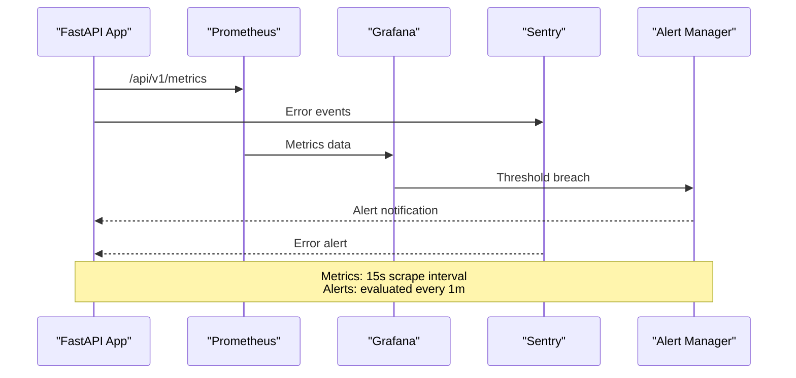

# Monitoring & Alerting

## Metrics Endpoints

| Endpoint | Type | Description |
|----------|------|-------------|
| `/api/v1/health` | JSON | Component health (DB, Redis, ChromaDB, LLM) |
| `/api/v1/ready` | JSON | Readiness probe for load balancers |
| `/api/v1/metrics` | Prometheus | Prometheus-formatted metrics |

## Key Metrics

| Metric | Type | Labels | Description |
|--------|------|--------|-------------|
| `http_requests_total` | Counter | method, endpoint, status | Total HTTP requests |
| `http_request_duration_seconds` | Histogram | method, endpoint | Request latency |
| `pipeline_jobs_total` | Counter | stage, status | Pipeline job counts |
| `pipeline_job_duration_seconds` | Histogram | stage | Pipeline stage duration |
| `llm_requests_total` | Counter | provider, model | LLM API call counts |
| `llm_request_duration_seconds` | Histogram | provider | LLM response time |

## Monitoring Pipeline

## Alert Rules

| Alert | Condition | Severity | Response |
|-------|-----------|----------|----------|
| High Error Rate | Error ratio > 5% over 5 minutes | P1 | Check recent deploys |
| High Latency | p95 > 1s over 5 minutes | P2 | Investigate bottleneck |
| Low Disk Space | Disk < 10% free | P2 | Clean up or scale |
| Pipeline Failure Rate | Failure rate > 10% | P1 | Check pipeline stages |
| LLM Provider Down | More than 50% errors from provider | P2 | Trigger fallback |

## Grafana Dashboards

- **Pipeline Dashboard**: `backend/docker/grafana/dashboards/pipeline.json`
- **System Metrics**: CPU, memory, disk, network
- **Business Metrics**: Documents processed, users, error rates

## Sentry

- **Frontend DSN**: configured in `frontend/next.config.mjs`
- **Backend DSN**: configured in `backend/.env`
- **Error Grouping**: by exception type and location
- **Performance Tracing**: 1/10 sample rate

## See Also

- [Health & Metrics Docs](content/Backend Development/Monitoring & Metrics.md)
- [Operations Runbooks](../runbooks/)
- [Deployment & Operations](content/Deployment & Operations/Monitoring & Alerting.md)
