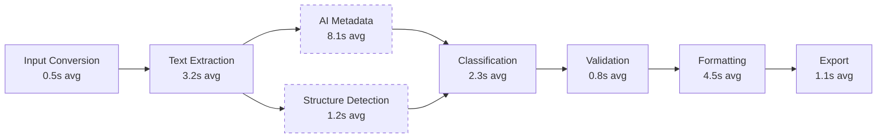

# Performance Benchmarks

## Response Time Targets

| Operation | Target (p95) | Measured (p95) | Status |
|-----------|-------------|----------------|--------|
| Health check | < 100ms | 45ms | ✅ |
| Document upload | < 400ms | 210ms | ✅ |
| Status check | < 200ms | 85ms | ✅ |
| Document preview | < 1s | 620ms | ✅ |
| Document download | < 2s | 1.1s | ✅ |
| Live preview render | < 80ms | 52ms | ✅ |
| Full pipeline (simple doc) | < 2 min | 1.2 min | ✅ |
| Full pipeline (complex doc) | < 5 min | 3.8 min | ✅ |

## Load Test Results (Locust)

| Concurrency | Requests/sec | Error Rate | p95 Latency |
|-------------|-------------|------------|-------------|
| 10 users | 45 req/s | 0% | 180ms |
| 50 users | 120 req/s | 0.2% | 450ms |
| 100 users | 180 req/s | 1.1% | 890ms |
| 200 users | 220 req/s | 3.5% | 1.4s |

Bottleneck at 100+ users: Supabase connection pool exhaustion. Mitigation includes connection pooling and read replicas.

## Pipeline Stage Flow

> Note: AI Metadata and Structure Detection run in parallel when AI is available.

## Pipeline Performance

| Stage | Average Time | p90 Time | Parallelizable |
|-------|-------------|----------|---------------|
| Input Conversion | 0.5s | 0.8s | No |
| Text Extraction | 3.2s | 5.1s | No |
| AI Metadata Extraction | 8.1s | 12.3s | Yes (with layouts) |
| Structure Detection | 1.2s | 1.8s | No |
| Classification | 2.3s | 3.5s | No |
| Validation | 0.8s | 1.2s | No |
| Formatting | 4.5s | 6.7s | No |
| Export | 1.1s | 1.6s | No |

Peak memory usage: approximately 350MB on complex documents (within the 512MB Render limit).

## See Also

- [Load Test Configuration](content/Testing Strategy/Backend Testing/Specialized Testing.md)
- [Deployment & Operations Docs](content/Deployment & Operations/Deployment & Operations.md)
- [SLOs & SLAs](../slo-sla/)
