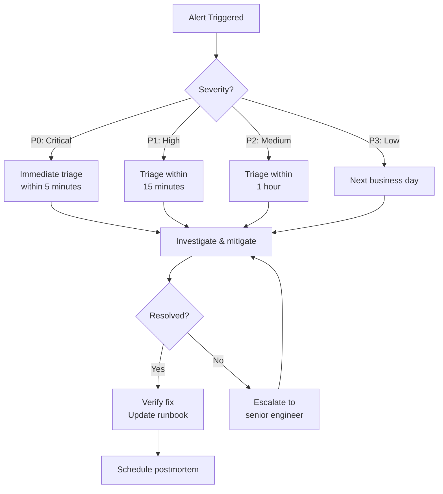

# Operations Runbooks

## Available Runbooks

| Runbook | Description | Estimated Time |
|---------|-------------|----------------|
| [Incident Response](../docs/runbooks/incident-response.md) | Triage, investigation, mitigation, and postmortem | 30–120 min |
| [Rollback Procedure](../docs/runbooks/rollback.md) | Rolling back backend, frontend, and database changes | 15–30 min |
| [Branch Protection](../docs/runbooks/branch-protection.md) | Configuring and troubleshooting branch protection rules | 10–20 min |
| [Secret Rotation](../docs/SECRET_ROTATION.md) | Rotating API keys, JWT secrets, and database credentials | 20–45 min |
| [Disaster Recovery](../docs/DISASTER_RECOVERY.md) | Recovering from data loss or corruption | 30–60 min |

Full runbook content is maintained in `docs/runbooks/`. This index provides discovery from `.docs/`.

## Incident Response Flow

## Runbook Format

Each runbook follows this structure:

1. **Symptoms** — How to detect the issue
2. **Severity Levels** — P0 (critical) through P3 (minor)
3. **Checklist** — Step-by-step remediation
4. **Verification** — How to confirm the fix
5. **Postmortem** — Required follow-up

## See Also

- [Operations Docs](../operations/)
- [Security Docs](../security/)
- [Deployment & Operations](content/Deployment & Operations/Deployment & Operations.md)
