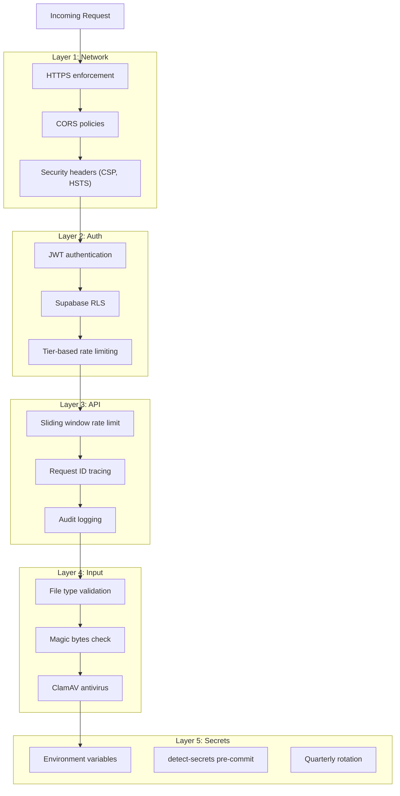

# Security & Compliance

## Security Model

ScholarForm AI implements defense-in-depth across all layers:

| Layer | Controls |
|-------|----------|
| **Network** | HTTPS enforcement, CORS, security headers (CSP, HSTS) |
| **Auth** | JWT-based auth via Supabase, RLS policies, tier-based rate limiting |
| **API** | Rate limiting (sliding window), request ID tracing, audit logging |
| **Input** | File type validation, magic bytes check, ClamAV antivirus scanning |
| **Pipeline** | Timeout enforcement, cancellation, partial result persistence |
| **Secrets** | Environment variables, `.secrets.baseline`, detect-secrets pre-commit hook |

## Available Documents

| Document | Description |
|----------|-------------|
| [Security Model](../docs/explanation/security-model.md) | Detailed security architecture |
| [Compliance](compliance.md) | Compliance posture and data handling controls |
| [Secret Rotation](../docs/SECRET_ROTATION.md) | Secret rotation procedures |
| [Threat Model](threat-model.md) | STRIDE threat model and mitigations |

## Defense in Depth

## Key Practices

- All secrets in environment variables via `settings.py` (Pydantic Settings)
- No secrets committed — enforced by `detect-secrets` pre-commit hook
- API keys rotated quarterly
- JWT tokens expire after 1 hour, refresh tokens after 7 days
- File uploads scanned by ClamAV before processing
- Rate limits: 100 req/min (authenticated), 10 req/min (guest uploads)

## See Also

- [Operations Runbooks](../runbooks/) — Incident response and secret rotation
- [Middleware & Security System](content/Backend Development/Middleware & Security System.md)
