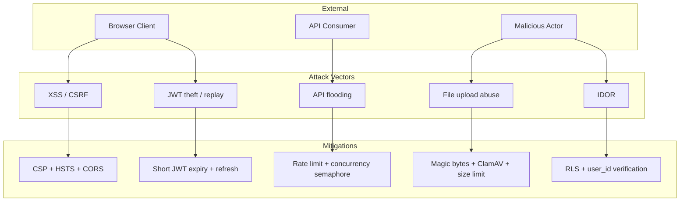

# Threat Model

## Spoofing

| Threat | Vector | Mitigation |
|--------|--------|------------|
| Fake user identity | JWT token theft | Short expiry (1h), refresh tokens, HTTPS-only |
| API key theft | Exposed in logs or client | Key rotation, env vars, no logging of secrets |

## Tampering

| Threat | Vector | Mitigation |
|--------|--------|------------|
| Document content modification | Man-in-the-middle | HTTPS or TLS enforced |
| Uploaded file tampering | Malicious file upload | Magic bytes check, ClamAV scan, size limits |
| Database tampering | SQL injection | SQLAlchemy parameterized queries, RLS |

## Repudiation

| Threat | Vector | Mitigation |
|--------|--------|------------|
| User denies action | No audit trail | Request ID and audit logging on all write operations |
| Pipeline failure denial | No logs | Structured logging with job_id correlation |

## Information Disclosure

| Threat | Vector | Mitigation |
|--------|--------|------------|
| Document leakage | Storage breach | AES-256 encryption, RLS policies |
| API key leakage | Error responses | Sanitized error messages, no secrets in responses |
| User data exposure | Insecure endpoints | Authentication required on all document endpoints |

## Denial of Service

| Threat | Vector | Mitigation |
|--------|--------|------------|
| API flooding | Excessive requests | Rate limiting (sliding window), tier-based limits |
| Pipeline exhaustion | Large or batch uploads | Concurrency semaphore, queue thresholds |

## Attack Surface Overview

## Elevation of Privilege

| Threat | Vector | Mitigation |
|--------|--------|------------|
| User accesses another user's documents | IDOR | RLS policies, user_id verification |
| Guest uses paid features | Tier bypass | TierRateLimitMiddleware, server-side enforcement |

## See Also

- [Security Model](../docs/explanation/security-model.md)
- [Middleware & Security System](content/Backend Development/Middleware & Security System.md)
- [Compliance Posture](compliance.md)
