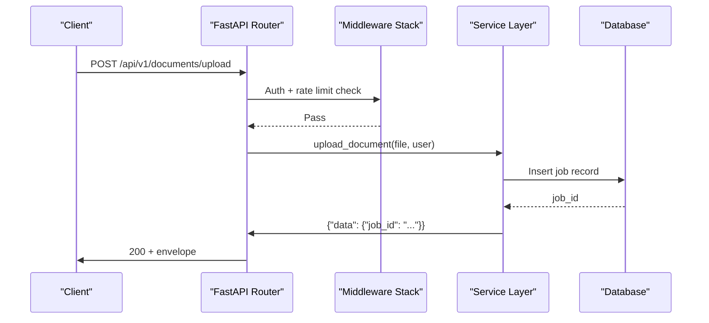

# API Design Skill

## Trigger

Invoke when designing a new API endpoint, modifying an existing one, or reviewing API contracts.

## Route Convention

```
/api/v1/{resource}[/{id}][/{action}]
```

Examples:
- `GET /api/v1/documents` — List documents
- `POST /api/v1/documents/upload` — Upload document
- `GET /api/v1/documents/{job_id}/status` — Get job status

## Response Envelope

All responses follow this structure:

```json
{
  "data": { ... },
  "error": null,
  "request_id": "uuid",
  "timestamp": "2026-06-14T10:00:00Z"
}
```

Error responses:

```json
{
  "data": null,
  "error": {
    "code": "ERROR_CODE",
    "message": "Human-readable message"
  },
  "request_id": "uuid",
  "timestamp": "2026-06-14T10:00:00Z"
}
```

## Error Codes

| Code | HTTP Status | When |
|------|-------------|------|
| UNAUTHORIZED | 401 | Missing or invalid auth token |
| FORBIDDEN | 403 | Valid auth but insufficient permissions |
| NOT_FOUND | 404 | Resource does not exist |
| VALIDATION_ERROR | 422 | Invalid request body |
| RATE_LIMITED | 429 | Too many requests |
| INTERNAL_ERROR | 500 | Unexpected server error |

## Request/Response Flow



## Requirements Checklist

- [ ] Pydantic model for request body
- [ ] Pydantic model for response data
- [ ] Route registered in appropriate router
- [ ] Authentication check (if protected)
- [ ] Rate limiting considered (upload endpoints need lower limits)
- [ ] OpenAPI schema auto-generated (FastAPI)
- [ ] Contract tests in `test_api_contracts.py`

## See Also

- [Code Review Skill](code-review.md)
- [API Reference Docs](content/API Reference/API Reference.md)
