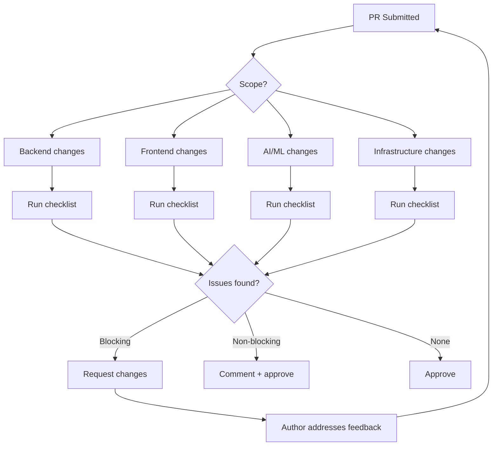

# Code Review Skill

## Trigger

Invoke when reviewing a pull request or when asked to review code changes.

## Workflow

### 1. Scope Analysis

Identify which stacks are affected: backend, frontend, AI/ML, infrastructure, docs. Flag PRs exceeding 500 lines for splitting.

### 2. Backend Checklist

- [ ] Type hints on all new functions
- [ ] Pydantic models for request/response schemas
- [ ] Error handling with appropriate HTTP status codes
- [ ] Tests added with correct pytest markers
- [ ] No hardcoded secrets — env vars via `settings.py`
- [ ] Database migrations included if models changed
- [ ] API routes use `/api/v1/` prefix

### 3. Frontend Checklist

- [ ] Tailwind CSS, not inline styles
- [ ] Environment vars use `NEXT_PUBLIC_` prefix
- [ ] Zod schemas for API contract validation
- [ ] Accessibility: ARIA attributes, keyboard nav, focus management
- [ ] Tests: Vitest unit + Playwright E2E where applicable
- [ ] No client-side secrets

### 4. AI/ML Checklist

- [ ] LLM calls use LiteLLM abstraction layer
- [ ] Proper error handling for NIM → Groq → Ollama fallback
- [ ] `DEFAULT_FAST_MODE` respected
- [ ] RAG embedding size and retrieval limits considered

### 5. General Checklist

- [ ] No secrets committed (run `detect-secrets` scan)
- [ ] Version consistency: `pyproject.toml` is canonical
- [ ] Pre-commit hooks pass locally
- [ ] CI passes (ruff, mypy, pytest)

## Review Workflow

## Output

Provide a summary with files reviewed, issues found (blocking vs non-blocking), and approval status.

## See Also

- [API Design Skill](api-design.md)
- [Migration Skill](migration.md)
