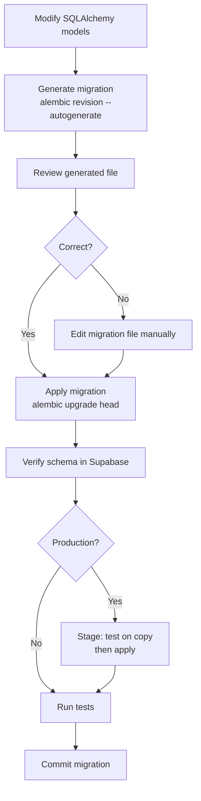

# Migration Skill

## Trigger

Invoke when database schema changes are needed — new tables, column changes, or index additions.

## Workflow

### 1. Model Change

Modify SQLAlchemy models in `backend/app/db/models/`:
- New model: define class with `__tablename__`, columns, relationships
- Existing model: add or modify columns, indexes, or constraints

### 2. Generate Migration

```bash
cd backend
alembic revision --autogenerate -m "description_of_change"
```

Review the generated migration file in `backend/alembic/versions/` for correctness.

### 3. Apply Migration

```bash
alembic upgrade head
```

### 4. Verify

Check Supabase table schema matches expectations and run relevant tests.

### 5. Rollback (if needed)

```bash
alembic downgrade -1
```

## Migration Workflow



## Notes

- Always generate from models — never write raw SQL migrations unless unavoidable
- Test migrations against a copy of production data in staging
- Never modify an already-committed migration; create a new one instead

## See Also

- [Database Design Docs](content/Database Design/Database Design.md)
- [Release Skill](release.md)
