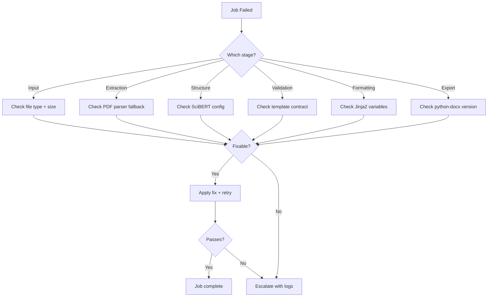

# Pipeline Debug Skill

## Trigger

Invoke when a document processing job fails, returns unexpected results, or when asked to diagnose pipeline issues.

## Workflow

### 1. Identify Failure Point

Check the job status in the database — identify which pipeline stage failed:

Input Conversion → Text Extraction → Structure Detection → Classification → Validation → Formatting → Export

### 2. Common Failure Patterns

| Stage | Symptom | Likely Cause |
|-------|---------|--------------|
| Input Conversion | 400 Bad Request | Unsupported file format or corrupted file |
| Text Extraction | Empty content | PDF parsing fallback exhausted |
| Structure Detection | Missing sections | SciBERT classification disabled |
| Validation | Validation errors | Template contract mismatch |
| Formatting | Template render error | Missing Jinja2 template variables |
| Export | DOCX corrupt | python-docx version mismatch |

### 3. Debug Commands

```bash
# Backend logs
uvicorn app.main:app --reload --log-level debug

# Specific pipeline test
pytest backend/tests/test_pipeline.py -x -v -k "test_formatting"

# Manual pipeline run
python backend/scripts/run_pipeline.py --input sample.docx --template ieee
```

### 4. Check Configuration

- Verify `DEFAULT_FAST_MODE` — if true, AI stages are skipped
- Check `GROBID_ENABLED` for PDF parsing
- Verify template exists in Supabase `templates` table
- Check Redis connectivity for pub/sub events

### Debug Flow



### 5. Escalation Checklist

Include the following when escalating:

- Input file type and size
- Selected template
- Exact error message and stack trace
- Job ID and status history
- Browser and OS (for frontend issues)

## See Also

- [Pipeline Processing Docs](content/Pipeline Processing/Pipeline Processing.md)
- [Pipeline Orchestrator](content/Pipeline Processing/Pipeline Orchestrator.md)
