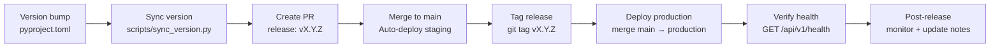

# Release Skill

## Trigger

Invoke when preparing a new release, cutting a tag, or deploying to production.

## Workflow

### 1. Version Bump

Update version in canonical source (`backend/pyproject.toml`), then sync:

```bash
python scripts/sync_version.py
```

### 2. Verify Consistency

```bash
python scripts/sync_version.py --check
```

### 3. Create Release PR

Title: `release: vX.Y.Z`
Body includes changelog with new features, bug fixes, breaking changes, and dependency updates.

### 4. Tag and Release

```bash
git tag vX.Y.Z
git push origin vX.Y.Z
```

CI triggers `create-release.yml` — ensure tag matches canonical version.

### 5. Deploy

- Staging: triggers automatically on merge to `main`
- Production: merge `main` → `production` branch or trigger `deploy-production.yml`
- Monitor: check Render dashboard, Sentry errors, and Grafana metrics

### Release Pipeline



### 6. Post-Release

- Verify health endpoint: `GET /api/v1/health`
- Run smoke tests
- Update release notes in GitHub
- Notify team

## See Also

- [Release Checklist](../docs/RELEASE_CHECKLIST.md)
- [Rollback Runbook](../runbooks/)
- [Code Review Skill](code-review.md)
