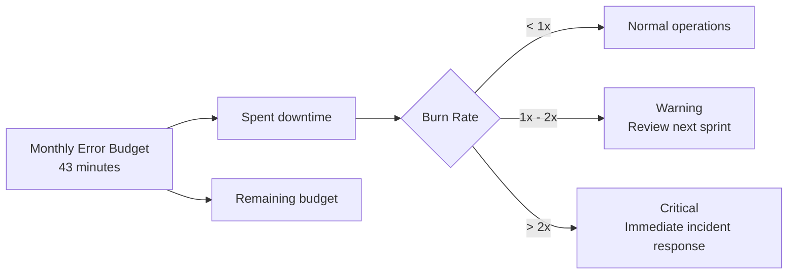

# SLOs & SLAs

## Service Level Objectives

| Metric | Target | Measurement |
|--------|--------|-------------|
| API Availability | 99.9% uptime (monthly) | Health endpoint checks every 5 minutes |
| Document Upload | < 400ms response time | p95 latency |
| Pipeline Processing | < 5 minutes for standard documents | p90 completion time |
| Live Preview Render | < 80ms | p95 WebSocket round-trip |
| API Response (read) | < 200ms | p95 latency |
| API Response (write) | < 500ms | p95 latency |

## API SLAs by Tier

| Tier | Rate Limit | Max File Size | Max Documents Per Day | Support |
|------|------------|---------------|-----------------------|---------|
| Guest | 10 req/min uploads | 10MB | 5 | None |
| Free | 100 req/min | 25MB | 20 | Community |
| Pro (planned) | 500 req/min | 50MB | 100 | Email |
| Enterprise (planned) | Custom | 100MB | Unlimited | Priority |

## Error Budget

Monthly error budget: 0.1% downtime (approximately 43 minutes per month).

Monthly error budget: 0.1% downtime (approximately 43 minutes per month).

- Burn rate < 1: Normal operations
- Burn rate 1–2: Warning, review next sprint
- Burn rate > 2: Incident response, immediate action

## See Also

- [API SLO/SLA Details](../docs/audits/2026-03-25-full-audit/API_SLO_SLA.md)
- [Performance Budget](../docs/audits/2026-03-25-full-audit/Frontend_Performance_Budget.md)
- [Operations Docs](../operations/)
