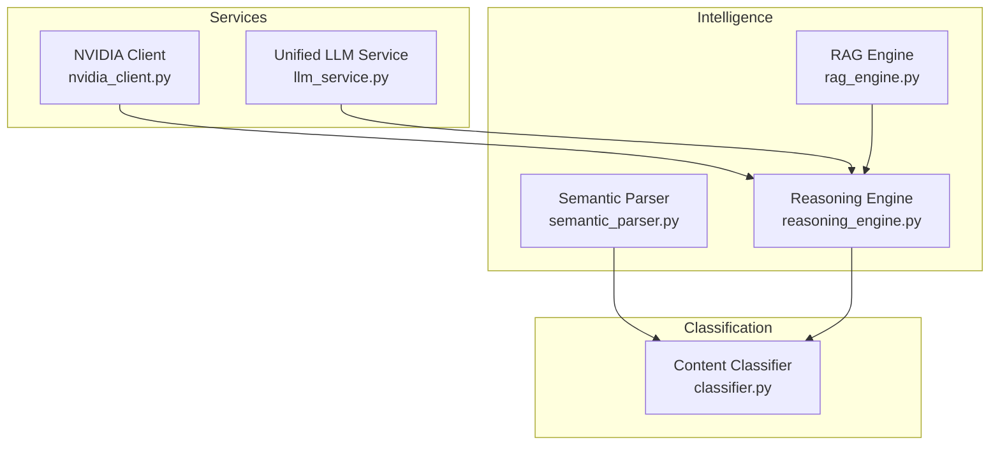
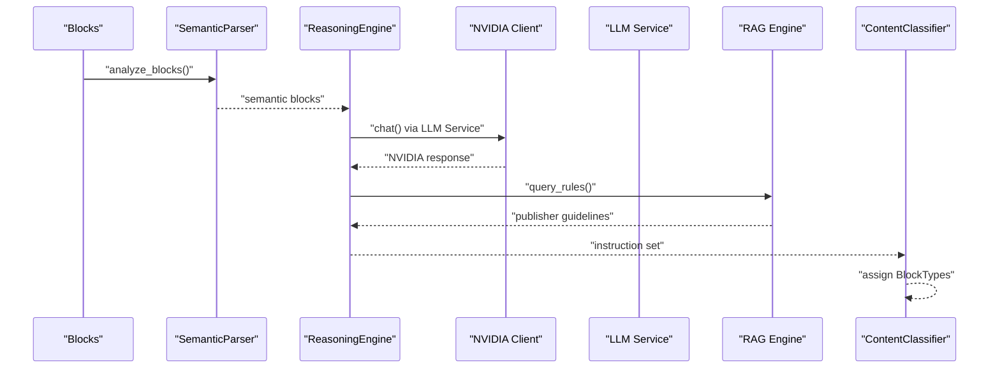
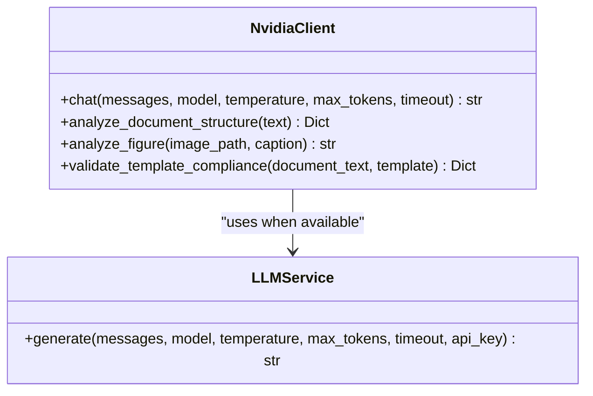
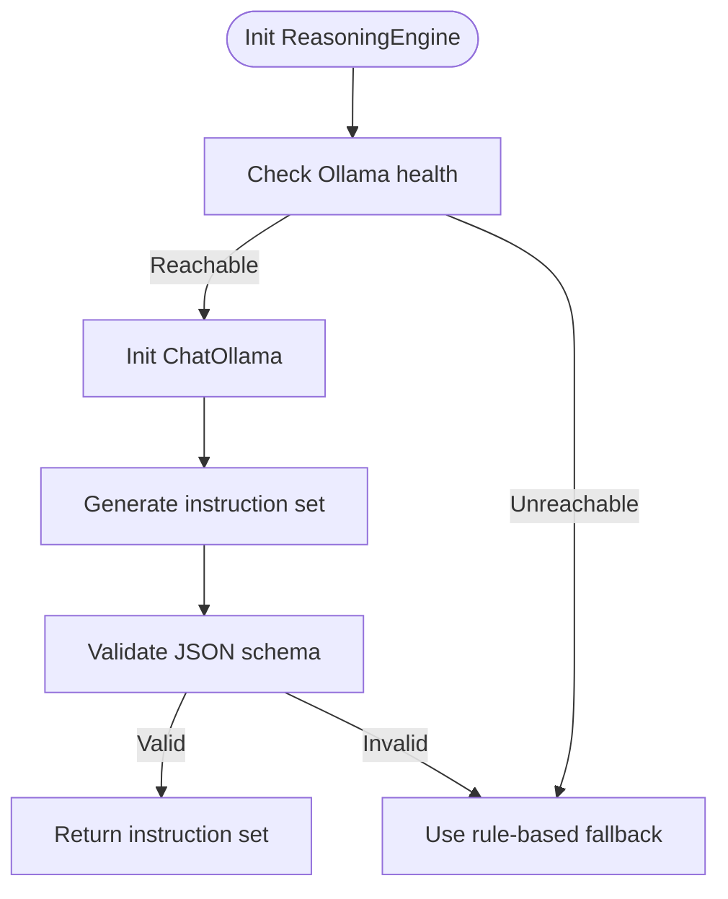
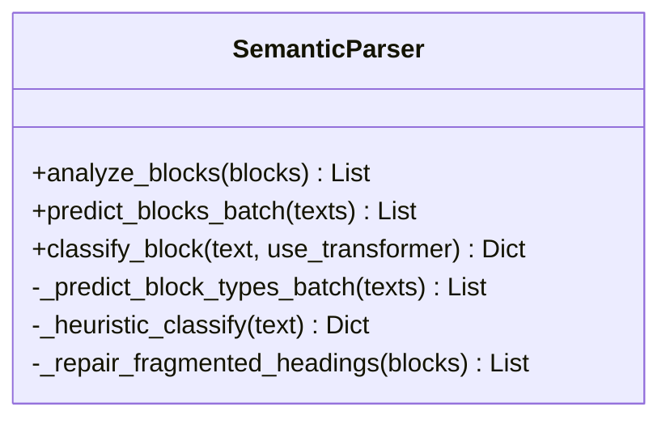
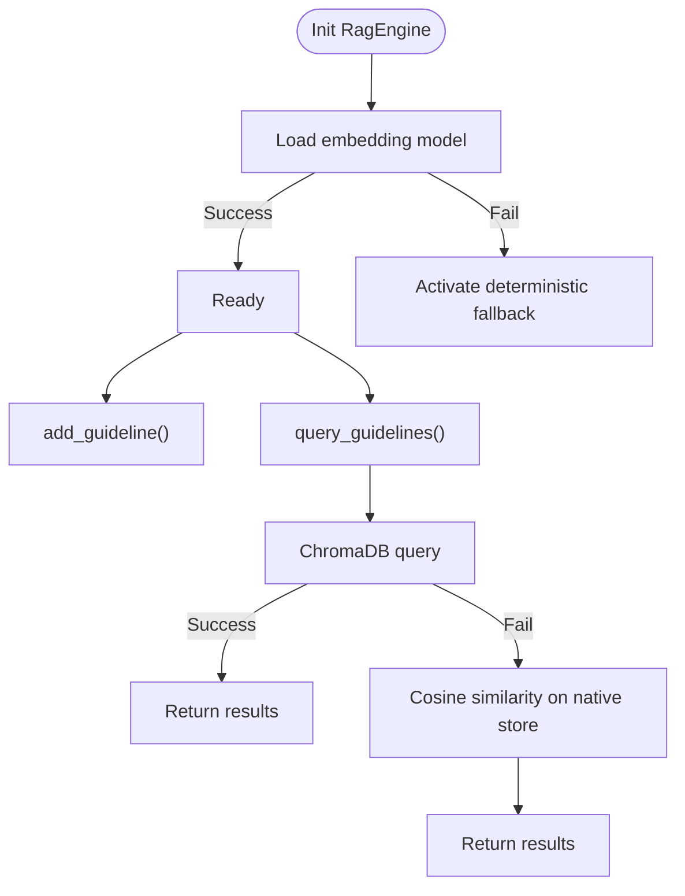
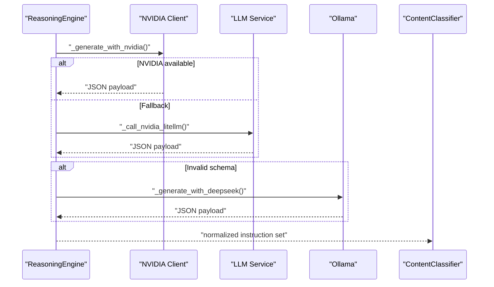
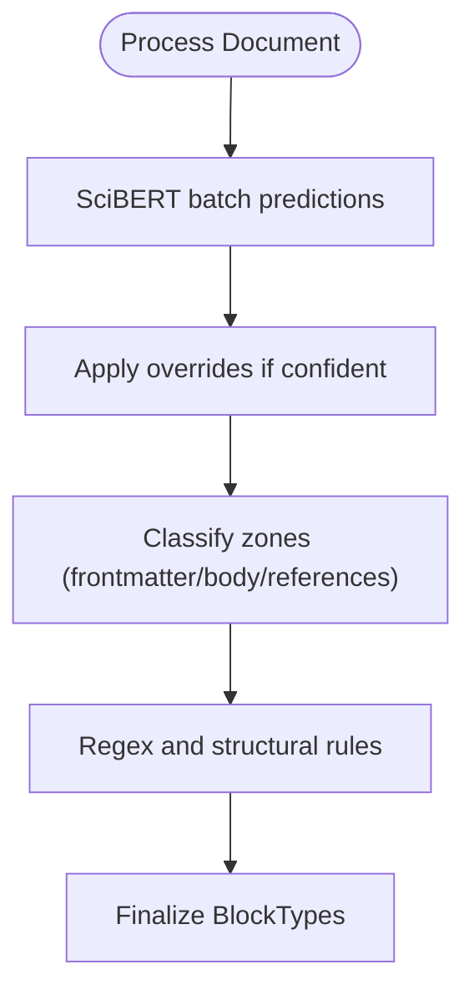
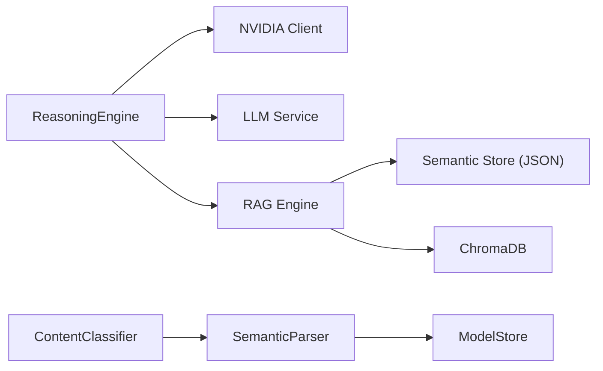

# AI/ML Integration

<cite>
**Referenced Files in This Document**
- [nvidia_client.py](file://backend/app/services/nvidia_client.py)
- [llm_service.py](file://backend/app/services/llm_service.py)
- [rag_engine.py](file://backend/app/pipeline/intelligence/rag_engine.py)
- [reasoning_engine.py](file://backend/app/pipeline/intelligence/reasoning_engine.py)
- [semantic_parser.py](file://backend/app/pipeline/intelligence/semantic_parser.py)
- [classifier.py](file://backend/app/pipeline/classification/classifier.py)
- [test_scibert_benchmark.py](file://backend/tests/test_scibert_benchmark.py)
- [test_rag_engine.py](file://backend/tests/test_rag_engine.py)
- [test_reasoning_engine.py](file://backend/tests/test_reasoning_engine.py)
- [test_nvidia_client.py](file://backend/tests/test_nvidia_client.py)
</cite>

## Table of Contents
1. [Introduction](#introduction)
2. [Project Structure](#project-structure)
3. [Core Components](#core-components)
4. [Architecture Overview](#architecture-overview)
5. [Detailed Component Analysis](#detailed-component-analysis)
6. [Dependency Analysis](#dependency-analysis)
7. [Performance Considerations](#performance-considerations)
8. [Troubleshooting Guide](#troubleshooting-guide)
9. [Conclusion](#conclusion)
10. [Appendices](#appendices)

## Introduction
This document explains the AI/ML integration across the system, focusing on:
- NVIDIA NIM integration with LiteLLM fallback
- Local Ollama deployment for reasoning
- SciBERT-based semantic classification
- Retrieval-Augmented Generation (RAG) with resilient embedding fallbacks
- Reasoning engine orchestration with circuit breakers and rule-based fallbacks
- Model management, caching, and persistence
- Configuration, cost optimization, and monitoring
- Versioning, troubleshooting, and operational guidance

## Project Structure
The AI/ML stack spans services, pipeline intelligence, and classification layers:
- Services: NVIDIA client, unified LLM service, model store
- Intelligence: RAG engine, reasoning engine, semantic parser
- Classification: Content classifier integrating semantic parsing
- Tests: Benchmarks and integration tests for each component

**Diagram sources**
- [nvidia_client.py](file://backend/app/services/nvidia_client.py)
- [llm_service.py](file://backend/app/services/llm_service.py)
- [rag_engine.py](file://backend/app/pipeline/intelligence/rag_engine.py)
- [reasoning_engine.py](file://backend/app/pipeline/intelligence/reasoning_engine.py)
- [semantic_parser.py](file://backend/app/pipeline/intelligence/semantic_parser.py)
- [classifier.py](file://backend/app/pipeline/classification/classifier.py)

**Section sources**
- [nvidia_client.py](file://backend/app/services/nvidia_client.py)
- [llm_service.py](file://backend/app/services/llm_service.py)
- [rag_engine.py](file://backend/app/pipeline/intelligence/rag_engine.py)
- [reasoning_engine.py](file://backend/app/pipeline/intelligence/reasoning_engine.py)
- [semantic_parser.py](file://backend/app/pipeline/intelligence/semantic_parser.py)
- [classifier.py](file://backend/app/pipeline/classification/classifier.py)

## Core Components
- NVIDIA NIM client with LiteLLM-backed generation and OpenAI-compatible fallback
- Unified LLM service for provider-agnostic model invocation
- RAG engine with BGE embeddings, ChromaDB, and deterministic fallback
- Reasoning engine with multi-tier LLM selection, retry guards, circuit breakers, and rule-based fallback
- Semantic parser with SciBERT and heuristic fallback
- Content classifier integrating structure detection and semantic parsing

**Section sources**
- [nvidia_client.py](file://backend/app/services/nvidia_client.py)
- [llm_service.py](file://backend/app/services/llm_service.py)
- [rag_engine.py](file://backend/app/pipeline/intelligence/rag_engine.py)
- [reasoning_engine.py](file://backend/app/pipeline/intelligence/reasoning_engine.py)
- [semantic_parser.py](file://backend/app/pipeline/intelligence/semantic_parser.py)
- [classifier.py](file://backend/app/pipeline/classification/classifier.py)

## Architecture Overview
The AI/ML pipeline orchestrates structured reasoning and classification:
- Input blocks are analyzed by the semantic parser (SciBERT or heuristics)
- The reasoning engine selects the best model tier (NVIDIA → Ollama → Rule-based) and generates instruction sets
- The RAG engine retrieves publisher-specific guidelines for contextual grounding
- The content classifier assigns semantic block types using structure and NLP signals

**Diagram sources**
- [semantic_parser.py](file://backend/app/pipeline/intelligence/semantic_parser.py)
- [reasoning_engine.py](file://backend/app/pipeline/intelligence/reasoning_engine.py)
- [nvidia_client.py](file://backend/app/services/nvidia_client.py)
- [llm_service.py](file://backend/app/services/llm_service.py)
- [rag_engine.py](file://backend/app/pipeline/intelligence/rag_engine.py)
- [classifier.py](file://backend/app/pipeline/classification/classifier.py)

## Detailed Component Analysis

### NVIDIA NIM Integration
- Provides chat completions with model routing to NVIDIA NIM
- Uses LiteLLM-backed generation when available; falls back to direct OpenAI-compatible client
- Exposes higher-level helpers for document structure analysis, figure analysis, and template compliance checks
- Graceful degradation when API key is missing

**Diagram sources**
- [nvidia_client.py](file://backend/app/services/nvidia_client.py)
- [llm_service.py](file://backend/app/services/llm_service.py)

**Section sources**
- [nvidia_client.py](file://backend/app/services/nvidia_client.py)
- [llm_service.py](file://backend/app/services/llm_service.py)

### Local Ollama Deployment and Fallback
- The reasoning engine optionally initializes a local Ollama client and health-checks model availability
- Falls back to rule-based classification when Ollama is unreachable
- Integrates with the unified LLM service when available

**Diagram sources**
- [reasoning_engine.py](file://backend/app/pipeline/intelligence/reasoning_engine.py)

**Section sources**
- [reasoning_engine.py](file://backend/app/pipeline/intelligence/reasoning_engine.py)

### SciBERT Classification
- Loads SciBERT tokenizer and model lazily, reusing global model store when available
- Supports batch inference and heuristic fallback for non-English or unavailable models
- Provides boundary repair for fragmented headings

**Diagram sources**
- [semantic_parser.py](file://backend/app/pipeline/intelligence/semantic_parser.py)

**Section sources**
- [semantic_parser.py](file://backend/app/pipeline/intelligence/semantic_parser.py)
- [test_scibert_benchmark.py](file://backend/tests/test_scibert_benchmark.py)

### RAG Engine Implementation
- Embedding models: BGE-M3 (primary), BGE-small (fallback), deterministic hash-based fallback
- Backend: ChromaDB with native JSON fallback for compatibility
- Auto-seeding from default guidelines when knowledge base is empty
- Query-time cosine similarity on native store when embeddings fail

**Diagram sources**
- [rag_engine.py](file://backend/app/pipeline/intelligence/rag_engine.py)

**Section sources**
- [rag_engine.py](file://backend/app/pipeline/intelligence/rag_engine.py)
- [test_rag_engine.py](file://backend/tests/test_rag_engine.py)

### Reasoning Engine Orchestration
- Multi-tier model selection: NVIDIA (primary) → Ollama (fallback) → Rule-based (final)
- Retry guards, circuit breakers, and JSON schema validation
- Normalizes instruction payloads and records metrics

**Diagram sources**
- [reasoning_engine.py](file://backend/app/pipeline/intelligence/reasoning_engine.py)

**Section sources**
- [reasoning_engine.py](file://backend/app/pipeline/intelligence/reasoning_engine.py)
- [test_reasoning_engine.py](file://backend/tests/test_reasoning_engine.py)

### Content Classifier Integration
- Applies structure-based classification with GROBID metadata hints
- Integrates SciBERT predictions when enabled and confident
- Applies regex and NLP confidence heuristics for UNKNOWN blocks

**Diagram sources**
- [classifier.py](file://backend/app/pipeline/classification/classifier.py)
- [semantic_parser.py](file://backend/app/pipeline/intelligence/semantic_parser.py)

**Section sources**
- [classifier.py](file://backend/app/pipeline/classification/classifier.py)
- [semantic_parser.py](file://backend/app/pipeline/intelligence/semantic_parser.py)

## Dependency Analysis
Key dependencies and relationships:
- ReasoningEngine depends on NVIDIA client and LLM service; also integrates with RAG engine
- SemanticParser depends on SciBERT and ModelStore; used by ContentClassifier
- RAG engine depends on ChromaDB and a native JSON store; loads embedding models with fallbacks
- Tests validate end-to-end behavior and benchmarks for SciBERT

**Diagram sources**
- [reasoning_engine.py](file://backend/app/pipeline/intelligence/reasoning_engine.py)
- [nvidia_client.py](file://backend/app/services/nvidia_client.py)
- [llm_service.py](file://backend/app/services/llm_service.py)
- [semantic_parser.py](file://backend/app/pipeline/intelligence/semantic_parser.py)
- [rag_engine.py](file://backend/app/pipeline/intelligence/rag_engine.py)

**Section sources**
- [reasoning_engine.py](file://backend/app/pipeline/intelligence/reasoning_engine.py)
- [semantic_parser.py](file://backend/app/pipeline/intelligence/semantic_parser.py)
- [rag_engine.py](file://backend/app/pipeline/intelligence/rag_engine.py)

## Performance Considerations
- Embedding model loading and reuse: Prefer global ModelStore to avoid repeated warm-up
- Batch processing: ReasoningEngine batches blocks to reduce overhead
- LiteLLM integration: Centralized provider routing reduces latency and simplifies fallbacks
- Deterministic fallback: Ensures minimal performance impact when transformers are unavailable
- Native store: Cosine similarity fallback avoids heavy model calls when ChromaDB is down
- Retry and circuit breaker: Prevent cascading failures and protect downstream consumers

[No sources needed since this section provides general guidance]

## Troubleshooting Guide
Common issues and resolutions:
- NVIDIA API key missing or invalid: Expect degraded mode with empty results; verify environment variables and provider credentials
- LiteLLM unavailable: Fallback to direct OpenAI-compatible client; confirm network connectivity
- Ollama unreachable: Expect rule-based fallback; verify base URL and model tags
- SciBERT model load failures: Switch to heuristic-only mode; ensure dependencies are installed
- RAG ChromaDB compatibility errors: Engine automatically falls back to native JSON store; check NumPy compatibility
- Invalid JSON schema from LLM: Circuit breaker triggers fallback; inspect prompt and output formatting
- Benchmark failures: Validate fixture presence and model configuration for SciBERT

**Section sources**
- [nvidia_client.py](file://backend/app/services/nvidia_client.py)
- [reasoning_engine.py](file://backend/app/pipeline/intelligence/reasoning_engine.py)
- [semantic_parser.py](file://backend/app/pipeline/intelligence/semantic_parser.py)
- [rag_engine.py](file://backend/app/pipeline/intelligence/rag_engine.py)
- [test_scibert_benchmark.py](file://backend/tests/test_scibert_benchmark.py)
- [test_rag_engine.py](file://backend/tests/test_rag_engine.py)
- [test_reasoning_engine.py](file://backend/tests/test_reasoning_engine.py)
- [test_nvidia_client.py](file://backend/tests/test_nvidia_client.py)

## Conclusion
The system integrates NVIDIA NIM, local Ollama, SciBERT, and a robust RAG engine with layered fallbacks. It emphasizes reliability, observability, and performance through model reuse, deterministic fallbacks, and circuit-breaking. Configuration flags enable cost-conscious operation, while tests and monitoring support continuous validation and improvement.

[No sources needed since this section summarizes without analyzing specific files]

## Appendices

### Configuration Options
- NVIDIA NIM
  - Environment variables: NVIDIA_API_KEY, NVIDIA_MODEL
  - Behavior: LiteLLM-backed when available; direct client fallback
- Reasoning Engine
  - Flags: ENABLE_NVIDIA_REASONER, PIPELINE_REASONING_TIMEOUT_SECONDS
  - Ollama: OLLAMA_BASE_URL, fallback model selection
- RAG Engine
  - Flags: LOW_MEMORY_MODE, RAG_USE_TRANSFORMERS
  - Persistence: semantic_store directory, auto-seeding from default guidelines
- SciBERT
  - Flag: USE_SCIBERT_CLASSIFICATION
  - Model: allenai/scibert_scivocab_uncased (with optional fine-tuning)
- Tests
  - SciBERT benchmark: SCIBERT_BENCHMARK_MODEL environment variable

**Section sources**
- [nvidia_client.py](file://backend/app/services/nvidia_client.py)
- [reasoning_engine.py](file://backend/app/pipeline/intelligence/reasoning_engine.py)
- [rag_engine.py](file://backend/app/pipeline/intelligence/rag_engine.py)
- [semantic_parser.py](file://backend/app/pipeline/intelligence/semantic_parser.py)
- [test_scibert_benchmark.py](file://backend/tests/test_scibert_benchmark.py)

### Cost Optimization Strategies
- Prefer LiteLLM for unified provider routing and reduced latency
- Use deterministic fallbacks to minimize compute costs when transformers are unavailable
- Enable low-memory mode and disable transformer-based RAG when appropriate
- Monitor model metrics and adjust timeouts and retry policies

[No sources needed since this section provides general guidance]

### Monitoring and Observability
- Model metrics recording for NVIDIA and Ollama tiers
- Logging for fallbacks, schema validation failures, and compatibility issues
- Test suites validating behavior under various conditions

**Section sources**
- [reasoning_engine.py](file://backend/app/pipeline/intelligence/reasoning_engine.py)
- [test_reasoning_engine.py](file://backend/tests/test_reasoning_engine.py)
- [test_rag_engine.py](file://backend/tests/test_rag_engine.py)
- [test_scibert_benchmark.py](file://backend/tests/test_scibert_benchmark.py)