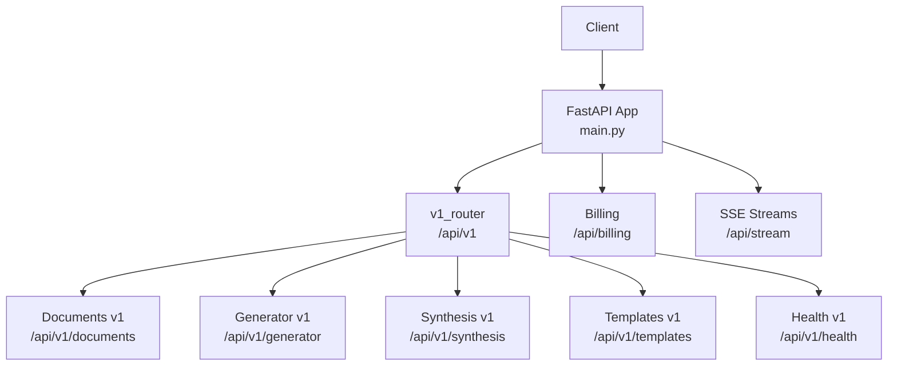
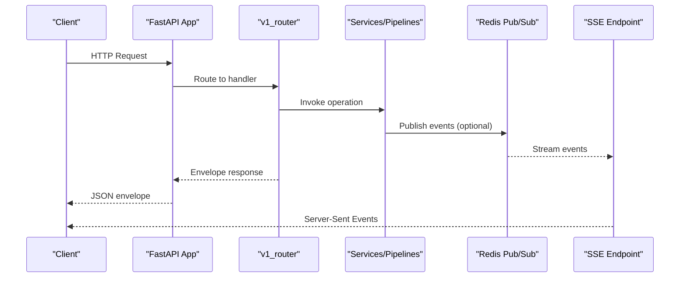
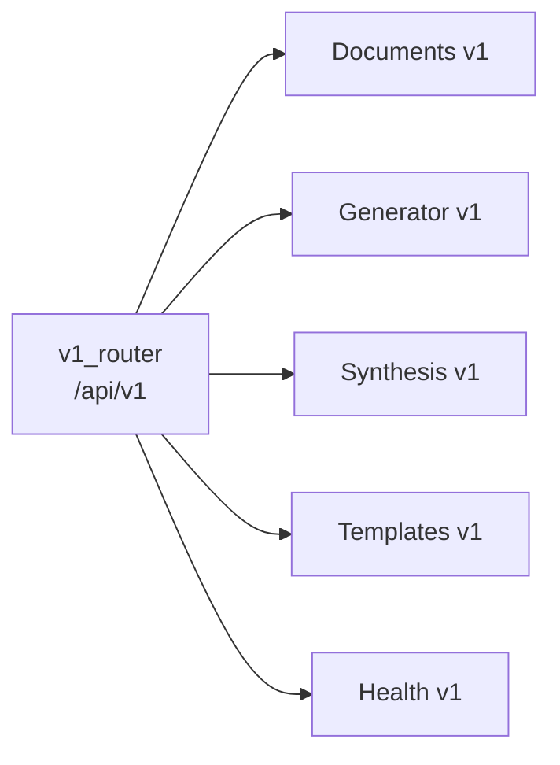

# API Reference

<cite>
**Referenced Files in This Document**
- [main.py](file://backend/app/main.py)
- [auth.py](file://backend/app/routers/auth.py)
- [documents.py](file://backend/app/routers/v1/documents.py)
- [generator.py](file://backend/app/routers/v1/generator.py)
- [synthesis.py](file://backend/app/routers/v1/synthesis.py)
- [templates.py](file://backend/app/routers/v1/templates.py)
- [health.py](file://backend/app/routers/v1/health.py)
- [billing.py](file://backend/app/routers/v1/billing.py)
- [stream.py](file://backend/app/routers/stream.py)
- [__init__.py](file://backend/app/routers/v1/__init__.py)
- [_helpers.py](file://backend/app/routers/v1/_helpers.py)
- [documents_legacy.py](file://backend/app/routers/documents.py)
- [generator_legacy.py](file://backend/app/routers/generator.py)
- [templates_legacy.py](file://backend/app/routers/templates.py)
</cite>

## Table of Contents
1. [Introduction](#introduction)
2. [Project Structure](#project-structure)
3. [Core Components](#core-components)
4. [Architecture Overview](#architecture-overview)
5. [Detailed Component Analysis](#detailed-component-analysis)
6. [Dependency Analysis](#dependency-analysis)
7. [Performance Considerations](#performance-considerations)
8. [Troubleshooting Guide](#troubleshooting-guide)
9. [Conclusion](#conclusion)
10. [Appendices](#appendices)

## Introduction
This document provides comprehensive API documentation for the backend REST endpoints and real-time communication protocols. It covers:
- REST endpoints for document processing, template management, generation, synthesis, and health/billing
- Real-time Server-Sent Events (SSE) for live updates
- Authentication and authorization requirements
- Request/response schemas, parameters, validation rules, and error codes
- Practical examples, client integration patterns, rate limiting, versioning, and backwards compatibility

## Project Structure
The backend is a FastAPI application with a versioned API surface under /api/v1 and several legacy routes maintained for backwards compatibility. Real-time updates are exposed via SSE endpoints.



**Diagram sources**
- [main.py:330-358](file://backend/app/main.py#L330-L358)
- [__init__.py:7-13](file://backend/app/routers/v1/__init__.py#L7-L13)

**Section sources**
- [main.py:262-383](file://backend/app/main.py#L262-L383)
- [__init__.py:1-14](file://backend/app/routers/v1/__init__.py#L1-L14)

## Core Components
- Versioned API: All primary features are exposed under /api/v1 with envelopes for standardized responses and error codes.
- Envelope helpers: Consistent success/error response builders and HTTP exception mapping.
- Real-time streaming: Redis-backed SSE for job/session events.
- Legacy compatibility: Legacy routes redirect to v1 equivalents with deprecation notices.

Key envelope behavior:
- Success responses wrap data with a request-scoped identifier.
- Error responses map HTTP status codes to named codes and include request context.

**Section sources**
- [_helpers.py:15-122](file://backend/app/routers/v1/_helpers.py#L15-L122)
- [health.py:17-42](file://backend/app/routers/v1/health.py#L17-L42)

## Architecture Overview
The API follows a layered design:
- Routers define endpoints and route to service/pipeline layers
- Services orchestrate business logic and integrate with external systems
- Pipelines handle document processing, generation, and synthesis
- Real-time subsystem emits events via Redis Pub/Sub to SSE clients



**Diagram sources**
- [main.py:330-358](file://backend/app/main.py#L330-L358)
- [stream.py:32-95](file://backend/app/routers/stream.py#L32-L95)
- [generator.py:401-433](file://backend/app/routers/v1/generator.py#L401-L433)
- [synthesis.py:174-206](file://backend/app/routers/v1/synthesis.py#L174-L206)

## Detailed Component Analysis

### Authentication and Authorization
- Base path: /api/auth
- Requires Supabase authentication; endpoints return user info or manage auth lifecycle
- Protected endpoints require a valid session

Endpoints:
- GET /api/auth/me → Returns authenticated user info
- POST /api/auth/signup → Triggers Supabase sign-up flow
- POST /api/auth/login → Triggers Supabase login flow
- POST /api/auth/forgot-password → Triggers OTP-based password reset initiation
- POST /api/auth/verify-otp → Stateless OTP verification
- POST /api/auth/reset-password → Finalizes password reset

Validation and errors:
- Schema-driven validation ensures required fields and constraints
- Typical errors: 400 invalid input, 401 unauthorized, 422 validation error, 500 internal error

Example request:
- POST /api/auth/login with JSON body containing email and password

Response envelope:
- Success: 200 OK with envelope-wrapped data
- Errors: 4xx mapped to named error codes via envelope helpers

**Section sources**
- [auth.py:15-59](file://backend/app/routers/auth.py#L15-L59)

### Documents API (v1)
Base path: /api/v1/documents

Endpoints:
- POST /api/v1/documents/upload
  - Upload a single document; returns job_id and initial status
  - Form fields: template, add_page_numbers, add_borders, add_cover_page, generate_toc, add_line_numbers, line_spacing, page_size, fast_mode
  - File field: file (multipart/form-data)
  - Validation: file type, size, magic bytes, path traversal checks
  - Ownership: requires authenticated user
  - Response: envelope-wrapped job metadata

- POST /api/v1/documents/upload/chunked
  - Upload large files in chunks; validates chunk size and reassembly limits
  - Form fields: file_id, chunk_index, total_chunks, template, formatting options
  - Validation: chunk size ≤ 5MB, total size ≤ configured MAX_FILE_SIZE
  - Response: completion payload with job_id and file hash

- GET /api/v1/documents
  - List user’s documents with filters: status, template, date range
  - Pagination: limit (1–100), offset
  - Response: envelope-wrapped array with total count

- GET /api/v1/documents/{jobId}/status
  - Detailed processing status with phases and progress
  - Ownership check: returns 403 if not owner
  - Response: envelope-wrapped status object

- GET /api/v1/documents/{jobId}/summary
  - Lightweight summary for hydration
  - Response: envelope-wrapped summary

- POST /api/v1/documents/{jobId}/edit
  - Submit edited structured data to re-run formatting
  - Body: edited_structured_data
  - Response: envelope-wrapped status

- GET /api/v1/documents/{jobId}/preview
  - Structured preview data and quality metrics
  - Response: envelope-wrapped preview object

- GET /api/v1/documents/{jobId}/compare
  - Side-by-side comparison data
  - Response: envelope-wrapped comparison object

- GET /api/v1/documents/{jobId}/download
  - Download formatted document; supports docx/pdf
  - Query params: format (docx|pdf), token, expires (optional signed URLs)
  - Response: binary attachment or error

- DELETE /api/v1/documents/{jobId}
  - Delete a document job
  - Response: envelope-wrapped deletion result

- POST /api/v1/documents/batch-upload
  - Upload multiple files (2–6) in one request
  - Response: envelope-wrapped batch metadata

Validation rules:
- File types: docx, doc, pdf, odt, rtf, tex, txt, html, htm, md, markdown
- Text files must be valid UTF-8
- Magic bytes validated for binary formats
- Size limits enforced via settings
- Path traversal protection for filenames

Error codes (selected):
- 400 INVALID_UPLOAD_REQUEST, DOCUMENT_TOO_LARGE, DOCUMENT_VALIDATION_FAILED
- 403 DOCUMENT_ACCESS_DENIED
- 404 DOCUMENT_NOT_FOUND
- 413 PAYLOAD_TOO_LARGE
- 429 UPLOAD_LIMIT_REACHED
- 503 DATABASE_UNAVAILABLE

**Section sources**
- [documents.py:32-359](file://backend/app/routers/v1/documents.py#L32-L359)
- [documents_legacy.py:468-800](file://backend/app/routers/documents.py#L468-L800)

### Generator API (v1)
Base path: /api/v1/generator

Sessions:
- POST /api/v1/generator/sessions
  - Start a generation session
  - Supports two modes:
    - multi_doc: upload 2–6 files; returns session_id
    - agent: requires JSON with session_type=agent and prompt; returns session_id
  - Form fields: session_type, template, config (JSON string), files (multipart)
  - Response: envelope-wrapped session metadata

- GET /api/v1/generator/sessions
  - List recent sessions for the user
  - Response: envelope-wrapped sessions array

- GET /api/v1/generator/sessions/{sessionId}
  - Retrieve session details and latest document path
  - Response: envelope-wrapped session object

- GET /api/v1/generator/sessions/{sessionId}/messages
  - Retrieve conversation history
  - Response: envelope-wrapped messages array

- GET /api/v1/generator/sessions/{sessionId}/document
  - Retrieve latest generated document content and metadata
  - Response: envelope-wrapped document object

- GET /api/v1/generator/sessions/{sessionId}/download
  - Download generated document (docx/pdf)
  - Response: FileResponse or error

- GET /api/v1/generator/sessions/{sessionId}/events
  - Real-time SSE stream for session events
  - Response: EventSourceResponse

- POST /api/v1/generator/sessions/{sessionId}/messages
  - Send a message to the session; answers using retrieved sources and LLM
  - Response: envelope-wrapped assistant reply with sources

- POST /api/v1/generator/sessions/{sessionId}/outline/approve
  - Approve an outline to resume generation
  - Response: envelope-wrapped status

- POST /api/v1/generator/sessions/{sessionId}/stop
  - Stop a running session; updates status and emits SSE
  - Response: envelope-wrapped cancellation status

Validation and errors:
- 400 INVALID_EXPORT_FORMAT
- 403 GENERATION_ACCESS_DENIED
- 404 SESSION_NOT_FOUND
- 409 SESSION_NOT_READY
- 422 INVALID_SESSION_REQUEST, INVALID_MESSAGE

**Section sources**
- [generator.py:150-573](file://backend/app/routers/v1/generator.py#L150-L573)

### Synthesis API (v1)
Base path: /api/v1/synthesis

Sessions:
- POST /api/v1/synthesis/sessions
  - Create a multi-document synthesis session
  - Upload 2–6 files; returns session_id
  - Form fields: files (multipart), session_type (must be multi_doc), template, config (JSON string)
  - Response: envelope-wrapped session metadata

- GET /api/v1/synthesis/sessions/{sessionId}
  - Retrieve session details and latest document path
  - Response: envelope-wrapped session object

- GET /api/v1/synthesis/sessions/{sessionId}/events
  - Real-time SSE stream for synthesis events
  - Response: EventSourceResponse

- POST /api/v1/synthesis/sessions/{sessionId}/messages
  - Ask questions about the synthesized content; answers drawn from stored sources
  - Response: envelope-wrapped assistant reply with sources

Validation and errors:
- 400 INVALID_UPLOAD_REQUEST, DOCUMENT_TOO_LARGE
- 404 SESSION_NOT_FOUND
- 413 PAYLOAD_TOO_LARGE
- 422 INVALID_SESSION_REQUEST, INVALID_MESSAGE

**Section sources**
- [synthesis.py:70-260](file://backend/app/routers/v1/synthesis.py#L70-L260)

### Templates API (v1)
Base path: /api/v1/templates

Built-in templates:
- GET /api/v1/templates
  - Lists public built-in templates
  - Response: envelope-wrapped templates array

CSL styles:
- GET /api/v1/templates/csl/search?q={query}
  - Search CSL styles by keyword
  - Response: envelope-wrapped results

- GET /api/v1/templates/csl/fetch?slug={slug}
  - Fetch CSL XML by style slug
  - Response: envelope-wrapped style XML

- GET /api/v1/templates/csl/{styleId}
  - Fetch CSL XML by style id/slug
  - Response: envelope-wrapped style XML

Custom templates (authenticated):
- GET /api/v1/templates/custom
  - List user’s custom templates
  - Response: envelope-wrapped templates array

- POST /api/v1/templates/custom
  - Create a custom template
  - Body: template payload with name, description, config/settings
  - Response: envelope-wrapped created template

- PUT /api/v1/templates/custom/{templateId}
  - Update a custom template
  - Response: envelope-wrapped updated template

- DELETE /api/v1/templates/custom/{templateId}
  - Delete a custom template
  - Response: envelope-wrapped deletion result

Validation and errors:
- 401 UNAUTHORIZED
- 404 TEMPLATE_NOT_FOUND
- 422 INVALID_TEMPLATE_PAYLOAD
- 500 TEMPLATE_LIST_FAILED, TEMPLATE_CREATE_FAILED, TEMPLATE_UPDATE_FAILED, TEMPLATE_DELETE_FAILED

**Section sources**
- [templates.py:20-189](file://backend/app/routers/v1/templates.py#L20-L189)
- [templates_legacy.py:119-327](file://backend/app/routers/templates.py#L119-L327)

### Health and Readiness
Base path: /api/v1/health

- GET /api/v1/health
  - Compatibility health endpoint
  - Response: envelope-wrapped alive status

- GET /api/v1/health/live
  - Liveness probe
  - Response: envelope-wrapped alive status

- GET /api/v1/health/ready
  - Readiness probe; evaluates database and model readiness
  - Response: envelope-wrapped readiness payload or error

**Section sources**
- [health.py:17-42](file://backend/app/routers/v1/health.py#L17-L42)

### Billing Webhooks
Base path: /api/billing

- POST /api/billing/webhook
  - Stripe webhook endpoint
  - Validates signature and updates user billing status and plan tier
  - Response: envelope-wrapped confirmation

Security:
- Requires STRIPE_WEBHOOK_SECRET and STRIPE_API_KEY configured
- Updates Supabase profiles with billing metadata

**Section sources**
- [billing.py:52-131](file://backend/app/routers/v1/billing.py#L52-L131)

### Real-Time Communication (SSE)
Base path: /api/stream

- GET /api/stream/{jobId}
  - Subscribe to real-time events for a job
  - Requires authentication
  - Emits Server-Sent Events with event types and payloads
  - On connect, sends a “connected” event

Usage pattern:
- Clients establish an SSE connection to receive progress updates and notifications
- Events are published to Redis channels and forwarded to connected clients

**Section sources**
- [stream.py:32-95](file://backend/app/routers/stream.py#L32-L95)

## Dependency Analysis
The v1 router aggregates all feature-specific routers and prefixes them appropriately. Envelope helpers centralize response formatting and error mapping.



**Diagram sources**
- [__init__.py:7-13](file://backend/app/routers/v1/__init__.py#L7-L13)

**Section sources**
- [__init__.py:1-14](file://backend/app/routers/v1/__init__.py#L1-L14)

## Performance Considerations
- File size limits and chunked uploads reduce memory pressure and improve reliability for large documents.
- SSE connections are tracked for metrics; ensure clients disconnect properly to free resources.
- Background task dispatch uses Celery when available; otherwise uses background tasks for lightweight flows.
- Caching of status responses reduces repeated database queries for frequent polling.

## Troubleshooting Guide
Common issues and resolutions:
- 401 Unauthorized: Ensure a valid session is present for protected endpoints.
- 403 Forbidden: Access denied if not owner of the resource.
- 404 Not Found: Resource missing; verify identifiers and permissions.
- 413 Payload Too Large: Reduce file size or split into chunks.
- 422 Validation Error: Fix input fields according to endpoint requirements.
- 429 Rate Limited: Implement exponential backoff and adhere to rate limits.
- 500 Internal Server Error: Inspect logs and Sentry for unhandled exceptions.

Operational checks:
- Use /api/v1/health/ready to verify service readiness.
- Monitor /metrics for latency and queue depths.

**Section sources**
- [_helpers.py:15-28](file://backend/app/routers/v1/_helpers.py#L15-L28)
- [main.py:360-383](file://backend/app/main.py#L360-L383)

## Conclusion
This API provides a robust, versioned interface for document processing, generation, synthesis, and template management, with standardized responses, comprehensive validation, and real-time updates. Backwards compatibility is maintained through legacy route redirections, and operational endpoints support health and billing integration.

## Appendices

### Authentication and Authorization
- All authenticated endpoints require a valid session.
- Token handling and RBAC are enforced via dependencies and middleware.

**Section sources**
- [auth.py:15-59](file://backend/app/routers/auth.py#L15-L59)

### Rate Limiting and Abuse Detection
- Global rate limiter: 60 requests per minute.
- Tier-based rate limiting: guest daily limit configurable.
- Abuse detection records generation requests and LLM calls.

**Section sources**
- [main.py:294-296](file://backend/app/main.py#L294-L296)
- [generator.py:156-158](file://backend/app/routers/v1/generator.py#L156-L158)

### Versioning and Backwards Compatibility
- v1 is the primary API surface; legacy routes redirect to v1 equivalents with deprecation notices.
- Health endpoints remain at /api/v1/health for compatibility.

**Section sources**
- [__init__.py:7-13](file://backend/app/routers/v1/__init__.py#L7-L13)
- [documents.py:32-83](file://backend/app/routers/v1/documents.py#L32-L83)
- [generator.py:35-46](file://backend/app/routers/v1/generator.py#L35-L46)
- [templates.py:19-30](file://backend/app/routers/v1/templates.py#L19-L30)

### Example Workflows

#### Upload and Process a Document
```http
POST /api/v1/documents/upload
Authorization: Bearer <token>
Content-Type: multipart/form-data

Form fields:
- file: <binary>
- template: "apa"
- add_page_numbers: true
- page_size: "Letter"
```
Response:
- Envelope-wrapped job_id and initial status

#### Start a Generation Session (Agent)
```http
POST /api/v1/generator/sessions
Authorization: Bearer <token>
Content-Type: application/json

{
  "session_type": "agent",
  "prompt": "Write a paper on AI in education",
  "template": "apa",
  "config": {}
}
```
Response:
- Envelope-wrapped session_id and status

#### Subscribe to Session Events
```http
GET /api/v1/generator/sessions/{sessionId}/events
Authorization: Bearer <token>
```
Response:
- Server-Sent Events stream

#### Download Generated Document
```http
GET /api/v1/generator/sessions/{sessionId}/download?format=pdf
Authorization: Bearer <token>
```
Response:
- Binary PDF file

#### Real-Time Job Updates
```http
GET /api/stream/{jobId}
Authorization: Bearer <token>
```
Response:
- SSE stream of job events

**Section sources**
- [documents.py:117-162](file://backend/app/routers/v1/documents.py#L117-L162)
- [generator.py:150-289](file://backend/app/routers/v1/generator.py#L150-L289)
- [stream.py:60-70](file://backend/app/routers/stream.py#L60-L70)