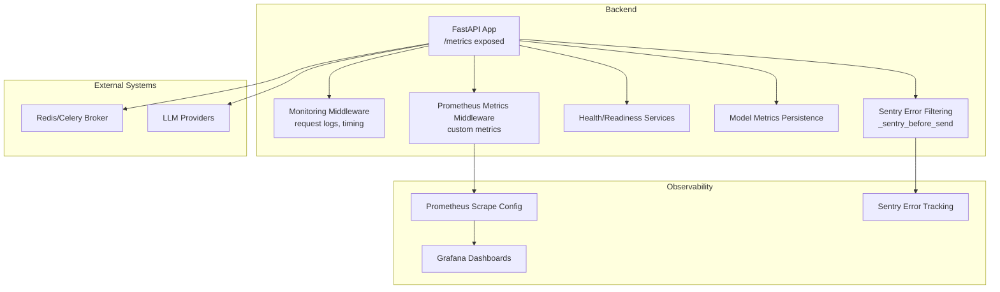
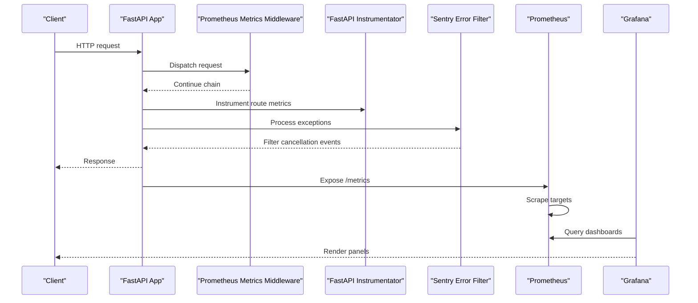
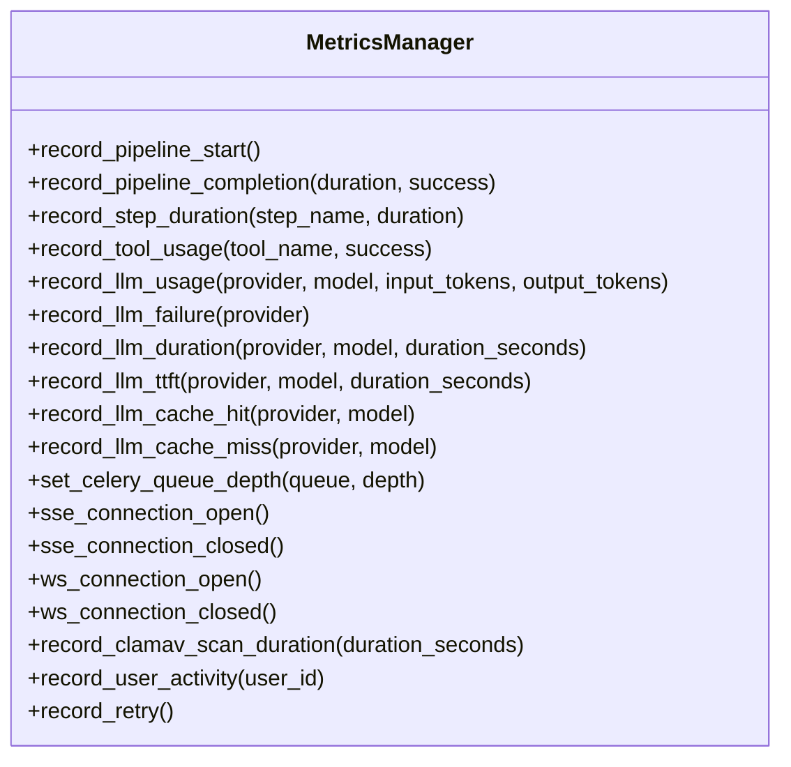
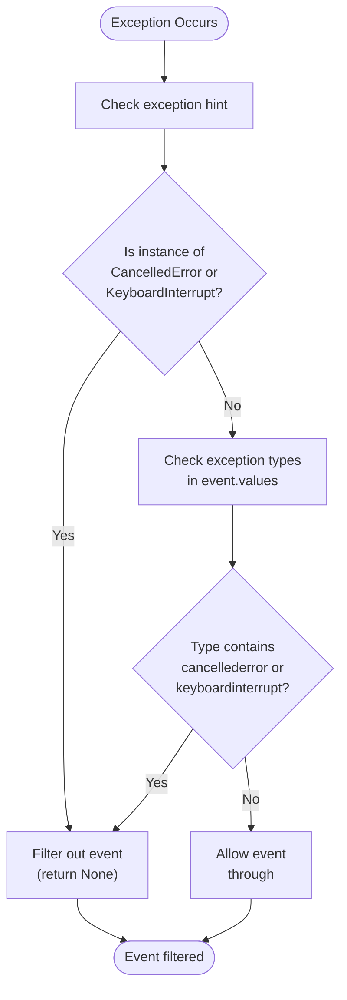
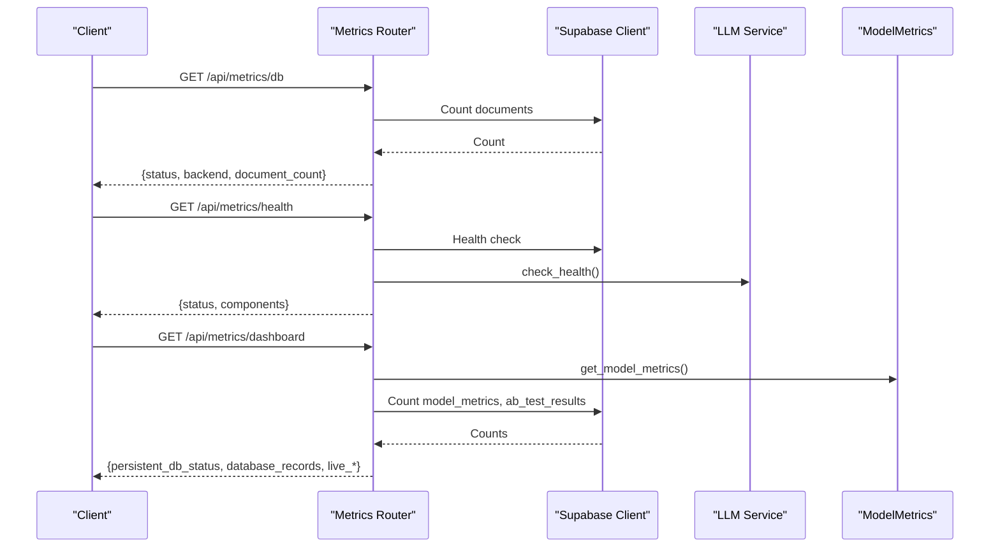
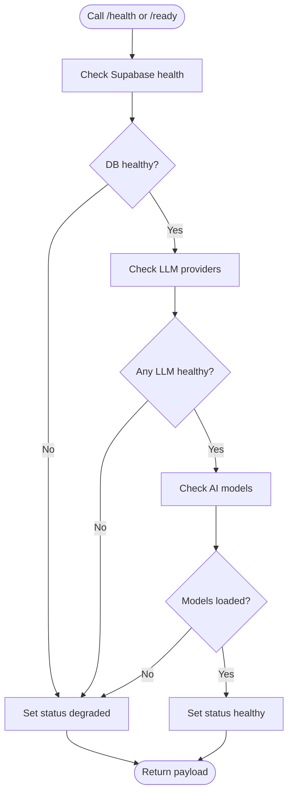
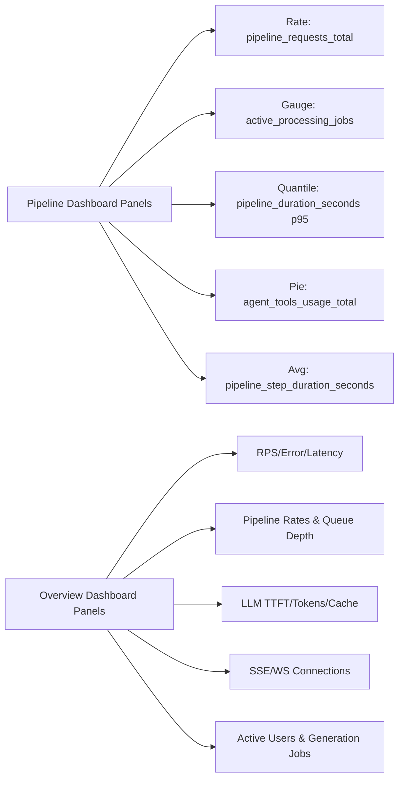
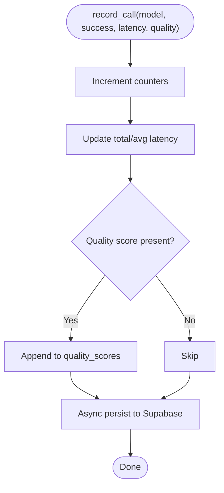
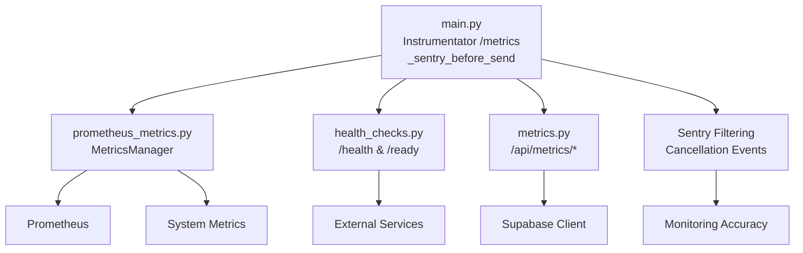

# Monitoring & Metrics

<cite>
**Referenced Files in This Document**
- [main.py](file://backend/app/main.py)
- [prometheus_metrics.py](file://backend/app/middleware/prometheus_metrics.py)
- [monitoring.py](file://backend/app/middleware/monitoring.py)
- [metrics.py](file://backend/app/routers/metrics.py)
- [settings.py](file://backend/app/config/settings.py)
- [health_checks.py](file://backend/app/services/health_checks.py)
- [model_metrics.py](file://backend/app/services/model_metrics.py)
- [metrics.py](file://backend/app/pipeline/agents/metrics.py)
- [pipeline.json](file://backend/docker/grafana/dashboards/pipeline.json)
- [scholarform-overview.json](file://backend/ops/grafana/dashboards/scholarform-overview.json)
- [prometheus.yml](file://backend/docker/prometheus/prometheus.yml)
- [prometheus.yml](file://backend/ops/prometheus/prometheus.yml)
- [docker-compose.yml](file://backend/docker/docker-compose.yml)
- [sentry.client.config.js](file://frontend/sentry.client.config.js)
- [sentry.server.config.js](file://frontend/sentry.server.config.js)
- [sentry.edge.config.js](file://frontend/sentry.edge.config.js)
</cite>

## Update Summary
**Changes Made**
- Enhanced Sentry error filtering section to document the new `_sentry_before_send` function
- Added detailed explanation of cancellation event filtering for improved error reporting accuracy
- Updated error handling and monitoring integration sections
- Expanded troubleshooting guide with Sentry-specific guidance

## Table of Contents
1. [Introduction](#introduction)
2. [Project Structure](#project-structure)
3. [Core Components](#core-components)
4. [Architecture Overview](#architecture-overview)
5. [Detailed Component Analysis](#detailed-component-analysis)
6. [Dependency Analysis](#dependency-analysis)
7. [Performance Considerations](#performance-considerations)
8. [Troubleshooting Guide](#troubleshooting-guide)
9. [Conclusion](#conclusion)
10. [Appendices](#appendices)

## Introduction
This document describes the monitoring and metrics system for the Automated Academic Docx Manuscript Formatter. It covers Prometheus instrumentation, custom metrics collection, Grafana dashboards, health and readiness checks, alerting strategies, log aggregation, distributed tracing integration, and enhanced error filtering with Sentry. It also provides guidance on metric retention, capacity planning, and production best practices.

## Project Structure
The monitoring stack integrates:
- Prometheus scraping of the FastAPI application's /metrics endpoint
- Grafana dashboards for pipeline, LLM, and business KPIs
- Health and readiness endpoints for platform observability
- Custom metrics for pipeline performance, queue depths, processing times, and error rates
- Enhanced Sentry error filtering that removes cancellation events and keyboard interrupts
- Optional persistence of model metrics to Supabase

**Diagram sources**
- [main.py:273-274](file://backend/app/main.py#L273-L274)
- [prometheus_metrics.py:135-142](file://backend/app/middleware/prometheus_metrics.py#L135-L142)
- [monitoring.py:13-51](file://backend/app/middleware/monitoring.py#L13-L51)
- [health_checks.py:85-127](file://backend/app/services/health_checks.py#L85-L127)
- [model_metrics.py:101-137](file://backend/app/services/model_metrics.py#L101-L137)
- [main.py:47-66](file://backend/app/main.py#L47-L66)
- [prometheus.yml:5-16](file://backend/docker/prometheus/prometheus.yml#L5-L16)
- [scholarform-overview.json:1-239](file://backend/ops/grafana/dashboards/scholarform-overview.json#L1-L239)

**Section sources**
- [main.py:273-274](file://backend/app/main.py#L273-L274)
- [prometheus_metrics.py:135-142](file://backend/app/middleware/prometheus_metrics.py#L135-L142)
- [monitoring.py:13-51](file://backend/app/middleware/monitoring.py#L13-L51)
- [health_checks.py:85-127](file://backend/app/services/health_checks.py#L85-L127)
- [model_metrics.py:101-137](file://backend/app/services/model_metrics.py#L101-L137)
- [main.py:47-66](file://backend/app/main.py#L47-L66)
- [prometheus.yml:5-16](file://backend/docker/prometheus/prometheus.yml#L5-L16)
- [scholarform-overview.json:1-239](file://backend/ops/grafana/dashboards/scholarform-overview.json#L1-L239)

## Core Components
- Prometheus instrumentation and custom metrics:
  - Pipeline request volume, durations, and step durations
  - Agent tool usage, LLM token consumption, TTFT, cache hits/misses, failures
  - Queue depths (Celery), real-time connections (SSE/WebSocket)
  - Active users and ClamAV scan durations
- Enhanced Sentry error filtering:
  - Automatic filtering of asyncio.CancelledError and KeyboardInterrupt exceptions
  - Prevention of noise in monitoring system from intentional cancellations
  - Improved accuracy of error reporting for genuine issues
- Metrics exposure:
  - FastAPI instrumentation exposes /metrics
  - Dedicated metrics router endpoints for DB health, dashboard summary, and enhancements
- Health and readiness:
  - Health endpoint aggregates DB, LLM providers, and AI models
  - Readiness endpoint validates DB, external services, and model availability
- Grafana dashboards:
  - Pipeline dashboard for throughput, latency, and step breakdown
  - Overview dashboard for RPS, error rate, latency, pipeline, LLM, real-time, and business KPIs
- Persistence and summaries:
  - Model metrics recorded and persisted asynchronously to Supabase
  - Agent vs legacy performance tracking stored locally and summarized

**Section sources**
- [prometheus_metrics.py:15-131](file://backend/app/middleware/prometheus_metrics.py#L15-L131)
- [prometheus_metrics.py:144-235](file://backend/app/middleware/prometheus_metrics.py#L144-L235)
- [metrics.py:18-201](file://backend/app/routers/metrics.py#L18-L201)
- [main.py:360-380](file://backend/app/main.py#L360-L380)
- [health_checks.py:130-192](file://backend/app/services/health_checks.py#L130-L192)
- [model_metrics.py:23-181](file://backend/app/services/model_metrics.py#L23-L181)
- [metrics.py:48-260](file://backend/app/pipeline/agents/metrics.py#L48-L260)
- [pipeline.json:1-448](file://backend/docker/grafana/dashboards/pipeline.json#L1-L448)
- [scholarform-overview.json:1-239](file://backend/ops/grafana/dashboards/scholarform-overview.json#L1-L239)
- [main.py:47-66](file://backend/app/main.py#L47-L66)

## Architecture Overview
The monitoring architecture integrates Prometheus scraping, custom metrics recording, and Grafana visualization. Enhanced Sentry error filtering prevents cancellation events from cluttering error reports. Health and readiness endpoints provide operational signals. Optional Supabase persistence captures model performance for long-term analysis.

**Diagram sources**
- [main.py:273-274](file://backend/app/main.py#L273-L274)
- [prometheus_metrics.py:135-142](file://backend/app/middleware/prometheus_metrics.py#L135-L142)
- [main.py:47-66](file://backend/app/main.py#L47-L66)
- [prometheus.yml:5-16](file://backend/docker/prometheus/prometheus.yml#L5-L16)
- [scholarform-overview.json:1-239](file://backend/ops/grafana/dashboards/scholarform-overview.json#L1-L239)

## Detailed Component Analysis

### Prometheus Metrics Middleware
Defines and records custom metrics for:
- Pipeline: total requests, duration histograms, per-step durations
- Agents: tool usage, retries, LLM token consumption, TTFT, cache stats, failures
- System: active processing jobs, queue depths, real-time connections, ClamAV scans, active users

**Diagram sources**
- [prometheus_metrics.py:144-235](file://backend/app/middleware/prometheus_metrics.py#L144-L235)

**Section sources**
- [prometheus_metrics.py:15-131](file://backend/app/middleware/prometheus_metrics.py#L15-L131)
- [prometheus_metrics.py:144-235](file://backend/app/middleware/prometheus_metrics.py#L144-L235)

### Enhanced Sentry Error Filtering
The backend now includes sophisticated error filtering that prevents cancellation events and keyboard interrupts from appearing in Sentry error reports. This improves the accuracy of monitoring by eliminating noise from intentional cancellations.

**Updated** Enhanced error filtering with _sentry_before_send function that automatically filters out asyncio.CancelledError and KeyboardInterrupt exceptions

**Diagram sources**
- [main.py:47-66](file://backend/app/main.py#L47-L66)

**Section sources**
- [main.py:47-66](file://backend/app/main.py#L47-L66)

### Metrics Exposure and Endpoints
- /metrics: Prometheus scrape endpoint handled by middleware
- /api/metrics/db: Lightweight DB health and document count
- /api/metrics/health: Aggregated health across DB, LLM providers, and AI models
- /api/metrics/dashboard: Live summaries of model metrics, A/B testing, and DB record counts
- /api/metrics/enhancements: Capability profile and queue status

**Diagram sources**
- [metrics.py:25-181](file://backend/app/routers/metrics.py#L25-L181)
- [health_checks.py:85-127](file://backend/app/services/health_checks.py#L85-L127)
- [model_metrics.py:148-181](file://backend/app/services/model_metrics.py#L148-L181)

**Section sources**
- [metrics.py:18-201](file://backend/app/routers/metrics.py#L18-L201)
- [health_checks.py:85-127](file://backend/app/services/health_checks.py#L85-L127)
- [model_metrics.py:148-181](file://backend/app/services/model_metrics.py#L148-L181)

### Health and Readiness
- Health endpoint aggregates DB, LLM providers, and AI models; returns 200 healthy or 503 degraded
- Readiness endpoint validates DB, external services, and model loading; used by orchestrators for startup gating

**Diagram sources**
- [health_checks.py:85-127](file://backend/app/services/health_checks.py#L85-L127)
- [health_checks.py:130-192](file://backend/app/services/health_checks.py#L130-L192)

**Section sources**
- [health_checks.py:85-127](file://backend/app/services/health_checks.py#L85-L127)
- [health_checks.py:130-192](file://backend/app/services/health_checks.py#L130-L192)

### Grafana Dashboards
- Pipeline dashboard: request rate by status, active jobs gauge, P95 pipeline duration, tool usage distribution, average step duration
- Overview dashboard: RPS, error rate, latency; pipeline completed/failed rates and queue depth; LLM TTFT, tokens/sec, cache hit rate; SSE/WS connections; active users and generation jobs

**Diagram sources**
- [pipeline.json:101-426](file://backend/docker/grafana/dashboards/pipeline.json#L101-L426)
- [scholarform-overview.json:39-202](file://backend/ops/grafana/dashboards/scholarform-overview.json#L39-L202)

**Section sources**
- [pipeline.json:1-448](file://backend/docker/grafana/dashboards/pipeline.json#L1-L448)
- [scholarform-overview.json:1-239](file://backend/ops/grafana/dashboards/scholarform-overview.json#L1-L239)

### Model Metrics Persistence and Summaries
- Records model usage, latency, success/failure, and optional quality scores
- Asynchronously persists to Supabase; disables persistence if table not found
- Provides summaries and comparisons for model performance and fallback rates

**Diagram sources**
- [model_metrics.py:60-137](file://backend/app/services/model_metrics.py#L60-L137)

**Section sources**
- [model_metrics.py:23-181](file://backend/app/services/model_metrics.py#L23-L181)

### Agent vs Legacy Performance Tracking
- Tracks processing runs, tool usage, retries, and quality metrics
- Stores metrics in JSONL and maintains a summary with speed, quality, and reliability comparisons

**Section sources**
- [metrics.py:15-260](file://backend/app/pipeline/agents/metrics.py#L15-L260)

### Queue Depth Metrics and Periodic Updates
- Periodically reads Redis queue lengths and updates Celery queue depth metrics
- Runs on a background task during app lifespan

**Section sources**
- [main.py:117-147](file://backend/app/main.py#L117-L147)

## Dependency Analysis
Key dependencies and relationships:
- FastAPI instrumentation exposes /metrics
- Prometheus scrapes the backend target defined in prometheus.yml
- Grafana queries Prometheus for dashboards
- Enhanced Sentry error filtering prevents cancellation events from reaching monitoring
- Metrics router depends on Supabase client for DB health and counts
- Health/Readiness services depend on external systems (DB, LLM providers, AI models)
- Model metrics persistence depends on Supabase client and runs in background threads

**Diagram sources**
- [main.py:273-274](file://backend/app/main.py#L273-L274)
- [prometheus_metrics.py:144-235](file://backend/app/middleware/prometheus_metrics.py#L144-L235)
- [metrics.py:25-181](file://backend/app/routers/metrics.py#L25-L181)
- [health_checks.py:85-127](file://backend/app/services/health_checks.py#L85-L127)
- [main.py:47-66](file://backend/app/main.py#L47-L66)

**Section sources**
- [main.py:273-274](file://backend/app/main.py#L273-L274)
- [prometheus_metrics.py:144-235](file://backend/app/middleware/prometheus_metrics.py#L144-L235)
- [metrics.py:25-181](file://backend/app/routers/metrics.py#L25-L181)
- [health_checks.py:85-127](file://backend/app/services/health_checks.py#L85-L127)
- [main.py:47-66](file://backend/app/main.py#L47-L66)

## Performance Considerations
- Scraping cadence and intervals:
  - Prometheus scrape interval configured to 5s for the backend job
  - Global evaluation interval at 15s
- Metric cardinality:
  - Use label selectors and bucket configurations judiciously to avoid excessive series
- Background persistence:
  - Model metrics persistence runs in a background thread to avoid blocking the pipeline
- Queue depth updates:
  - Periodic updates reduce overhead while keeping queue metrics fresh
- Caching:
  - Health and readiness payloads are cached with TTLs to reduce repeated checks
- Error filtering efficiency:
  - Sentry filtering reduces processing overhead by preventing cancellation events from being logged

**Section sources**
- [prometheus.yml:5-16](file://backend/docker/prometheus/prometheus.yml#L5-L16)
- [model_metrics.py:101-137](file://backend/app/services/model_metrics.py#L101-L137)
- [main.py:138-147](file://backend/app/main.py#L138-L147)
- [health_checks.py:195-226](file://backend/app/services/health_checks.py#L195-L226)
- [main.py:47-66](file://backend/app/main.py#L47-L66)

## Troubleshooting Guide
Common issues and resolutions:
- No metrics in Grafana:
  - Verify Prometheus scrape job target matches backend address and port
  - Confirm /metrics endpoint is reachable and returns text/plain
- Missing Supabase table for model metrics:
  - Persistence disables itself after detecting missing table; ensure table exists or adjust expectations
- Health/Readiness degraded:
  - Check DB connectivity, LLM provider availability, and AI model loading status
- High error rate or latency spikes:
  - Inspect pipeline P95 duration and step averages; correlate with queue depths and LLM cache hit rates
- Real-time connection churn:
  - Monitor SSE/WS reconnect rates and active connections to detect client-side instability
- **Sentry error filtering issues**:
  - **Updated** Verify that cancellation events (asyncio.CancelledError, KeyboardInterrupt) are properly filtered out
  - Check _sentry_before_send function configuration in main.py
  - Ensure legitimate errors are still being reported while cancellations are suppressed
  - Review Sentry dashboard to confirm reduced noise from intentional cancellations

**Section sources**
- [prometheus.yml:5-16](file://backend/docker/prometheus/prometheus.yml#L5-L16)
- [model_metrics.py:123-135](file://backend/app/services/model_metrics.py#L123-L135)
- [health_checks.py:85-127](file://backend/app/services/health_checks.py#L85-L127)
- [scholarform-overview.json:41-202](file://backend/ops/grafana/dashboards/scholarform-overview.json#L41-L202)
- [main.py:47-66](file://backend/app/main.py#L47-L66)

## Conclusion
The monitoring and metrics system provides comprehensive observability for the manuscript formatter pipeline. It combines Prometheus instrumentation, custom metrics, health/readiness endpoints, and Grafana dashboards. Enhanced Sentry error filtering with cancellation event suppression improves error reporting accuracy by reducing noise from intentional cancellations. Optional Supabase persistence enables long-term analysis of model performance. With proper alerting and capacity planning aligned to queue depths and LLM usage, the system supports reliable production operations.

## Appendices

### Metrics Exposure Endpoints
- /metrics: Prometheus scrape endpoint
- /api/metrics/db: Database health and document count
- /api/metrics/health: Aggregated health status
- /api/metrics/dashboard: Live model and A/B test summaries
- /api/metrics/enhancements: Enhancement capability profile

**Section sources**
- [prometheus_metrics.py:135-142](file://backend/app/middleware/prometheus_metrics.py#L135-L142)
- [metrics.py:25-181](file://backend/app/routers/metrics.py#L25-L181)

### Custom Metric Definitions
- Pipeline: requests_total, pipeline_duration_seconds, pipeline_step_duration_seconds
- Agent: agent_tools_usage_total, agent_llm_tokens_total, agent_retries_total
- LLM: llm_failures_total, llm_ttft_seconds, llm_cache_hits_total, llm_cache_misses_total, llm_request_duration_seconds
- System: active_processing_jobs, celery_queue_depth, sse/ws connections, clamav_scan_duration_seconds, active_users

**Section sources**
- [prometheus_metrics.py:15-131](file://backend/app/middleware/prometheus_metrics.py#L15-L131)

### Alerting Strategies
- Suggested alerts:
  - High pipeline failure rate or sustained P95 latency increases
  - Low LLM cache hit rate or frequent failures
  - Elevated error rate from HTTP instrumentor
  - Rising queue depths without corresponding worker throughput
  - Declining active users or generation jobs
  - **Enhanced Sentry monitoring**: Reduced error volume due to cancellation filtering, allowing focus on genuine issues

### Log Aggregation and Distributed Tracing
- Structured logging can be enabled via settings for production environments
- **Enhanced Sentry integration**:
  - Backend: _sentry_before_send filters cancellation events and keyboard interrupts
  - Frontend: Separate client/server configurations for comprehensive coverage
  - Request IDs are attached to responses for correlation across services
  - Replay integration for frontend error analysis

**Section sources**
- [settings.py:26-28](file://backend/app/config/settings.py#L26-L28)
- [main.py:40-59](file://backend/app/main.py#L40-L59)
- [monitoring.py:17-50](file://backend/app/middleware/monitoring.py#L17-L50)
- [main.py:47-66](file://backend/app/main.py#L47-L66)
- [sentry.client.config.js:1-20](file://frontend/sentry.client.config.js#L1-L20)
- [sentry.server.config.js:1-12](file://frontend/sentry.server.config.js#L1-L12)
- [sentry.edge.config.js:1-11](file://frontend/sentry.edge.config.js#L1-L11)

### Metric Retention and Capacity Planning
- Retention policy:
  - File cleanup scheduled periodically based on settings; configure retention_days accordingly
- Capacity planning insights:
  - Monitor queue_depth and active_processing_jobs to size Celery workers
  - Track LLM tokens_total and cache hit rates to right-size provider resources
  - Observe pipeline step durations to optimize slowest stages
  - **Enhanced error monitoring**: Reduced error volume allows better focus on genuine performance issues

**Section sources**
- [settings.py:128-131](file://backend/app/config/settings.py#L128-L131)
- [main.py:106-114](file://backend/app/main.py#L106-L114)
- [main.py:138-147](file://backend/app/main.py#L138-L147)
- [scholarform-overview.json:88-125](file://backend/ops/grafana/dashboards/scholarform-overview.json#L88-L125)

### Production Monitoring Best Practices
- Enforce HTTPS and HSTS headers in production
- Configure CORS origins carefully
- Use readiness probes to gate traffic until dependencies are ready
- Set appropriate scrape intervals and alert thresholds
- Back up and monitor dashboards and recording rules
- **Implement enhanced error filtering**: Configure _sentry_before_send for optimal error reporting
- **Monitor cancellation patterns**: Track cancellation events separately from other errors for system health insights

**Section sources**
- [main.py:303-313](file://backend/app/main.py#L303-L313)
- [settings.py:76-82](file://backend/app/config/settings.py#L76-L82)
- [health_checks.py:130-192](file://backend/app/services/health_checks.py#L130-L192)
- [main.py:47-66](file://backend/app/main.py#L47-L66)