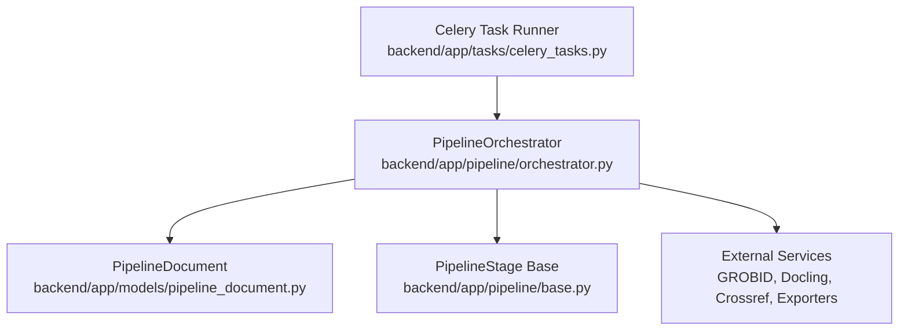
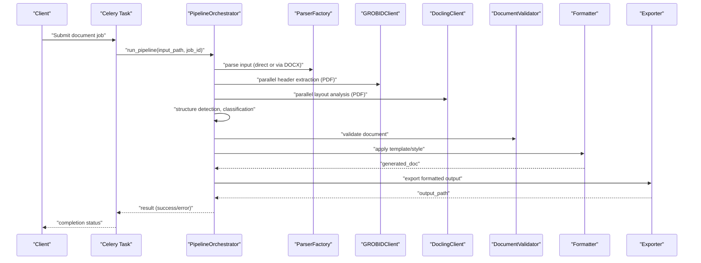
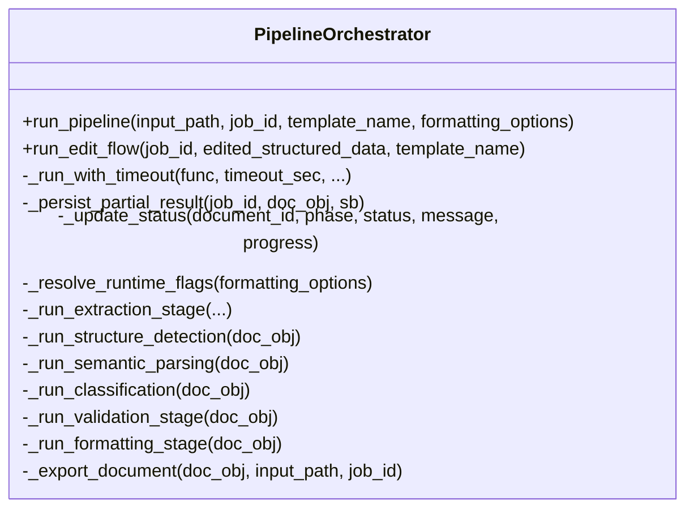
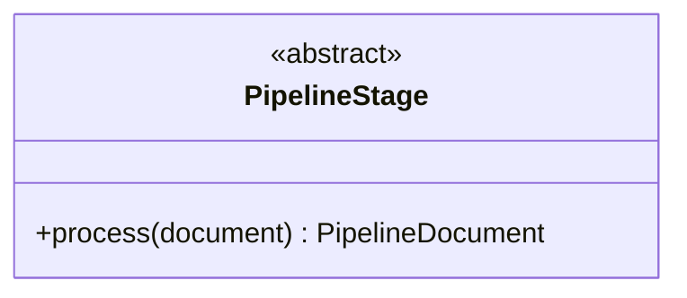
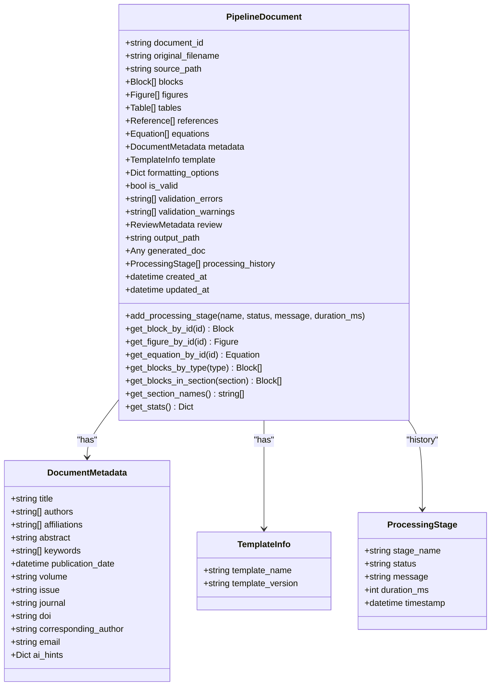
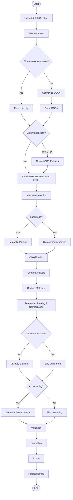
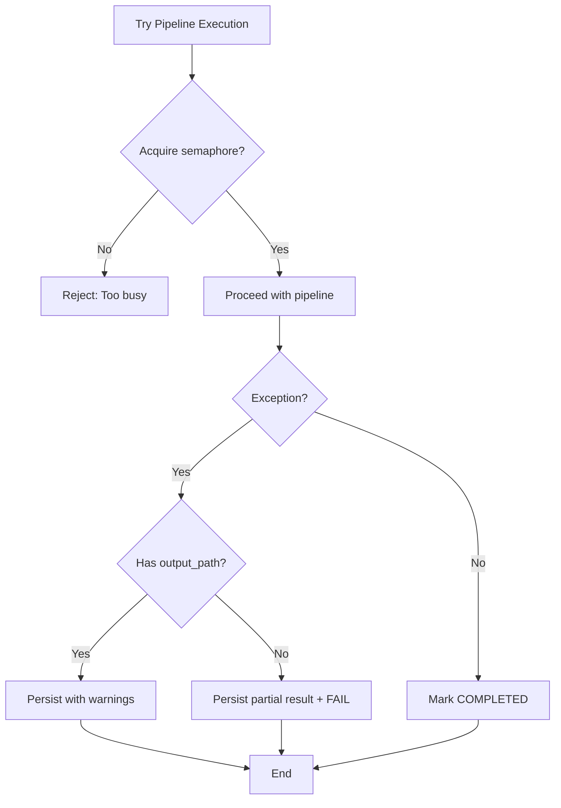
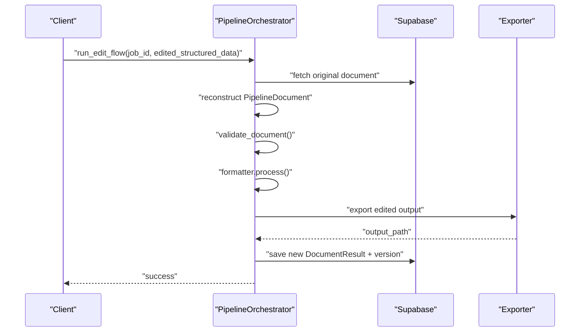
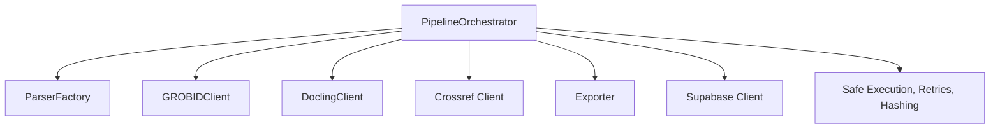

# Pipeline Processing System

<cite>
**Referenced Files in This Document**
- [orchestrator.py](file://backend/app/pipeline/orchestrator.py)
- [base.py](file://backend/app/pipeline/base.py)
- [pipeline_document.py](file://backend/app/models/pipeline_document.py)
- [celery_tasks.py](file://backend/app/tasks/celery_tasks.py)
</cite>

## Table of Contents
1. [Introduction](#introduction)
2. [Project Structure](#project-structure)
3. [Core Components](#core-components)
4. [Architecture Overview](#architecture-overview)
5. [Detailed Component Analysis](#detailed-component-analysis)
6. [Dependency Analysis](#dependency-analysis)
7. [Performance Considerations](#performance-considerations)
8. [Troubleshooting Guide](#troubleshooting-guide)
9. [Conclusion](#conclusion)
10. [Appendices](#appendices)

## Introduction
This document describes the 12-stage pipeline processing system used to transform academic manuscripts into properly formatted outputs. The PipelineOrchestrator coordinates a modular set of stages that perform text extraction, metadata enrichment, structure detection, classification, validation, formatting, and persistence. It implements robust error handling, timeouts, concurrency controls, and real-time status updates to support large-scale document processing.

## Project Structure
The pipeline is implemented in the backend under the pipeline package and integrates with models, services, and tasks:
- Orchestrator: Central coordinator for the pipeline lifecycle and stage orchestration
- Base stage interface: Defines the contract for all pipeline stages
- Document model: Internal representation of the document and its components across stages
- Task runner: Asynchronous execution via Celery to trigger the orchestrator

**Diagram sources**
- [celery_tasks.py:41-66](file://backend/app/tasks/celery_tasks.py#L41-L66)
- [orchestrator.py:73-1227](file://backend/app/pipeline/orchestrator.py#L73-L1227)
- [base.py:4-23](file://backend/app/pipeline/base.py#L4-L23)
- [pipeline_document.py:49-207](file://backend/app/models/pipeline_document.py#L49-L207)

**Section sources**
- [celery_tasks.py:41-66](file://backend/app/tasks/celery_tasks.py#L41-L66)
- [orchestrator.py:73-1227](file://backend/app/pipeline/orchestrator.py#L73-L1227)
- [base.py:4-23](file://backend/app/pipeline/base.py#L4-L23)
- [pipeline_document.py:49-207](file://backend/app/models/pipeline_document.py#L49-L207)

## Core Components
- PipelineOrchestrator: Implements the end-to-end pipeline, stage coordination, timeouts, retries, cancellation checks, and persistence
- PipelineStage (base): Abstract interface that all stages implement
- PipelineDocument: Internal document model carrying content, metadata, formatting options, validation results, and processing history

Key responsibilities:
- Orchestrate sequential and parallel stages
- Enforce runtime flags (fast mode, semantic parser, crossref enrichment, AI reasoning)
- Manage concurrency limits and timeouts
- Persist partial results on failure and update statuses in real time
- Support an edit reprocessing flow for iterative refinement

**Section sources**
- [orchestrator.py:73-1227](file://backend/app/pipeline/orchestrator.py#L73-L1227)
- [base.py:4-23](file://backend/app/pipeline/base.py#L4-L23)
- [pipeline_document.py:49-207](file://backend/app/models/pipeline_document.py#L49-L207)

## Architecture Overview
The pipeline follows a staged design with explicit phases and optional AI layers. It supports:
- Direct parsing for supported formats
- Conversion to DOCX for unsupported formats
- Parallel extraction via GROBID and Docling for PDFs
- Structure detection and optional semantic parsing
- Classification and content analysis
- Caption matching for figures and tables
- Reference parsing and normalization
- Validation and AI reasoning integration
- Formatting and export
- Persistence and real-time status updates

**Diagram sources**
- [celery_tasks.py:41-66](file://backend/app/tasks/celery_tasks.py#L41-L66)
- [orchestrator.py:522-1092](file://backend/app/pipeline/orchestrator.py#L522-L1092)

## Detailed Component Analysis

### PipelineOrchestrator
The orchestrator coordinates all pipeline stages, manages runtime flags, enforces timeouts, and persists results. It includes:
- Semaphore-based concurrency control to limit simultaneous jobs
- Safe execution wrappers and retry guards for resilience
- Conditional execution flags (fast mode, semantic parser, crossref enrichment, AI reasoning)
- Parallel extraction for PDFs using GROBID and Docling
- Timeout enforcement per stage using thread pools
- Cancellation checks against user actions
- Partial result persistence on failures
- Real-time status updates and SSE event emission
- Edit reprocessing flow for iterative refinement

**Diagram sources**
- [orchestrator.py:73-1227](file://backend/app/pipeline/orchestrator.py#L73-L1227)

**Section sources**
- [orchestrator.py:73-1227](file://backend/app/pipeline/orchestrator.py#L73-L1227)

### PipelineStage Base Interface
All pipeline stages implement a uniform interface to ensure modularity and testability.

**Diagram sources**
- [base.py:4-23](file://backend/app/pipeline/base.py#L4-L23)

**Section sources**
- [base.py:4-23](file://backend/app/pipeline/base.py#L4-L23)

### PipelineDocument Model
The internal document model carries parsed content, assets, metadata, formatting options, validation outcomes, and processing history.

**Diagram sources**
- [pipeline_document.py:49-207](file://backend/app/models/pipeline_document.py#L49-L207)

**Section sources**
- [pipeline_document.py:49-207](file://backend/app/models/pipeline_document.py#L49-L207)

### Stage Coordination and Control Flow
The orchestrator defines a clear progression of stages with optional branches and parallelism:
- Upload and job creation
- Text extraction (direct or via DOCX conversion)
- Optional Nougat OCR fallback for scanned PDFs
- Parallel GROBID and Docling extraction for PDFs
- Equation standardization and structure detection
- Optional semantic parsing and classification
- Content analysis and caption matching
- Reference parsing and normalization
- Optional CrossRef enrichment
- Optional AI reasoning integration
- Validation and formatting
- Export and persistence
- Real-time status updates and SSE events

**Diagram sources**
- [orchestrator.py:522-1092](file://backend/app/pipeline/orchestrator.py#L522-L1092)

**Section sources**
- [orchestrator.py:522-1092](file://backend/app/pipeline/orchestrator.py#L522-L1092)

### Error Handling and Recovery
The orchestrator implements layered safety:
- Concurrency limiting with rejection and status updates
- Retry guards around critical stages
- Timeout enforcement per stage with cancellation events
- Cancellation checks against user-initiated cancellations
- Partial result persistence on early failure
- Downgrade to warnings when artifacts exist despite validation errors
- Atomic completion checks ensuring output readiness before marking success

**Diagram sources**
- [orchestrator.py:532-539](file://backend/app/pipeline/orchestrator.py#L532-L539)
- [orchestrator.py:1052-1092](file://backend/app/pipeline/orchestrator.py#L1052-L1092)

**Section sources**
- [orchestrator.py:532-539](file://backend/app/pipeline/orchestrator.py#L532-L539)
- [orchestrator.py:1052-1092](file://backend/app/pipeline/orchestrator.py#L1052-L1092)

### Conditional Execution and Runtime Flags
Runtime flags control optional stages:
- fast_mode: Disables semantic parser, crossref enrichment, and AI reasoning by default
- semantic_parser: Enables optional semantic parsing layer
- crossref_enrichment: Enables optional CrossRef citation validation
- ai_reasoning: Enables optional AI reasoning layer

These flags are resolved from formatting options and environment settings, with tests overriding defaults to ensure determinism.

**Section sources**
- [orchestrator.py:252-269](file://backend/app/pipeline/orchestrator.py#L252-L269)

### Timeout Handling and Concurrency Controls
- Per-stage timeouts enforced via thread pool futures with cancellation events
- Global semaphore limits concurrent pipeline executions
- Configurable timeouts for GROBID, Docling, semantic parsing, and reasoning
- Graceful shutdown handling for server reloads and cancellations

**Section sources**
- [orchestrator.py:212-234](file://backend/app/pipeline/orchestrator.py#L212-L234)
- [orchestrator.py:69-71](file://backend/app/pipeline/orchestrator.py#L69-L71)
- [orchestrator.py:691-715](file://backend/app/pipeline/orchestrator.py#L691-L715)

### Edit Reprocessing Flow
The orchestrator supports an edit flow that:
- Reconstructs a document from edited structured data
- Re-validates and re-formats without re-extracting
- Persists a new version while preserving previous versions
- Updates output hash and status accordingly

**Diagram sources**
- [orchestrator.py:1094-1227](file://backend/app/pipeline/orchestrator.py#L1094-L1227)

**Section sources**
- [orchestrator.py:1094-1227](file://backend/app/pipeline/orchestrator.py#L1094-L1227)

## Dependency Analysis
The orchestrator depends on external services and internal modules:
- ParserFactory for direct parsing and DOCX conversion
- GROBIDClient and DoclingClient for metadata and layout extraction
- Crossref client for citation validation
- Exporter for generating final outputs
- Supabase client for status updates and persistence
- Utilities for safe execution, retries, and hashing

**Diagram sources**
- [orchestrator.py:19-38](file://backend/app/pipeline/orchestrator.py#L19-L38)
- [orchestrator.py:58-61](file://backend/app/pipeline/orchestrator.py#L58-L61)

**Section sources**
- [orchestrator.py:19-38](file://backend/app/pipeline/orchestrator.py#L19-L38)
- [orchestrator.py:58-61](file://backend/app/pipeline/orchestrator.py#L58-L61)

## Performance Considerations
- Concurrency control: Limit simultaneous jobs to prevent resource exhaustion
- Parallel extraction: Offload GROBID and Docling to separate threads with bounded timeouts
- Fast mode: Disable optional AI layers to reduce latency during testing or constrained environments
- Streaming and SSE: Provide real-time feedback to users without blocking the pipeline
- Hashing and atomic completion: Ensure integrity checks before marking success
- Memory footprint: Prefer incremental processing and avoid loading entire documents into memory when possible

[No sources needed since this section provides general guidance]

## Troubleshooting Guide
Common issues and remedies:
- Too many concurrent jobs: The semaphore rejects new requests; reduce batch sizes or scale horizontally
- Stage timeouts: Increase stage-specific timeout settings or disable optional stages
- Cancellations: Server reloads or user cancellations are handled gracefully; check status updates
- Partial results: On failure, partial results are persisted to aid debugging
- Output readiness: Atomic checks ensure only valid artifacts are marked as completed
- Edit flow failures: Validate edited structured data and rerun the edit flow

**Section sources**
- [orchestrator.py:532-539](file://backend/app/pipeline/orchestrator.py#L532-L539)
- [orchestrator.py:1038-1051](file://backend/app/pipeline/orchestrator.py#L1038-L1051)
- [orchestrator.py:1052-1092](file://backend/app/pipeline/orchestrator.py#L1052-L1092)

## Conclusion
The pipeline system is designed for reliability, scalability, and extensibility. The PipelineOrchestrator coordinates modular stages with robust error handling, timeouts, and real-time feedback. Optional AI layers and runtime flags enable tuning for performance and quality. The edit reprocessing flow supports iterative refinement, and the document model provides a consistent representation across all stages.

[No sources needed since this section summarizes without analyzing specific files]

## Appendices

### Pipeline Phases and Responsibilities
- UPLOAD: Job initialization and status updates
- EXTRACTION: Text extraction and optional OCR fallback
- PARALLEL AI EXTRACTION: GROBID and Docling for PDFs
- STRUCTURE DETECTION: Heading and section identification
- SEMANTIC PARSING: Optional NLP layer for confidence scores
- CLASSIFICATION: Content categorization
- CONTENT ANALYSIS: Keyword extraction and metadata enrichment
- CAPTION MATCHING: Figures and tables alignment
- REFERENCES: Parsing and normalization
- CROSSREF ENRICHMENT: Optional citation validation
- AI REASONING: Optional semantic advice
- VALIDATION: Structural and style validation
- FORMATTING: Template-driven styling
- EXPORT: Artifact generation
- PERSISTENCE: Final result storage and status updates

[No sources needed since this section provides general guidance]