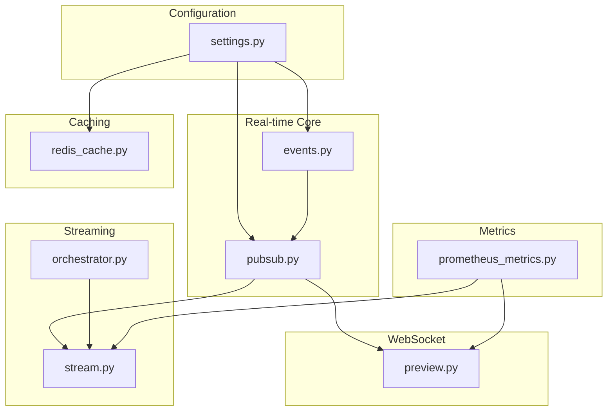
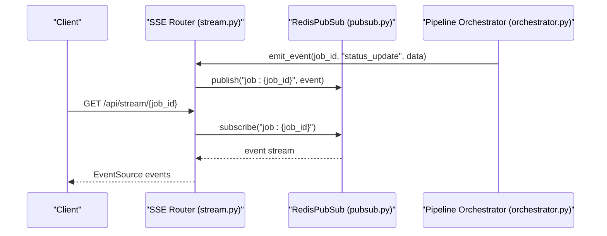
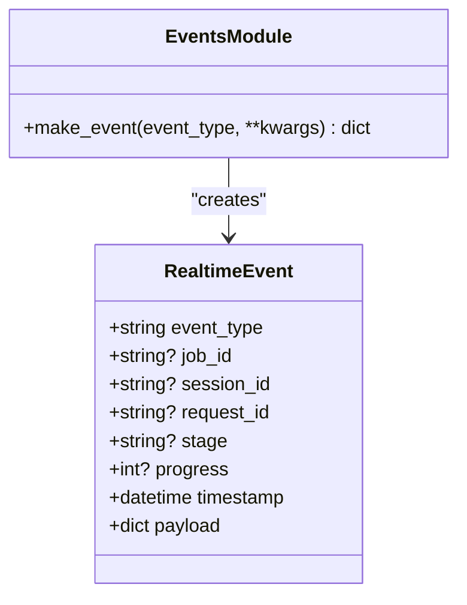
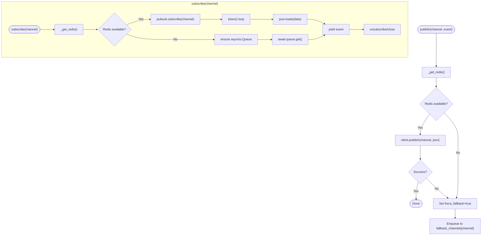
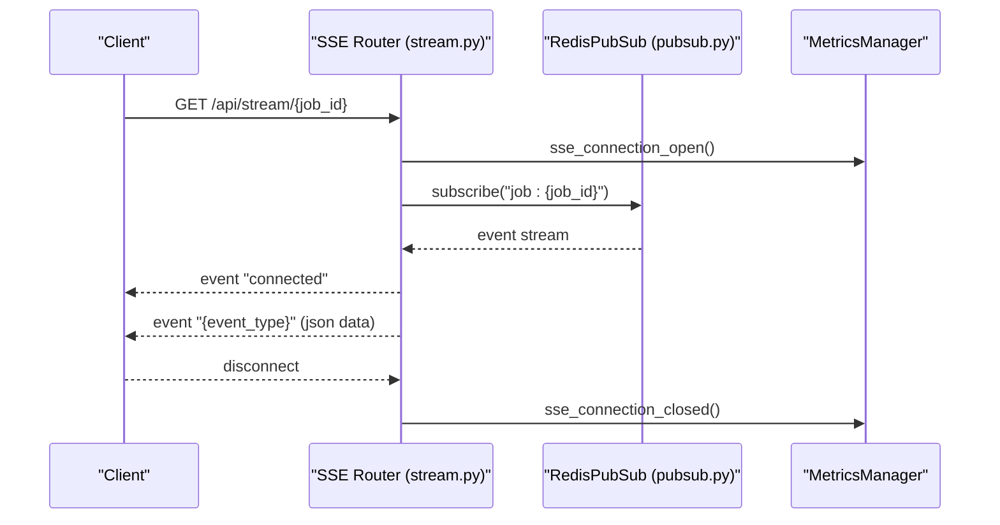
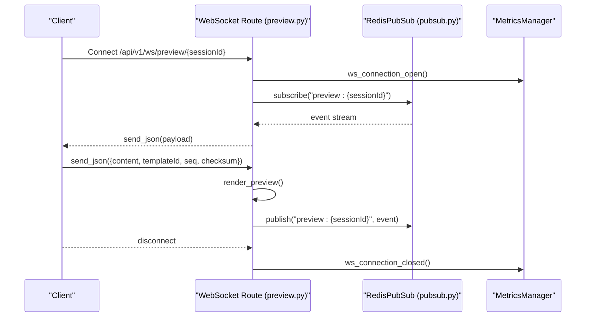
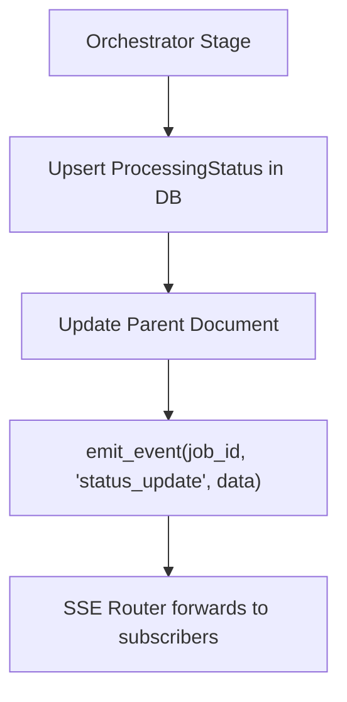
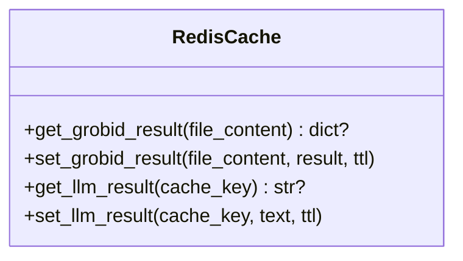
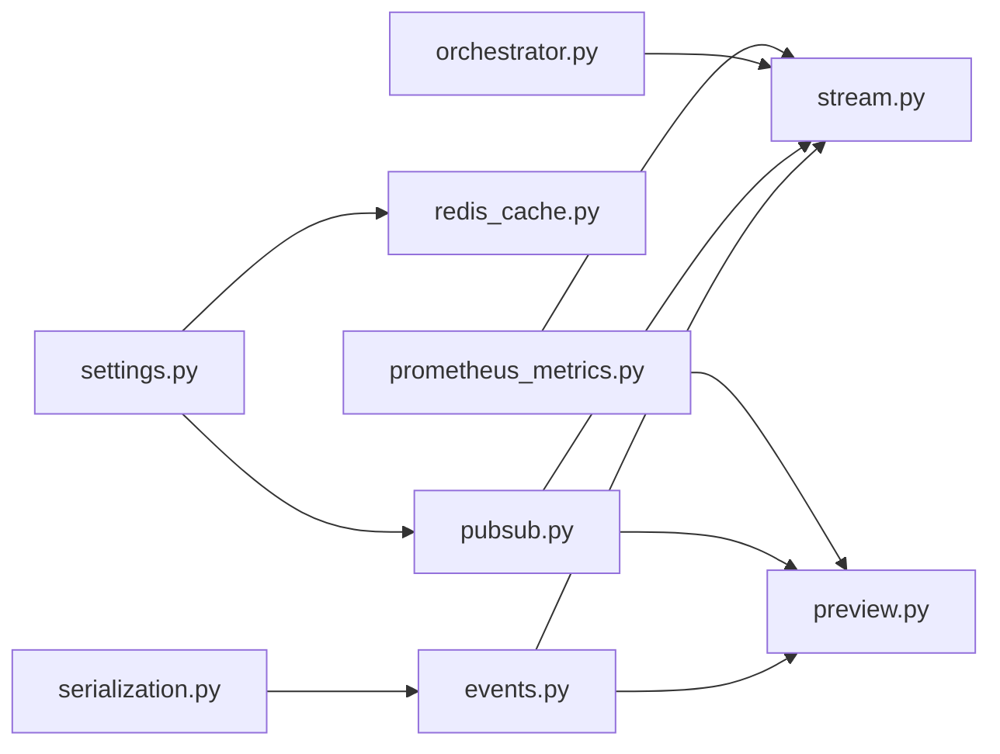

# Real-time Communication

<cite>
**Referenced Files in This Document**
- [events.py](file://backend/app/realtime/events.py)
- [pubsub.py](file://backend/app/realtime/pubsub.py)
- [stream.py](file://backend/app/routers/stream.py)
- [preview.py](file://backend/app/routers/preview.py)
- [orchestrator.py](file://backend/app/pipeline/orchestrator.py)
- [prometheus_metrics.py](file://backend/app/middleware/prometheus_metrics.py)
- [redis_cache.py](file://backend/app/cache/redis_cache.py)
- [settings.py](file://backend/app/config/settings.py)
- [serialization.py](file://backend/app/utils/serialization.py)
</cite>

## Table of Contents
1. [Introduction](#introduction)
2. [Project Structure](#project-structure)
3. [Core Components](#core-components)
4. [Architecture Overview](#architecture-overview)
5. [Detailed Component Analysis](#detailed-component-analysis)
6. [Dependency Analysis](#dependency-analysis)
7. [Performance Considerations](#performance-considerations)
8. [Troubleshooting Guide](#troubleshooting-guide)
9. [Conclusion](#conclusion)

## Introduction
This document explains the real-time communication systems powering live status updates, progress tracking, and collaborative features. It covers:
- Server-Sent Events (SSE) for long-lived server-to-client updates
- WebSocket support for bidirectional live collaboration
- Redis pub/sub for scalable event distribution across instances
- Event modeling and serialization
- Connection lifecycle, fallbacks, and resilience
- Monitoring and metrics for SSE and WebSocket connections
- Caching strategies for real-time data
- Security and rate-limiting considerations

## Project Structure
The real-time stack spans configuration, event modeling, pub/sub, streaming endpoints, WebSocket routes, orchestration, and metrics.

**Diagram sources**
- [settings.py:156-174](file://backend/app/config/settings.py#L156-L174)
- [events.py:9-34](file://backend/app/realtime/events.py#L9-L34)
- [pubsub.py:18-120](file://backend/app/realtime/pubsub.py#L18-L120)
- [stream.py:24-95](file://backend/app/routers/stream.py#L24-L95)
- [preview.py:25-201](file://backend/app/routers/preview.py#L25-L201)
- [orchestrator.py:115-165](file://backend/app/pipeline/orchestrator.py#L115-L165)
- [prometheus_metrics.py:98-214](file://backend/app/middleware/prometheus_metrics.py#L98-L214)
- [redis_cache.py:10-102](file://backend/app/cache/redis_cache.py#L10-L102)

**Section sources**
- [settings.py:156-174](file://backend/app/config/settings.py#L156-L174)
- [events.py:9-34](file://backend/app/realtime/events.py#L9-L34)
- [pubsub.py:18-120](file://backend/app/realtime/pubsub.py#L18-L120)
- [stream.py:24-95](file://backend/app/routers/stream.py#L24-L95)
- [preview.py:25-201](file://backend/app/routers/preview.py#L25-L201)
- [orchestrator.py:115-165](file://backend/app/pipeline/orchestrator.py#L115-L165)
- [prometheus_metrics.py:98-214](file://backend/app/middleware/prometheus_metrics.py#L98-L214)
- [redis_cache.py:10-102](file://backend/app/cache/redis_cache.py#L10-L102)

## Core Components
- RealtimeEvent and event factory: define the canonical event shape and serialization for transport.
- RedisPubSub: async pub/sub abstraction with Redis-backed channels and in-memory fallback.
- SSE router: exposes a streaming endpoint per job and emits standardized events.
- WebSocket route: supports live preview collaboration with ping/pong and incremental rendering.
- Orchestrator integration: emits SSE events during pipeline stages.
- Prometheus metrics: tracks active SSE and WebSocket connections.
- Redis cache: provides caching for expensive operations to reduce latency and load.

**Section sources**
- [events.py:9-34](file://backend/app/realtime/events.py#L9-L34)
- [pubsub.py:18-120](file://backend/app/realtime/pubsub.py#L18-L120)
- [stream.py:32-95](file://backend/app/routers/stream.py#L32-L95)
- [preview.py:61-128](file://backend/app/routers/preview.py#L61-L128)
- [orchestrator.py:115-165](file://backend/app/pipeline/orchestrator.py#L115-L165)
- [prometheus_metrics.py:98-214](file://backend/app/middleware/prometheus_metrics.py#L98-L214)
- [redis_cache.py:10-102](file://backend/app/cache/redis_cache.py#L10-L102)

## Architecture Overview
The system uses Redis pub/sub to fan out real-time events to clients subscribed via SSE or WebSocket. The orchestrator publishes status updates, which downstream consumers (UIs) receive through persistent connections. Metrics track connection health and throughput.

**Diagram sources**
- [stream.py:73-95](file://backend/app/routers/stream.py#L73-L95)
- [pubsub.py:55-109](file://backend/app/realtime/pubsub.py#L55-L109)
- [orchestrator.py:159-165](file://backend/app/pipeline/orchestrator.py#L159-L165)

## Detailed Component Analysis

### Event Model and Serialization
- RealtimeEvent captures event_type, correlation identifiers (job_id, session_id), stage, progress, timestamp, and payload.
- make_event constructs canonical events, injects request_id context, and serializes timestamps for transport.

**Diagram sources**
- [events.py:9-34](file://backend/app/realtime/events.py#L9-L34)

**Section sources**
- [events.py:9-34](file://backend/app/realtime/events.py#L9-L34)
- [serialization.py:13-67](file://backend/app/utils/serialization.py#L13-L67)

### Redis Pub/Sub Abstraction
- RedisPubSub manages Redis availability per event loop, with a lock to avoid race conditions.
- publish attempts Redis publish; on failure, falls back to in-memory queues keyed by channel.
- subscribe connects to Redis pubsub or yields from in-memory queues; ensures cleanup on exit.

**Diagram sources**
- [pubsub.py:18-120](file://backend/app/realtime/pubsub.py#L18-L120)

**Section sources**
- [pubsub.py:18-120](file://backend/app/realtime/pubsub.py#L18-L120)
- [settings.py:156-174](file://backend/app/config/settings.py#L156-L174)

### Server-Sent Events (SSE)
- The SSE endpoint streams job-specific events to authenticated clients.
- It sends an initial “connected” event, then forwards Redis-published events until the client disconnects.
- Metrics track SSE connection open/close.

**Diagram sources**
- [stream.py:32-71](file://backend/app/routers/stream.py#L32-L71)
- [pubsub.py:79-119](file://backend/app/realtime/pubsub.py#L79-L119)
- [prometheus_metrics.py:198-205](file://backend/app/middleware/prometheus_metrics.py#L198-L205)

**Section sources**
- [stream.py:32-95](file://backend/app/routers/stream.py#L32-L95)
- [prometheus_metrics.py:98-214](file://backend/app/middleware/prometheus_metrics.py#L98-L214)

### WebSocket Live Preview
- WebSocket route accepts sessions with validated IDs, maintains a session-to-websocket set, and forwards Redis events to clients.
- Heartbeat pings keep connections alive; client messages trigger live preview rendering and push updates back to the session channel.
- Metrics track WebSocket connection open/close.

**Diagram sources**
- [preview.py:78-128](file://backend/app/routers/preview.py#L78-L128)
- [pubsub.py:79-119](file://backend/app/realtime/pubsub.py#L79-L119)
- [prometheus_metrics.py:207-214](file://backend/app/middleware/prometheus_metrics.py#L207-L214)

**Section sources**
- [preview.py:61-128](file://backend/app/routers/preview.py#L61-L128)
- [prometheus_metrics.py:108-116](file://backend/app/middleware/prometheus_metrics.py#L108-L116)

### Pipeline Integration and Event Emission
- The orchestrator updates processing status and emits SSE events for real-time UI feedback.
- It coordinates Supabase updates and SSE publishing to keep clients informed of progress and outcomes.

**Diagram sources**
- [orchestrator.py:115-165](file://backend/app/pipeline/orchestrator.py#L115-L165)
- [stream.py:73-95](file://backend/app/routers/stream.py#L73-L95)

**Section sources**
- [orchestrator.py:115-165](file://backend/app/pipeline/orchestrator.py#L115-L165)
- [stream.py:73-95](file://backend/app/routers/stream.py#L73-L95)

### Caching Strategies for Real-time Data
- RedisCache provides optional caching for expensive operations (e.g., LLM results, GROBID results) with TTL.
- When Redis is disabled or unavailable, the cache layer gracefully disables itself and continues without caching.

**Diagram sources**
- [redis_cache.py:10-102](file://backend/app/cache/redis_cache.py#L10-L102)

**Section sources**
- [redis_cache.py:10-102](file://backend/app/cache/redis_cache.py#L10-L102)
- [settings.py:156-174](file://backend/app/config/settings.py#L156-L174)

## Dependency Analysis
- Configuration: settings controls Redis enablement and URLs, impacting pub/sub availability.
- Eventing: events.py defines the event contract; stream.py and preview.py depend on it.
- Pub/Sub: stream.py and preview.py depend on pubsub.py; orchestrator depends on stream.py’s emit_event.
- Metrics: prometheus_metrics.py is invoked by SSE and WebSocket routes to track connections.
- Serialization: serialization.py ensures payloads are JSON-safe for transport.

**Diagram sources**
- [settings.py:156-174](file://backend/app/config/settings.py#L156-L174)
- [events.py:9-34](file://backend/app/realtime/events.py#L9-L34)
- [pubsub.py:18-120](file://backend/app/realtime/pubsub.py#L18-L120)
- [stream.py:24-95](file://backend/app/routers/stream.py#L24-L95)
- [preview.py:25-201](file://backend/app/routers/preview.py#L25-L201)
- [orchestrator.py:115-165](file://backend/app/pipeline/orchestrator.py#L115-L165)
- [prometheus_metrics.py:98-214](file://backend/app/middleware/prometheus_metrics.py#L98-L214)
- [serialization.py:13-67](file://backend/app/utils/serialization.py#L13-L67)

**Section sources**
- [settings.py:156-174](file://backend/app/config/settings.py#L156-L174)
- [events.py:9-34](file://backend/app/realtime/events.py#L9-L34)
- [pubsub.py:18-120](file://backend/app/realtime/pubsub.py#L18-L120)
- [stream.py:24-95](file://backend/app/routers/stream.py#L24-L95)
- [preview.py:25-201](file://backend/app/routers/preview.py#L25-L201)
- [orchestrator.py:115-165](file://backend/app/pipeline/orchestrator.py#L115-L165)
- [prometheus_metrics.py:98-214](file://backend/app/middleware/prometheus_metrics.py#L98-L214)
- [serialization.py:13-67](file://backend/app/utils/serialization.py#L13-L67)

## Performance Considerations
- Redis pub/sub scalability: Redis-backed channels distribute events across workers/processes; fallback to in-memory queues avoids single-point-of-failure but limits cross-instance delivery.
- SSE/WS concurrency: Metrics expose active connections and totals; monitor for spikes and adjust autoscaling accordingly.
- Payload size: Keep event payload minimal; use serialization helpers to ensure safe transport.
- Caching: Use RedisCache for expensive reads to reduce upstream load and latency.
- Timeouts and heartbeats: WebSocket routes implement periodic ping to detect dead peers; SSE checks disconnection to free resources promptly.

[No sources needed since this section provides general guidance]

## Troubleshooting Guide
- Redis connectivity failures:
  - Symptom: Redis warnings and fallback to in-memory queues.
  - Action: Verify REDIS_URL/REDIS_ENABLED; ensure Redis is reachable; confirm ping succeeds.
- SSE disconnects:
  - Symptom: Client stops receiving updates.
  - Action: Confirm client-side EventSource reconnects; check is_disconnected checks in SSE route.
- WebSocket disconnects:
  - Symptom: Session ends unexpectedly.
  - Action: Inspect heartbeat intervals and client ping/pong; verify session ID validation and cleanup paths.
- Metrics anomalies:
  - Symptom: Active connection counters inconsistent.
  - Action: Review metrics middleware invocations for SSE/WS open/close.

**Section sources**
- [pubsub.py:40-53](file://backend/app/realtime/pubsub.py#L40-L53)
- [stream.py:48-57](file://backend/app/routers/stream.py#L48-L57)
- [preview.py:61-76](file://backend/app/routers/preview.py#L61-L76)
- [prometheus_metrics.py:198-214](file://backend/app/middleware/prometheus_metrics.py#L198-L214)

## Conclusion
The system combines Redis pub/sub, SSE, and WebSocket to deliver robust, scalable real-time updates. Events are modeled consistently, published from the orchestrator, and consumed by clients through durable connections. RedisCache reduces latency for expensive operations, while Prometheus metrics provide operational visibility. Proper configuration and monitoring ensure resilience under high concurrency.