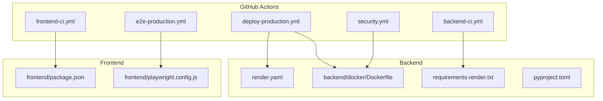
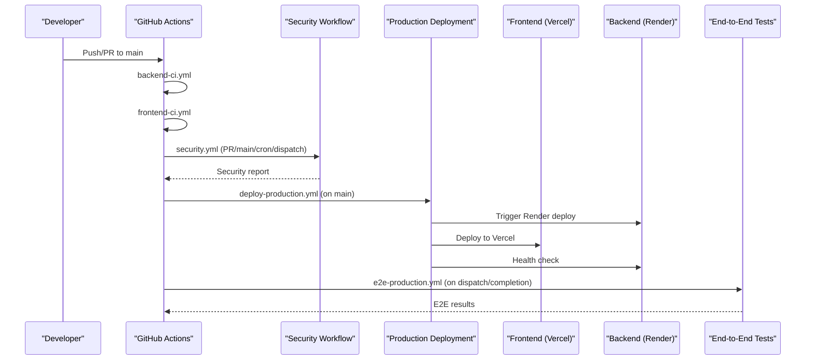
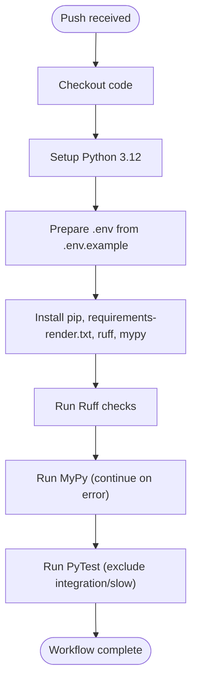
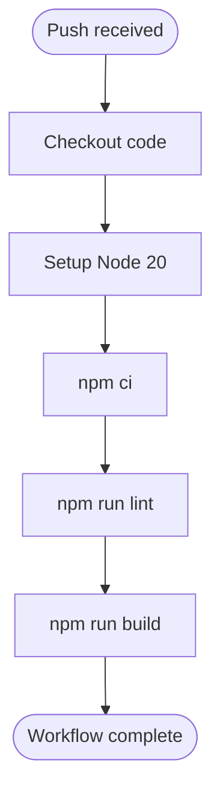
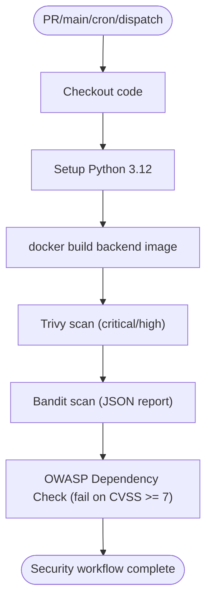
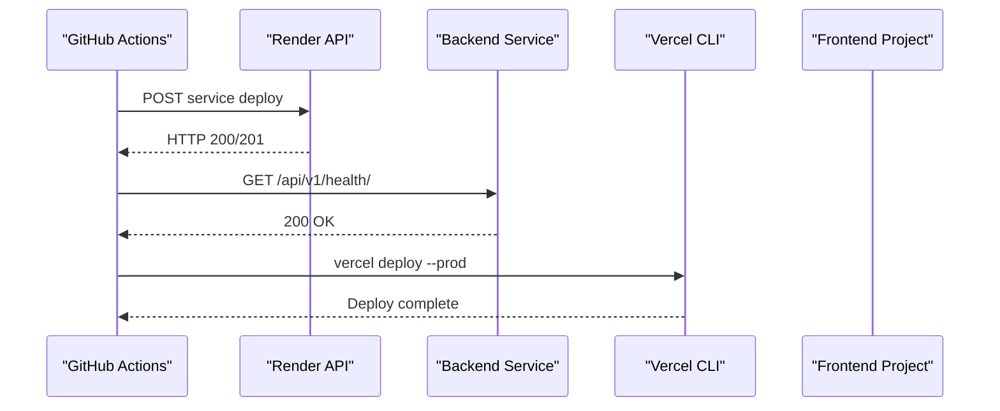
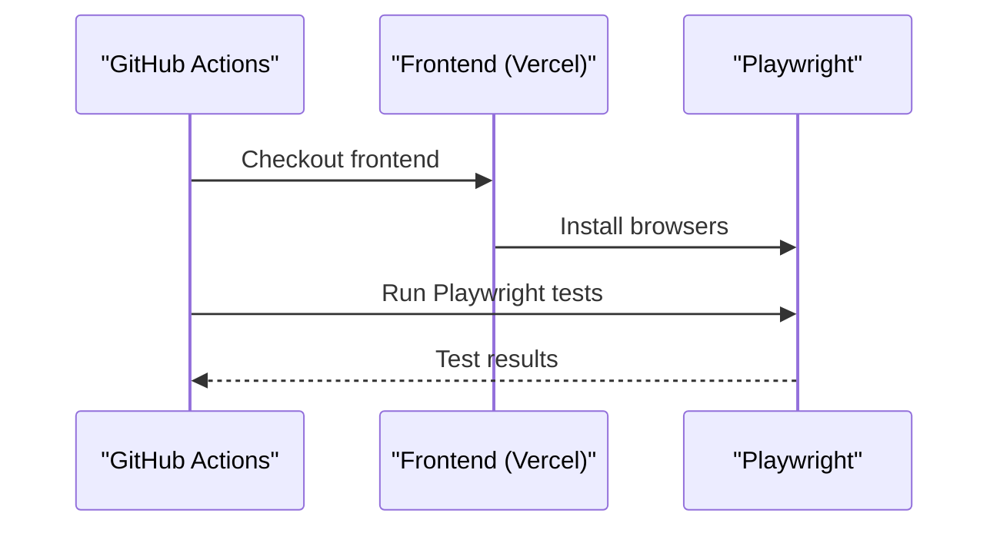
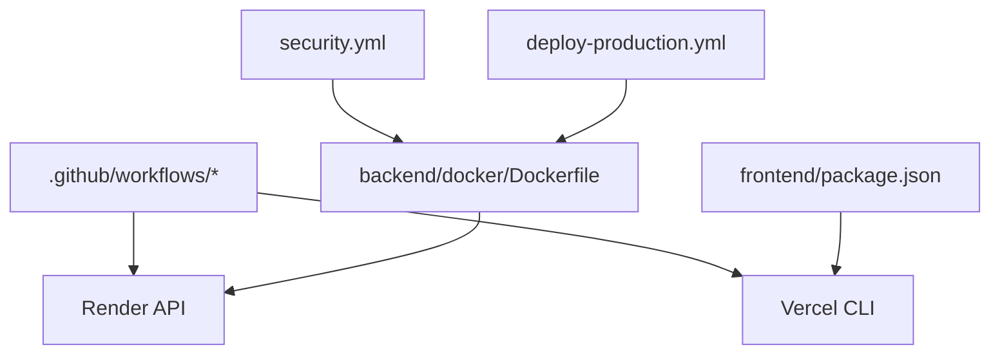

# CI/CD Pipeline

<cite>
**Referenced Files in This Document**
- [backend-ci.yml](file://.github/workflows/backend-ci.yml)
- [frontend-ci.yml](file://.github/workflows/frontend-ci.yml)
- [deploy-production.yml](file://.github/workflows/deploy-production.yml)
- [e2e-production.yml](file://.github/workflows/e2e-production.yml)
- [security.yml](file://.github/workflows/security.yml)
- [render.yaml](file://render.yaml)
- [Dockerfile](file://backend/docker/Dockerfile)
- [requirements-render.txt](file://backend/requirements-render.txt)
- [pyproject.toml](file://backend/pyproject.toml)
- [package.json](file://frontend/package.json)
- [playwright.config.js](file://frontend/playwright.config.js)
- [branch-protection.md](file://docs/runbooks/branch-protection.md)
- [rollback.md](file://docs/runbooks/rollback.md)
- [incident-response.md](file://docs/runbooks/incident-response.md)
- [ruff.toml](file://backend/ruff.toml)
- [mypy.ini](file://backend/mypy.ini)
</cite>

## Table of Contents
1. [Introduction](#introduction)
2. [Project Structure](#project-structure)
3. [Core Components](#core-components)
4. [Architecture Overview](#architecture-overview)
5. [Detailed Component Analysis](#detailed-component-analysis)
6. [Dependency Analysis](#dependency-analysis)
7. [Performance Considerations](#performance-considerations)
8. [Troubleshooting Guide](#troubleshooting-guide)
9. [Conclusion](#conclusion)
10. [Appendices](#appendices)

## Introduction
This document describes the CI/CD pipeline for the automated manuscript formatter project, covering automated testing, deployment workflows, and release management. It explains the GitHub Actions workflows for backend and frontend, including build processes, testing phases, and deployment triggers. It also details the multi-stage deployment pipeline from development to production, including quality gates, security scanning, and rollback procedures. Branch protection rules, code review requirements, and automated deployment strategies are covered. Finally, it includes troubleshooting common CI/CD issues, performance optimization tips, and monitoring deployment success rates.

## Project Structure
The CI/CD system is organized around GitHub Actions workflows and platform-specific deployment configurations:
- Workflows are defined under .github/workflows for backend-ci, frontend-ci, security scanning, production deployment, and end-to-end testing.
- Backend deployment is configured for Render via render.yaml and a containerized build using backend/docker/Dockerfile.
- Frontend deployment targets Vercel, orchestrated by the production deployment workflow.
- Quality gates are enforced by linters (Ruff, ESLint), type checking (Mypy), and unit/integration tests.
- Security scanning uses Trivy, Bandit, and OWASP Dependency Check.
- End-to-end tests run against the production frontend after successful deployments.

**Diagram sources**
- [backend-ci.yml:1-41](file://.github/workflows/backend-ci.yml#L1-L41)
- [frontend-ci.yml:1-31](file://.github/workflows/frontend-ci.yml#L1-L31)
- [security.yml:1-47](file://.github/workflows/security.yml#L1-L47)
- [deploy-production.yml:1-63](file://.github/workflows/deploy-production.yml#L1-L63)
- [e2e-production.yml:1-38](file://.github/workflows/e2e-production.yml#L1-L38)
- [render.yaml:1-15](file://render.yaml#L1-L15)
- [Dockerfile:1-24](file://backend/docker/Dockerfile#L1-L24)
- [requirements-render.txt:1-136](file://backend/requirements-render.txt#L1-L136)
- [pyproject.toml:1-9](file://backend/pyproject.toml#L1-L9)
- [package.json:1-62](file://frontend/package.json#L1-L62)
- [playwright.config.js:1-48](file://frontend/playwright.config.js#L1-L48)

**Section sources**
- [backend-ci.yml:1-41](file://.github/workflows/backend-ci.yml#L1-L41)
- [frontend-ci.yml:1-31](file://.github/workflows/frontend-ci.yml#L1-L31)
- [security.yml:1-47](file://.github/workflows/security.yml#L1-L47)
- [deploy-production.yml:1-63](file://.github/workflows/deploy-production.yml#L1-L63)
- [e2e-production.yml:1-38](file://.github/workflows/e2e-production.yml#L1-L38)
- [render.yaml:1-15](file://render.yaml#L1-L15)
- [Dockerfile:1-24](file://backend/docker/Dockerfile#L1-L24)
- [requirements-render.txt:1-136](file://backend/requirements-render.txt#L1-L136)
- [pyproject.toml:1-9](file://backend/pyproject.toml#L1-L9)
- [package.json:1-62](file://frontend/package.json#L1-L62)
- [playwright.config.js:1-48](file://frontend/playwright.config.js#L1-L48)

## Core Components
- Backend CI workflow validates Python code with Ruff and MyPy, and runs unit tests excluding slow and integration suites.
- Frontend CI workflow installs dependencies, runs ESLint, and builds the Next.js application.
- Security workflow builds a backend image and scans it with Trivy, Bandit, and OWASP Dependency Check.
- Production deployment workflow triggers backend deployment to Render and frontend deployment to Vercel, followed by a backend health check.
- End-to-end workflow runs Playwright tests against the production frontend after a successful production deployment.
- Branch protection enforces required status checks and pull request reviews before merging to main.
- Rollback and incident response runbooks provide remediation playbooks for production issues.

**Section sources**
- [backend-ci.yml:1-41](file://.github/workflows/backend-ci.yml#L1-L41)
- [frontend-ci.yml:1-31](file://.github/workflows/frontend-ci.yml#L1-L31)
- [security.yml:1-47](file://.github/workflows/security.yml#L1-L47)
- [deploy-production.yml:1-63](file://.github/workflows/deploy-production.yml#L1-L63)
- [e2e-production.yml:1-38](file://.github/workflows/e2e-production.yml#L1-L38)
- [branch-protection.md:1-14](file://docs/runbooks/branch-protection.md#L1-L14)
- [rollback.md:1-24](file://docs/runbooks/rollback.md#L1-L24)
- [incident-response.md:1-47](file://docs/runbooks/incident-response.md#L1-L47)

## Architecture Overview
The CI/CD pipeline consists of three stages:
- Build and Test: backend and frontend workflows execute linting, type checking, and unit tests.
- Security Gate: security workflow validates the backend image for vulnerabilities and dependency issues.
- Deploy and Validate: production deployment triggers backend and frontend deployments, followed by an end-to-end test suite.

**Diagram sources**
- [backend-ci.yml:1-41](file://.github/workflows/backend-ci.yml#L1-L41)
- [frontend-ci.yml:1-31](file://.github/workflows/frontend-ci.yml#L1-L31)
- [security.yml:1-47](file://.github/workflows/security.yml#L1-L47)
- [deploy-production.yml:1-63](file://.github/workflows/deploy-production.yml#L1-L63)
- [e2e-production.yml:1-38](file://.github/workflows/e2e-production.yml#L1-L38)

## Detailed Component Analysis

### Backend CI Workflow
- Triggers on all pushes.
- Sets up Python 3.12, prepares environment, installs dependencies, runs Ruff, MyPy (continue on error), and PyTest excluding integration and slow markers.

**Diagram sources**
- [backend-ci.yml:1-41](file://.github/workflows/backend-ci.yml#L1-L41)
- [requirements-render.txt:1-136](file://backend/requirements-render.txt#L1-L136)
- [ruff.toml:1-11](file://backend/ruff.toml#L1-L11)
- [mypy.ini:1-10](file://backend/mypy.ini#L1-L10)

**Section sources**
- [backend-ci.yml:1-41](file://.github/workflows/backend-ci.yml#L1-L41)
- [ruff.toml:1-11](file://backend/ruff.toml#L1-L11)
- [mypy.ini:1-10](file://backend/mypy.ini#L1-L10)
- [requirements-render.txt:1-136](file://backend/requirements-render.txt#L1-L136)

### Frontend CI Workflow
- Triggers on all pushes.
- Sets up Node 20, installs dependencies with npm ci, runs ESLint, and builds the Next.js app.

**Diagram sources**
- [frontend-ci.yml:1-31](file://.github/workflows/frontend-ci.yml#L1-L31)
- [package.json:1-62](file://frontend/package.json#L1-L62)

**Section sources**
- [frontend-ci.yml:1-31](file://.github/workflows/frontend-ci.yml#L1-L31)
- [package.json:1-62](file://frontend/package.json#L1-L62)

### Security Workflow
- Runs on pull_request to main/develop, workflow_dispatch, and a weekly cron.
- Builds backend image from backend/docker/Dockerfile.
- Scans with Trivy for critical/high severity, Bandit for Python security issues, and OWASP Dependency Check for CVE thresholds.

**Diagram sources**
- [security.yml:1-47](file://.github/workflows/security.yml#L1-L47)
- [Dockerfile:1-24](file://backend/docker/Dockerfile#L1-L24)

**Section sources**
- [security.yml:1-47](file://.github/workflows/security.yml#L1-L47)
- [Dockerfile:1-24](file://backend/docker/Dockerfile#L1-L24)

### Production Deployment Workflow
- Triggers on push to main.
- Deploys backend to Render via Render API, waits for backend health endpoint, then deploys frontend to Vercel using vercel CLI.

**Diagram sources**
- [deploy-production.yml:1-63](file://.github/workflows/deploy-production.yml#L1-L63)
- [render.yaml:1-15](file://render.yaml#L1-L15)

**Section sources**
- [deploy-production.yml:1-63](file://.github/workflows/deploy-production.yml#L1-L63)
- [render.yaml:1-15](file://render.yaml#L1-L15)

### End-to-End Production Workflow
- Triggers on workflow_dispatch or when deploy-production completes successfully.
- Installs Playwright browsers, runs Playwright tests against the production frontend URL.

**Diagram sources**
- [e2e-production.yml:1-38](file://.github/workflows/e2e-production.yml#L1-L38)
- [playwright.config.js:1-48](file://frontend/playwright.config.js#L1-L48)

**Section sources**
- [e2e-production.yml:1-38](file://.github/workflows/e2e-production.yml#L1-L38)
- [playwright.config.js:1-48](file://frontend/playwright.config.js#L1-L48)

### Branch Protection and Review Requirements
- Required status checks include backend-ci, frontend-ci, and security.
- Pull requests require review approval and passing status checks before merging into main.
- Direct pushes to main are disallowed.

**Section sources**
- [branch-protection.md:1-14](file://docs/runbooks/branch-protection.md#L1-L14)

### Rollback Procedures
- Backend (Render): Use the dashboard to rollback to a previous known-good deploy and verify readiness.
- Frontend (Vercel): Promote a previous known-good deployment to production.
- Database migrations (Alembic): Downgrade the last migration if needed.
- Feature flags: Disable problematic features via environment flags and redeploy if necessary.

**Section sources**
- [rollback.md:1-24](file://docs/runbooks/rollback.md#L1-L24)

### Incident Response Playbooks
- Alert matrix defines thresholds for error rates, latency, queue depth, LLM performance, realtime connections, antivirus scans, and readiness.
- Response playbooks outline immediate actions, escalation, and verification steps per incident type.

**Section sources**
- [incident-response.md:1-47](file://docs/runbooks/incident-response.md#L1-L47)

## Dependency Analysis
The CI/CD pipeline depends on:
- GitHub Actions runners for orchestration.
- Render for backend hosting and deployment automation.
- Vercel for frontend hosting and deployment automation.
- Docker image built from backend/docker/Dockerfile for security scanning and production deployment.
- Platform-specific toolchains (Python 3.12, Node 20) and dependency manifests (requirements-render.txt, package.json).

**Diagram sources**
- [deploy-production.yml:1-63](file://.github/workflows/deploy-production.yml#L1-L63)
- [security.yml:1-47](file://.github/workflows/security.yml#L1-L47)
- [Dockerfile:1-24](file://backend/docker/Dockerfile#L1-L24)
- [package.json:1-62](file://frontend/package.json#L1-L62)

**Section sources**
- [deploy-production.yml:1-63](file://.github/workflows/deploy-production.yml#L1-L63)
- [security.yml:1-47](file://.github/workflows/security.yml#L1-L47)
- [Dockerfile:1-24](file://backend/docker/Dockerfile#L1-L24)
- [package.json:1-62](file://frontend/package.json#L1-L62)

## Performance Considerations
- Parallelism: Frontend CI disables parallel tests in CI to avoid resource contention; consider similar constraints for backend tests if needed.
- Caching: Use npm ci for deterministic frontend installs; backend uses pip with requirements-render.txt; ensure secrets and environment caching align with caching policies.
- Image size and build time: Keep backend dependencies minimal; consolidate Docker layers and leverage multi-stage builds if necessary.
- E2E test execution: Limit browser fan-out in CI; the configuration sets workers to 1 in CI to reduce overhead.
- Health checks: Post-deploy health checks prevent traffic redirection to unhealthy instances.

[No sources needed since this section provides general guidance]

## Troubleshooting Guide
Common CI/CD issues and resolutions:
- Backend lint/type failures: Fix Ruff violations or suppress selectively per ruff.toml; address MyPy issues or adjust mypy.ini.
- Frontend lint failures: Resolve ESLint errors; ensure strictness and module resolution match tsconfig.json.
- Security scan failures: Address Trivy critical/high findings; fix Bandit-reported issues; resolve OWASP dependency vulnerabilities.
- Render deployment errors: Verify RENDER_API_KEY and RENDER_PROD_SERVICE_ID; check Render logs for build/start errors.
- Vercel deployment errors: Verify VERCEL_TOKEN, VERCEL_ORG_ID, and VERCEL_PROD_PROJECT_ID; check Vercel logs.
- Health check timeouts: Confirm backend readiness endpoint and environment configuration; increase wait loops if necessary.
- E2E test failures: Validate PLAYWRIGHT_BASE_URL; ensure browsers are installed; review test reports and traces.

**Section sources**
- [backend-ci.yml:1-41](file://.github/workflows/backend-ci.yml#L1-L41)
- [frontend-ci.yml:1-31](file://.github/workflows/frontend-ci.yml#L1-L31)
- [security.yml:1-47](file://.github/workflows/security.yml#L1-L47)
- [deploy-production.yml:1-63](file://.github/workflows/deploy-production.yml#L1-L63)
- [e2e-production.yml:1-38](file://.github/workflows/e2e-production.yml#L1-L38)
- [ruff.toml:1-11](file://backend/ruff.toml#L1-L11)
- [mypy.ini:1-10](file://backend/mypy.ini#L1-L10)
- [package.json:1-62](file://frontend/package.json#L1-L62)
- [playwright.config.js:1-48](file://frontend/playwright.config.js#L1-L48)

## Conclusion
The CI/CD pipeline establishes robust automated testing, security scanning, and deployment workflows for both backend and frontend. Quality gates through linting, type checking, and security scans ensure reliable releases. The production deployment integrates Render and Vercel with health checks and end-to-end validation. Branch protection and documented runbooks support safe, traceable releases with clear rollback and incident response procedures.

[No sources needed since this section summarizes without analyzing specific files]

## Appendices
- Backend runtime and build configuration are defined in render.yaml and pyproject.toml.
- Frontend build and test scripts are defined in package.json.
- Playwright configuration controls E2E test execution and reporting.

**Section sources**
- [render.yaml:1-15](file://render.yaml#L1-L15)
- [pyproject.toml:1-9](file://backend/pyproject.toml#L1-L9)
- [package.json:1-62](file://frontend/package.json#L1-L62)
- [playwright.config.js:1-48](file://frontend/playwright.config.js#L1-L48)