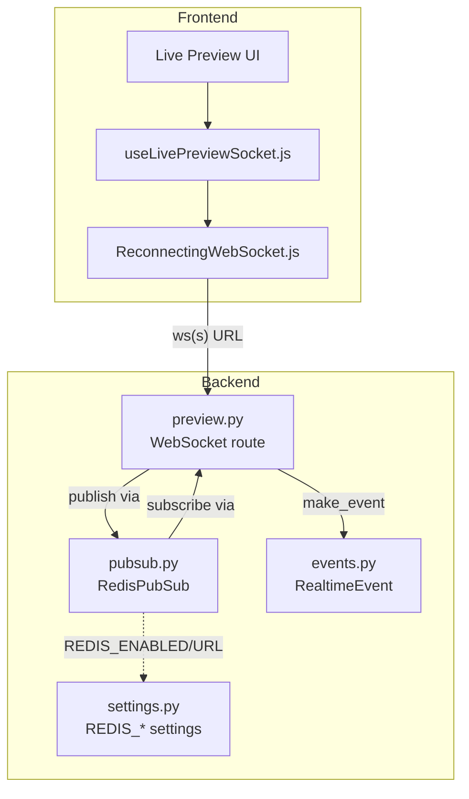
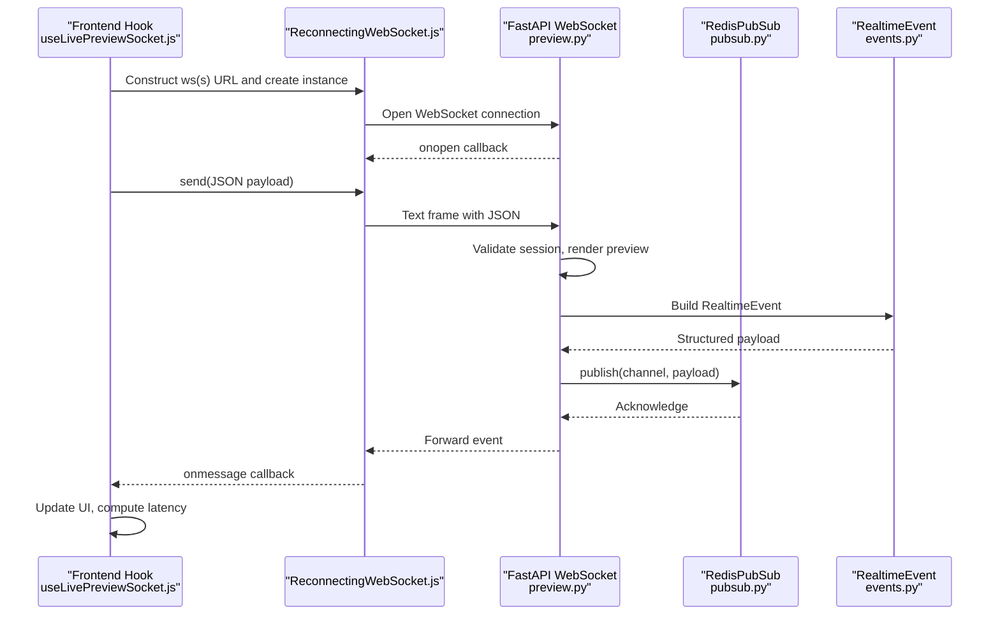
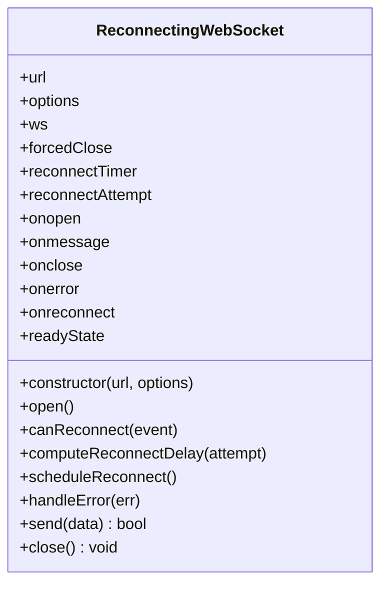
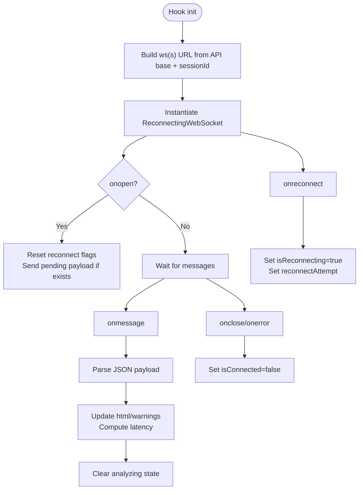
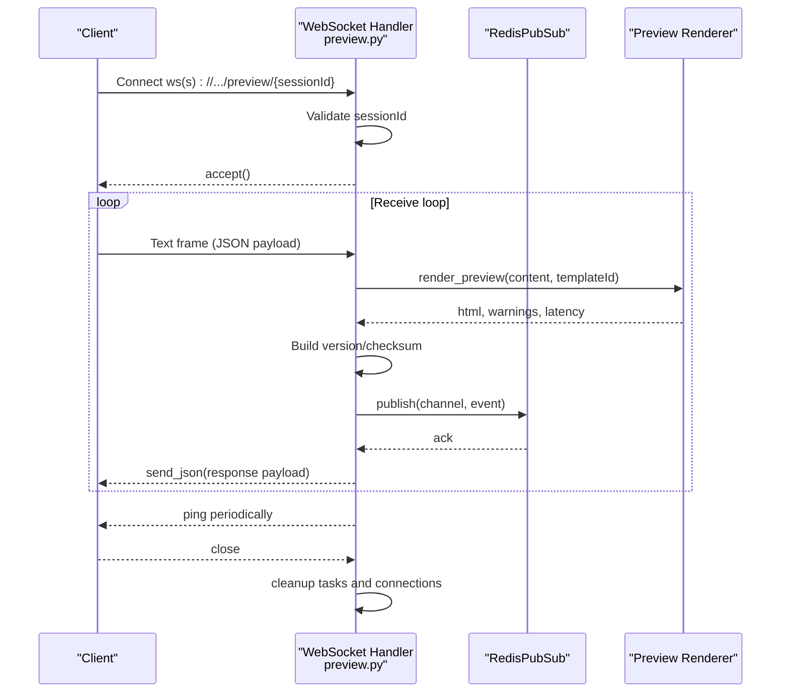
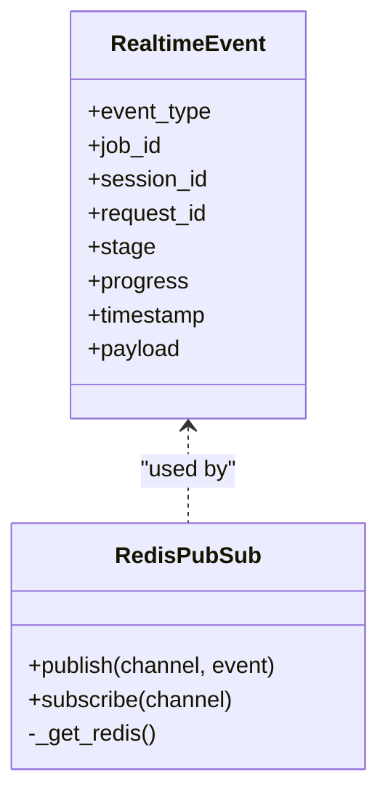
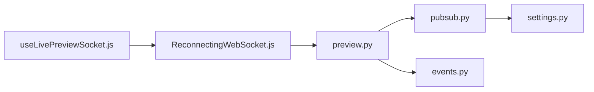

# WebSocket Implementation

<cite>
**Referenced Files in This Document**
- [ReconnectingWebSocket.js](file://frontend/src/lib/ReconnectingWebSocket.js)
- [useLivePreviewSocket.js](file://frontend/src/hooks/useLivePreviewSocket.js)
- [preview.py](file://backend/app/routers/preview.py)
- [events.py](file://backend/app/realtime/events.py)
- [pubsub.py](file://backend/app/realtime/pubsub.py)
- [settings.py](file://backend/app/config/settings.py)
- [002-redis-realtime-backbone.md](file://docs/adr/002-redis-realtime-backbone.md)
</cite>

## Table of Contents
1. [Introduction](#introduction)
2. [Project Structure](#project-structure)
3. [Core Components](#core-components)
4. [Architecture Overview](#architecture-overview)
5. [Detailed Component Analysis](#detailed-component-analysis)
6. [Dependency Analysis](#dependency-analysis)
7. [Performance Considerations](#performance-considerations)
8. [Troubleshooting Guide](#troubleshooting-guide)
9. [Conclusion](#conclusion)

## Introduction
This document explains the WebSocket implementation powering real-time live preview in the application. It focuses on the ReconnectingWebSocket class, connection lifecycle management, automatic reconnection strategies, URL construction, protocol conversion from HTTP to WS, session-based routing, state management, message handling, payload structure, event callbacks, error handling, timeouts, and graceful degradation. It also provides practical examples for establishing connections, sending messages, and handling disconnections.

## Project Structure
The WebSocket real-time feature spans the frontend and backend:
- Frontend: A reusable ReconnectingWebSocket wrapper and a React hook that connects to the backend preview WebSocket endpoint.
- Backend: A FastAPI WebSocket route, a pub/sub layer backed by Redis with in-memory fallback, and event data structures.

**Diagram sources**
- [useLivePreviewSocket.js:16-20](file://frontend/src/hooks/useLivePreviewSocket.js#L16-L20)
- [ReconnectingWebSocket.js:5-31](file://frontend/src/lib/ReconnectingWebSocket.js#L5-L31)
- [preview.py:78-127](file://backend/app/routers/preview.py#L78-L127)
- [pubsub.py:18-120](file://backend/app/realtime/pubsub.py#L18-L120)
- [events.py:9-34](file://backend/app/realtime/events.py#L9-L34)
- [settings.py:156-162](file://backend/app/config/settings.py#L156-L162)

**Section sources**
- [useLivePreviewSocket.js:16-20](file://frontend/src/hooks/useLivePreviewSocket.js#L16-L20)
- [ReconnectingWebSocket.js:5-31](file://frontend/src/lib/ReconnectingWebSocket.js#L5-L31)
- [preview.py:78-127](file://backend/app/routers/preview.py#L78-L127)
- [pubsub.py:18-120](file://backend/app/realtime/pubsub.py#L18-L120)
- [events.py:9-34](file://backend/app/realtime/events.py#L9-L34)
- [settings.py:156-162](file://backend/app/config/settings.py#L156-L162)

## Core Components
- ReconnectingWebSocket: A robust wrapper around the browser’s WebSocket API that adds exponential backoff with jitter, retry limits, and reconnect scheduling. It exposes event callbacks and a send method.
- useLivePreviewSocket: A React hook that constructs the WebSocket URL from the API base URL, manages connection state flags, debounces and sends payloads, and handles incoming preview updates.
- Backend WebSocket route: Validates sessions, accepts connections, forwards updates via pub/sub, and periodically pings clients.
- RedisPubSub: Publish/subscribe layer that uses Redis when available, with in-memory fallback for resilience.
- RealtimeEvent: A structured event builder for real-time updates.

Key capabilities:
- Automatic reconnection with exponential backoff and jitter
- Session-based routing via URL path parameter
- Payload structure with content, templateId, optional cursor, checksum, and sequence number
- Event-driven updates with ping/heartbeat and structured payloads

**Section sources**
- [ReconnectingWebSocket.js:5-31](file://frontend/src/lib/ReconnectingWebSocket.js#L5-L31)
- [useLivePreviewSocket.js:28-102](file://frontend/src/hooks/useLivePreviewSocket.js#L28-L102)
- [preview.py:78-127](file://backend/app/routers/preview.py#L78-L127)
- [pubsub.py:18-120](file://backend/app/realtime/pubsub.py#L18-L120)
- [events.py:9-34](file://backend/app/realtime/events.py#L9-L34)

## Architecture Overview
The live preview WebSocket flow:
- Frontend constructs a ws(s) URL from the configured API base URL and session ID.
- ReconnectingWebSocket opens the connection and wires event handlers.
- On receiving user content, the hook debounces and sends a JSON payload.
- Backend validates the session, renders HTML, computes a version/checksum, and publishes a structured event to the session-specific channel.
- RedisPubSub delivers the event to subscribed WebSocket clients; the route forwards it to the client.
- Clients update UI state and measure latency.

**Diagram sources**
- [useLivePreviewSocket.js:44-102](file://frontend/src/hooks/useLivePreviewSocket.js#L44-L102)
- [ReconnectingWebSocket.js:33-67](file://frontend/src/lib/ReconnectingWebSocket.js#L33-L67)
- [preview.py:78-127](file://backend/app/routers/preview.py#L78-L127)
- [pubsub.py:55-78](file://backend/app/realtime/pubsub.py#L55-L78)
- [events.py:21-34](file://backend/app/realtime/events.py#L21-L34)

## Detailed Component Analysis

### ReconnectingWebSocket Class
Responsibilities:
- Manage WebSocket lifecycle and reconnection
- Expose event callbacks: onopen, onmessage, onclose, onerror, onreconnect
- Compute reconnect delay using exponential backoff with jitter
- Track reconnectAttempt and forcedClose flag
- Provide send and close helpers

Implementation highlights:
- Constructor merges defaults with user options and immediately opens the connection.
- open() creates a native WebSocket and wires event handlers; resets reconnectAttempt on open and clears scheduled reconnect timers.
- canReconnect() respects maxRetries and an optional shouldReconnect predicate.
- computeReconnectDelay() calculates capped exponential delay with jitter applied to min/max bounds.
- scheduleReconnect() triggers onreconnect callback, sets a timer, increments reconnectAttempt, and retries open().
- handleError() invokes onerror and schedules a reconnect.
- send() checks readyState before sending; returns whether the send succeeded.
- close() cancels timers, clears listeners, closes the underlying socket if needed, and marks forcedClose.

**Diagram sources**
- [ReconnectingWebSocket.js:5-147](file://frontend/src/lib/ReconnectingWebSocket.js#L5-L147)

**Section sources**
- [ReconnectingWebSocket.js:5-31](file://frontend/src/lib/ReconnectingWebSocket.js#L5-L31)
- [ReconnectingWebSocket.js:33-67](file://frontend/src/lib/ReconnectingWebSocket.js#L33-L67)
- [ReconnectingWebSocket.js:69-79](file://frontend/src/lib/ReconnectingWebSocket.js#L69-L79)
- [ReconnectingWebSocket.js:81-92](file://frontend/src/lib/ReconnectingWebSocket.js#L81-L92)
- [ReconnectingWebSocket.js:94-109](file://frontend/src/lib/ReconnectingWebSocket.js#L94-L109)
- [ReconnectingWebSocket.js:111-114](file://frontend/src/lib/ReconnectingWebSocket.js#L111-L114)
- [ReconnectingWebSocket.js:116-122](file://frontend/src/lib/ReconnectingWebSocket.js#L116-L122)
- [ReconnectingWebSocket.js:124-142](file://frontend/src/lib/ReconnectingWebSocket.js#L124-L142)
- [ReconnectingWebSocket.js:144-147](file://frontend/src/lib/ReconnectingWebSocket.js#L144-L147)

### Frontend Hook: useLivePreviewSocket
Responsibilities:
- Build ws(s) URL from NEXT_PUBLIC_API_URL and session ID
- Initialize ReconnectingWebSocket with backoff parameters
- Manage connection state flags: isConnected, isReconnecting, reconnectAttempt, isAnalyzing
- Debounce and send content updates with payload structure
- Parse incoming preview updates and compute latency

Key behaviors:
- URL construction converts http(s) to ws(s) and appends the preview WebSocket endpoint with session ID.
- onopen resets reconnect state and replays any pending payload.
- onmessage parses JSON, updates HTML/warnings, computes latency, and clears analyzing state.
- onclose/onerror set isConnected to false.
- onreconnect toggles isReconnecting and tracks reconnectAttempt.
- sendContent debounces input, computes a lightweight checksum, assigns a sequence number, and sends when the socket is ready.

**Diagram sources**
- [useLivePreviewSocket.js:16-20](file://frontend/src/hooks/useLivePreviewSocket.js#L16-L20)
- [useLivePreviewSocket.js:44-102](file://frontend/src/hooks/useLivePreviewSocket.js#L44-L102)
- [useLivePreviewSocket.js:106-133](file://frontend/src/hooks/useLivePreviewSocket.js#L106-L133)

**Section sources**
- [useLivePreviewSocket.js:16-20](file://frontend/src/hooks/useLivePreviewSocket.js#L16-L20)
- [useLivePreviewSocket.js:44-102](file://frontend/src/hooks/useLivePreviewSocket.js#L44-L102)
- [useLivePreviewSocket.js:106-133](file://frontend/src/hooks/useLivePreviewSocket.js#L106-L133)

### Backend WebSocket Route: preview_ws
Responsibilities:
- Validate session ID
- Accept WebSocket connections
- Maintain per-session connections
- Forward updates to clients via RedisPubSub
- Periodically send ping heartbeats
- Render preview on incoming content and publish structured events

Key behaviors:
- Validates session ID; closes with code 1008 if invalid.
- Accepts the WebSocket and starts forward and heartbeat tasks.
- Receives text frames, parses JSON, renders preview, computes version/checksum, builds a structured payload, and publishes to the session channel.
- Cleans up tasks and removes the connection on disconnect.

**Diagram sources**
- [preview.py:78-127](file://backend/app/routers/preview.py#L78-L127)
- [pubsub.py:55-78](file://backend/app/realtime/pubsub.py#L55-L78)

**Section sources**
- [preview.py:78-127](file://backend/app/routers/preview.py#L78-L127)

### Realtime Event Model and Pub/Sub
- RealtimeEvent defines a typed event with fields such as event_type, session_id, request_id, stage, progress, timestamp, and payload.
- make_event() constructs a dictionary suitable for transport, injecting request_id if not present and serializing timestamp.
- RedisPubSub supports publish/subscribe with Redis when enabled; otherwise falls back to in-memory queues per loop.

**Diagram sources**
- [events.py:9-34](file://backend/app/realtime/events.py#L9-L34)
- [pubsub.py:18-120](file://backend/app/realtime/pubsub.py#L18-L120)

**Section sources**
- [events.py:9-34](file://backend/app/realtime/events.py#L9-L34)
- [pubsub.py:18-120](file://backend/app/realtime/pubsub.py#L18-L120)

## Dependency Analysis
- Frontend depends on:
  - ReconnectingWebSocket for connection management
  - React hooks for state and lifecycle
  - Environment variable for API base URL
- Backend depends on:
  - FastAPI WebSocket router for endpoints
  - RedisPubSub for pub/sub
  - RealtimeEvent for structured payloads
  - Settings for Redis configuration

**Diagram sources**
- [useLivePreviewSocket.js:1-3](file://frontend/src/hooks/useLivePreviewSocket.js#L1-L3)
- [ReconnectingWebSocket.js:5-31](file://frontend/src/lib/ReconnectingWebSocket.js#L5-L31)
- [preview.py:78-127](file://backend/app/routers/preview.py#L78-L127)
- [pubsub.py:18-120](file://backend/app/realtime/pubsub.py#L18-L120)
- [events.py:21-34](file://backend/app/realtime/events.py#L21-L34)
- [settings.py:156-162](file://backend/app/config/settings.py#L156-L162)

**Section sources**
- [useLivePreviewSocket.js:1-3](file://frontend/src/hooks/useLivePreviewSocket.js#L1-L3)
- [ReconnectingWebSocket.js:5-31](file://frontend/src/lib/ReconnectingWebSocket.js#L5-L31)
- [preview.py:78-127](file://backend/app/routers/preview.py#L78-L127)
- [pubsub.py:18-120](file://backend/app/realtime/pubsub.py#L18-L120)
- [events.py:21-34](file://backend/app/realtime/events.py#L21-L34)
- [settings.py:156-162](file://backend/app/config/settings.py#L156-L162)

## Performance Considerations
- Backoff strategy: Exponential backoff with jitter reduces thundering herd and stabilizes recovery after transient failures.
- Latency measurement: The frontend measures round-trip latency by recording send timestamps and updating upon receiving the response.
- Heartbeat/ping: Backend periodically sends ping frames to detect dead connections proactively.
- Pub/Sub scaling: Redis-backed pub/sub enables horizontal scaling; in-memory fallback ensures basic functionality when Redis is unavailable.

[No sources needed since this section provides general guidance]

## Troubleshooting Guide
Common scenarios and remedies:
- Connection fails immediately:
  - Verify NEXT_PUBLIC_API_URL and that the backend is reachable.
  - Check that the WebSocket route path matches the constructed URL.
- Frequent reconnections:
  - Inspect onreconnect callbacks to confirm retry attempts and delays.
  - Review shouldReconnect predicate if overridden.
- Messages not received:
  - Ensure the payload is valid JSON and includes required fields (content, templateId/template_id).
  - Confirm the session ID is valid and matches the route pattern.
- Redis unavailability:
  - The backend falls back to in-memory queues; expect limited scalability but functional behavior.
  - Monitor logs for Redis-related warnings.

Operational tips:
- Use onerror and onclose handlers to surface connection issues to users.
- Implement a maximum retry limit via options.maxRetries to prevent indefinite reconnection loops.
- Gracefully degrade by disabling real-time features when WebSocket is unavailable; the fallback mechanisms remain intact.

**Section sources**
- [ReconnectingWebSocket.js:69-79](file://frontend/src/lib/ReconnectingWebSocket.js#L69-L79)
- [ReconnectingWebSocket.js:111-114](file://frontend/src/lib/ReconnectingWebSocket.js#L111-L114)
- [preview.py:78-127](file://backend/app/routers/preview.py#L78-L127)
- [pubsub.py:40-53](file://backend/app/realtime/pubsub.py#L40-L53)

## Conclusion
The WebSocket implementation combines a resilient frontend wrapper with a backend route and pub/sub infrastructure. It provides automatic reconnection, structured events, session-based routing, and clear state management. Together with heartbeat and fallback strategies, it delivers a robust real-time experience with predictable behavior under failure conditions.