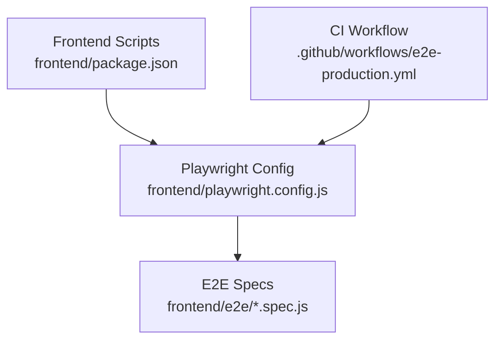
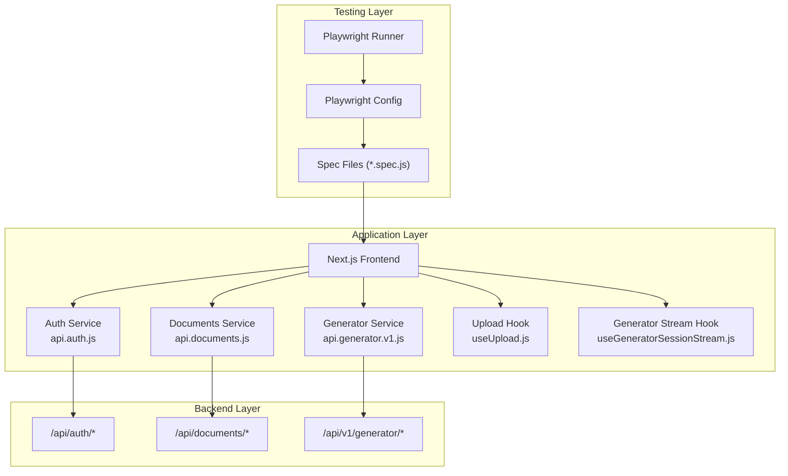
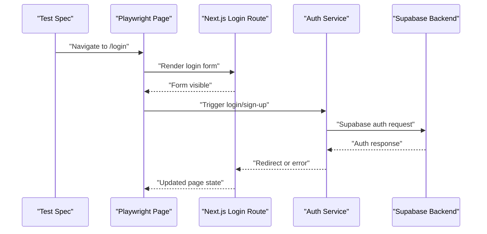
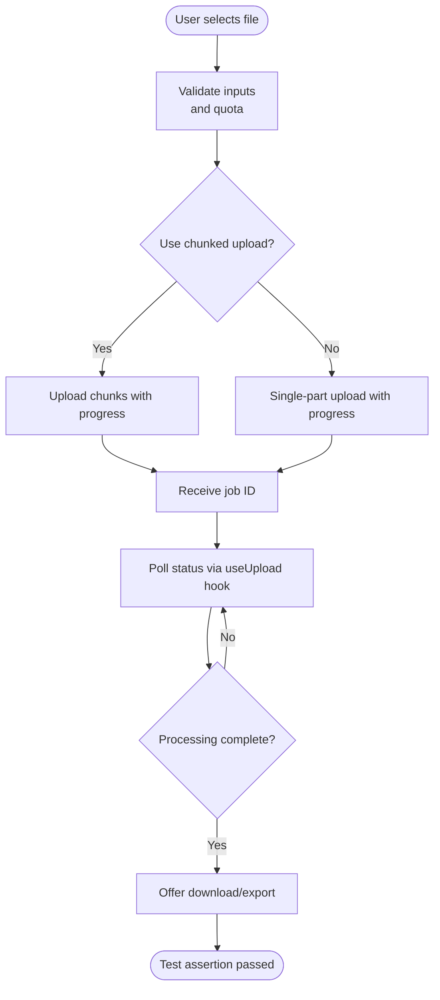
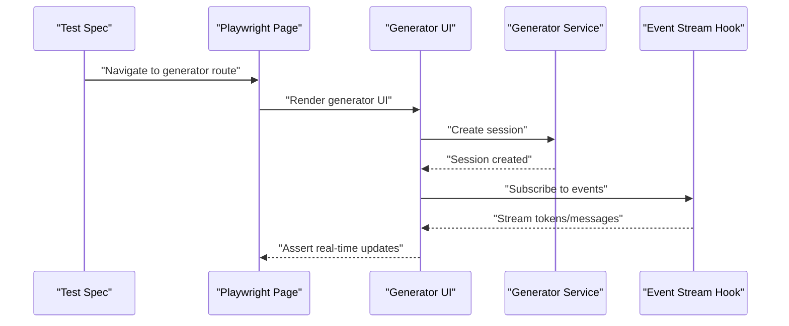
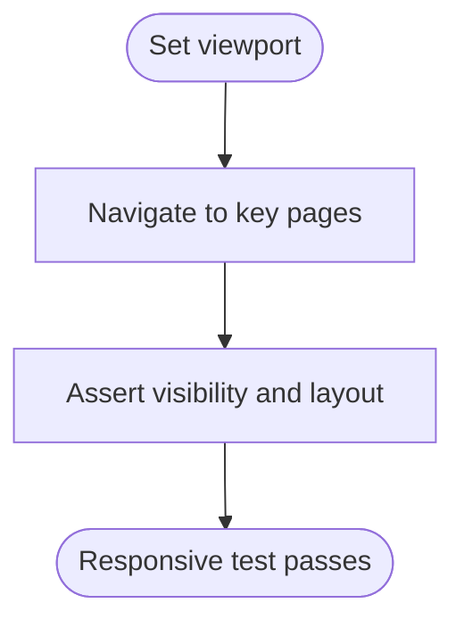
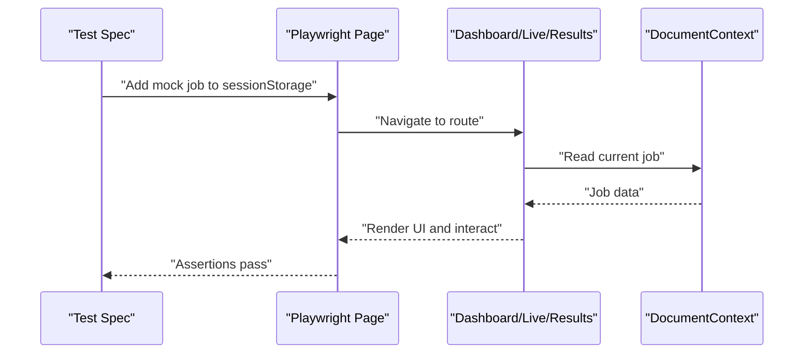
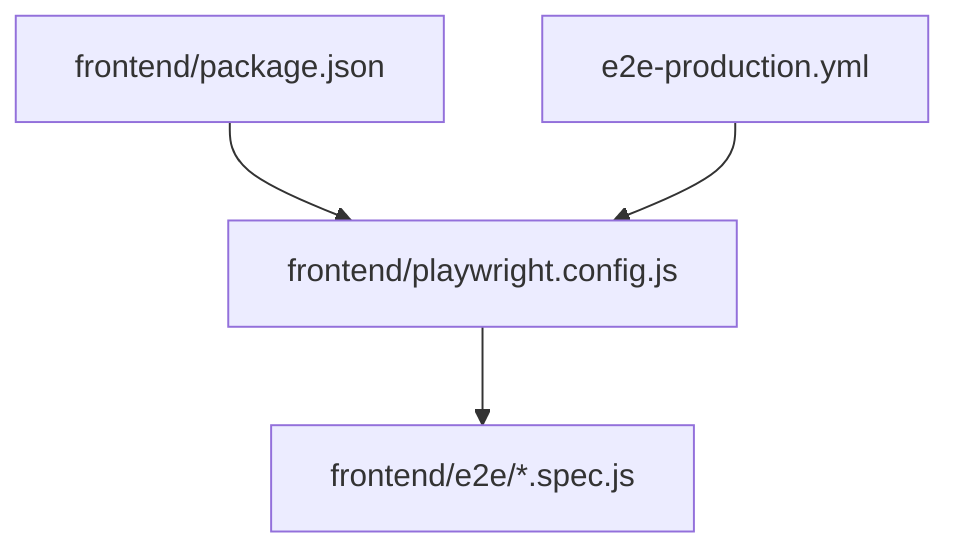

# Playwright End-to-End Testing

<cite>
**Referenced Files in This Document**
- [playwright.config.js](file://frontend/playwright.config.js)
- [package.json](file://frontend/package.json)
- [auth-flow.spec.js](file://frontend/e2e/auth-flow.spec.js)
- [formatter-upload.spec.js](file://frontend/e2e/formatter-upload.spec.js)
- [generator-streaming.spec.js](file://frontend/e2e/generator-streaming.spec.js)
- [responsive-mobile.spec.js](file://frontend/e2e/responsive-mobile.spec.js)
- [formatter-live-preview.spec.js](file://frontend/e2e/formatter-live-preview.spec.js)
- [generator-history.spec.js](file://frontend/e2e/generator-history.spec.js)
- [smoke.spec.js](file://frontend/e2e/smoke.spec.js)
- [template-list.spec.js](file://frontend/e2e/template-list.spec.js)
- [e2e-production.yml](file://.github/workflows/e2e-production.yml)
- [api.auth.js](file://frontend/src/services/api.auth.js)
- [api.documents.js](file://frontend/src/services/api.documents.js)
- [useUpload.js](file://frontend/src/hooks/useUpload.js)
- [api.generator.v1.js](file://frontend/src/services/api.generator.v1.js)
- [useGeneratorSessionStream.js](file://frontend/src/hooks/useGeneratorSessionStream.js)
</cite>

## Table of Contents
1. [Introduction](#introduction)
2. [Project Structure](#project-structure)
3. [Core Components](#core-components)
4. [Architecture Overview](#architecture-overview)
5. [Detailed Component Analysis](#detailed-component-analysis)
6. [Dependency Analysis](#dependency-analysis)
7. [Performance Considerations](#performance-considerations)
8. [Troubleshooting Guide](#troubleshooting-guide)
9. [Conclusion](#conclusion)
10. [Appendices](#appendices)

## Introduction
This document provides comprehensive Playwright End-to-End (E2E) testing documentation for the Next.js frontend application. It covers configuration, setup, test categories, and testing patterns for critical user workflows such as authentication, document formatting, generator functionality, and template management. It also includes guidance for writing robust E2E tests, handling asynchronous operations, managing test data, debugging failures, browser compatibility, responsive design validation, and performance testing scenarios.

## Project Structure
The E2E tests reside under the frontend directory in the e2e folder. The Playwright configuration defines test execution behavior, browser targets, and local development server integration. The GitHub Actions workflow executes E2E tests against a production-like frontend URL.

**Diagram sources**
- [playwright.config.js:1-48](file://frontend/playwright.config.js#L1-L48)
- [package.json:1-62](file://frontend/package.json#L1-L62)
- [e2e-production.yml:1-38](file://.github/workflows/e2e-production.yml#L1-L38)

**Section sources**
- [playwright.config.js:1-48](file://frontend/playwright.config.js#L1-L48)
- [package.json:1-62](file://frontend/package.json#L1-L62)
- [.github/workflows/e2e-production.yml:1-38](file://.github/workflows/e2e-production.yml#L1-L38)

## Core Components
- Playwright configuration controls test execution, browser selection, tracing, and local dev server lifecycle.
- Test suites cover authentication flows, dashboard interactions, formatter workflows, generator features, and responsive design.
- Services and hooks encapsulate API interactions and real-time features used by the tested pages.

Key configuration highlights:
- Test directory: frontend/e2e
- Projects: Chromium only by default
- Workers: 4 locally, 1 in CI
- Retries: 2 on CI
- Trace: collected on first retry
- Web server: starts Next.js dev server automatically when no external base URL is provided

**Section sources**
- [playwright.config.js:10-47](file://frontend/playwright.config.js#L10-L47)
- [package.json:6-16](file://frontend/package.json#L6-L16)

## Architecture Overview
The E2E architecture integrates Playwright with the Next.js frontend and backend APIs. Tests navigate to routes, interact with UI components, and assert expected outcomes. Authentication relies on Supabase, while document and generator features leverage dedicated services and hooks.

**Diagram sources**
- [playwright.config.js:1-48](file://frontend/playwright.config.js#L1-L48)
- [api.auth.js:1-39](file://frontend/src/services/api.auth.js#L1-L39)
- [api.documents.js:1-412](file://frontend/src/services/api.documents.js#L1-L412)
- [api.generator.v1.js:1-80](file://frontend/src/services/api.generator.v1.js#L1-L80)
- [useUpload.js:1-361](file://frontend/src/hooks/useUpload.js#L1-L361)
- [useGeneratorSessionStream.js:1-12](file://frontend/src/hooks/useGeneratorSessionStream.js#L1-L12)

## Detailed Component Analysis

### Authentication Flow Testing
Tests verify the authentication root check and basic login behavior. The auth service integrates with Supabase for OAuth and OTP-based flows.

**Diagram sources**
- [auth-flow.spec.js:1-7](file://frontend/e2e/auth-flow.spec.js#L1-L7)
- [api.auth.js:18-38](file://frontend/src/services/api.auth.js#L18-L38)

**Section sources**
- [auth-flow.spec.js:1-7](file://frontend/e2e/auth-flow.spec.js#L1-L7)
- [api.auth.js:1-39](file://frontend/src/services/api.auth.js#L1-L39)

### Document Upload and Formatting Workflows
Tests cover upload routes and formatter pages. The upload hook manages progress, chunked uploads, and status polling. The documents service handles file uploads, previews, comparisons, exports, and deletions.

**Diagram sources**
- [useUpload.js:224-342](file://frontend/src/hooks/useUpload.js#L224-L342)
- [api.documents.js:128-300](file://frontend/src/services/api.documents.js#L128-L300)

**Section sources**
- [formatter-upload.spec.js:1-11](file://frontend/e2e/formatter-upload.spec.js#L1-L11)
- [useUpload.js:1-361](file://frontend/src/hooks/useUpload.js#L1-L361)
- [api.documents.js:1-412](file://frontend/src/services/api.documents.js#L1-L412)

### Generator Streaming and Session Management
Generator tests validate real-time token streaming and session interactions. The generator service supports sessions, messages, outlines, and stopping sessions. The generator stream hook connects to event streams.

**Diagram sources**
- [generator-streaming.spec.js:1-5](file://frontend/e2e/generator-streaming.spec.js#L1-L5)
- [api.generator.v1.js:4-80](file://frontend/src/services/api.generator.v1.js#L4-L80)
- [useGeneratorSessionStream.js:1-12](file://frontend/src/hooks/useGeneratorSessionStream.js#L1-L12)

**Section sources**
- [generator-streaming.spec.js:1-5](file://frontend/e2e/generator-streaming.spec.js#L1-L5)
- [api.generator.v1.js:1-80](file://frontend/src/services/api.generator.v1.js#L1-L80)
- [useGeneratorSessionStream.js:1-12](file://frontend/src/hooks/useGeneratorSessionStream.js#L1-L12)

### Responsive Design Testing
Responsive tests set device viewports to simulate mobile and tablet experiences.

**Diagram sources**
- [responsive-mobile.spec.js:1-7](file://frontend/e2e/responsive-mobile.spec.js#L1-L7)

**Section sources**
- [responsive-mobile.spec.js:1-7](file://frontend/e2e/responsive-mobile.spec.js#L1-L7)

### Dashboard and Live Preview Interactions
Smoke tests validate core routes and interactions, including live preview and results pages. These tests initialize mock job data via session storage to exercise UI components that depend on active jobs.

**Diagram sources**
- [smoke.spec.js:5-23](file://frontend/e2e/smoke.spec.js#L5-L23)

**Section sources**
- [smoke.spec.js:1-68](file://frontend/e2e/smoke.spec.js#L1-L68)

### Template Management Testing
Template list tests ensure the templates page loads without crashing and displays content.

**Section sources**
- [template-list.spec.js:1-11](file://frontend/e2e/template-list.spec.js#L1-L11)

### Additional Test Categories
- History and generator-related flows: generator-history.spec.js
- Live preview types and updates: formatter-live-preview.spec.js
- Protected routes and onboarding tours: protected-routes.spec.js, onboarding-tour-next.spec.js, onboarding-tour-skip.spec.js
- Multi-file uploads and quotas: generator-multi-upload.spec.js, multi-upload-max-files.spec.js
- Guest uploads: guest-upload.spec.js, guest-upload-pdf.spec.js
- Export formats and LaTeX downloads: formatter-download-formats.spec.js, latex-export-download.spec.js
- Quality checks and editing: formatter-quality.spec.js, formatter-edit.spec.js
- Compare and batch operations: formatter-compare.spec.js, formatter-batch.spec.js
- Settings and profile updates: settings.spec.js, profile-update.spec.js
- Forgot/reset password: forgot-password.spec.js, reset-password.spec.js
- Plan gating and account deletion: plan-gating.spec.js, account-deletion.spec.js
- Admin access and error boundaries: admin-access.spec.js, error-boundary.spec.js
- Dark mode and navigation toggles: dark-mode.spec.js, navigation-sidebar-toggle.spec.js
- Landing page and smoke: landing-page.spec.js, smoke.spec.js

**Section sources**
- [generator-history.spec.js:1-11](file://frontend/e2e/generator-history.spec.js#L1-L11)
- [formatter-live-preview.spec.js:1-5](file://frontend/e2e/formatter-live-preview.spec.js#L1-L5)
- [protected-routes.spec.js:1-50](file://frontend/e2e/protected-routes.spec.js#L1-L50)
- [onboarding-tour-next.spec.js:1-50](file://frontend/e2e/onboarding-tour-next.spec.js#L1-L50)
- [onboarding-tour-skip.spec.js:1-50](file://frontend/e2e/onboarding-tour-skip.spec.js#L1-L50)
- [generator-multi-upload.spec.js:1-50](file://frontend/e2e/generator-multi-upload.spec.js#L1-L50)
- [multi-upload-max-files.spec.js:1-50](file://frontend/e2e/multi-upload-max-files.spec.js#L1-L50)
- [guest-upload.spec.js:1-50](file://frontend/e2e/guest-upload.spec.js#L1-L50)
- [guest-upload-pdf.spec.js:1-50](file://frontend/e2e/guest-upload-pdf.spec.js#L1-L50)
- [formatter-download-formats.spec.js:1-50](file://frontend/e2e/formatter-download-formats.spec.js#L1-L50)
- [latex-export-download.spec.js:1-50](file://frontend/e2e/latex-export-download.spec.js#L1-L50)
- [formatter-quality.spec.js:1-50](file://frontend/e2e/formatter-quality.spec.js#L1-L50)
- [formatter-edit.spec.js:1-50](file://frontend/e2e/formatter-edit.spec.js#L1-L50)
- [formatter-compare.spec.js:1-50](file://frontend/e2e/formatter-compare.spec.js#L1-L50)
- [formatter-batch.spec.js:1-50](file://frontend/e2e/formatter-batch.spec.js#L1-L50)
- [settings.spec.js:1-50](file://frontend/e2e/settings.spec.js#L1-L50)
- [profile-update.spec.js:1-50](file://frontend/e2e/profile-update.spec.js#L1-L50)
- [forgot-password.spec.js:1-50](file://frontend/e2e/forgot-password.spec.js#L1-L50)
- [reset-password.spec.js:1-50](file://frontend/e2e/reset-password.spec.js#L1-L50)
- [plan-gating.spec.js:1-50](file://frontend/e2e/plan-gating.spec.js#L1-L50)
- [account-deletion.spec.js:1-50](file://frontend/e2e/account-deletion.spec.js#L1-L50)
- [admin-access.spec.js:1-50](file://frontend/e2e/admin-access.spec.js#L1-L50)
- [error-boundary.spec.js:1-50](file://frontend/e2e/error-boundary.spec.js#L1-L50)
- [dark-mode.spec.js:1-50](file://frontend/e2e/dark-mode.spec.js#L1-L50)
- [navigation-sidebar-toggle.spec.js:1-50](file://frontend/e2e/navigation-sidebar-toggle.spec.js#L1-L50)
- [landing-page.spec.js:1-50](file://frontend/e2e/landing-page.spec.js#L1-L50)
- [smoke.spec.js:1-68](file://frontend/e2e/smoke.spec.js#L1-L68)

## Dependency Analysis
Playwright depends on the frontend package scripts and configuration. The CI workflow installs Playwright browsers and runs tests against a configured base URL.

**Diagram sources**
- [package.json:6-16](file://frontend/package.json#L6-L16)
- [playwright.config.js:1-48](file://frontend/playwright.config.js#L1-L48)
- [e2e-production.yml:1-38](file://.github/workflows/e2e-production.yml#L1-L38)

**Section sources**
- [package.json:1-62](file://frontend/package.json#L1-L62)
- [playwright.config.js:1-48](file://frontend/playwright.config.js#L1-L48)
- [.github/workflows/e2e-production.yml:1-38](file://.github/workflows/e2e-production.yml#L1-L38)

## Performance Considerations
- Parallelism: Disable full parallelism locally; use 4 workers; CI uses 1 worker for stability.
- Retries: Enable retries on CI to mitigate flakiness.
- Tracing: Enable trace collection on first retry to capture failure context.
- Local dev server: Reuse existing server to avoid repeated startup overhead.
- Viewport testing: Use targeted viewport sizes to reduce test runtime while validating responsiveness.

[No sources needed since this section provides general guidance]

## Troubleshooting Guide
Common issues and resolutions:
- Flaky tests: Increase retries on CI; collect traces on first retry for failure analysis.
- Local vs. CI differences: Ensure consistent environment variables (e.g., PLAYWRIGHT_BASE_URL).
- Authentication failures: Verify Supabase client initialization and redirect paths.
- Upload timeouts: Adjust waitUntil and timeout options; consider chunked uploads for large files.
- Real-time updates: Confirm event stream URLs and hook subscriptions.
- Mock data: Initialize session storage with required job data for routes dependent on active jobs.

**Section sources**
- [playwright.config.js:14-28](file://frontend/playwright.config.js#L14-L28)
- [e2e-production.yml:33-37](file://.github/workflows/e2e-production.yml#L33-L37)
- [api.auth.js:28-38](file://frontend/src/services/api.auth.js#L28-L38)
- [useUpload.js:267-290](file://frontend/src/hooks/useUpload.js#L267-L290)
- [useGeneratorSessionStream.js:5-11](file://frontend/src/hooks/useGeneratorSessionStream.js#L5-L11)
- [smoke.spec.js:5-23](file://frontend/e2e/smoke.spec.js#L5-L23)

## Conclusion
The Playwright E2E suite comprehensively validates the Next.js application’s critical user workflows. With focused test categories, robust configuration, and clear testing patterns, teams can maintain reliable coverage for authentication, document formatting, generator features, and responsive design. Adhering to the guidelines in this document ensures consistent, maintainable, and effective E2E testing.

[No sources needed since this section summarizes without analyzing specific files]

## Appendices

### Writing Robust E2E Tests
- Prefer explicit waits for critical UI elements.
- Use beforeEach hooks to initialize required state (e.g., session storage).
- Isolate tests with minimal shared state.
- Capture traces on failure to aid debugging.
- Validate both happy paths and error conditions.

[No sources needed since this section provides general guidance]

### Handling Asynchronous Operations
- Use hooks/services that expose status polling and event streams.
- Assert real-time updates by subscribing to event endpoints.
- Manage upload progress and cancellation via AbortController.

**Section sources**
- [useUpload.js:89-196](file://frontend/src/hooks/useUpload.js#L89-L196)
- [useGeneratorSessionStream.js:5-11](file://frontend/src/hooks/useGeneratorSessionStream.js#L5-L11)

### Managing Test Data
- Initialize mock jobs via addInitScript for routes requiring active jobs.
- Use fixture-like patterns to seed data for authenticated flows.
- Keep test data minimal and deterministic.

**Section sources**
- [smoke.spec.js:5-23](file://frontend/e2e/smoke.spec.js#L5-L23)

### Browser Compatibility and Responsive Testing
- Extend projects to include Firefox and Safari for broader compatibility.
- Add viewport-specific tests for mobile and tablet breakpoints.
- Validate layout shifts and interactive elements across devices.

**Section sources**
- [playwright.config.js:30-36](file://frontend/playwright.config.js#L30-L36)
- [responsive-mobile.spec.js:3-7](file://frontend/e2e/responsive-mobile.spec.js#L3-L7)

### Performance Testing Scenarios
- Measure page load times for key routes.
- Benchmark upload throughput with chunked uploads.
- Track generator session latency and token streaming rates.

[No sources needed since this section provides general guidance]