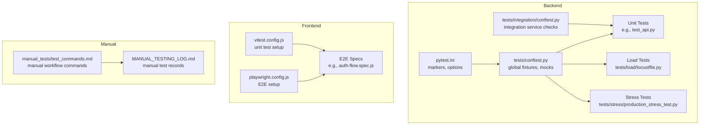
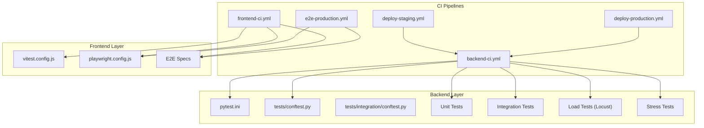
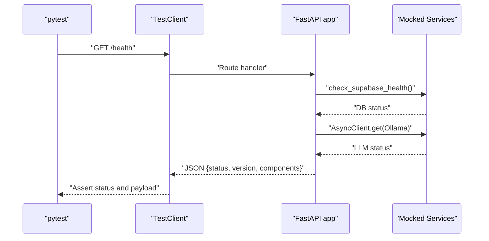
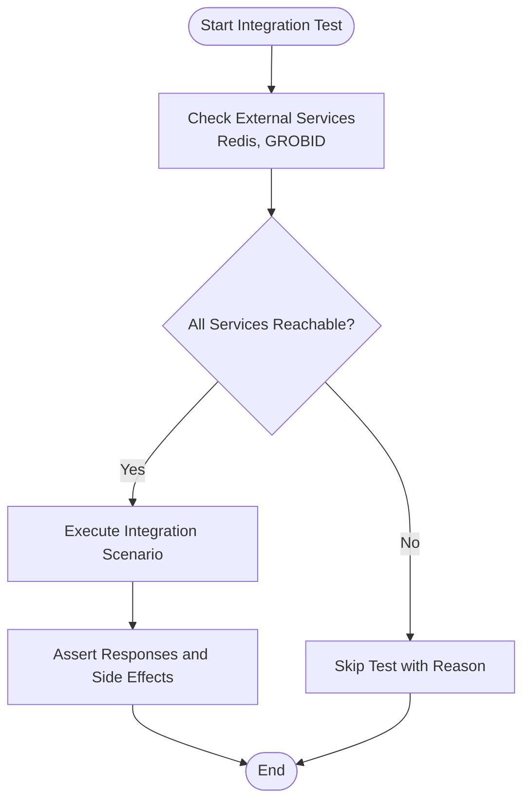
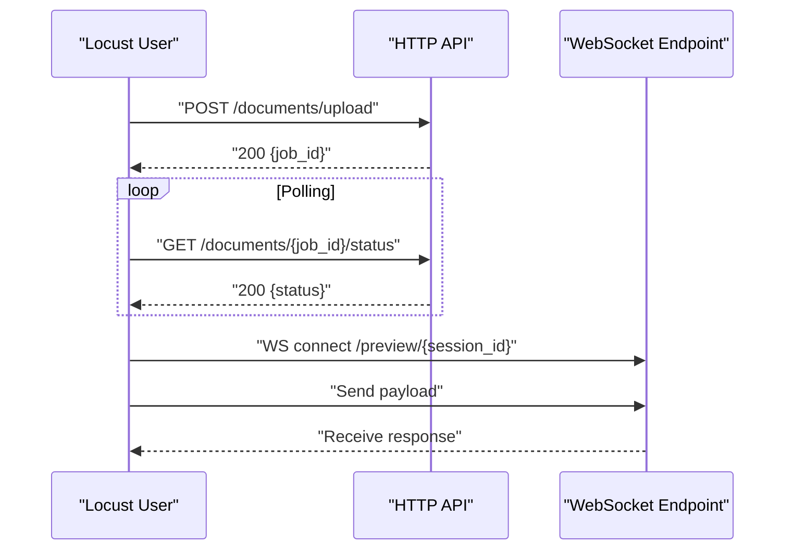
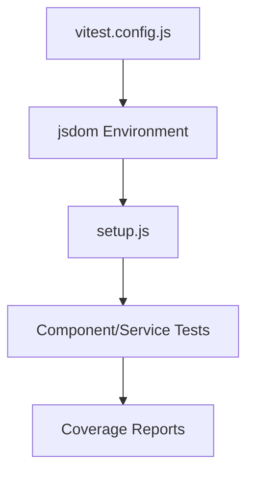
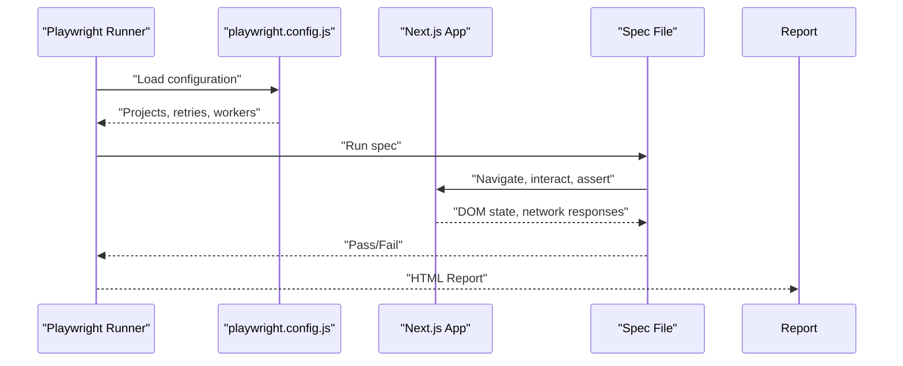
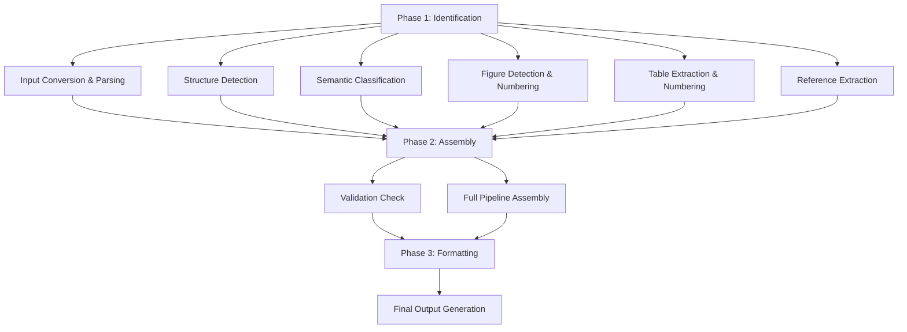
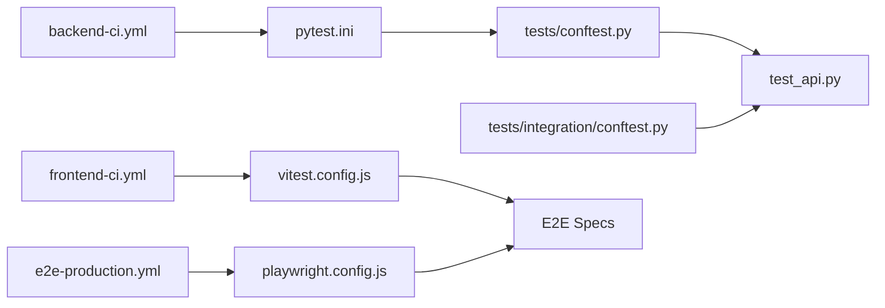

# Testing Strategy

<cite>
**Referenced Files in This Document**
- [conftest.py](file://backend/tests/conftest.py)
- [pytest.ini](file://backend/pytest.ini)
- [test_api.py](file://backend/tests/test_api.py)
- [integration/conftest.py](file://backend/tests/integration/conftest.py)
- [test_crossref_integration.py](file://backend/tests/integration/test_crossref_integration.py)
- [test_csl_integration.py](file://backend/tests/integration/test_csl_integration.py)
- [test_docling_integration.py](file://backend/tests/integration/test_docling_integration.py)
- [test_grobid_pipeline.py](file://backend/tests/integration/test_grobid_pipeline.py)
- [test_template_integration.py](file://backend/tests/integration/test_template_integration.py)
- [locustfile.py](file://backend/tests/load/locustfile.py)
- [production_stress_test.py](file://backend/tests/stress/production_stress_test.py)
- [playwright.config.js](file://frontend/playwright.config.js)
- [vitest.config.js](file://frontend/vitest.config.js)
- [auth-flow.spec.js](file://frontend/e2e/auth-flow.spec.js)
- [formatter-upload.spec.js](file://frontend/e2e/formatter-upload.spec.js)
- [login.spec.js](file://frontend/e2e/login.spec.js)
- [setup.js](file://frontend/src/test/setup.js)
- [TESTING_COMMANDS.md](file://backend/manual_tests/TESTING_COMMANDS.md)
- [test_commands.md](file://backend/manual_tests/test_commands.md)
- [MANUAL_TESTING_LOG.md](file://backend/MANUAL_TESTING_LOG.md)
- [backend-ci.yml](file://.github/workflows/backend-ci.yml)
- [frontend-ci.yml](file://.github/workflows/frontend-ci.yml)
- [e2e-production.yml](file://.github/workflows/e2e-production.yml)
- [deploy-staging.yml](file://.github/workflows/deploy-staging.yml)
- [deploy-production.yml](file://.github/workflows/deploy-production.yml)
</cite>

## Table of Contents
1. [Introduction](#introduction)
2. [Project Structure](#project-structure)
3. [Core Components](#core-components)
4. [Architecture Overview](#architecture-overview)
5. [Detailed Component Analysis](#detailed-component-analysis)
6. [Dependency Analysis](#dependency-analysis)
7. [Performance Considerations](#performance-considerations)
8. [Troubleshooting Guide](#troubleshooting-guide)
9. [Conclusion](#conclusion)
10. [Appendices](#appendices)

## Introduction
This document defines the complete testing strategy and implementation approach for the Automated Academic Docx Manuscript Formatter. It covers unit testing, integration testing with external services, end-to-end testing with Playwright, and manual testing workflows. It also explains test organization, fixture usage, mocking strategies, continuous integration pipelines, performance and load testing, best practices, test data management, and maintenance guidelines for different environments and deployment scenarios.

## Project Structure
The repository organizes testing across three layers:
- Backend Python tests: unit, integration, performance, and stress tests
- Frontend JavaScript/TypeScript tests: unit tests with Vitest and E2E tests with Playwright
- Manual testing scripts and commands for pipeline phases

**Diagram sources**
- [pytest.ini:1-28](file://backend/pytest.ini#L1-L28)
- [conftest.py:1-112](file://backend/tests/conftest.py#L1-L112)
- [integration/conftest.py:1-41](file://backend/tests/integration/conftest.py#L1-L41)
- [test_api.py:1-200](file://backend/tests/test_api.py#L1-L200)
- [locustfile.py:1-139](file://backend/tests/load/locustfile.py#L1-L139)
- [production_stress_test.py:1-172](file://backend/tests/stress/production_stress_test.py#L1-L172)
- [vitest.config.js:1-34](file://frontend/vitest.config.js#L1-L34)
- [playwright.config.js:1-48](file://frontend/playwright.config.js#L1-L48)
- [auth-flow.spec.js](file://frontend/e2e/auth-flow.spec.js)
- [test_commands.md:1-347](file://backend/manual_tests/test_commands.md#L1-L347)
- [MANUAL_TESTING_LOG.md](file://backend/MANUAL_TESTING_LOG.md)

**Section sources**
- [pytest.ini:1-28](file://backend/pytest.ini#L1-L28)
- [conftest.py:1-112](file://backend/tests/conftest.py#L1-L112)
- [integration/conftest.py:1-41](file://backend/tests/integration/conftest.py#L1-L41)
- [vitest.config.js:1-34](file://frontend/vitest.config.js#L1-L34)
- [playwright.config.js:1-48](file://frontend/playwright.config.js#L1-L48)
- [test_commands.md:1-347](file://backend/manual_tests/test_commands.md#L1-L347)

## Core Components
- Test runner configuration and markers: pytest.ini defines markers for categorizing tests (unit, integration, performance, pipeline, etc.) and global options.
- Backend fixtures and mocks: conftest.py provides global Redis, rate-limit, and cache mocks, plus reusable document fixtures for pipeline tests.
- Integration service readiness: integration conftest.py ensures external services (e.g., Redis, GROBID) are reachable before running integration tests.
- Unit tests: example test_api.py demonstrates endpoint testing with mocked dependencies.
- Load and stress tests: locustfile.py defines realistic load scenarios; production_stress_test.py validates end-to-end pipeline stability with real documents.
- Frontend unit tests: vitest.config.js configures the jsdom environment and aliases for testing utilities.
- Frontend E2E tests: playwright.config.js configures browser targets, retries, workers, and optional local dev server startup.
- Manual testing: comprehensive command guides and logs support iterative, visual verification of pipeline phases.

**Section sources**
- [pytest.ini:16-28](file://backend/pytest.ini#L16-L28)
- [conftest.py:37-112](file://backend/tests/conftest.py#L37-L112)
- [integration/conftest.py:24-41](file://backend/tests/integration/conftest.py#L24-L41)
- [test_api.py:14-200](file://backend/tests/test_api.py#L14-L200)
- [locustfile.py:1-139](file://backend/tests/load/locustfile.py#L1-L139)
- [production_stress_test.py:1-172](file://backend/tests/stress/production_stress_test.py#L1-L172)
- [vitest.config.js:1-34](file://frontend/vitest.config.js#L1-L34)
- [playwright.config.js:1-48](file://frontend/playwright.config.js#L1-L48)
- [test_commands.md:1-347](file://backend/manual_tests/test_commands.md#L1-L347)

## Architecture Overview
The testing architecture separates concerns across layers and environments while enabling deterministic execution via fixtures and controlled mocking.

**Diagram sources**
- [backend-ci.yml](file://.github/workflows/backend-ci.yml)
- [frontend-ci.yml](file://.github/workflows/frontend-ci.yml)
- [e2e-production.yml](file://.github/workflows/e2e-production.yml)
- [deploy-staging.yml](file://.github/workflows/deploy-staging.yml)
- [deploy-production.yml](file://.github/workflows/deploy-production.yml)
- [pytest.ini:1-28](file://backend/pytest.ini#L1-L28)
- [conftest.py:1-112](file://backend/tests/conftest.py#L1-L112)
- [integration/conftest.py:1-41](file://backend/tests/integration/conftest.py#L1-L41)
- [vitest.config.js:1-34](file://frontend/vitest.config.js#L1-L34)
- [playwright.config.js:1-48](file://frontend/playwright.config.js#L1-L48)

## Detailed Component Analysis

### Backend Unit Testing
- Purpose: Validate individual components and API endpoints in isolation.
- Organization: Tests are grouped by feature and categorized with markers (e.g., integration, unit).
- Fixtures and mocks: Global Redis, rate limit, and cache mocks simplify endpoint tests and avoid external dependencies.
- Example: test_api.py demonstrates health checks, CORS behavior, rate limiting exemptions, and document summary endpoints with targeted mocks.

**Diagram sources**
- [test_api.py:24-101](file://backend/tests/test_api.py#L24-L101)

**Section sources**
- [pytest.ini:16-28](file://backend/pytest.ini#L16-L28)
- [conftest.py:46-58](file://backend/tests/conftest.py#L46-L58)
- [test_api.py:14-200](file://backend/tests/test_api.py#L14-L200)

### Backend Integration Testing
- Purpose: Validate interactions with external services (e.g., Redis, GROBID, Crossref, CSL, Docling).
- Service readiness: Integration conftest.py checks connectivity to required services and skips tests if unavailable.
- Examples:
  - Crossref integration tests validate citation fetching and parsing.
  - CSL integration tests verify citation formatting.
  - Docling pipeline tests exercise document conversion.
  - Template integration tests ensure template assets integrity.

**Diagram sources**
- [integration/conftest.py:9-32](file://backend/tests/integration/conftest.py#L9-L32)

**Section sources**
- [integration/conftest.py:1-41](file://backend/tests/integration/conftest.py#L1-L41)
- [test_crossref_integration.py](file://backend/tests/integration/test_crossref_integration.py)
- [test_csl_integration.py](file://backend/tests/integration/test_csl_integration.py)
- [test_docling_integration.py](file://backend/tests/integration/test_docling_integration.py)
- [test_grobid_pipeline.py](file://backend/tests/integration/test_grobid_pipeline.py)
- [test_template_integration.py](file://backend/tests/integration/test_template_integration.py)

### Backend Performance and Load Testing
- Purpose: Measure latency and throughput under realistic workloads.
- Scenarios:
  - Upload: concurrent users uploading small documents with target P99 ACK latency.
  - Status polling: frequent GET /status requests with low P99 latency.
  - Live preview: WebSocket round-trip RTT targets.
  - Templates: GET /templates under load.
- Tools:
  - Locust (locustfile.py) defines HttpUser and WebSocketUser tasks.
  - Production stress test validates end-to-end pipeline stability with real documents.

**Diagram sources**
- [locustfile.py:36-97](file://backend/tests/load/locustfile.py#L36-L97)

**Section sources**
- [locustfile.py:1-139](file://backend/tests/load/locustfile.py#L1-L139)
- [production_stress_test.py:1-172](file://backend/tests/stress/production_stress_test.py#L1-L172)

### Frontend Unit Testing with Vitest
- Purpose: Validate React components, hooks, services, and utilities in a jsdom environment.
- Configuration: vitest.config.js sets up aliases, jsdom environment, and include/exclude patterns.
- Setup: src/test/setup.js initializes testing utilities and environment.

**Diagram sources**
- [vitest.config.js:1-34](file://frontend/vitest.config.js#L1-L34)
- [setup.js](file://frontend/src/test/setup.js)

**Section sources**
- [vitest.config.js:1-34](file://frontend/vitest.config.js#L1-L34)
- [setup.js](file://frontend/src/test/setup.js)

### Frontend End-to-End Testing with Playwright
- Purpose: Automate real-browser user journeys across the application.
- Configuration: playwright.config.js defines projects, retries, workers, tracing, and optional dev server.
- Specs: E2E specs cover authentication, upload flows, preview, and UI interactions.

**Diagram sources**
- [playwright.config.js:9-47](file://frontend/playwright.config.js#L9-L47)
- [auth-flow.spec.js](file://frontend/e2e/auth-flow.spec.js)
- [formatter-upload.spec.js](file://frontend/e2e/formatter-upload.spec.js)
- [login.spec.js](file://frontend/e2e/login.spec.js)

**Section sources**
- [playwright.config.js:1-48](file://frontend/playwright.config.js#L1-L48)
- [auth-flow.spec.js](file://frontend/e2e/auth-flow.spec.js)
- [formatter-upload.spec.js](file://frontend/e2e/formatter-upload.spec.js)
- [login.spec.js](file://frontend/e2e/login.spec.js)

### Manual Testing Workflows
- Purpose: Iterative, visual verification of pipeline phases with annotated outputs.
- Structure: Commands are organized by phase (identification, assembly, formatting) and include both JSON and DOCX outputs.
- Execution: Scripts produce intermediate and final outputs for visual inspection and validation.

**Diagram sources**
- [test_commands.md:5-52](file://backend/manual_tests/test_commands.md#L5-L52)
- [TESTING_COMMANDS.md:1-285](file://backend/manual_tests/TESTING_COMMANDS.md#L1-L285)

**Section sources**
- [test_commands.md:1-347](file://backend/manual_tests/test_commands.md#L1-L347)
- [TESTING_COMMANDS.md:1-285](file://backend/manual_tests/TESTING_COMMANDS.md#L1-L285)
- [MANUAL_TESTING_LOG.md](file://backend/MANUAL_TESTING_LOG.md)

## Dependency Analysis
- Backend test dependencies:
  - pytest.ini markers drive selective execution and categorization.
  - conftest.py injects global mocks and document fixtures.
  - integration/conftest.py gates tests based on external service availability.
  - test_api.py depends on FastAPI TestClient and targeted mocks.
- Frontend test dependencies:
  - vitest.config.js configures environment and aliases.
  - playwright.config.js configures browser projects and dev server behavior.
- CI/CD dependencies:
  - backend-ci.yml, frontend-ci.yml orchestrate unit and integration runs.
  - e2e-production.yml executes E2E tests against deployed environments.
  - deploy-staging.yml and deploy-production.yml prepare environments for testing.

**Diagram sources**
- [pytest.ini:1-28](file://backend/pytest.ini#L1-L28)
- [conftest.py:1-112](file://backend/tests/conftest.py#L1-L112)
- [integration/conftest.py:1-41](file://backend/tests/integration/conftest.py#L1-L41)
- [test_api.py:1-200](file://backend/tests/test_api.py#L1-L200)
- [vitest.config.js:1-34](file://frontend/vitest.config.js#L1-L34)
- [playwright.config.js:1-48](file://frontend/playwright.config.js#L1-L48)
- [backend-ci.yml](file://.github/workflows/backend-ci.yml)
- [frontend-ci.yml](file://.github/workflows/frontend-ci.yml)
- [e2e-production.yml](file://.github/workflows/e2e-production.yml)

**Section sources**
- [pytest.ini:1-28](file://backend/pytest.ini#L1-L28)
- [conftest.py:1-112](file://backend/tests/conftest.py#L1-L112)
- [integration/conftest.py:1-41](file://backend/tests/integration/conftest.py#L1-L41)
- [test_api.py:1-200](file://backend/tests/test_api.py#L1-L200)
- [vitest.config.js:1-34](file://frontend/vitest.config.js#L1-L34)
- [playwright.config.js:1-48](file://frontend/playwright.config.js#L1-L48)
- [backend-ci.yml](file://.github/workflows/backend-ci.yml)
- [frontend-ci.yml](file://.github/workflows/frontend-ci.yml)
- [e2e-production.yml](file://.github/workflows/e2e-production.yml)

## Performance Considerations
- Use Locust scenarios to simulate realistic traffic patterns and measure latency percentiles.
- Prefer lightweight fixtures and targeted mocks to reduce test execution time.
- Isolate heavy external service calls behind mocks or dedicated integration tests.
- Monitor CI worker concurrency to avoid resource contention during parallel runs.
- Validate end-to-end pipeline stability with production_stress_test.py using real documents.

[No sources needed since this section provides general guidance]

## Troubleshooting Guide
- Integration tests skipped due to service unavailability:
  - Ensure Redis and GROBID are reachable; see integration conftest.py service checks.
- Frontend E2E flakiness:
  - Adjust retries and workers in playwright.config.js; enable trace collection on first retry.
- Backend unit test failures:
  - Confirm mocks are correctly applied; verify dependency overrides for authenticated routes.
- Manual testing discrepancies:
  - Compare outputs and visual annotations; consult manual testing logs for regressions.

**Section sources**
- [integration/conftest.py:24-32](file://backend/tests/integration/conftest.py#L24-L32)
- [playwright.config.js:14-18](file://frontend/playwright.config.js#L14-L18)
- [test_api.py:154-200](file://backend/tests/test_api.py#L154-L200)
- [MANUAL_TESTING_LOG.md](file://backend/MANUAL_TESTING_LOG.md)

## Conclusion
The testing strategy combines robust unit and integration tests, performance and stress validations, and comprehensive manual and E2E workflows. Centralized fixtures and mocks ensure reliable, isolated test execution, while CI pipelines automate verification across environments. Adhering to the documented best practices and using the provided tools and configurations will maintain test reliability and accelerate development confidence.

[No sources needed since this section summarizes without analyzing specific files]

## Appendices

### Continuous Integration Testing Pipeline
- Backend CI: Runs unit and integration tests, enforces markers and skips based on service availability.
- Frontend CI: Executes unit tests and E2E suites with configured retries and workers.
- E2E Production: Validates end-to-end flows against production-like environments.
- Deployments: Staging and production workflows prepare environments for testing.

**Section sources**
- [backend-ci.yml](file://.github/workflows/backend-ci.yml)
- [frontend-ci.yml](file://.github/workflows/frontend-ci.yml)
- [e2e-production.yml](file://.github/workflows/e2e-production.yml)
- [deploy-staging.yml](file://.github/workflows/deploy-staging.yml)
- [deploy-production.yml](file://.github/workflows/deploy-production.yml)

### Writing New Tests
- Backend:
  - Add unit tests under backend/tests; use pytest.ini markers to categorize.
  - Leverage conftest.py fixtures and mocks; isolate external dependencies.
- Frontend:
  - Add unit tests under frontend/src/**/*.{test,spec}.{js,jsx,ts,tsx}.
  - Configure vitest.config.js and setup.js as needed.
  - Add E2E specs under frontend/e2e; configure playwright.config.js for environment.

**Section sources**
- [pytest.ini:16-28](file://backend/pytest.ini#L16-L28)
- [conftest.py:1-112](file://backend/tests/conftest.py#L1-L112)
- [vitest.config.js:16-26](file://frontend/vitest.config.js#L16-L26)
- [playwright.config.js:9-28](file://frontend/playwright.config.js#L9-L28)

### Test Data Management
- Backend:
  - Use fixtures for reusable domain objects (e.g., PipelineDocument).
  - Store golden files and sample inputs under backend/tests/golden_files and backend/manual_tests/sample_inputs.
- Frontend:
  - Use test assets under frontend/public or component-specific test folders.
  - Maintain E2E test files under frontend/e2e/test-files.

**Section sources**
- [conftest.py:70-112](file://backend/tests/conftest.py#L70-L112)
- [test_commands.md:5-52](file://backend/manual_tests/test_commands.md#L5-L52)

### Debugging Test Failures
- Backend:
  - Increase verbosity with pytest.ini; inspect mocked dependencies and overrides.
  - Use targeted patches around failing endpoints.
- Frontend:
  - Enable traces in playwright.config.js; adjust workers and retries.
  - Inspect DOM snapshots and network logs from HTML reports.

**Section sources**
- [pytest.ini:8-10](file://backend/pytest.ini#L8-L10)
- [playwright.config.js:16-28](file://frontend/playwright.config.js#L16-L28)

### Testing Across Environments and Deployments
- Local development:
  - Use pytest markers to run subsets of tests; rely on mocks for external services.
- CI:
  - Configure workers and retries per environment; enforce skip-on-unavailable services.
- Staging/Production:
  - Run E2E tests against deployed instances; collect traces and reports.

**Section sources**
- [backend-ci.yml](file://.github/workflows/backend-ci.yml)
- [frontend-ci.yml](file://.github/workflows/frontend-ci.yml)
- [e2e-production.yml](file://.github/workflows/e2e-production.yml)
- [deploy-staging.yml](file://.github/workflows/deploy-staging.yml)
- [deploy-production.yml](file://.github/workflows/deploy-production.yml)