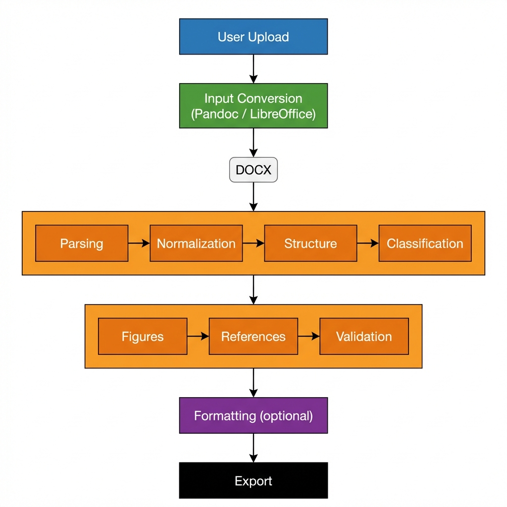

# Automated Academic Manuscript Formatter

## Overview
The system combines deterministic document processing with optional OCR and AI enrichment.
OCR ensures accessibility for scanned inputs, while AI provides advisory insights without compromising reproducibility or control.

## Key Features
- Multi-format input support (DOCX, PDF, MD, HTML, TXT, ODT, RTF)
- **PDF OCR Support**: Automatic conversion of scanned documents.
- **AI Enrichment**: Optional advisory hints for section detection and readablity.
- Deterministic document understanding (no AI / LLMs involved in core logic)
- Section detection & semantic classification
- Figure–caption linking and validation
- Reference parsing and integrity checks
- Template-aware formatting (IEEE, Springer)
- Safe operation without template selection

## Architecture
Input Conversion (OCR) → Parsing → Normalization → Structure Detection →
AI Enrichment → Classification → Figures → References → Validation → Formatting → Export



## Supported Input Formats
| Format | Handling |
|------|---------|
| DOCX | Native |
| PDF | LibreOffice / Tesseract OCR (if scanned) |
| MD / HTML / TXT | Pandoc |
| ODT / RTF | LibreOffice |

## API Usage
### POST /upload

**Request**:
- `file`: manuscript (any supported format)
- `template_name` (optional): `ieee` | `springer`
- `enable_ocr` (boolean, default: True): Auto-detect scanned PDFs
- `enable_ai` (boolean, default: False): Enable advisory analysis flags

**Response**:
- `validation_result` (JSON dict)
- `message` (string)
- `output_path` / `download_url` (if generated)
- `ocr_used` (boolean)
- `ai_enabled` (boolean)

## Validation Rules
- **Missing References** → ERROR
- **Missing Abstract / Introduction** → WARNING
- **Figure referenced but missing** → WARNING
- **Uncaptioned figures** → WARNING
- **Missing reference authors** → ERROR

## Running Locally
**Command**:
```bash
uvicorn app.main:app --reload
```

## Manual Testing
All stages tested via scripts in `app/manual_tests/`:
- `run_conversion.py`
- `run_orchestrator.py`
- `run_validation.py`
- `run_export.py`

## Limitations
- PDF layout may degrade during conversion
- Equations are treated as plain text
- No citation renumbering across styles

## Future Work
- Frontend UI
- PDF export
- Citation cross-linking

---

## Demo Walkthrough

1. **Upload a messy PDF or DOCX**
   - Use the `/upload` endpoint.
   - The system auto-converts PDF to DOCX using LibreOffice.

2. **Show validation warnings**
   - The response JSON highlights issues like "Figure 1 referenced but missing caption" or "Missing Introduction section".
   - Critical errors (e.g., missing author list in references) ensure quality control.

3. **Upload again with IEEE template**
   - Re-upload the file, setting `template_name="ieee"`.

4. **Download formatted DOCX**
   - The system returns a valid document.
   - The output file applies IEEE styles (e.g., "Paper Title", "Heading 1").

5. **Open the file and verify**:
   - Headings are correctly styled.
   - Figures are numbered sequentially (Figure 1, Figure 2).
   - Captions appear immediately after figures.
   - References are structured.
