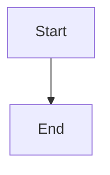

# Documentation Style Guide

## Metadata Frontmatter

Every `.md` file must begin with YAML frontmatter:

```yaml
---
title: ScholarForm AI — Page Title
description: One-sentence summary (max 160 chars)
sidebar_position: 50
version: "1.0"
status: ✅ Complete | 🔄 In Progress | 📋 Planned
owner: Docs Team | Engineering | Product
review_cadence: monthly | quarterly
last_updated: June 2026
---
```

### Field rules

| Field | Required | Values |
|-------|----------|--------|
| `title` | Yes | Max 80 chars, `ScholarForm AI — ` prefix on all pages |
| `description` | Yes | Max 160 chars, one sentence |
| `sidebar_position` | Yes | Integer. 1–9 for core, 10–19 API, 20–29 deploy, 30–39 security, 40–49 ADRs, 50–59 dev, 90+ reference |
| `version` | Yes | Semver string in quotes |
| `status` | Yes | One of: ✅ Complete / 🔄 In Progress / 📋 Planned |
| `owner` | Yes | Team name |
| `review_cadence` | Yes | monthly / quarterly / annually |
| `last_updated` | Yes | Month Year format (e.g., "June 2026") |

## Tone

- **Technical but approachable** — avoid jargon when simpler language works.
- **Active voice** — "The pipeline processes documents" not "Documents are processed by the pipeline".
- **Direct** — don't pad with filler ("Basically", "Simply", "It is worth noting").
- **Consistent branding** — always "ScholarForm AI" (not "ScholarForm" standalone in first reference on a page).

## Structure

### Headings

- `# Title` — exactly once per file, matches `title` frontmatter (without prefix)
- `## Section` — major section
- `### Subsection` — sub-section
- `#### Sub-subsection` — use sparingly; prefer restructure
- All headings use Title Case.

### Table of Contents

Required on all files > 100 lines. Use unordered list with anchor links:

```markdown
- [Section](#section)
  - [Subsection](#subsection)
```

### Code blocks

Language-tagged fenced blocks. Shell commands use `bash` or `powershell`:

```bash
curl http://localhost:8000/api/v1/health
```

```python
from app.services.formatter import format_document
```

- Do not include prompt signs (`$`, `>`) in code — only the command.
- Use `#` comments inside code blocks to explain steps.

### Admonitions

Use GitHub-flavored blockquotes with emoji prefixes:

```
> **Note**: Supplementary information.
> **Warning**: Risk of data loss.
> **Tip**: Alternative approach.
> **Important**: Critical prerequisite.
```

### Cross-references

Every doc must end with a **See Also** section listing related documents:

```markdown
## See Also

- [Architecture Overview](architecture.md)
- [Deployment Guide](Deployment.md) — setup instructions
```

### Images

Use relative paths from the `docs/` directory:

```markdown

```

- Alt text must be descriptive (generated from filename if omitted).
- Screenshots: 1920×1080, PNG, placed in `docs/images/`.

### Mermaid diagrams

For architecture, flow, and sequence diagrams. Must use the fenced block:



## Organization

```
docs/
├── README.md              # Index portal (required)
├── architecture.md        # System architecture
├── Deployment.md          # Deployment procedures
├── API.md                 # API reference
├── Database.md            # Schema documentation
├── Roadmap.md             # Feature roadmap
├── user_guide.md          # End-user guide
├── template_creation.md   # Template authoring
├── troubleshooting.md     # Common issues
├── testing.md             # Testing strategy
├── monitoring.md          # Observability
├── disaster_recovery.md   # DR procedures
├── GLOSSARY.md            # Terminology (required)
├── cheatsheet.md          # Quick reference (required)
├── .docs-style-guide.md   # This file
├── images/                # Screenshots and diagrams
├── adr/                   # Architecture Decision Records
└── ...                    # Any additional docs
```

## Review Cadence

| Doc type | Cadence | Owner |
|----------|---------|-------|
| API reference | Monthly + on deploy | Engineering |
| Architecture | Quarterly | Engineering |
| Deployment | On infra change | DevOps |
| User guides | Quarterly | Product |
| ADRs | Never (immutable) | Engineering |
| GLOSSARY / cheatsheet | Monthly | Docs Team |

## CI Enforcement

- **Freshness check** — every Monday at 0900 UTC via `.github/workflows/docs-freshness.yml`
- **Broken link check** — on every PR touching `docs/`
- **Frontmatter validation** — every PR (TODO: automate with action)
