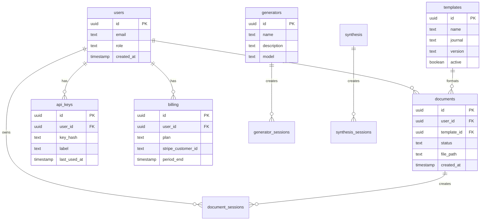

# ScholarForm AI — Database & Data Model

> **See also:** [Architecture](architecture.md), [API Reference](API.md), [ADRs](adr/)

## Table of Contents
- [PostgreSQL (Supabase)](#postgresql-supabase)
- [Supabase Storage Buckets](#supabase-storage-buckets)
- [ChromaDB Collections](#chromadb-collections)
- [Redis Cache Keys](#redis-cache-keys)
- [Migration Tool](#migration-tool)

## PostgreSQL (Supabase)



### Core Tables

#### `users` (Supabase Auth — auto-managed)
| Column | Type | Notes |
|--------|------|-------|
| id | UUID | PK, auto from Supabase Auth |
| email | TEXT | Unique |
| plan_tier | TEXT | 'free', 'pro', 'team' |
| created_at | TIMESTAMPTZ | Auto |

#### `api_keys`
| Column | Type | Notes |
|--------|------|-------|
| id | UUID | PK |
| user_id | UUID | FK &rarr; users |
| key_hash | TEXT | SHA-256 hash of the API key |
| prefix | TEXT | First 8 chars for identification |
| name | TEXT | User-assigned label |
| scopes | TEXT[] | e.g. `{upload,download}` |
| expires_at | TIMESTAMPTZ | Nullable |
| is_active | BOOLEAN | Default true |
| last_used_at | TIMESTAMPTZ | Nullable |
| created_at | TIMESTAMPTZ | |

#### `documents`
| Column | Type | Notes |
|--------|------|-------|
| id | UUID | PK |
| user_id | UUID | FK &rarr; users (nullable for guests) |
| filename | TEXT | Original filename |
| status | TEXT | pending/processing/done/error |
| template | TEXT | Selected template name |
| input_path | TEXT | Supabase Storage path |
| output_path | TEXT | Supabase Storage path |
| quality_score | JSONB | {overall, structure, formatting, citations} |
| metadata | JSONB | Extra fields |
| created_at | TIMESTAMPTZ | |
| updated_at | TIMESTAMPTZ | |

#### `templates` (metadata registry)
| Column | Type | Notes |
|--------|------|-------|
| name | TEXT | PK, machine name (e.g. `ieee`) |
| display_name | TEXT | Human-readable |
| description | TEXT | |
| version | TEXT | Semver |
| is_active | BOOLEAN | Default true |
| preview_css | TEXT | CSS for live preview |
| contract_schema | JSONB | Validation rules |
| created_at | TIMESTAMPTZ | |
| updated_at | TIMESTAMPTZ | |

#### `feedback`
| Column | Type | Notes |
|--------|------|-------|
| id | UUID | PK |
| user_id | UUID | FK &rarr; users |
| document_id | UUID | FK &rarr; documents (nullable) |
| rating | INTEGER | 1–5 |
| category | TEXT | 'formatting', 'quality', 'usability', 'bug' |
| message | TEXT | Free-text |
| metadata | JSONB | Browser, OS, etc. |
| created_at | TIMESTAMPTZ | |

#### `generator_sessions`
| Column | Type | Notes |
|--------|------|-------|
| id | UUID | PK |
| user_id | UUID | FK &rarr; users |
| session_type | TEXT | 'multi_doc', 'agent' |
| status | TEXT | started/running/done/error |
| config | JSONB | Session configuration |
| outline_json | JSONB | Generated outline |
| docx_path | TEXT | Final output path |
| created_at | TIMESTAMPTZ | |
| updated_at | TIMESTAMPTZ | |

#### `generator_messages`
| Column | Type | Notes |
|--------|------|-------|
| id | UUID | PK |
| session_id | UUID | FK &rarr; generator_sessions |
| role | TEXT | 'user', 'assistant', 'system' |
| content | TEXT | Message content |
| token_count | INTEGER | Tokens used |
| sources | JSONB | RAG source attributions |
| created_at | TIMESTAMPTZ | |

#### `generator_documents`
| Column | Type | Notes |
|--------|------|-------|
| id | UUID | PK |
| session_id | UUID | FK &rarr; generator_sessions |
| content_json | JSONB | Structured document content |
| docx_path | TEXT | Generated DOCX path |
| version | INTEGER | |
| created_at | TIMESTAMPTZ | |

#### `audit_logs`
| Column | Type | Notes |
|--------|------|-------|
| id | UUID | PK |
| user_id | UUID | FK &rarr; users |
| action | TEXT | e.g. 'document.create', 'session.delete' |
| resource_type | TEXT | 'document', 'session', 'template' |
| resource_id | UUID | |
| details | JSONB | |
| ip_address | INET | |
| created_at | TIMESTAMPTZ | |

### Indexes (Recommended)
```sql
CREATE INDEX idx_documents_user_created ON documents(user_id, created_at DESC);
CREATE INDEX idx_documents_status ON documents(status);
CREATE INDEX idx_gen_sessions_user ON generator_sessions(user_id, created_at DESC);
CREATE INDEX idx_gen_messages_session ON generator_messages(session_id, created_at);
CREATE INDEX idx_audit_user ON audit_logs(user_id, created_at DESC);
CREATE INDEX idx_api_keys_user ON api_keys(user_id);
CREATE INDEX idx_feedback_user ON feedback(user_id, created_at DESC);
```

## Supabase Storage Buckets
| Bucket | Purpose | RLS |
|--------|---------|-----|
| `uploads` | Original uploaded documents | User can only read own |
| `formatted` | Processed output documents | User can only read own |
| `generated` | AI-generated documents | User can only read own |

## ChromaDB Collections
| Collection | Purpose | Embedding Model |
|------------|---------|-----------------|
| `session_{id}` | Per-session RAG vectors | multi-qa-MiniLM-L6-v2 |
| TTL: 24 hours | Auto-cleanup | |

## Redis Cache Keys
| Key Pattern | TTL | Purpose |
|-------------|-----|---------|
| `preview:{session_id}` | 5 min | Live preview cache |
| `llm:cache:{prompt_hash}` | configurable | LLM prompt/response cache |
| `rate:{user_id}:{window}` | 1 min | Rate limiting counters |
| `job:{job_id}:status` | 1 hr | Job status cache |
| `template:{name}:css` | 24 hr | Template CSS pre-warm |

## Migration Tool
- **Alembic** directory exists at `backend/alembic/`
- Status: ⚠️ Need to verify migration versions match schema
