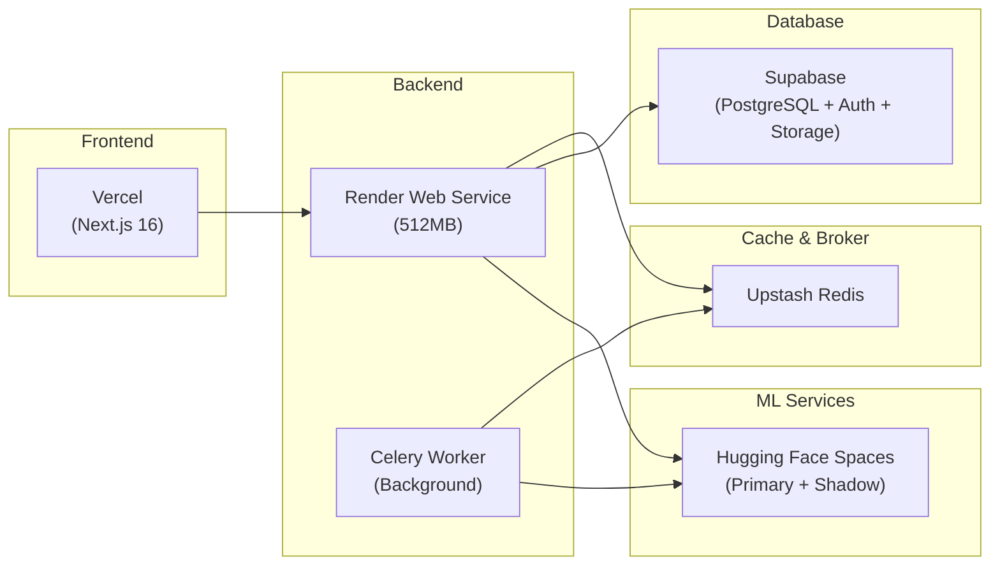

# ScholarForm AI — Deployment Guide

> **See also:** [Architecture](architecture.md), [DISASTER_RECOVERY.md](DISASTER_RECOVERY.md), [Testing.md](Testing.md)

---

## Table of Contents
- [Architecture (Strict $0)](#architecture-strict-0)
- [Production Runtime Profile (Render 512MB)](#production-runtime-profile-render-512mb)
- [Remote Service Routing](#remote-service-routing)
- [CI/CD Control](#cicd-control)
- [Required GitHub Secrets](#required-github-secrets)
- [Render Environment Checklist](#render-environment-checklist)
- [Deployment Acceptance Criteria](#deployment-acceptance-criteria)
- [Deferred Scope](#deferred-scope-not-enabled-in-this-phase)

## Architecture (Strict $0)



- Frontend: Vercel
- Backend API: Render Web Service (512MB free tier)
- Database/Auth/Storage: Supabase
- Cache/Broker: Upstash Redis
- Heavy document services: Hugging Face Spaces (primary + shadow per service)

The production path is remote-first. Heavy processing should not depend on developer-local services.

## Production Runtime Profile (Render 512MB)

Use this low-memory profile:

```env
LOW_MEMORY_MODE=true
PRELOAD_AI_MODELS=false
RAG_USE_TRANSFORMERS=false
ENHANCEMENT_QUEUE_ENABLED=false
ENABLE_STRUCTURED_LOGGING=true
ENABLE_FILE_CLEANUP=true
ENABLE_NOUGAT_PARSER=false
USE_SCIBERT_CLASSIFICATION=false
```

## Remote Service Routing

URL list variables take precedence over single URL variables.

```env
GROBID_URLS=https://<grobid-primary>.hf.space,https://<grobid-shadow>.hf.space
DOCLING_URLS=https://<docling-primary>.hf.space,https://<docling-shadow>.hf.space
OCR_URLS=https://<ocr-primary>.hf.space,https://<ocr-shadow>.hf.space
DOCX_CONVERTER_URLS=https://<docx-primary>.hf.space,https://<docx-shadow>.hf.space

GROBID_HEALTH_PATH=/api/isalive
DOCLING_HEALTH_PATH=/
OCR_HEALTH_PATH=/
DOCX_CONVERTER_HEALTH_PATH=/
```

Compatibility fallback remains supported:

- If `*_URLS` is set, it is used.
- Else the single `*_URL` variable is used.

## CI/CD Control

### Production deployment workflow

- Workflow: `.github/workflows/deploy-production.yml`
- Trigger: `workflow_dispatch` only (manual)
- Backend gate: `GET /api/v1/health/live`
- Curl guardrails are enabled (`--connect-timeout`, `--max-time`)
- Frontend deploy does not run if backend health gate fails

### Keepalive workflow

- Workflow: `.github/workflows/keepalive-free-tier.yml`
- Schedule: every 14 minutes (`*/14 * * * *`)
- Probes:
  - Render backend live endpoint
  - HF primary/shadow endpoints for GROBID, Docling, OCR, DOCX converter
- Behavior:
  - Compact health logs
  - Fails the job if both primary and shadow fail for any service pair

## Required GitHub Secrets

- `PROD_BACKEND_URL`
- `RENDER_DEPLOY_HOOK`
- `VERCEL_TOKEN`
- `VERCEL_ORG_ID`
- `VERCEL_PROJECT_ID`
- `HF_GROBID_PRIMARY_URL`
- `HF_GROBID_SHADOW_URL`
- `HF_DOCLING_PRIMARY_URL`
- `HF_DOCLING_SHADOW_URL`
- `HF_OCR_PRIMARY_URL`
- `HF_OCR_SHADOW_URL`
- `HF_DOCX_PRIMARY_URL`
- `HF_DOCX_SHADOW_URL`

## Render Environment Checklist

- `LOW_MEMORY_MODE=true`
- `PRELOAD_AI_MODELS=false`
- `RAG_USE_TRANSFORMERS=false`
- `ENHANCEMENT_QUEUE_ENABLED=false`
- `ENABLE_STRUCTURED_LOGGING=true`
- `ENABLE_FILE_CLEANUP=true`
- `GROBID_URLS` configured with primary + shadow
- `DOCLING_URLS` configured with primary + shadow
- `OCR_URLS` configured with primary + shadow
- `DOCX_CONVERTER_URLS` configured with primary + shadow

## Deployment Acceptance Criteria

- Render starts without port-scan timeout
- `GET /api/v1/health/live` returns HTTP 200 consistently after deploy
- Deploy workflow completes without backend-health hang
- GROBID requests fail over from primary to shadow on upstream failure
- Keepalive reports backend healthy and at least one endpoint healthy per service pair

## Deferred Scope (Not Enabled in This Phase)

- Queue mode (`ENHANCEMENT_QUEUE_ENABLED=true`) remains off until a 7-day stability window is achieved.
- Nougat/SciBERT remote offload is design-ready but not enabled by default.
