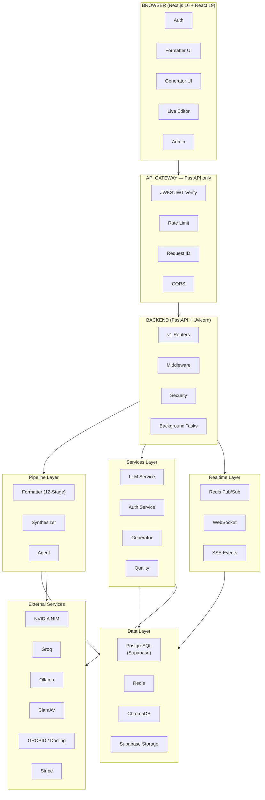

# ScholarForm AI — Architecture

> **Key correction:** The Spring Boot API gateway referenced in early plan documents is **obsolete/incorrect**. The system uses **FastAPI only** as the backend gateway.

> **See also:** [API Reference](API.md), [Database](Database.md), [ADRs](adr/)

---

## Table of Contents
- [System Layers](#system-layers)
- [Current Architecture (FastAPI-Only)](#current-architecture-fastapi-only)
- [Request Flows](#request-flows)
- [Key Architecture Decisions](#key-architecture-decisions)
- [Middleware Stack (Execution Order)](#middleware-stack-execution-order)
- [Data Flow Diagram (Simplified)](#data-flow-diagram-simplified)

## System Layers



---

## Current Architecture (FastAPI-Only)

The architecture is **FastAPI-only**. There is no Spring Boot gateway. Earlier plan documents (including PRD drafts) listed a Spring Boot API Gateway as a potential future component; this was never built and is no longer planned.

```
Browser → FastAPI (port 8000)
  → middleware stack: rate_limit → tier_rate_limit → jwks_verifier
    → abuse_detector → request_id → security_headers → prometheus_metrics
  → v1 routers: documents │ templates │ generator │ synthesis │ billing │ health
```

---

## Request Flows

### Formatter Mode A — Upload & Format

```
Browser → POST /api/v1/documents/upload
  → ClamAV virus scan
  → MIME + magic byte + extension tri-validation
  → Start background task (Celery/asyncio)
  → Return job_id (< 400ms)

Background:
  → Parse (GROBID if enabled, else Docling, else PyMuPDF)
  → Structure Detection
  → Block Classification (SciBERT — if USE_SCIBERT_CLASSIFICATION=true)
  → NLP Enhancement (YAKE/spaCy)
  → Validation
  → Format & Render (Template)
  → Export (DOCX/PDF)
  → SSE events: { stage, progress } → frontend Stepper.jsx
```

### Formatter Mode B — Live Preview

```
Browser ↔ WebSocket /api/v1/preview/ws/{session_id}
  → Client sends edited content + template choice
  → Server: HTML render (target < 80ms — no DOCX generated!)
  → Redis cache: preview:{session_id}
  → Server sends rendered HTML/CSS back
```

### Generator Mode A — Multi-Doc Synthesis

```
Browser → POST /api/v1/synthesis/sessions (multipart: 2-6 PDFs)
  → Create session in DB (generator_session_service.py)
  → Vector-embed all papers (ChromaDB RAG)
  → Return session_id

Browser → GET /api/v1/synthesis/sessions/{id}/events (SSE)
  → Synthesizer pipeline (synthesizer.py — 24.2KB)
  → Dedup → Merge → Write synthesis sections (LLM streaming)
  → SSE: stage updates + token stream
```

### Generator Mode B — AI Agent

```
Browser → POST /api/v1/generator/sessions
  → Create session in DB
  → Return session_id

Browser → POST .../messages (user prompt)
  → Task Parser (LLM: extract requirements → structured JSON)
  → Outline Generation (LLM: outline)
  → SSE: outline ready for approval

Browser → POST .../outline/approve
  → Section-by-section generation (LLM streaming via LiteLLM)
  → SSE: token stream per section (TokenStream.jsx)
  → Citation assembly (CrossRef API)
  → Quality scoring
  → DOCX render
```

---

## Key Architecture Decisions

| Decision | Rationale |
|---------|---------|
| **No Spring Boot gateway** | FastAPI handles all middleware. Spring Boot was never built; it's obsolete in the requirements. |
| **No DOCX on live preview** | HTML/CSS only for <80ms latency — generating DOCX is too slow for real-time. |
| **No LLM during typing** | LLM fires only on explicit user action (not keystroke). |
| **Redis pub/sub as backbone** | Single consistent pattern for SSE, WebSocket, and Celery task events. |
| **LiteLLM abstraction** | Same client code for NVIDIA NIM, Groq, and Ollama. |
| **Background tasks for >400ms ops** | Never block the HTTP request thread. |
| **GROBID optional, Docling primary** | Render 512MB RAM constraint makes GROBID Docker (1.5GB) non-viable. 3-tier PDF fallback: GROBID (if `GROBID_ENABLED=true`) → Docling → PyMuPDF. |

---

## Middleware Stack (Execution Order)

| Middleware | File | Size |
|-----------|------|------|
| Prometheus metrics | `prometheus_metrics.py` | 7KB |
| Rate limit (base) | `rate_limit.py` | 6.9KB |
| Tier-aware rate limit | `tier_rate_limit.py` | 4.1KB |
| Abuse detection | `abuse_detector.py` | 2.7KB |
| Request ID | `request_id.py` | 2.2KB |
| Security headers (CSP, HSTS) | `security_headers.py` | 4.6KB |
| RBAC | `rbac.py` | 708B ⚠️ stub |

---

## Data Flow Diagram (Simplified)

```
User uploads file
      │
      ▼
FastAPI /upload ──→ ClamAV scan ──→ Background Task
                                          │
          ┌───────────────────────────────┘
          │
          ▼
    GROBID / Docling / PyMuPDF (PDF parse)
          │
    SciBERT classification (optional)
          │
    NLP enhancement (YAKE / spaCy)
          │
    Template rules apply
          │
    DOCX + PDF export
          │
    Supabase Storage upload
          │
    SSE event → Browser
```
