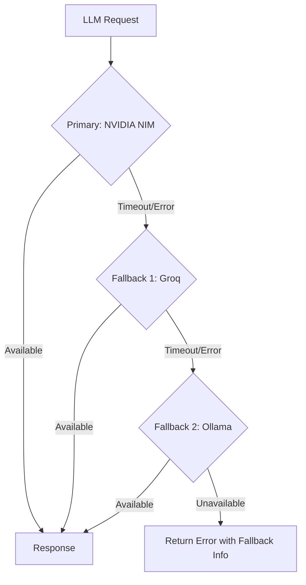

# LLM Fallback Strategy

## Why Multi-Provider?

Single-provider dependencies create single points of failure. If NVIDIA NIM goes down, Groq should handle the request. If both are down, the local Ollama instance serves as a final fallback. This design ensures ScholarForm AI remains operational even when external LLM providers are unavailable.

## Provider Tier Hierarchy



## Implementation

### LiteLLM Abstraction

All LLM calls go through LiteLLM (`app/services/llm_service.py`), which provides a unified interface:

```python
response = await llm_service.generate(
    prompt="Write an abstract about...",
    model="nvidia/meta/llama-3.3-70b-instruct",
    fallbacks=["groq/mixtral-8x7b-32768", "ollama/deepseek"]
)
```

LiteLLM handles:
- Provider routing
- Retry logic (3 attempts per provider)
- Timeout handling (30s per call)
- Response format normalization

### Provider Configuration

```env
# Primary
NVIDIA_API_KEY=...
NVIDIA_BASE_URL=https://integrate.api.nvidia.com/v1

# Fallback 1
GROQ_API_KEY=...

# Fallback 2
OLLAMA_BASE_URL=http://localhost:11434
```

### Health Checks

Each provider is health-checked on startup and every 60 seconds:

- **NVIDIA NIM**: `GET /v1/models` — 5s timeout
- **Groq**: `GET /v1/models` — 5s timeout
- **Ollama**: `GET /api/tags` — 2s timeout

Unhealthy providers are skipped in the routing chain until they pass a subsequent health check.

## Fallback Behavior by Feature

| Feature | Provider | Fallback Behavior |
|---------|----------|-------------------|
| AI Agent generation | NIM → Groq → Ollama | Degraded quality on fallback; user notified via SSE |
| Multi-doc synthesis | NIM → Groq → Ollama | May increase latency; Ollama requires local GPU |
| NLP enhancement | NIM → Groq | Skipped if all providers unavailable |
| SciBERT classification | N/A (local model) | Falls back to rule-based classification |

## Monitoring

- Provider-level success/error rate metrics in Prometheus
- Fallback events logged with `provider`, `reason`, `latency_ms`
- Dashboard alert if primary provider success rate < 95% over 5 minutes
- SLA: P95 response < 10s across all providers

## See Also

- [ADR 008: LiteLLM for LLM Routing](../adr/008-litellm-llm-routing.md)
- [AI Instructions](../AI_Instructions.md) — prompt rules and configuration
- [Pipeline Architecture](pipeline-architecture.md) — end-to-end processing
