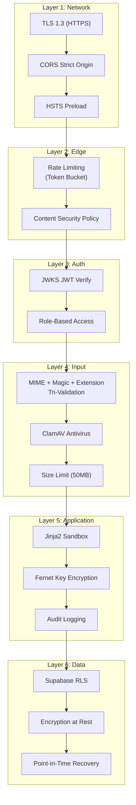

# Security Model

## Defense in Depth

ScholarForm AI employs a layered security approach — no single point of failure in our defense chain.

## Layer Details

### Layer 1: Network
- **TLS 1.3** enforced for all external communication
- **CORS** — strict origin allowlist; no wildcard in production
- **HSTS** — `max-age=31536000; includeSubDomains`

### Layer 2: Edge
- **Rate Limiting** — per-IP token bucket + per-API-key tier-aware rate limit
- **CSP** — restricts script/style sources; reports violations via report-only mode

### Layer 3: Authentication
- **JWKS JWT Verify** — all authenticated routes verify JWT against Supabase JWKS endpoint
- **RBAC** — roles: admin, pro, free, guest (stub in v1.0; expanded in v1.1)

### Layer 4: Input Validation
- **Tri-Validation** — file is checked by MIME type, magic bytes, AND file extension
- **ClamAV** — all uploaded files scanned before any processing begins
- **Size Limit** — 50MB maximum upload; enforced at middleware level

### Layer 5: Application
- **Jinja2 Sandbox** — template rendering uses restricted Jinja2 environment (no unsafe calls)
- **API Key Encryption** — keys encrypted with Fernet (symmetric AES-128-CBC) at rest
- **Audit Logging** — all authenticated actions logged with `request_id`, `user_id`, timestamp

### Layer 6: Data
- **Supabase RLS** — Row-Level Security scopes all queries to authenticated user
- **Encryption at Rest** — AES-256 for database (Supabase) and file storage (buckets)
- **PITR** — continuous database backup; restore to any point in last 7 days

## Threat Model

| Threat | Mitigation | Layer |
|--------|------------|-------|
| Malicious file upload | ClamAV + tri-validation | 4 |
| SQL injection | Parameterized queries + RLS | 3, 6 |
| XSS | CSP + React DOM escaping | 2, 5 |
| CSRF | SameSite cookies + Origin header check | 1 |
| API key theft | Fernet encryption + rotation policy | 5 |
| DoS | Rate limiting + size limits | 2, 4 |
| Privilege escalation | RBAC + JWT verification | 3 |
| Template injection | Jinja2 sandbox | 5 |
| SSRF | Outbound URL allowlist | 5 |

## See Also

- [Security Policy](../../SECURITY.md) — vulnerability disclosure
- [Security Controls](../Security.md) — controls inventory
- [Secret Rotation](../SECRET_ROTATION.md) — key rotation procedures
- [Risk Register](../Risk_Register.md) — risk inventory
